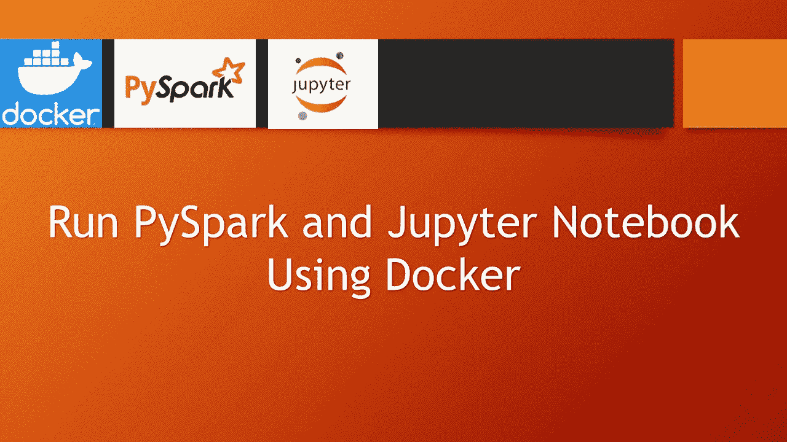
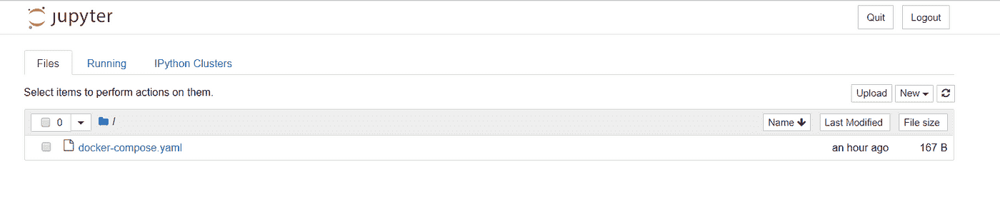
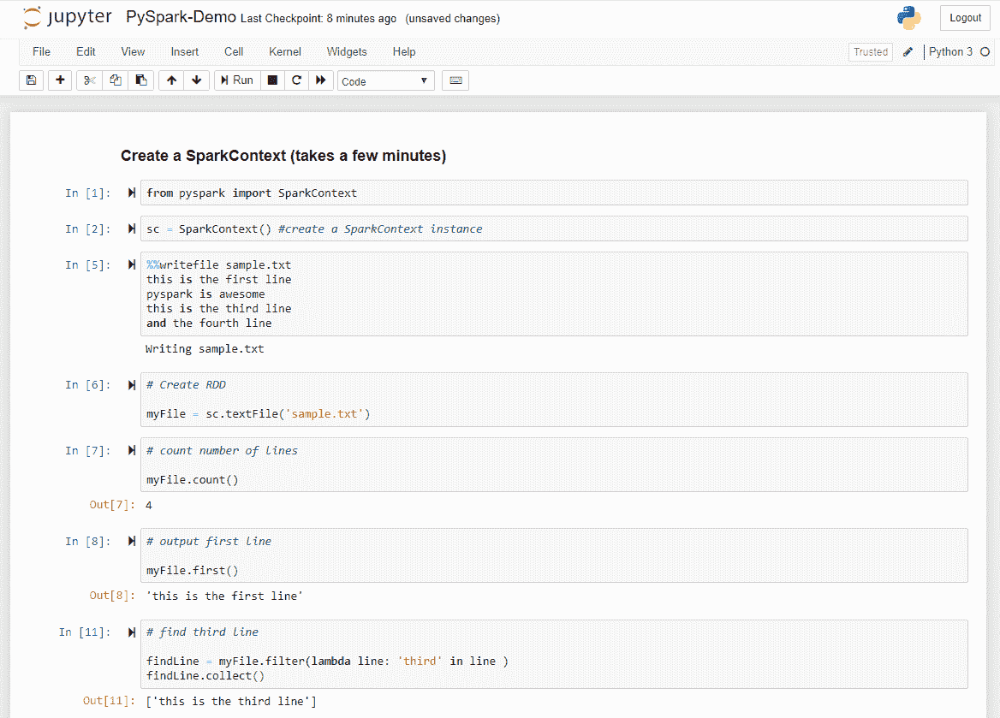
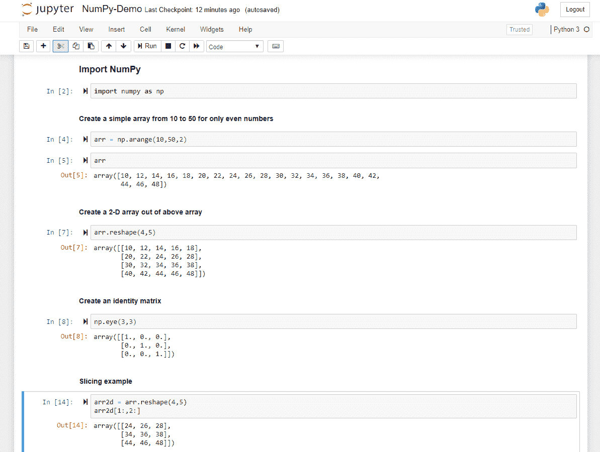

# 使用 Docker 运行 PySpark 和 Jupyter 笔记本

> 原文：<https://medium.com/analytics-vidhya/run-pyspark-and-jupyter-notebook-using-docker-bed12ecb755a?source=collection_archive---------9----------------------->



在本文中，我将解释使用 Docker 在容器化环境中编写标准数据分析程序所需的基本工具集。和往常一样，我的方法是让你的程序可移植并且独立于平台。让我们先简单了解一下我所说的工具集是什么意思，以及我要在 Docker 容器中打包什么。

*   **PySpark** — PySpark 编程是 Apache Spark 和 Python 的合作。它是为与 Apache Spark 交互而构建的 Python API。因为它是用 Python 编写的，所以您可以使用其他 Python 模块成为高效的数据分析师
*   **Apache Spark** —这是一个非常流行的处理和使用大数据的框架。它几乎比任何其他传统的大规模数据处理框架快 100 倍
*   **Jupyter Notebook** —这是一个开源 web 应用程序，主要由数据分析师/工程师用来编写代码、数学方程、数据可视化等
*   这是一个 Python 库，用于处理多维数组、矩阵、高级数学函数等

现在让我们深入研究技术细节，看看如何设置支持 PySpark、Jupyter Notebook 和 NumPy 的本地环境。以下是分步说明:

1.  在你的系统上创建一个新的文件夹，例如 c:\code\pyspark-jupyter 或者你想给的任何名字
2.  在该文件夹中创建一个文件，将其命名为 **docker-compose.yaml** ，内容如下:

```
version: "3"
services:
  pyspark:
    image: "jupyter/all-spark-notebook"
    volumes:
      - c:/code/pyspark-data:/home/jovyan
    ports:
      - 8888:8888
```

1.  在上面的文件中，我提取了一个正式的 jupyter docker 映像，将本地文件夹映射到容器内部的一个文件夹，并将容器端口 8888 暴露给主机端口 8888。很简单，不是吗？
2.  现在使用命令 **docker-compose up** 运行该文件，您将看到类似如下所示的输出

```
PS C:\code\pyspark-jupyter> docker-compose up
Recreating pyspark-jupyter_pyspark_1 ... done
Attaching to pyspark-jupyter_pyspark_1
pyspark_1  | Executing the command: jupyter notebook
pyspark_1  | [I 14:41:40.780 NotebookApp] Writing notebook server cookie secret to /home/jovyan/.local/share/jupyter/runtime/notebook_cookie_secret
pyspark_1  | [I 14:41:41.010 NotebookApp] Loading IPython parallel extension
pyspark_1  | [I 14:41:41.049 NotebookApp] JupyterLab extension loaded from /opt/conda/lib/python3.7/site-packages/jupyterlab
pyspark_1  | [I 14:41:41.049 NotebookApp] JupyterLab application directory is /opt/conda/share/jupyter/lab
pyspark_1  | [I 14:41:41.054 NotebookApp] Serving notebooks from local directory: /home/jovyan
pyspark_1  | [I 14:41:41.054 NotebookApp] The Jupyter Notebook is running at:
pyspark_1  | [I 14:41:41.054 NotebookApp] http://3d475598a523:8888/?token=YOUR_TOKEN
pyspark_1  | [I 14:41:41.054 NotebookApp]  or http://127.0.0.1:8888/?token=YOUR_TOKEN
pyspark_1  | [I 14:41:41.055 NotebookApp] Use Control-C to stop this server and shut down all kernels (twice to skip confirmation).
pyspark_1  | [C 14:41:41.073 NotebookApp]
pyspark_1  |
pyspark_1  |     To access the notebook, open this file in a browser:
pyspark_1  |         file:///home/jovyan/.local/share/jupyter/runtime/nbserver-6-open.html
pyspark_1  |     Or copy and paste one of these URLs:
pyspark_1  |         http://3d475598a523:8888/?token=YOUR_TOKEN
pyspark_1  |      or http://127.0.0.1:8888/?token=YOUR_TOKEN
```

1.  复制网址[http://127 . 0 . 0 . 1:8888/？token=YOUR_TOKEN](http://127.0.0.1:8888/?token=YOUR_TOKEN) 并在您选择的浏览器中打开
2.  您将看到 Jupyter Notebook 的一个实例在一个容器中运行。您可能已经注意到，您的本地文件夹被映射到容器内部



朱庇特笔记本的一个实例

现在让我们创建我们的第一个笔记本，并与 PySpark 一起工作。这只是一个简单的介绍，因为我将分别撰写关于 PySpark 和 NumPy 的详细文章。



在 Docker 中运行的 PySpark 程序

第二个笔记本简要介绍了 NumPy 的使用



Docker 中运行的 NumPy 程序

希望它有助于您开始数据分析之旅，并使用 Docker 制作可移植程序。

***快乐学习！！！***