# 运行一个自由数据科学项目。第一部分

> 原文：<https://medium.com/analytics-vidhya/running-a-freelance-data-science-project-part-1-c261dc87d87e?source=collection_archive---------15----------------------->

在我的生活中，我学到了很多东西，并期待着学习更多。我学到的一件事是成为一名团队成员。不要。这篇文章不是关于如何成为一名团队成员，但是团队合作是必要的。最近我拿到了[谷歌 Play 商店的数据](https://www.kaggle.com/lava18/google-play-store-apps)，我脑海中有两个主要问题:

1.  电影:**社会困境**
2.  我也能帮忙带来一些确凿的事实吗？

所以，我试了一下，加入了一些星星，包括我的两个 brodas！。我们把它当作一个项目，并给它命名为:**谷歌 Play 商店。现在，我们使用 GitHub 作为我们的源代码控制器。这件事真的改变了一个团队的工作方式。我们都有自己的 **git 分支，创建了 4 列 *To-Do、In-Progress、Review、Sprint1、Sprint2 和 Done*T11。仪表板看起来像这样:****

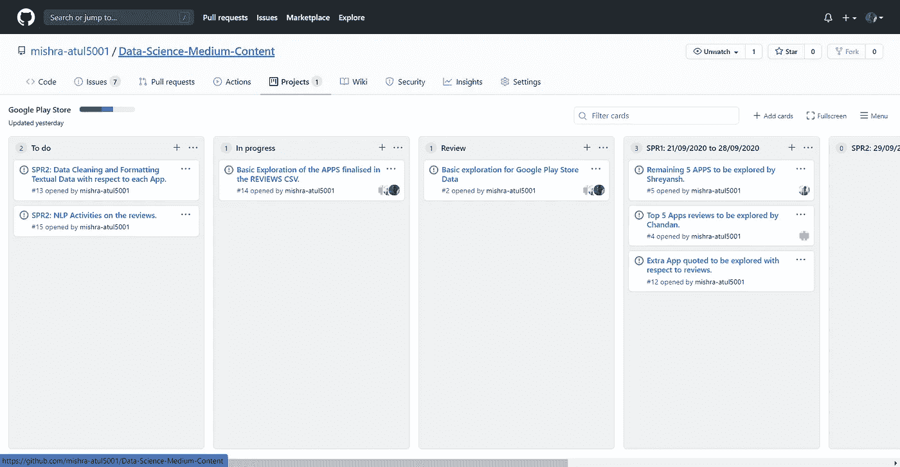

项目仪表板

我们把所有的任务以卡片的形式排列起来，然后很容易地分配工作，这样就把所有的事情都整理好了。我的一个同事 [Chandan Singh](https://www.linkedin.com/in/chandansingh2693/) 在这个项目中引用了一句话，**任何开发项目都是这样运行的**我们有自己的**数据科学项目**，为这个团队干杯！！

我们寻求的主要目标是:

1.  求解与数据集相关联的[任务](https://www.kaggle.com/lava18/google-play-store-apps/tasks)。任务包括一些问题，如**安装数量最多的最受欢迎的类别是什么；哪个应用程序的大小最大；哪个 app 很久没更新了；这可以通过将当前日期与应用实际更新的最后日期进行比较来完成；2016 年、2017 年和 2018 年，哪个应用程序的安装次数最多，下载次数最多的应用程序类别是什么；哪个应用的评论数最多？**
2.  为我们的 NLP 活动完成 10 个应用程序。
3.  为与此相关的评审执行 NLP EDA。
4.  把它拿到前面来。

我会把整个**项目**分成两个不同的部分，这样事情就不会太紧张。最初，我们将集中于回答与任务相关的问题，然后将 ML 和 NLP 技术应用于所采取的决策。

那么，让我们来看看手头的数据集:

```
**import** **numpy** **as** **np**
**import** **pandas** **as** **pd**
**import** **seaborn** **as** **sns**
**import** **matplotlib.pyplot** **as** **plt**
**import** **re**
**import** **warnings**
warnings.filterwarnings('ignore')summary_data = pd.read_csv('googleplaystore.csv')
reviews_data = pd.read_csv('googleplaystore_user_reviews.csv')

*# Let's do some DATA Formalitites*
summary_data.head()
```

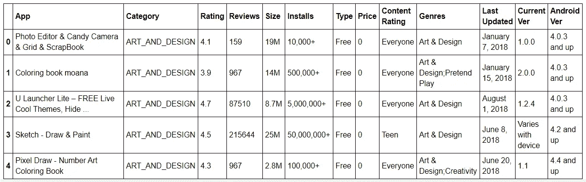

summary_data.head()

让我们执行数据清单:

```
print('Shape of summary data:', summary_data.shape)
print('--------------------------------------------')
print('Columns in our summary of data: ',summary_data.columns)
print('--------------------------------------------')
print(summary_data.info())
print('--------------------------------------------')
print('Total Unique APPS in the data: ',summary_data.App.nunique())
print('--------------------------------------------')
print('Total Unique Categories: ',summary_data.Category.nunique())
print('--------------------------------------------')
print('Total Unique Genres: ',summary_data.Genres.nunique())
print('--------------------------------------------')
print('Total Unique Content Ratings: ',summary_data['Content Rating'].nunique())
print('--------------------------------------------')
print("Let's see the distribution of Content Ratings: ")
print(summary_data['Content Rating'].value_counts())
```

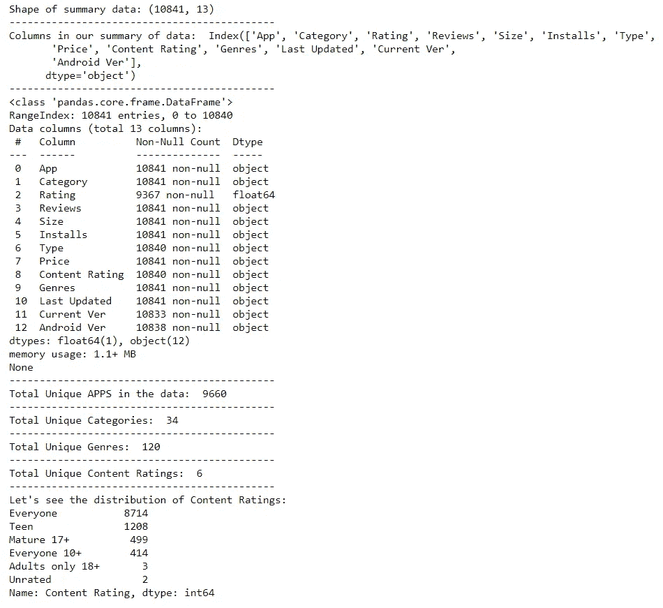

数据清单

**为了证明自己的 EDA 技能，总是不一定要画一些情节**，但是知道向下钻取回答一个问题的方法更重要。

查看清单，我们发现诸如**评级、类型、内容评级、当前版本、Android 版本**等列有缺失值，需要进行处理。因此，我们将删除任何列中缺少一个值的行。

```
summary_data = summary_data.dropna(axis='rows')
summary_data = summary_data.drop_duplicates(subset=['App'])
summary_data = summary_data[summary_data.Size!= 'Varies with device']
summary_data.info()
```

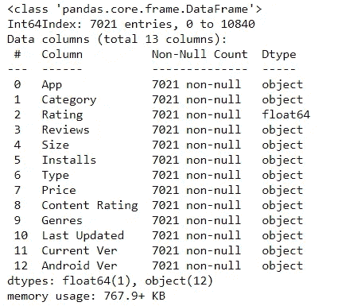

我们的数据需要处理多种事情。如果你没有弄错的话，你可能会在安装和大小栏中分别看到 **+** 和 **M** 。此外，列**内容分级**有值，如**成人仅 18+，每个人 10+** 这是不太合适的，我们可以用**下划线**来替换它们，并清理我们的数据。

```
*# Installs like 1000+,50,000,000+ doesn't looks good, as we can't compare strings properly on a logical manner. So we remove the +*

**def** remove_plus_add_underscore(summary_data):
    summary_data['Installs'] = summary_data['Installs'].str.replace(',','')
    summary_data['Installs'] = summary_data['Installs'].str.replace('+','')
    summary_data['Content Rating'] = summary_data['Content Rating'].str.replace('+','')
    summary_data['Content Rating'] = summary_data['Content Rating'].str.replace(' ','_')
    summary_data['Installs'] = summary_data['Installs'].astype('int64')
    *# Converting SIZE of APPS from KB to MB*
    **for** i,j **in** enumerate(summary_data.Size):
        *#print(i,j)*
        **if** 'k' **in** j:
            clean_str = j.replace('k','')
            cleant_int = round(float(clean_str)*0.001,2)
        **else**:
            clean_str = j.replace('M','')
            cleant_int = float(clean_str)
        summary_data.Size.iloc[i] = cleant_int
        *#print('Clean',cleant_int)*
    **return** summary_data

copy_summary_data = remove_plus_add_underscore(summary_data)
copy_summary_data.head()
```

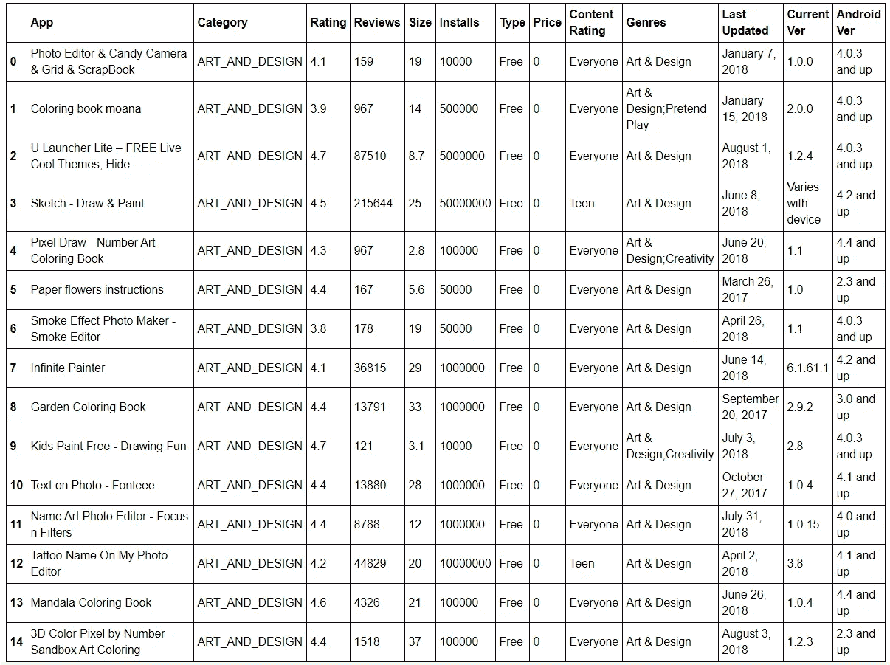

已清理数据

经过更多的预处理，比如将每个**内容评分**值作为一个数据帧进行子集化，我们找到了每个类别中评分最高的应用。

```
content_rating_namelist = ['content_rating_Adults_only_18','content_rating_Everyone','content_rating_Everyone_10','content_rating_Mature_17',
                      'content_rating_Teen','content_rating_Unrated']
content_rating_list = [content_rating_Adults_only_18,content_rating_Everyone,content_rating_Everyone_10,content_rating_Mature_17,
                      content_rating_Teen,content_rating_Unrated]
**for** i,j **in** zip(content_rating_namelist,content_rating_list):
        print('Top 3 Apps in :',i)
        print(j.App[:3].values,j.Rating[:3].values)
```

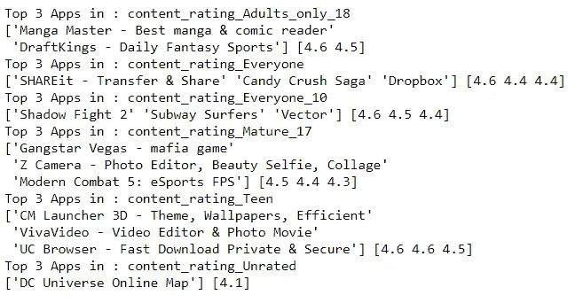

**问题 1:安装数量最多的最受欢迎的类别是什么？**

*   >这个问题很容易回答，因为没有太多相关的规则。我们只需要**按类别分组，汇总安装数量，并对安装进行排序**。现在，我们可以用一行代码来完成。

```
category_with_largest_installs = copy_summary_data.groupby('Category').agg({'Installs':'sum'}).sort_values(by = 'Installs',ascending=**False**).reset_index()
category_with_largest_installs

*# Let's try to plot the same* plt.figure(figsize=(12,8))
sns.barplot(y = 'Category', x ='Installs',data = category_with_largest_installs)
plt.title('Sorted order for the CATEGORIES for which the highest number of installs are recorded on Play Store');
plt.show();
```

情节是这样的:

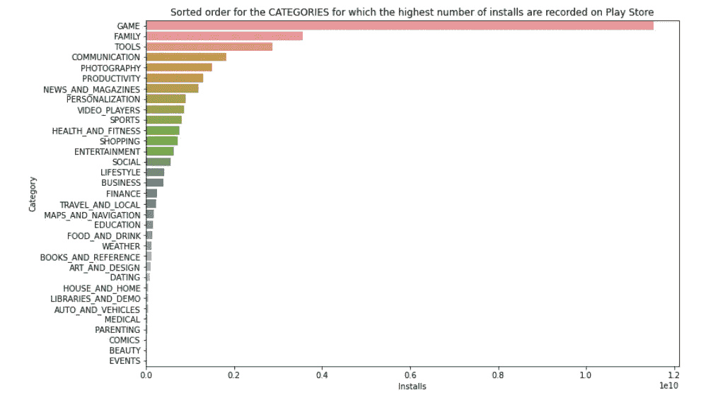

Play Store 上记录的安装数量最高的类别的排序顺序

**游戏是**安装数量最高的**类别**。

**问题 2:哪个应用程序的大小最大？**

*   >现在，当我在大小列上进行正常排序时，有一个**歧义**，有几个大小相同的应用程序 **100** MB，所以为了找到那一个应用程序，我只添加了一个子句，RATING。我们将在对大小进行排序后，选择评分最高的应用程序。

```
app_with_larget_size = copy_summary_data.sort_values(by = ‘Size’,ascending = False)# We now know that the Apps we are dealing with has maximum of 100MB as size in our dataset
x = app_with_larget_size.groupby('Size').get_group(100).sort_values(by = 'Rating',ascending=False).reset_index(drop=True).head(1)
x
```

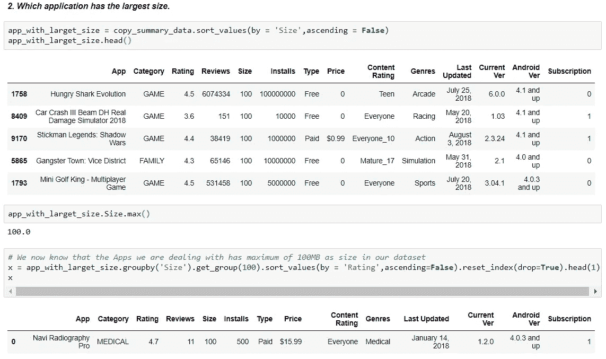

**纳维射线影业是一个高付费 APP** 是最大的 APP。

**问题 3:哪个 app 很久没更新了。这可以通过比较当前日期和应用程序实际更新的最后日期来实现？**

*   >这里，我们只需要一个列，如**日期差**，它将保存从今天减去的日期的值，然后我们寻找日期差的 m **ax。**

```
**import** **datetime**
*#copy_summary_data['Last Updated'] = pd.to_datetime(copy_summary_data['Last Updated'],coerce=True)*
copy_summary_data['Date Diff'] = pd.to_datetime(copy_summary_data['Last Updated']) - pd.Timestamp.now().normalize() 
copy_summary_data['Date Diff'] = copy_summary_data['Date Diff']*-1# We multiply by -1 because values generated are with minus sign to show the backdate feature.copy_summary_data[copy_summary_data['Date Diff'] == max(copy_summary_data['Date Diff'])]
```

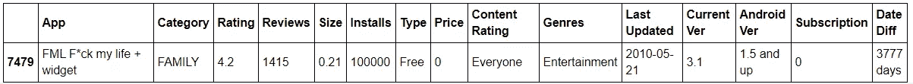

Booyah，APP 好像有点怪，是不是。？但是这是一个提供了停靠和停靠时钟的应用程序，可能还有更多小部件。**哪个 app 很久没更新了。 *F*ck 我的生活+ widget。过去 10 年来没有更新过。***

**问题 4:哪个 app 的安装量最大？？**

*   >这非常简单。我们只对**安装**进行排序，并选择第一个值。

```
copy_summary_data.sort_values(by = 'Installs',ascending = **False**).reset_index(drop=**True**).head(1)
```

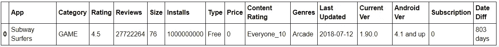

这就是了。地铁冲浪者，我在我的三星手机上玩了很多次，我爸爸沉迷于此。😅继续前进…

**问题 5:2016 年、2017 年、2018 年，下载量最多的应用类别是什么？？**

*   > Sinc，我们已经将最后更新的**列的 dtype 转换为 datetime，因此在这里，我们只需要根据每年进行过滤，即 **2016、2017、2018** 和对**安装**进行排序。这会给我们带来想要的结果。**

```
year_2016 = copy_summary_data[copy_summary_data['Last Updated'].dt.year == 2016].sort_values(by = 'Installs',ascending=**False**).reset_index(drop=**True**)
year_2017 = copy_summary_data[copy_summary_data['Last Updated'].dt.year == 2017].sort_values(by = 'Installs',ascending=**False**).reset_index(drop=**True**)
year_2018 = copy_summary_data[copy_summary_data['Last Updated'].dt.year == 2018].sort_values(by = 'Installs',ascending=**False**).reset_index(drop=**True**)# Finding the top HEAD of all APPS for different categories.print('Category in 2016 which got highest Installs is:"', year_2016['Category'][0],'",','has installs count around:"',year_2016['Installs'][0],'".')
print('Category in 2017 which got highest Installs is:"', year_2017['Category'][0],'",','has installs count around:"',year_2017['Installs'][0],'".')
print('Category in 2018 which got highest Installs is:"', year_2018['Category'][0],'",','has installs count around:"',year_2018['Installs'][0],'".')
```

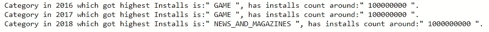

最后，最后一个问题。

**问题 6:哪个应用的评论数最多？**

```
largest_reviews = copy_summary_data.sort_values(by = 'Reviews',ascending = **False**).reset_index(drop=**True**)
print('App with the Maximum Reviews:"',largest_reviews['App'][0],largest_reviews['Reviews'][0],'"')
print('App with the Second Maximum Reviews:"',largest_reviews['App'][1],largest_reviews['Reviews'][1],'"')
```

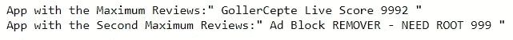

回答这些问题和解决问题的过程很有趣。我试图更精确一些，以便在对代码的一次**理解中完成**数据类型**的排序和转换，甚至分组。这节省了大量的执行时间。**

一件有趣的事情是，我有与我的同龄人、朋友、同事分享推论的习惯，这是积极的事情发生的地方。我的一个学长在**数字营销**领域有一家初创公司，他的团队专注于客户获取，其中一个创收模式是在多个平台上运行**广告**。他引用我的话，**你能帮我识别应用程序、流派、类别等吗？锁定目标以扩大他的市场范围。**

这真的鼓舞了我，因为我正在做的事情被证明是有帮助的，从那里我们开始着手这个项目，准备一些仪表板、草稿、报告，作为他扩展计划的一部分。

我们分享的一些关键推论是:

*   所有与**保健或护肤**相关的产品都可以在**Navi radiotomypro**等应用上分享。
*   因为，我们发现像**地铁冲浪者、Vector** 这样的应用程序是高收视率的高人气游戏，所以像**鞋子和酷酷的花花公子服装**这样的产品可以在那里做广告，这同样反映在应用程序中。
*   由于游戏是**最高安装类别**之一，他们应该专注于 AR-VR 游戏概念，然后一次又一次地，可以包括付费促销，这样就可以瞄准欧洲市场。
*   对于印度市场，像 **UC 浏览器、Turbo VPN、Picsart** 这样的应用程序可以有针对性地吸引更多的受众。

有些作品是公开的，因为我想让我的同行也来贡献，请看看吧。还有[笔记本](https://github.com/mishra-atul5001/Data-Science-Medium-Content/blob/master/Play%20Store%20DataSet/Play%20Store%20Inspection.ipynb)也可供参考。

接下来，我们正在努力建立一个**情感分类模型**，以便帮助他们在测试阶段发布的特定应用上做任何事情。

我看到许多人在 LinkedIn 上发帖说，数据科学不仅仅是关于编码或领域，而是解释我们使用这种技术所做的工作，但他们从来没有出现并展示应该如何做。我想，**讲故事**我们所做的工作是让客户留在我们圈子里的**关键**这就是我们击中目标的地方。

你到了这里！**荣誉。**你学会了如何构思你的**项目，并把故事讲给他人听。**

敬请期待下一部分。快乐学习！🎇