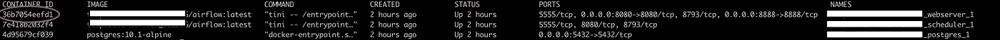
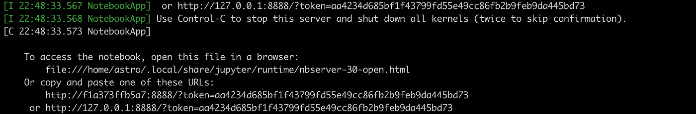
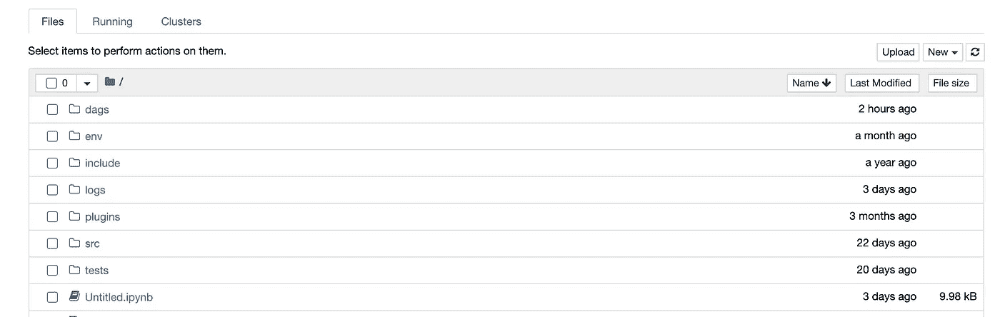
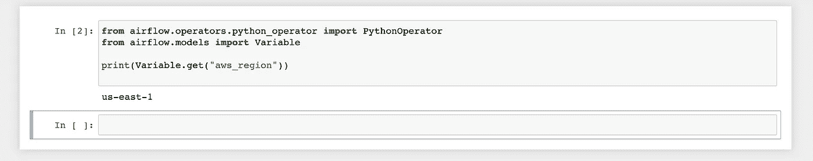

# 用 6 个简单的步骤在天文学家气流局部发展中运行 Jupyter 笔记本

> 原文：<https://medium.com/analytics-vidhya/running-a-jupyter-notebook-in-an-astronomer-airflow-local-development-in-6-easy-steps-5f134da392a0?source=collection_archive---------17----------------------->

> **注意** : *这篇文章是专门写给使用天文学家版本的 Airflow 的读者的，但是它可以通过 Docker 适应任何 Airflow 实例设置。*

我们的 DAG 的复杂性在过去的一年中增加了，我发现在一个 DAG 中以简单和可重复的方式交互地迭代和调试代码变得更加困难。所以我做了一些研究，整理了一些步骤，可以帮助人们运行 Jupyter 笔记本，它可以继承 Airflow 实例的所有本机挂钩、连接和变量。

有了这个交互式笔记本，您可以在最类似于 DAG 的最终形式的状态下更轻松地开发想法并共享它们，而无需 DAG 触发即可进行探索。

下面是在您自己的本地环境中进行设置的步骤:

# 步骤 1(仅适用于阿尔卑斯山图像)

***注意:*** *除非您 docker 文件中的天文学家图像包含阿尔卑斯山*，否则不再需要此步骤

将以下内容添加到 Airflow 项目根目录中的`packages.txt`。这些包支持 Jupyter 在你的 docker 镜像中运行。

```
build-base
python3-dev
zeromq-dev
```

# 第二步

将 jupyter 包添加到您的`requirements.txt`中，它也位于 airflow 项目根目录中

```
jupyter
```

# 第三步

现在我们需要在 Airflow 项目根目录下创建或添加一个名为`docker-compose.override.yml`的文件。此文件允许您附加/修改天文学家气流图像的默认 docker-compose 文件。我们将在 webserver docker 容器上为我们的 Jupyter 笔记本打开默认端口 8888。

```
version '2'
services:
  webserver:
    ports:
      - 0.0.0.0:8888:8888
```

# 第四步

用`astro dev start`启动您的本地实例如果当前正在运行，首先运行`astro dev stop`

# 第五步

通过运行`docker ps`找到 Airflow 服务器的 docker 容器 id

输出将显示 3 个运行的映像，一个用于 web 服务器，一个用于调度程序，另一个用于 postgres。在这种情况下，我们需要 web 服务器的容器 id。它应该是大约 10 个字符的小写字母和数字的组合，如下图所示。



# 第六步(最后！)

现在我们想通过运行以下命令从 webserver 容器中执行 jupyter notebook

```
docker exec -it xxxxxxxxxxxxx jupyter notebook --ip 0.0.0.0 --port 8888 --no-browser
```

## 让我们进一步分析一下上面的陈述:

`docker exec -it` —执行命令`-it`交互式文本终端

`xxxxxxxxxxxxx`是在步骤 5 中找到的容器的 id

`jupyter notebook`是运行 jupyter 笔记本的命令，这一行后的一切都是运行选项

因为我们在 docker 映像中，所以我们需要将 ip running 定义为 0.0.0.0，以便转发到您的本地机器

`--port 8888`是我们在前面步骤中定义的运行端口。如果您选择在不同的端口上运行，您可以在此处输入该号码

`--no-browser`因为这是在 docker container airflow web 服务器中运行，我们不需要 web 浏览器来自动启动，因为我们会自己处理。

假设这些都正确运行，您应该会看到类似如下的输出:



运行步骤 6 的控制台输出

# 在你最喜欢的浏览器中加载 Jupyter 笔记本

现在，您可以像使用任何其他笔记本一样使用这个有记录的笔记本。

通过访问 [http://127.0.0.1:8888/？我们现在在我们的 Airflow web 服务器上运行一个 Jupyter 笔记本。](http://127.0.0.1:8888/?token=)

**注意:** *如果提示您输入令牌，您将需要利用输出中显示的令牌，在上面的示例中是* `*aa4234d685bf1f43799fd55e49cc86fb2b9feb9da445bd73*`

这个令牌在 jupyter 笔记本的每一次启动时都会有所不同



运行在气流项目根目录下的 Jupyter 笔记本

在这个笔记本中，您现在可以像编写 DAG 代码一样编写代码，从而能够交互地利用连接、变量和本机挂钩



打印 POC 的气流项目变量的上下文