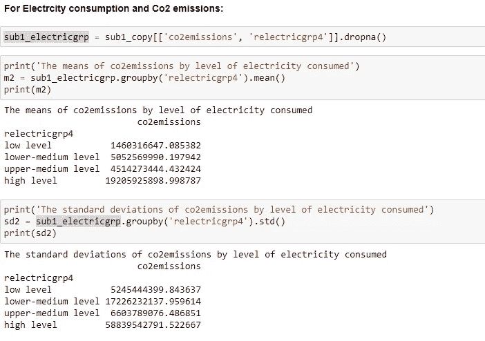
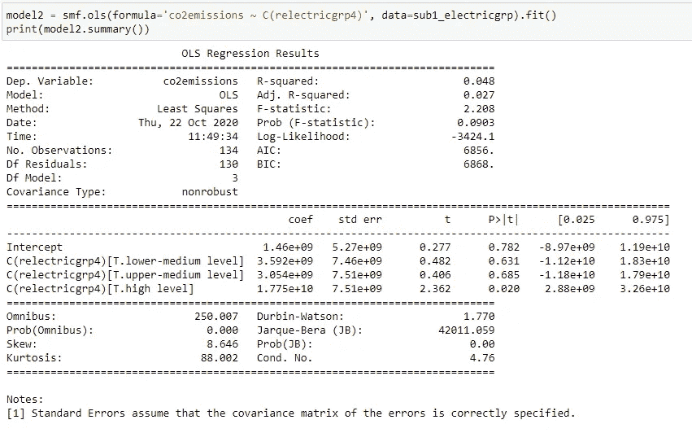

# 运行方差分析(ANOVA)测试

> 原文：<https://medium.com/analytics-vidhya/running-an-analysis-of-variance-anova-test-f7202bcc9e78?source=collection_archive---------19----------------------->

还记得我最近分享的关于我在 Coursera 提供的数据管理和可视化课程中每周作业的解决方案的博客系列吗？在那里，我努力寻找 Gapminder 数据集中两个变量之间的关联，以接受或拒绝我的假设，并回答研究问题。

**数据分析工具—方差分析检验**

现在，我决定通过进行统计测试，即方差分析测试，进一步深入研究。方差分析评估两个或更多组的平均值在统计上是否彼此不同。每当您想要比较组(分类变量)的平均值(数量变量)时，这种分析是合适的。零假设是各组之间的数量变量(分类变量)的平均值没有差异，而另一个假设是有差异。

我必须细化我的研究问题，因为我想比较从解释变量(即，电力人员)创建的四个组的定量响应变量(即，二氧化碳排放量)的平均值。精炼的研究问题是:

> 人均用电量与环境中排放的二氧化碳有关联吗？

**统计检验的假设**

1.  零假设是指在电力人均变量组中，CO2 排放量变量的平均值没有显著差异。
2.  另一个假设是，不同组的电力人均排放量变量之间的 CO2 排放量均值存在差异。

**方差分析检验**

为了使用为研究选择的两个变量执行 ANOVA 测试，我创建了 4 组解释变量(即，relectricperperson)。这些组是显示电力消耗水平的类别，它们是:低、中低、中高和高水平。方差分析测试的程序和结果总结如下:

四个电量水平的平均值和标准偏差

方差分析测试结果总结

**结果解读**

ANOVA 检验报告显示 F 统计值为 2.208，概率即 p 值为 0.0903。p 值大于阈值(0.05)，这意味着零假设不能被拒绝，并且电力消耗水平和二氧化碳排放之间没有显著关联。

没有必要进行事后方差分析测试，因为方差分析测试并不重要。

这是我的解决方案的结尾，我希望你对我的文章感兴趣。如果您有任何反馈或建议，请留言。谢谢你。