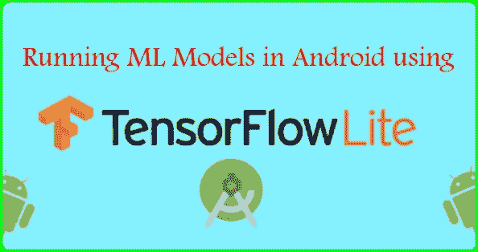
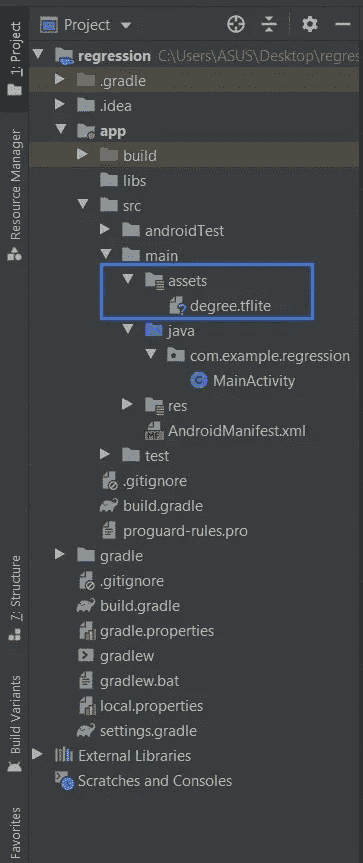
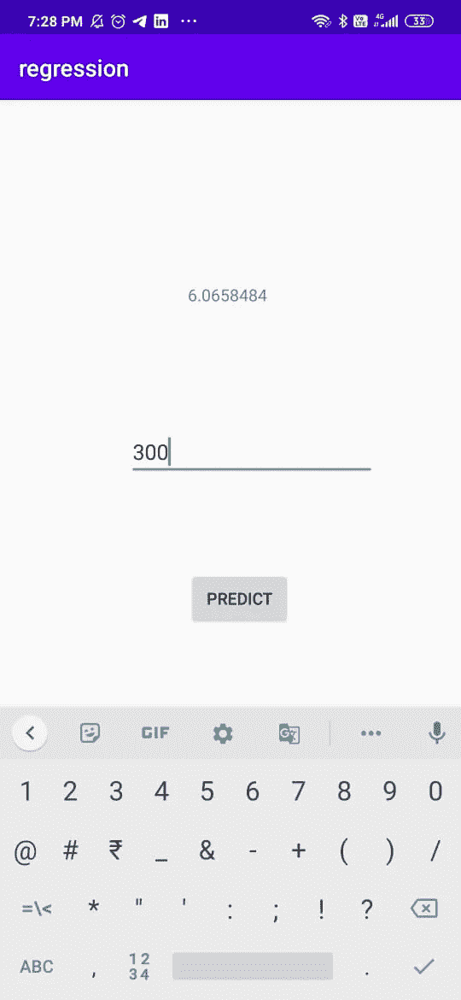

# 使用 Tensorflow Lite 在 Android 中运行 ML 模型

> 原文：<https://medium.com/analytics-vidhya/running-ml-models-in-android-using-tensorflow-lite-e549209287f0?source=collection_archive---------1----------------------->



使用 Tensorflow Lite 在 Android 中运行 ML 模型

# 简介:-

通常，在我们训练一个模型之后，我们需要测试它。在开发阶段，可以使用 CLI(命令行界面)来完成。但是当我们需要进入部署阶段时，我们需要让我们的模型在 Web 和 Android 上运行。对于 Web，我们可以使用 Tensorflow.js 或 Flask / Django 框架运行我们的模型。当谈到 android 时，在 android 中运行模型会很困难，因为它通常需要更多的 RAM 和许多限制。为此，谷歌推出了一个名为 TensorFlow-Lite 的迷你 API。通过使用 Tensorflow-Lite API，我们可以将 ML 模型部署到任何 android 应用程序中。为了简要说明它的工作原理，我将向您展示如何创建一个基本的线性回归模型，并使用 Tensorflow Lite 将其部署为 android 应用程序。

# 了解 Tensorflow-Lite API 的架构:-

在此之前，我们需要了解 TensorFlow-lite 的工作原理。


Tensorflow Lite API 的架构

它主要包括 4 个步骤

1.  **训练和保存 Tensorflow 模型:-** 首先我们需要使用 Keras 框架训练一个模型，并将模型保存在. H5 或。PB 格式加载它在任何时候我们需要的。
2.  **创建 TensorFlow Lite 转换器:-**[TensorFlow Lite 转换器](https://www.tensorflow.org/lite/convert)是一个作为 Python API 提供的工具，可以将训练好的 tensor flow 模型转换为 TensorFlow Lite 格式。它还可以引入优化。
3.  **将 TensorFlow Lite 转换器转换为。tflite 格式:-** 现在我们需要将这个对象转换成 tflite 格式，这将在 android 应用程序中进一步使用。
4.  **正在部署。tflite 进入 android studio 并运行推理:-** 现在我们将在 Android Studio 中使用 Tensorflow 解释器 API 来运行。用数据生成输出的 tflite 模型。

这样，我们可以按照上面的步骤使用 Tensorflow Lite API 运行 ML 模型。现在我们来做一个简单的线性回归 app，以 x 为输入，返回 y。

# 使用 TensorFlow Lite 在 Android Studio 中实现简单线性回归应用:-

1.  首先我们做一个简单的线性回归模型，x 和 y 为随机数。

2.将模型保存到。pbtxt 文件。

3.现在我们需要创建一个 TFLite Converter 对象，它带有在步骤 1 中创建的预训练模型。

4.现在我们需要使用这个转换器将对象转换为 tflite 对象，并需要将对象保存为。将被进一步使用的 tflite 文件。

5.现在打开 Android Studio，创建一个空项目，语言选择为 java。

6.现在您需要在项目级别创建 assets 文件夹，路径为 *app/src/main* 文件夹。

7.现在我们需要将一个 **degree.tflite** 文件添加到 assets 文件夹中。项目结构如下所示。



项目结构

8.现在转到 build.gradle(Module: app)并在 build types 下添加以下脚本，这有助于在形成 app apk 时不压缩 tflite 文件。

```
aaptOptions **{** noCompress "tflite"
**}**
```

9.现在在 build.gradle(Module: app)的 dependencies 中添加以下依赖项。

```
implementation 'org.tensorflow:tensorflow-lite:+'
```

10.现在同步您的项目。

11.现在，我们需要将以下代码添加到 activity_main.xml 中，其中添加了用于预测按钮的按钮、用于输入的编辑文本和用于显示输出的文本视图。

12.现在转到 MainActivity.java，我们需要添加一个方法来加载。tflite 模型文件。

13.现在，我们需要初始化变量，并分配 activity_main.xml 文件中的元素的链接。

14.现在，我们需要从 TensorFlow lite API 导入解释器，方法是将下面一行添加到 MainActivity.java

```
import org.tensorflow.lite.Interpreter;
```

15.现在，在 onCreate 方法中添加以下脚本，以创建从 TFLite 模型加载的 tflite 解释器对象。

```
try {
    tflite = new Interpreter(loadModelFile());
}catch (Exception ex){
    ex.printStackTrace();
}
```

16.要进行推断，需要创建一个方法，将输入字符串作为输入，并将其转换为浮点数组，然后使用 tflite.run()方法获取输出，并将输出作为浮点值返回。

17.现在，当我们单击 predict 时，方法 doInference 被调用，并获得在 TextView 中显示为预测输出的输出。

18.最终的 MainActivity.java 看起来如下:-

19.现在运行并安装在模拟器/手机上，应用程序看起来如下。



应用外观的快照

# 结论:-

这样，通过使用 TensorFlow Lite API，我们可以在 Android 手机上运行我们的机器学习模型。

# 参考资料:-

[](https://www.tensorflow.org/lite/guide/android) [## Android 快速入门| TensorFlow Lite

### 要在 Android 上开始使用 TensorFlow Lite，我们建议探索以下示例。Android 图像…

www.tensorflow.org](https://www.tensorflow.org/lite/guide/android)