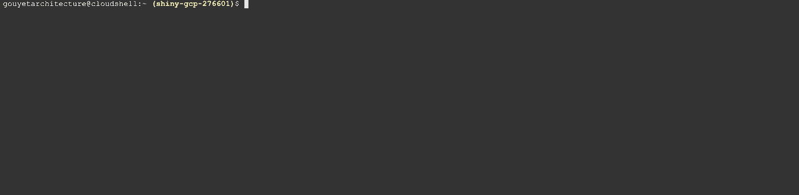
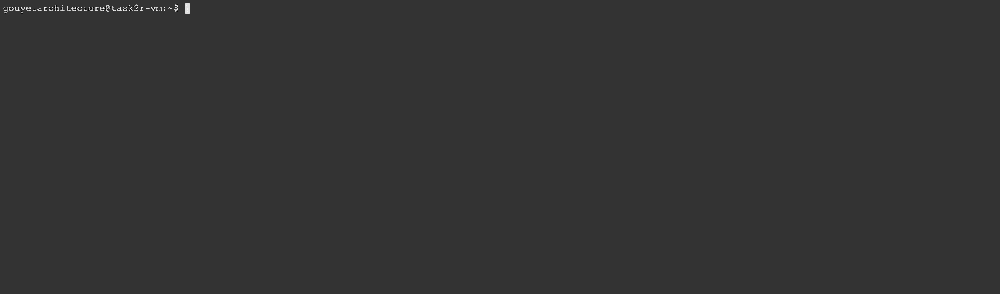
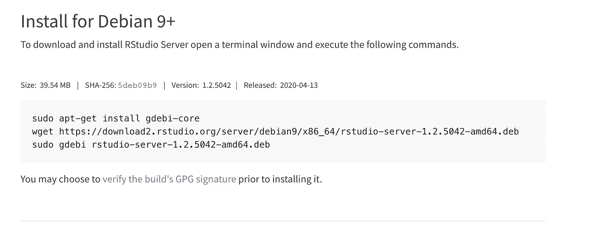
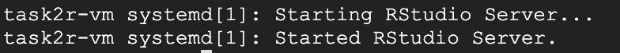
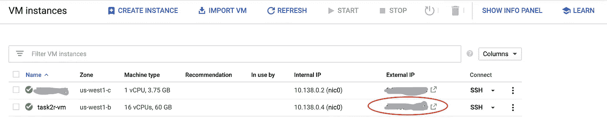
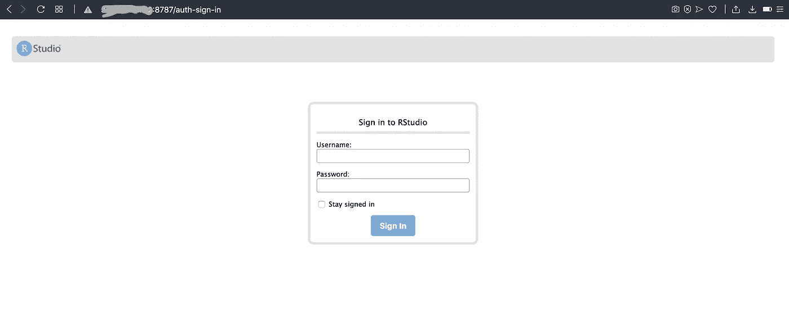
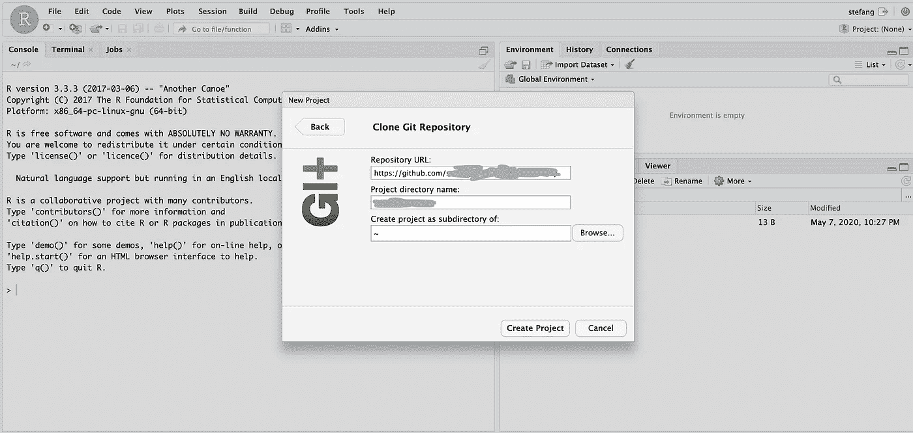

# 在 GCP 虚拟机中运行 R/RStudio

> 原文：<https://medium.com/analytics-vidhya/running-r-rstudio-in-a-gcp-vm-21a8458ef086?source=collection_archive---------3----------------------->


运行大型计算密集型 R 脚本通常是一个非常缓慢的过程；我们如何升级到更强大的服务器，同时保持低成本？

谷歌云平台(GCP)允许我们使用[各种配置](https://cloud.google.com/compute/docs/machine-types)的虚拟机(VM ),并且只为我们使用的东西付费。这种定价结构使得以相对低廉的价格运行大型密集型脚本变得可行。如果你的工作流程是容错的，那么[可抢占机器](https://cloud.google.com/preemptible-vms)可以大大降低你的总支出。

出于本文的目的，我将使用一台 n1-standard-16 机器(16 个 vCPUs 和 60 GB 内存)，配置一个 Debian GNU/Linux 9 (stretch)磁盘映像和可抢占性。这台机器的成本是每小时 0.161 美元——我的特定任务平均每周运行 3 小时，每月总计约 2 美元。*确保在使用虚拟机后将其关闭，因为保持开启会增加该数量。*


*注意:当然，对于可抢占的机器，总是存在实例在您使用时终止的风险。我个人从未遇到过这种情况，但这总是有风险的。和往常一样，如果您的工作流不是容错的，那么不推荐使用可抢占的机器。*

**步骤 1:配置虚拟机和防火墙规则**

下面是用于创建我的特定配置的 gcloud 命令(注意，我添加了一个 http-server 标记)。

```
gcloud compute instances create task2r-vm --zone=us-west1-b --machine-type=n1-standard-16 --image=debian-9-stretch-v20200420 --image-project=debian-cloud --preemptible --scopes=https://www.googleapis.com/auth/cloud-platform --tags=http-server,https-server
```

接下来，让我们配置我们的防火墙规则(在 VPC 网络>防火墙规则下)，以允许我们访问端口 8787，我们将需要使用我们的 RStudio GUI。防火墙规则应该使用 IP-ranges: 0.0.0.0/0 和端口 tcp:8787，并应用于 tag: http-server(以便它连接到我们的 VM)。


一旦这两个步骤完成，我们就可以通过控制台或命令行 SSH 到我们的虚拟机。

```
gcloud compute ssh task2r-vm --zone=us-west1-b
```



**第二步:**

成功登录我们的服务器后，让我们安装相关的软件包:

一如既往，从以下内容开始:

```
sudo apt-get update
```

接下来，运行这两个命令(第一个[将允许我们安装 deb 文件，而第二个将安装 R)。](https://packages.debian.org/sid/admin/gdebi-core)

```
sudo apt -y install gdebi-coresudo apt -y install r-base r-base-dev
```

此外，如果需要使用 tidyverse，还需要运行以下命令:

```
sudo apt-get install libcurl4-openssl-dev libssl-dev libxml2-dev
```

一旦安装了这些依赖项，确保可以在您的虚拟机中访问 R:

```
sudo R
```



**第三步:安装 RStudio 服务器**

现在 R 可以工作了，让我们也安装 RStudio(从技术上讲，这不是一个必需的步骤，因为我们可以在没有 RStudio 的情况下运行 R 脚本)。

RStudio 的[文档](https://rstudio.com/products/rstudio/download-commercial/debian-ubuntu/)让这部分变得非常简单。



我们可以运行上面的第二个和第三个命令(我们已经运行了第一个命令):

```
wget https://download2.rstudio.org/server/debian9/x86_64/rstudio-server-1.2.5042-amd64.debsudo gdebi rstudio-server-1.2.5042-amd64.deb
```


在这两个命令成功运行之后，我们会收到一个确认消息，告知 RStudio 已经启动。



为了直观地确认这种情况，导航到您的虚拟机的**外部 IP** ，指定端口号 8787。这应该类似于<外部 IP > :8787。回想一下，tcp:8787 是我们在防火墙规则中指定的端口(步骤 1)。



查找实例的外部 IP

当您导航到该 URL 时，您将看到“/auth-sign-in”字符串附加在 8787 端口号之后。



访问 <external ip="">:8787</external>

回到 shell 中，我们需要将自己添加为新用户。为此，我们使用以下命令(用您喜欢的用户名替换<stefang>):</stefang>

```
sudo adduser stefang
```

运行此程序后，返回 RStudio 登录页面并使用您的新凭据:


太好了！我们已经有了 RStudio。现在让我们通过 Github 引入我们的代码(我个人喜欢在我的本地计算机上编写我的所有代码——当我的 VM 关闭时——然后如果有任何更改，将代码推送到 VM 来运行它)。

在这样做之前，我们需要在 shell 中安装 git(下面的第二行不是必需的，但是允许登录之间有更长的“超时”)。

```
sudo apt-get install git-core -ygit config --global credential.helper "cache --timeout 28800"
```


重启 RStudio 后，我们现在可以通过克隆 git 存储库来创建一个新项目。



**关于目录**:如果您想在 VM shell 中访问您的存储库，您需要更改用户，从您的默认用户更改为您用上面的“sudo adduser < username >命令创建的用户。

```
cd /home
cd stefang/
```


从这个新目录，我们可以通过 shell 访问我们所有的文件(包括脚本的任何输出)。

**最后一个提示:**

我想完全自动化这个过程，这样，除非我有新的代码要推送，否则脚本可以在我不需要 SSH 到实例的情况下运行。

这项任务需要几个步骤，我将简要总结如下:

首先，我设置了[云调度器](http://console.cloud.google.com/cloudscheduler)来在每周的特定时间启动/停止我的实例。云调度程序允许我们限制虚拟机的使用，保持低成本并减少任何能源浪费。设置此功能的[完整流程](http://sudo apt-get install libcurl4-openssl-dev libssl-dev libxml2-dev)还涉及云功能和发布/订阅。

其次，我创建了一个 bash 脚本，它将更改当前目录，挂载一个 GCS bucket，并将我的脚本的输出文件(几个 CSV 和一个 HTML map 文件)上传到 bucket。

```
#!/bin/bashcd /home
cd stefang/gcsfuse --implicit-dirs <project-name-bucket> gcs-bucket/sudo mv <project-name>/output/ gcs-bucket/#unmount GCS bucket
fusermount -u gcs-bucket
```

第三，我将 [Crontab](https://linux4one.com/how-to-set-up-cron-job-on-debian-9/) 配置为在每周四下午 1:50 运行脚本，在下午 6:00 运行 bash 脚本(这给了我足够的时间，以防报告花费更长时间)。

```
50 13 * * 4 cd /home/stefang/<project-name> && /usr/bin/Rscript -e "rmarkdown::render('<script-name>')"00 18 * * 4 cd /home/stefang/<project-name> && /usr/bin/bash write_to_bucket.sh
```

— — —

原来如此！感谢您的阅读，欢迎在下面留下任何评论/问题。