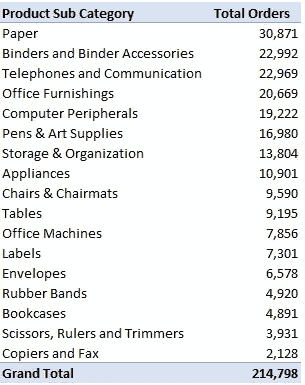
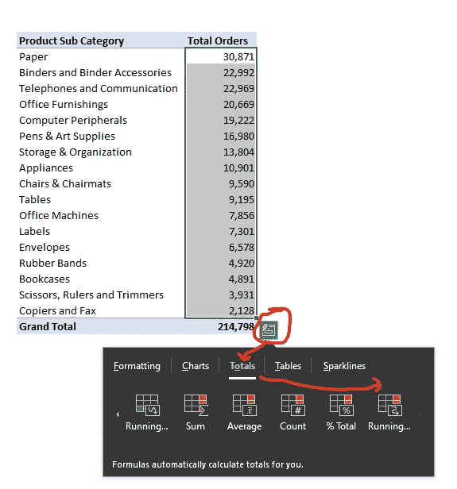
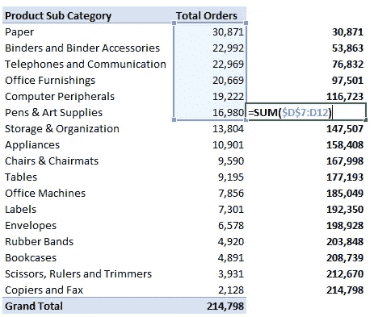
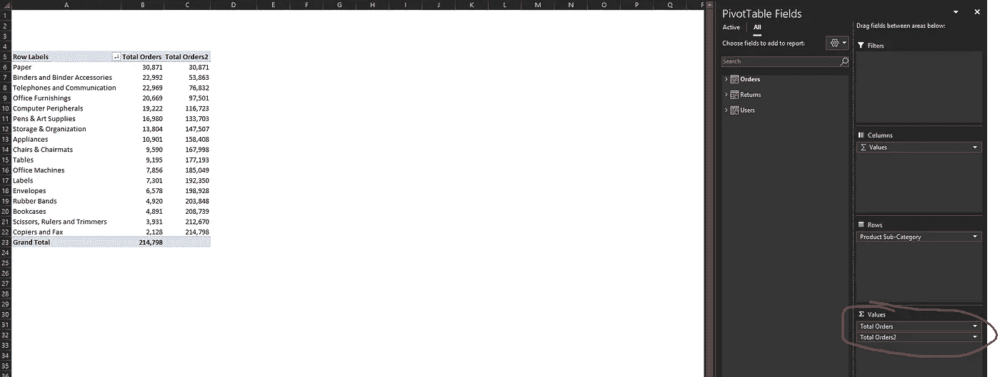
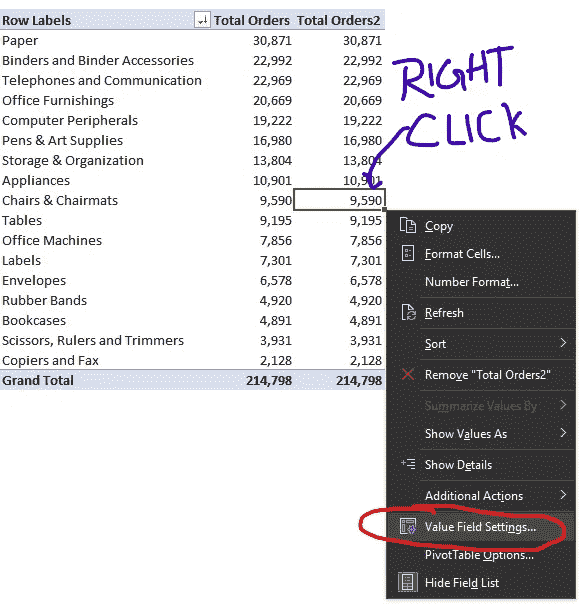
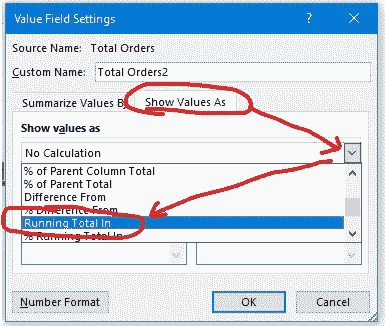
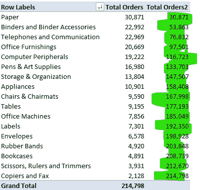
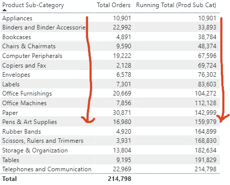
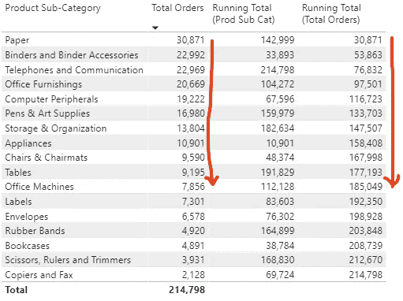

# 累计总数

> 原文：<https://medium.com/analytics-vidhya/running-totals-59d6cc015195?source=collection_archive---------24----------------------->


最初发布于:

[](https://www.vivran.in/post/running-totals) [## 累计总数

### 计算一组数据的累计总数是数据分析师的常见要求之一。这篇文章…

www.vivran.in](https://www.vivran.in/post/running-totals) 

计算一组数据的累计总数是数据分析师的常见要求之一。本文探讨了如何在 Excel 和 Power BI 中计算运行总数。

当我们使用 Excel 表格和数据透视表时，获取运行总计是一项简单的任务

# 使用快速分析进行累计

请考虑下表:



下载[样本数据文件](https://vivranin-my.sharepoint.com/:x:/g/personal/vivek_ranjan_vivran_in/EVKB4jfTRINChkKk3j4akz0B1Yys0v7KpQQ8yUD-CDJJwg?e=gy5ICh)

目标是在订单总数旁边添加一列，用于订单的运行总数

选择订单合计> Ctrl + Q(快速分析) >合计>列的运行合计



它添加了一个包含计算累计值的公式的列:



# 使用枢轴的累计

将字段拖到值中:



在本例中，我们在 Value 下拖动了 Order Quantity 字段两次

右键单击包含订单值的任何单元格>值字段设置:



在值字段设置选项>显示值为>运行总计中



结果:包含累计计算的列:



查看以下关于 pivots 的文章:

[数据透视表的 5 个有用特性](https://www.vivran.in/post/5-useful-features-of-excel-pivot-tables)

[用枢轴做更多事情](https://www.vivran.in/post/do-more-with-pivot-tables-value-field-settings)

# 使用 DAX 度量

我们希望它能如此简单。如果我们了解 DAX 的几个基本概念，那么也不难。

[下载样本文件](https://vivranin-my.sharepoint.com/:u:/g/personal/vivek_ranjan_vivran_in/ETfujvS-KeZMr1_PrjDfWVsBEuKl7CGUfAHoMRsHn5AHSA?e=lvIp0g)



为此，我们创建了以下 DAX 衡量标准:

```
Total Orders = SUM(dtOrders[Order Quantity])

 Running Total (Prod Sub Cat) = 

 //defining the subcategory selected in the visual
 VAR _SubCat = SELECTEDVALUE(dtOrders[Product Sub-Category])

 //filtering the table as per the visual selected. 
 VAR _Filter = 
  FILTER(
    ALLSELECTED(dtOrders[Product Sub-Category]),
     dtOrders[Product Sub-Category] <= _SubCat
  )

 //calculating the running total
 VAR _RT = 
  CALCULATE(
    [Total Orders],
      _Filter
  )

 RETURN
 _RT
```

上述 DAX 衡量标准为:

首先识别过滤器上下文中的当前产品子类别

_Filter 变量返回一个包含按字母顺序排序的产品子类别的列表，包括当前产品子类别。例如，对于产品子类别书架，它返回一个表:器具、活页夹和活页夹附件以及书架。

计算上一步中返回的产品子类别的订单总数。

要根据订单总数而不是产品子类别来计算累计，请将产品子类别替换为订单总数 DAX 度量:

```
Running Total (Total Orders) = 
 VAR _CurrentOrder = [Total Orders]

 VAR _Filter = 
  FILTER(
    ALLSELECTED(dtOrders[Product Sub-Category]),
     [Total Orders] >= _CurrentOrder
  )

 VAR _RT = 
  CALCULATE(
    [Total Orders],
      _Filter
  )

 RETURN
 _RT
```



你可以参考下面这篇关于如何使用 DAX 计算日期的累计的文章

[DAX 时间智能:截止日期汇总](https://www.vivran.in/post/dax-time-intelligence-part-2-till-date-aggregations)

*我写关于*[*MS Excel*](https://www.vivran.in/my-blog/categories/excel)*[*权力查询*](https://www.vivran.in/my-blog/categories/powerquery)*[*权力毕*](https://www.vivran.in/my-blog/categories/powerbi)*[*权力中枢*](https://www.vivran.in/my-blog/categories/power-pivot)*[*DAX*](https://www.vivran.in/my-blog/categories/dax)*[*数据分析【数据*](https://www.vivran.in/my-blog/categories/data-analytics)*****

**[@imVivRan](https://twitter.com/imvivran)**