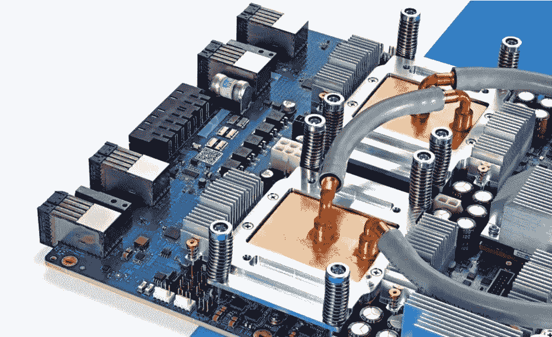
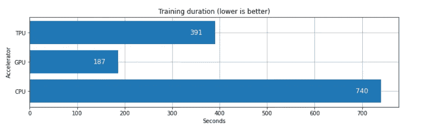
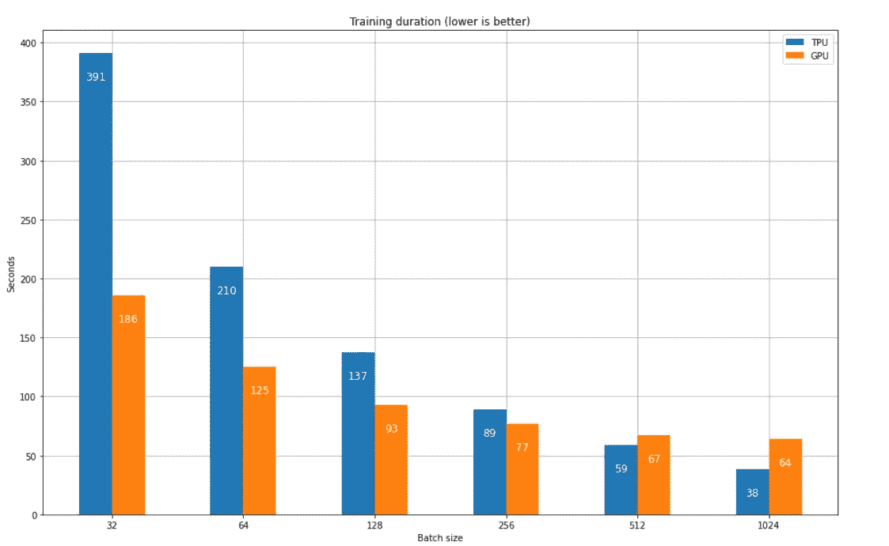
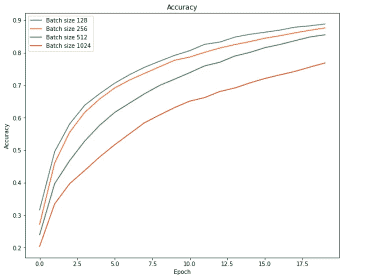
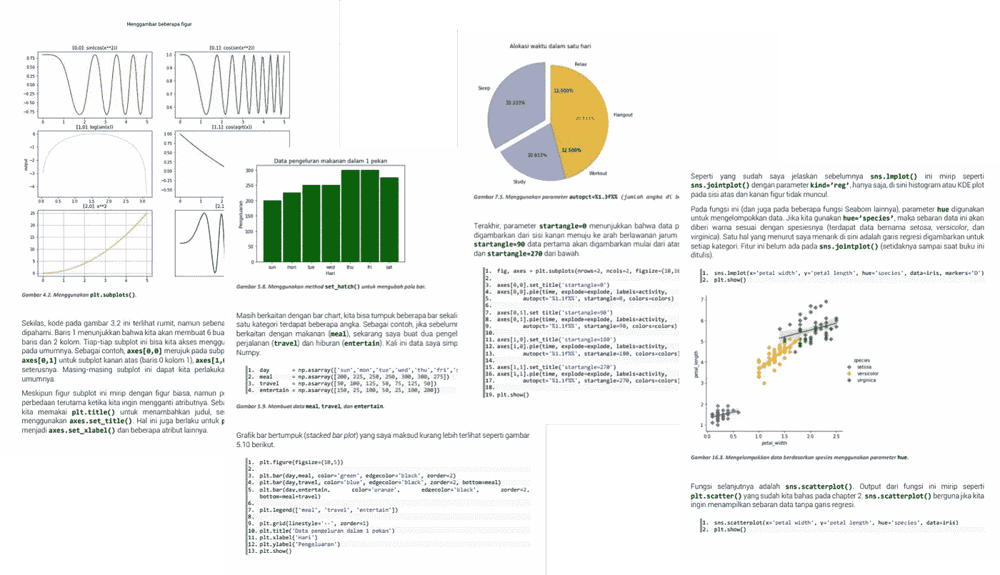

# 在 Kaggle 中运行 TPU(张量处理单元)

> 原文：<https://medium.com/analytics-vidhya/running-tpu-tensor-processing-unit-in-kaggle-96fbce4684d2?source=collection_archive---------9----------------------->

## 你的 GPU 配额快用完了，但你还有其他神经网络要训练。你能做什么？



图一。张量处理单元(TPU)。来源:[https://storage . Google APIs . com/ka ggle-media/TPU/TPU v3 angle . jpg](https://storage.googleapis.com/kaggle-media/tpu/tpuv3angle.jpg)

# 介绍

用 GPU 训练神经网络无疑比 CPU 快得多。然而，并不是所有的深度学习爱好者都拥有一台配备了像样 GPU 的计算机。我自己用的是 Nvidia GeForce MX150 笔记本电脑，但我很少用它来训练神经网络，因为我觉得即使只训练了几分钟，我的笔记本电脑也变得非常热。由于我经常做深度学习的事情，我不认为长时间加热我的笔记本电脑是一个好主意。

这就是我现在使用 Kaggle 的基本原因。但我在这里遇到了一个问题:它每周只给我 42 小时来运行与 GPU 的交互会话。但是，相信我，如果你不是像我一样的深度学习狂人，那么一周 42 小时的编码应该足够了。然而，如果你愿意，你可以使用 TPU(张量处理单元)来训练你的神经网络，它也是由 Kaggle 提供的，每周 30 小时。现在每周 42+30 = 72 小时真的很多了吧？


图二。GPU (42 小时)和 TPU (30 小时)配额由 Kaggle 提供。

有一点要记住:神经网络不会仅仅通过打开笔记本上的 TPU 加速器来训练。为了实际运行 TPU，我们需要添加一些代码。因此，在这篇文章中，我想解释一下如何使用这个神经网络加速器，以及它如何影响训练持续时间。

# 模块，CIFAR-10 数据集，CNN 模型

在我们开始之前，我想先通知你，我们在这里要做的深度学习项目基本上已经在我之前的文章中解释过了(CIFAR-10 图像分类任务)。如果你想知道它的细节，请点击下面的链接查看，因为在这里我将更关注 TPU 是如何被用于训练的。

[](https://becominghuman.ai/cifar-10-image-classification-fd2ace47c5e8) [## CIFAR-10 图像分类

### 如何用 CNN 教机器区分图像？

becominghuman.ai](https://becominghuman.ai/cifar-10-image-classification-fd2ace47c5e8) 

好了，下面是我们需要导入的所有必需模块。请注意，在下面代码的最后一行，我导入了*时间*模块，这将有助于精确计算训练持续时间。

图 3。正在导入模块。

接下来，我们将创建一个函数来完成整个预处理阶段。关于下面代码的所有解释已经在上面显示链接的文章中讨论过了。

图 4。整个预处理阶段。

现在，对于模型本身，我们也将把它包装在一个 *create_model()* 函数中。我这样做是因为基本上我会创建另外两个函数，分别是*run _ with _ TPU()*和 *run_with_tpu()* ，其中 *create_model()* 会在这两个函数内部被调用。这样做比手动定义神经网络的每一层两次更简单。下面是我们的神经网络结构的样子。

图 5。创建模型的函数。

# 创建不带和带 TPU 运行的函数

我觉得 *run_without_tpu()* 的函数名是不言自明的。下面的代码简单地运行，首先初始化 CNN 模型，然后是 training 命令。这里的 *start* 变量用于存储当前时间，其值将用于计算整个训练持续时间。

下面的代码没有什么特别的，因为它基本上就像我们在训练深度学习模型时通常做的一样。我们可以使用这段代码在 CPU 或 GPU 上训练模型，这取决于您是否激活了 GPU 加速器。

图 6。无需 TPU 即可训练神经网络的函数。

另一方面，如果我们想在 tpu 上训练模型，我们应该使用 *run_with_tpu()* 函数。下面图 7 中的代码实际上是基于 Kaggle 的文档[3]给出的模板，其中的步骤基本上可以分为几个部分:

1.  初始化 TPU
2.  初始化策略
3.  在初始化的策略中构建模型
4.  像往常一样训练模型

图 7。用 TPU 训练神经网络的函数。

# 如何使用以上所有功能

现在，既然我们已经创建了所有需要的函数，那么我们可以开始实际调用它们来运行培训。首先，调用 *preprocess_data()* 函数加载所需的数据集及其预处理步骤。返回值分别存储在 *X_train* 、 *y_train* 、 *X_test* 、 *y_test* 和 *input_shape* 中。如果您想了解我是如何定义这些回报的，只需查看图 4 中显示的代码。

接下来，我们可以调用 *run_with_tpu()* 函数来开始训练。在我们运行完图 8 中的所有代码后，进度条应该会立即出现。如果你想使用 CPU 或 GPU，我们可以将第 3 行改为 *run_without_tpu()* 。

图 8。调用我们之前定义的函数。

为了用 TPU 加速器训练一个神经网络模型，这几乎是你需要做的所有事情。CPU、GPU 和 TPU 的性能比较将在下一节讨论。

# 性能比较

根据许多消息来源(如[1]和[2])，TPU 比其他人跑得更快。但在这里我想亲自测试一下。注意，为了公平比较，在下面的图 9 中，我将所有实验的批处理大小设置为 32，epoch 设置为 20。请记住，我们并不真正关心最终的准确性分数，因为这个实验的目的只是为了找出 TPU 是否真的比 GPU 运行得更快。



图 9。不同加速器之间的训练持续时间比较。

根据上面的实验结果，看起来 TPU 的运行速度比 CPU 快大约 1.89 倍。嗯，这是相当快，但我们仍然看到，GPU 完成整个训练过程更快，速度比 CPU 快 3.96 倍。但是为什么会这样呢？

Kaggle 的文档[3]提到，我们需要使用 128 的批处理大小，以便使 TPU 以其最高性能运行。因此，我尝试在不同的批量大小之间进行比较，同时坚持使用值 20 作为纪元。实验总结如图 10 所示。请注意，这里我没有包括 CPU 的训练持续时间，因为它将远远高于条形图中的其他时间。



图 10。不同批量之间的训练持续时间比较。

我想我在这里找到了一些有趣的东西。我们可以从上面的图 10 中看到，当我们使用 TPU 时，增加批量极大地减少了训练持续时间。事实上，GPU 显示了类似的行为，但训练时间的减少没有我们在 TPU 看到的那么显著。此外，我认为使用 128 批次大小的 TPU 没有 Kaggle 在他们的文档中声称的那么快，因为它仍然需要比 GPU 所实现的更长的时间。

当我们使用 512 或更大的批量时，TPU 的训练速度实际上高于 GPU。但是重要的是要记住，使用如此大规模的批处理并不常见——嗯，至少出于某些原因，我通常使用相对较小的值。

按照[4]的说法，TPU 确实是针对大的训练批量进行优化的，而 GPU 在处理较小的批量时相对更快。然而，仅仅因为这个原因而增加批量的大小并不总是最好的解决方案，因为大批量可能会导致神经网络分类器收敛得非常慢。事实上，图 11 所示的结果实验证明了这一点。



图 11。批量大小如何影响培训过程。

同样重要的是要知道，1024 批次大小可能最终达到高精度以及较小的大小，但它将需要几个更多的纪元，这也导致总训练持续时间的增加。因此，如果我说，选择使用 TPU 或 GPU 是一种超参数调整。

事实上，我得到了另一个可能不太重要的东西，但对我来说它有点有趣，所以我还是把它写了下来。也就是说，当我们使用 GPU 开始训练时，我们会看到每个历元所用的时间是相对稳定的。你可以看到下面这个块，在批量为 256 的情况下，GPU 每次迭代训练模型需要 3 秒。

```
Epoch 1/20
49/49 [==============================] - **3s 64ms/step** - loss: 2.3475 - acc: 0.1031 - val_loss: 2.2463 - val_acc: 0.1433
Epoch 2/20
49/49 [==============================] - **3s 62ms/step** - loss: 2.1589 - acc: 0.1840 - val_loss: 2.0372 - val_acc: 0.2417
Epoch 3/20
49/49 [==============================] - **3s 61ms/step** - loss: 1.9511 - acc: 0.2610 - val_loss: 1.8399 - val_acc: 0.3026
Epoch 4/20
49/49 [==============================] - **3s 60ms/step** - loss: 1.8450 - acc: 0.2965 - val_loss: 1.8113 - val_acc: 0.3169
Epoch 5/20
49/49 [==============================] - **3s 60ms/step** - loss: 1.7943 - acc: 0.3229 - val_loss: 1.7674 - val_acc: 0.3455
```

另一方面，当我使用 TPU 加速器时，它显示第一个历元需要 5 秒来完成，但是在随后的迭代中这个速度降低到只有 1 秒。培训详情显示在下面的方框中。

```
Epoch 1/20
49/49 [==============================] - **5s 110ms/step** - acc: 0.1101 - loss: 2.3297 - val_acc: 0.1746 - val_loss: 2.2359
Epoch 2/20
49/49 [==============================] - **1s 26ms/step** - acc: 0.2218 - loss: 2.1254 - val_acc: 0.2474 - val_loss: 2.0586
Epoch 3/20
49/49 [==============================] - **1s 26ms/step** - acc: 0.2797 - loss: 1.9639 - val_acc: 0.3286 - val_loss: 1.8029
Epoch 4/20
49/49 [==============================] - **1s 26ms/step** - acc: 0.3454 - loss: 1.7732 - val_acc: 0.3861 - val_loss: 1.6769
Epoch 5/20
49/49 [==============================] - **1s 26ms/step** - acc: 0.3902 - loss: 1.6665 - val_acc: 0.4260 - val_loss: 1.5748
```

老实说，我实际上一直在网上寻找它为什么会那样的答案，但是到目前为止我还是一无所获。我会更新这篇文章，如果我已经有一个。

# 结论

总之，我们已经学习了如何使用 TPU 加速器通过添加几行代码来训练一个模型，模板可以从图 7 中获得。

谈到性能，我们在即将对批量相对较小的模型进行训练时，可以使用 GPU。否则，如果我们想要大批量训练我们的模型，应该选择 TPU。但是重要是要注意，较大的批量也可能导致较慢的收敛，这迫使您添加更多的历元来获得高精度分数，因此也消耗更多的时间。

回到我的案例，我自己更喜欢先使用 GPU，直到我用完 Kaggle 提供的配额，因为我通常使用相对较小的批处理大小。同时，如果我不再有 GPU 配额，TPU 将是我的唯一选择。CPU 呢？我想我永远不会在我的深度学习项目中使用它，因为它占用了我很多时间。

今天的文章到此为止。感谢阅读！

顺便说一下，这是这个项目中使用的全部代码。

图 12。这个项目中使用的全部代码。

# 参考

[1]在 Paul Mooney 的 Kaggle 竞赛中何时使用 CPUs vs GPUs vs TPUs。[https://towards data science . com/when-to-use-CPU-vs-GPU-vs-tpus-in-a-ka ggle-competition-9af 708 a 8 C3 EB](https://towardsdatascience.com/when-to-use-cpus-vs-gpus-vs-tpus-in-a-kaggle-competition-9af708a8c3eb)

[2]你应该选择 GPU 还是 TPU 来训练你的机器学习模型？作者高拉夫·贝兰尼。[https://www . predictiveanalyticsworld . com/machine learning times/should-you-choose-a-GPU-or-a-TPU-to-train-your-machine-learning-models/10460/](https://www.predictiveanalyticsworld.com/machinelearningtimes/should-you-choose-a-gpu-or-a-tpu-to-train-your-machine-learning-models/10460/)

【3】如何使用 Kaggle？[https://www.kaggle.com/docs/tpu](https://www.kaggle.com/docs/tpu)

[4] TPU Vs GPU Vs CPU:深度学习应该选择哪个硬件 Ambika Choudhury。[https://analyticsindiamag . com/TPU-vs-GPU-vs-CPU-你应该选择哪个硬件用于深度学习/](https://analyticsindiamag.com/tpu-vs-gpu-vs-cpu-which-hardware-should-you-choose-for-deep-learning/)

**给我的印尼朋友们的提示。**很高兴通知你，我刚刚写完一本电子书(印度尼西亚语)。这本书的题目是《用 Matplotlib 和 Seaborn 实现数据可视化》。顾名思义，它讲述了如何使用两个 Python 模块来可视化数据。它只需要 50，000 印尼盾。如果你有兴趣，请随时通过 books.by.ardi@gmail.com 打电话给我！


书的封面是什么样的。



图书内容截图。