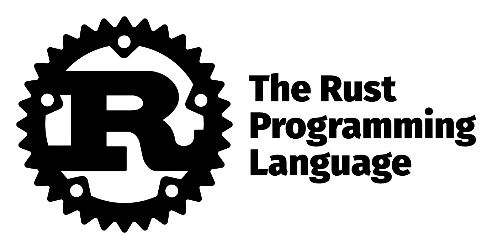

# Rust 冒险——从 Java 类到 Rust Struct

> 原文：<https://medium.com/analytics-vidhya/rust-adventures-from-java-class-to-rust-struct-1d63b66890cf?source=collection_archive---------0----------------------->

嗨，伙计们！

正如你已经知道的，我正在学习把信任作为我到 2020 年的目标之一。到目前为止，我的主要经验是 Java，虽然我也玩过其他一些。所以[面向对象编程](https://en.wikipedia.org/wiki/Object-oriented_programming)是我日常生活的一部分。

类是 Java 的核心，没有类根本无法编写 Java 程序，甚至打印一个 Hello…