# RVL-CDIP(瑞尔森视觉实验室复杂文件信息处理)

> 原文：<https://medium.com/analytics-vidhya/rvl-cdip-ryerson-vision-lab-complex-document-information-processing-aa30b00a2b1e?source=collection_archive---------6----------------------->

安妮·斯普拉特在 [Unsplash](https://unsplash.com?utm_source=medium&utm_medium=referral) 上的照片

# 描述:

RVL-CDIP(瑞尔森视觉实验室复杂文档信息处理)数据集由 16 类 400，000 幅灰度图像组成，每类 25，000 幅图像。有 320，000 幅训练图像、40，000 幅验证图像和 40，000 幅测试图像。调整图像大小，使其最大尺寸不超过 1000 像素。

以下是数据集中的类，以及每个类的示例:

信函备忘录电子邮件文件夹表单手写发票广告
预算新闻文章演示科学出版物问卷简历科学报告
规格
该数据集是 IIT-CDIP 测试集 1.0 的子集，可在此处公开获取。该数据集的文件结构与 IIT 集合中的文件结构相同，因此可以引用该数据集进行 OCR 和其他元数据。IIT-CDIP 数据集本身就是传统烟草文档库的一个子集。

演职员表:[https://www.cs.cmu.edu/~aharley/rvl-cdip/](https://www.cs.cmu.edu/~aharley/rvl-cdip/)

# 深度学习的使用:

提出了一种用于文档结构学习的基于区域的深度卷积神经网络框架。这项工作的贡献包括基于区域的分类器的有效训练和文档图像分类的有效集成。通过在 ImageNet 数据集上从预训练的 VGG16 架构导出权重来使用初级“域间”迁移学习，以在整个文档图像上训练文档分类器。利用基于区域的影响建模的性质，使用二级“域内”转移学习来快速训练图像片段的深度学习模型。最后，利用基于堆叠概括的集成来组合基本深度神经网络模型的预测。所提出的方法在流行的 RVL-CDIP 文档图像数据集上实现了 92.21%的最新精度，超过了现有算法设定的基准。

# 数据来源:

数据下载地点:[https://www.cs.cmu.edu/~aharley/rvl-cdip/](https://www.cs.cmu.edu/~aharley/rvl-cdip/)。我使用 colab 来完成这个项目。数据是使用 curl-we-get 软件直接在 colab 平台上下载的，然后提取并分发到 16 个类中。

# 数据概述:

该数据集由针对美国烟草公司的法律诉讼文件的扫描灰度图像组成，并被分为 16 个类别。数据集被细分为训练集、验证集和测试集，每个数据集分别包含 320000、40000 和 40000 幅图像。数据集已经被分割成 train/dev/test，每个分割中分别有 320k/40k/40k 文件可用。未压缩时，数据集大小约为 100GB。

# 映射到现实世界的 ml 问题:

这是一个多类分类问题，对于给定的原始图像作为输入，我们需要预测它属于 16 类中的哪一类。

# 绩效指标:

我使用准确度作为性能度量，因为所有的图像被分为 16 类，并且每类中的图像数量是均等分布的。

# 问题陈述:

取一个 raw 图像作为输入，预测它属于哪个类作为输出。

# 解决问题的第一步:

解决该问题的第一种方法是制作 16 个不同的文件夹，并将训练和交叉验证图像分发给各自的文件夹。下一步是使用图像数据生成器对这些图像分别进行整体、页眉、页脚、每隔一个图像序列的左右部分、验证和测试图像，并分别保存模型。接下来，执行所有五个模型的特征提取部分，并堆叠所有模型，然后使用堆叠的模型预测标签。最后一步是制作一个神经网络，并使用这个具有堆叠模型的神经网络作为神经网络拟合部分的输入。案例研究的最后一部分是将管道作为项目的一部分，即以原始图像作为输入，以 hollistic、header、footer、left 和 right 作为输入，使用现有的模型提取特征，并使用一些原始的看不见的图像来测试模型是否能预测类别。

# rvl 数据集的探索性数据分析:

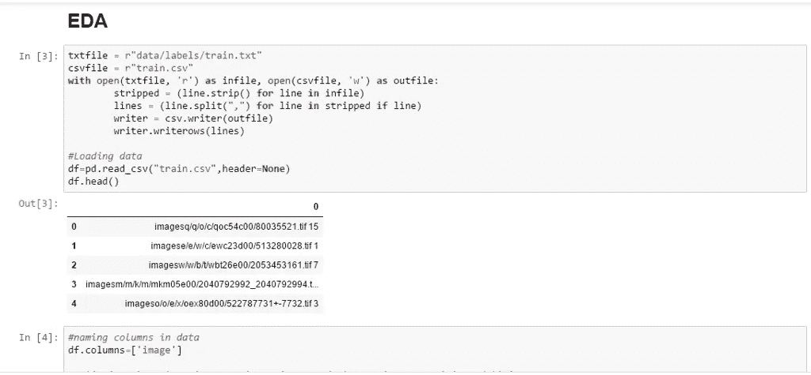

首要任务是理解数据中实际提供给我们的是什么。

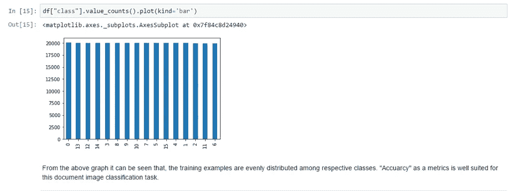

从给定的图表中可以看出，数据是均匀分布的。

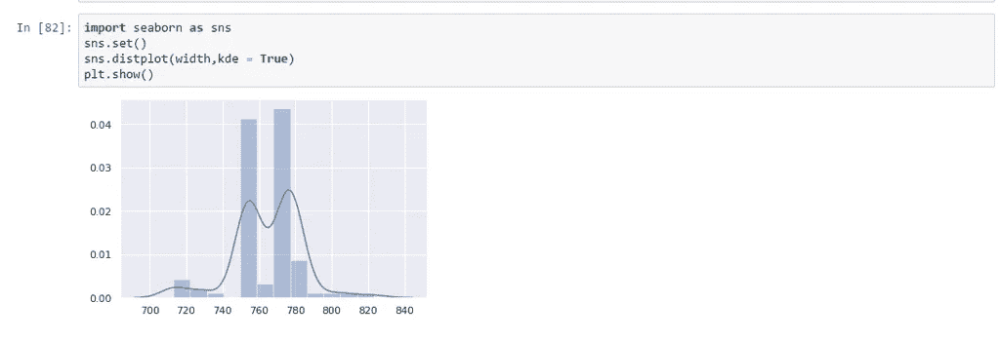

理解每幅图像的宽度。可以看出，图像的宽度在给定的范围内变化。

# 我案例研究中的模型解释:

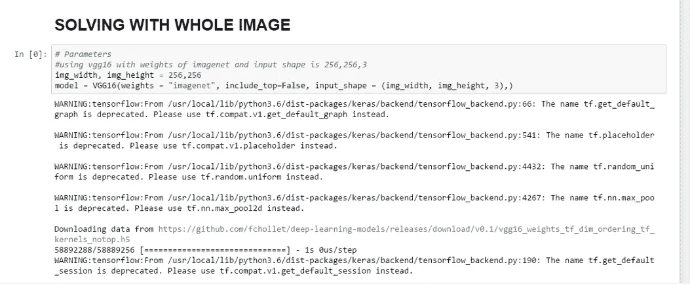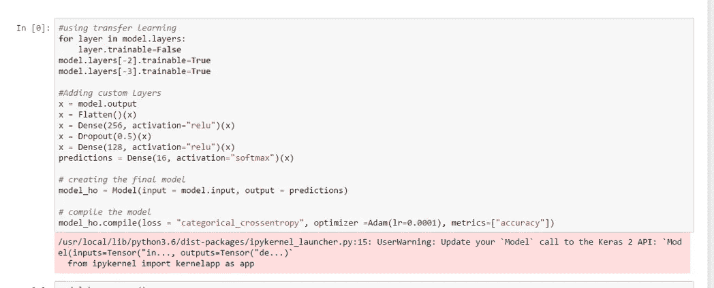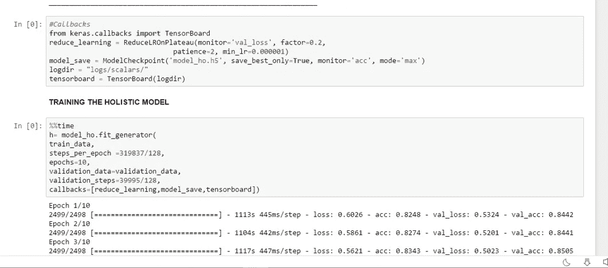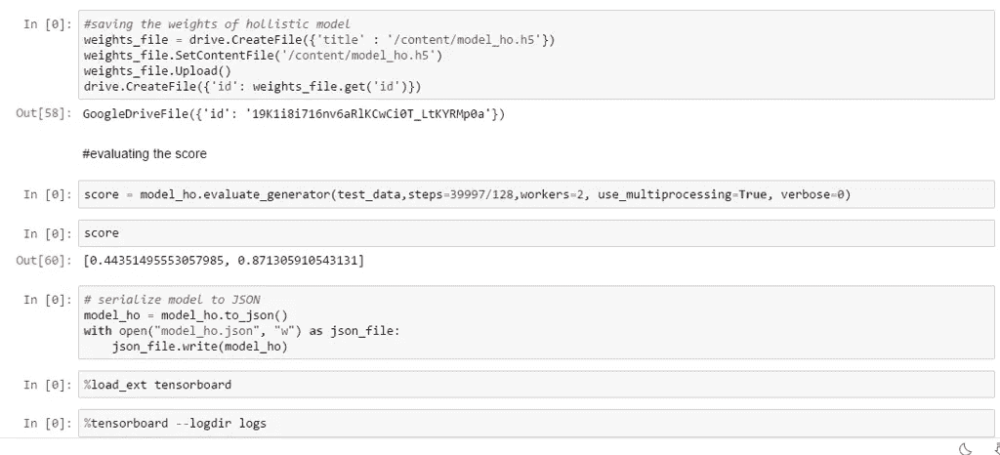

DCNNs 是目前最流行的深度学习模型之一。为此，我使用了 vgg16。VGG16 模型在文档分类任务上比其他 DCNN 模型表现得更好。我们利用这些信息来选择 VGG16 模型作为我们的基本分类器模型。总体架构是通过 Adam 优化器完成的，Adam 优化器用于训练，学习率衰减基于验证集的准确性进行调整。所使用的初始权重是从在 ImageNet 对象识别数据集上训练的模型转移来的。为了评估各种架构，使用 ImageNet1K 权重和随机权重初始化模型权重。我们使用 32 的小批量来容纳大的训练图像。它可能会更高，但测试集上的结果似乎保持良好。首先，完全连接的 vgg16 层被删除，最后两层是可训练的，并在此基础上增加三层。

在最后一层，我使用了 softmax，因为它是一个多类分类问题，损失函数是分类交叉熵，因为它是一个多类分类问题。在模型中使用下降来控制过拟合。Adam optimizer 的性能优于 rmsprop、adagrad 和 adadelta，因此我使用了 Adam。之后，我使用 tensorboard 来了解模型的性能。之后，我使用了模型检查点来保存具有最佳权重的模型。保存模型权重后，我使用该模型在数据生成器上评估该模型。

然后将模型序列化为 json。在解决底部、右侧、左侧和顶部等其他部分时，我使用了保存的检查点中的类似模型。在对其他三个部分进行类似的训练后，我所做的是使用 predict generator 提取特征，并再次保存模型的特征。以这种方式，提取并保存所有五个部分——霍利斯蒂、左、右、整体和底部部分——的训练、测试、验证的所有特征。

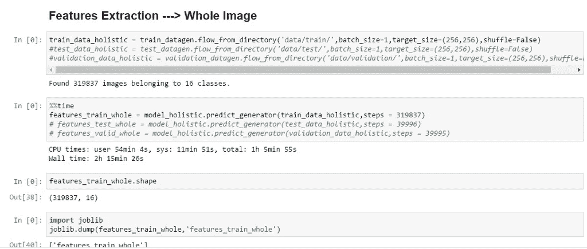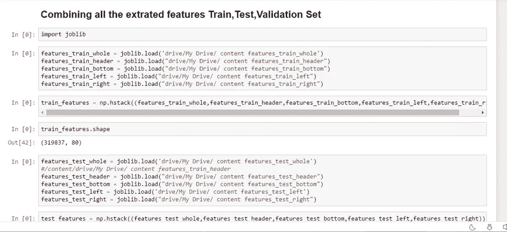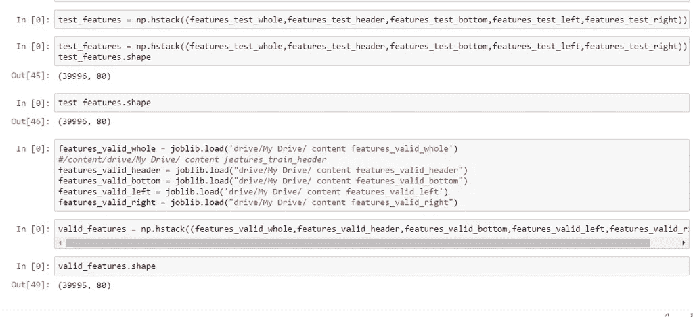

我们必须堆叠所有提取的特征并保存提取的特征，从而创建检查点。

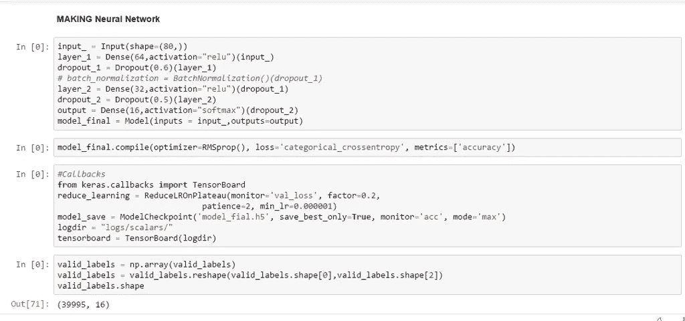

然后设计一个神经网络，根据提取的训练特征训练该模型，然后根据提取的测试特征评估该模型。准确率为 91.85%。

# 未来工作:

在未来，我可以使用分布式计算来提高模型的可使用性，我可以一次性运行整个任务，这在 colab 或入门级台式机/笔记本电脑中是不可能的，而不是保存模型，这将提高模型的效率。它可以使用数据并行性跨多个 GPU 进行训练。我还可以尝试用更多的历元来训练模型，这可以改进模型。

# 参考:

[-https://www . cs . CMU . edu/~ a Harley/rvl-cdip/](https://www.cs.cmu.edu/~aharley/rvl-cdip/)

[-https://papers with code . com/sota/document-image-class ification-on-rvl-cdip](https://paperswithcode.com/sota/document-image-classification-on-rvl-cdip)

[-https://github . com/jpc rum/Final-Project-group 5](https://github.com/jpcrum/Final-Project-Group5)

*   【https://www.cs.cmu.edu/~aharley/icdar15/ 

# Github:

 [## Ilovemysr/rvl-cdip

### 在 GitHub 上创建一个帐户，为 Ilovemysr/rvl-cdip 开发做出贡献。

github.com](https://github.com/Ilovemysr/rvl-cdip) 

# Linkedin:

[https://www.linkedin.com/in/ishika-chatterjee-9a9966120/](https://www.linkedin.com/in/ishika-chatterjee-9a9966120/)