# 南面向对象设计中的 O.L.I.D 原则

> 原文：<https://medium.com/analytics-vidhya/s-o-l-i-d-principles-in-object-oriented-designing-66a2eef500?source=collection_archive---------19----------------------->

图片由在 Unsplash 的 Hitesh Choudhary 拍摄

南 O.L.I.D 是一个缩写词，它定义了面向对象设计的前五个原则。这是罗伯特·c·马丁提出的。这五个原则定义了如何设计一个符合编码标准的软件解决方案，以及如何避免糟糕的设计实践。让我们用 JAVA 中的简单例子来进一步研究这些原则。

**什么是 S.O.L.I.D 原则？**

*   单一责任原则
*   **O** 关笔原理
*   **L** 伊斯科夫替代原理
*   I 界面偏析原理
*   **D** 依赖反转原理

**为什么我们使用 S.O.L.I.D 原则？**

南 O.L.I.D 原则让程序员很容易设计出非常灵活的解决方案，灵活性在编程中非常重要。通过在您的解决方案中使用 S.O.L.I.D，代码变得更容易理解、可扩展、易于调试和重构。设计中的不良实践可能会导致极其糟糕的结果，例如解决方案变得不灵活和脆弱，一个小的变化可能会导致许多错误，从而使系统完全失败。为了克服所有这些不良做法，开发符合行业标准的系统，让我们实践 S.O.L.I.D 原则。

**详细的 S . o . l . I . d…**

**01)单一责任原则**

*“一个类应该有且只有一个改变的理由”。*

这个意味着一个类应该只有一个目的或责任，并且该类中的所有方法和属性应该只与那个目的或责任直接相关。简单地说，一个类中的所有方法和变量应该有相同的目标。如果一个方法或属性的目的与类的目的不同，那么它应该放入一个单独的类中。让我们通过下面的例子更清楚地理解它。

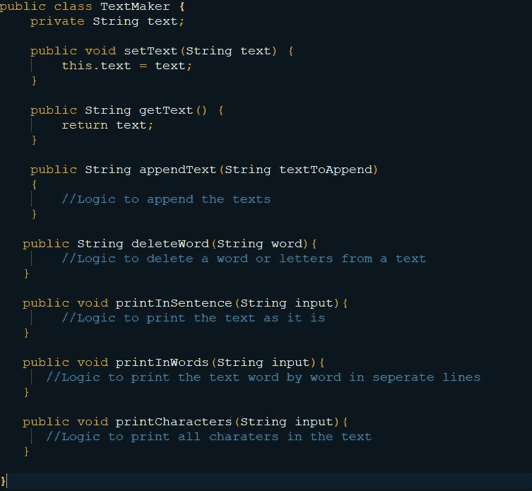

违反单一责任原则的一个例子。

看上面的例子。乍一看，似乎很好。当然，它工作得很好，并给出了期望的输出。但它违反了单一责任原则。 *TextMaker* 类的目的是操纵文本，如创建新文本、添加文本、修改文本等。但是在这门课上，不是操纵文本，而是以不同的格式打印文本。嗯，以不同格式打印文本不是文本制作者的责任。这里 *TextMaker* 已经完成了 *TextPrinter* 的职责，但违反了第一条原则。

让我们看看如何纠正这一点，以确保单一责任原则。让我们将打印不同格式文本的责任交给一个名为 *TextPrinter* 的新类。这样文本打印机将打印文本，而*文本生成器*将处理文本。现在职责分开，交给相关的类。

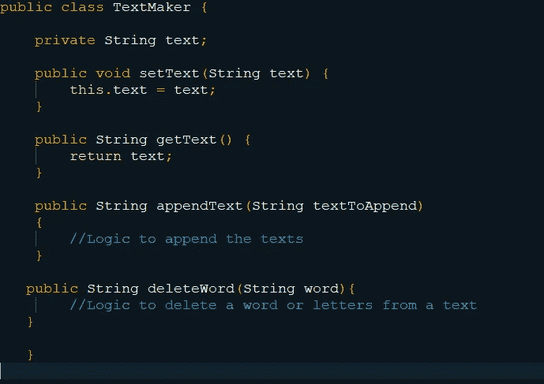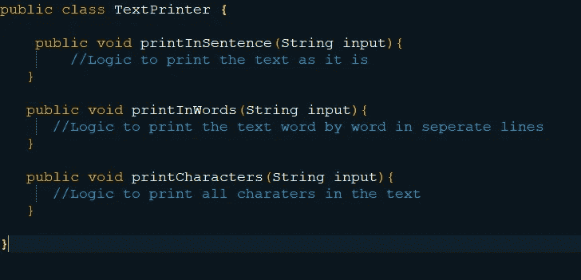

一个确保单一责任原则的例子。

现在，这两个级别有各自的责任，并确保单一责任原则。在这个原则中需要记住的非常重要的一点是，我们首先应该非常清楚地了解课堂的目的。

**02)开闭原理**

*“软件实体(类、模块、函数等)应该对扩展开放，但对修改关闭”*

这个原则认为，一个实体应该能够在不改变其内容的情况下轻松扩展。它促使您以一种无需更改现有代码就可以添加新功能的方式编写代码。这一原则防止了对一个类的更改影响到所有其他相关类的情况。Bertrand Mayer 提出用继承来解决这个问题。但是由于继承引入了紧耦合，Robert C. Martin 和其他人引入了多态性作为解决方案。在那里，我们使用总是对修改关闭但对扩展开放的接口。让我们看一个这个原理的例子。

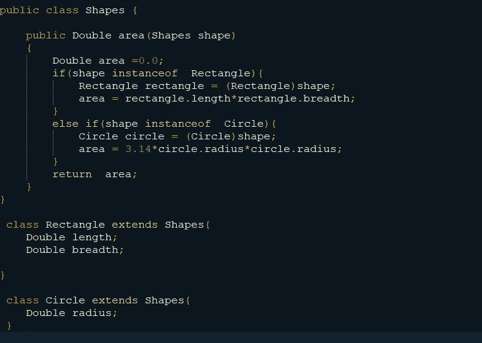

违背开闭原则的例子。

看上面的例子，乍一看，似乎还可以。是的，它工作正常，输出正确。但这段代码违反了开闭原则。看方法区()。面积函数只计算圆和矩形的面积。想想看，如果我们想添加一个新的形状，如正方形或三角形。然后，我们必须修改超类中的面积函数，以便计算新形状的面积。每次添加一个新的形状，我们都必须修改超类面积方法。这是一种不好的做法。本例中的实体可以修改。让我们更改代码，以确保开闭原则，即实体只对扩展开放，对修改关闭。

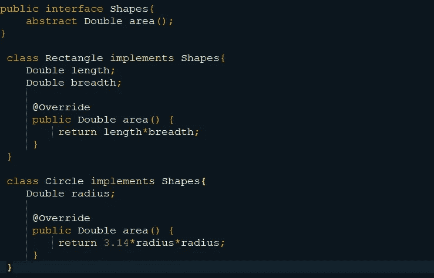

开合原则得到保证的例子。

看上面的例子。为了确保松耦合，我使用了接口而不是继承。这里接口*形状*有一个抽象方法区域()。形状的所有其他类都是形状接口的实现，并且用它们自己的实现覆盖面积方法。这样，无论添加多少新类，它们都会覆盖 area 方法，而不会修改任何其他实体。在这个新代码中，实体对于修改是封闭的，但是对于扩展是开放的。现在我们已经保证了开闭原则。

**03)利斯科夫替代原理**

*“使用指向基类的指针或引用的函数必须能够在不知道的情况下使用派生类的对象。”*

简而言之，子类应该可以替代它们的父类。当考虑接口(抽象)时，接口的任何实现都应该可以替代接口被接受的地方。如果按常理来说，子类型应该可以替代它们的超类型引用，而不会影响程序的执行。

让我们看一个违反上述原则的例子。

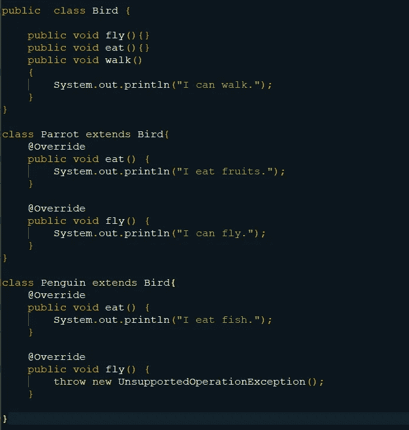

违背里斯科夫替代原理的一个例子。

在上面的代码中，*鸟*是超类，*鹦鹉*和*企鹅*是子类。下面的类*测试器*被编写来运行和测试上面的代码。

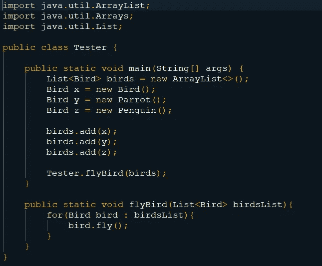

请参见上面的示例代码。当我们在 *Tester* 类中运行 flyBird()方法时，在 Bird 对象列表中对象 x 和 y 将运行 fly()方法。但是当 z.fly()运行时，就会出现异常。那是因为*鸟*类不能被*企鹅*类替代，因为后者违反了利斯科夫替代原则。让我们看看如何纠正这一点，以确保利斯科夫替代原则。

通过将公共特性分解到相同的类中，我们可以纠正上面的代码，以确保 Liskov 替换原则。下面我们把会飞的鸟和不会飞的鸟分开。

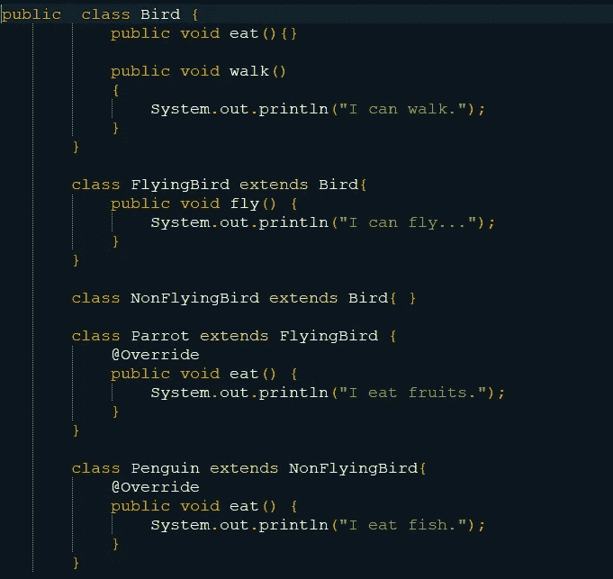

里斯科夫替代原理得到保证的一个例子。

现在所有的超类都可以被子类替换，其中代码确保了 Liskov 替换原则。

利斯科夫替代原理(LSP)与开闭原理有着非常密切的关系。每当一个代码违反了利斯科夫替代原则，它也违反了开闭原则。情况是这样的，当子类型不能被父类型替换时，我们必须在当前的解决方案中做一些改变来支持父类型，这违反了开闭原则。

**04)界面偏析原理**

永远不要强迫客户端实现它不使用的接口，也不要强迫客户端依赖它们不使用的方法

这个原则是说，不应该强迫客户依赖它不使用的方法。当开发一个软件解决方案时，用户经常要求新的特性。当满足这些要求时，很容易违反这个原则。这一原则的目的是将根据用户要求所做的更改的副作用最小化。为此，解决方案被分成多个独立的部分。

让我们用下面的例子来理解这个原则是如何被违反的。

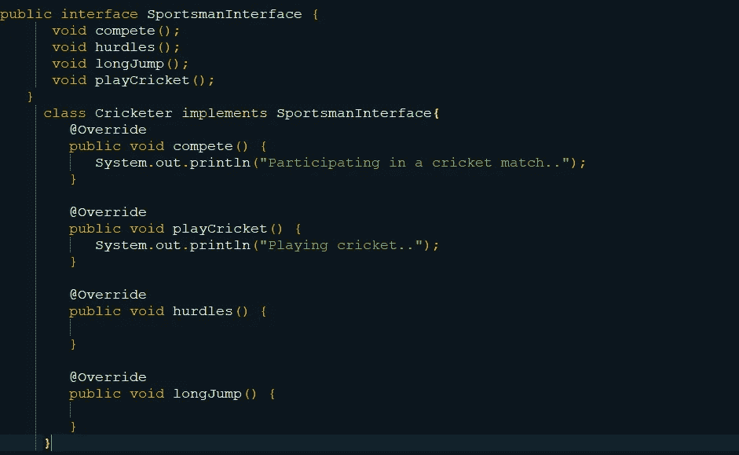

违反界面分离原则的一个例子。

乍一看，这段代码运行良好。但是如果观察得好，它就不符合正确的标准。在上面的代码中， *SportsmanInterface* 有四个方法。板球运动员是运动员的一个亚型。通过由类*板球运动员*实现*运动员接口*，它必须实现像*板球运动员*从未使用过的 longJump()和跨栏()这样的方法。这里，板球运动员*被迫依赖于两种永远不会使用的方法。在这里，界面分离原则被违反了。让我们看看如何通过确保接口隔离原则来纠正上面的示例代码。*

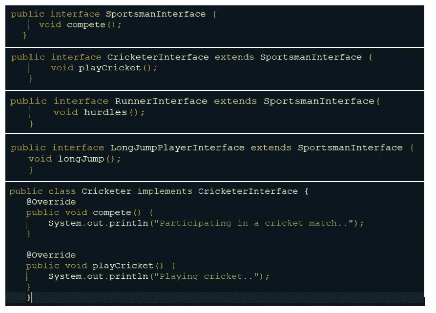

界面分离原则得到保证的例子。

现在*运动员接口*只有 compete()方法，这是所有运动员共有的。添加了一个名为 *CricketerInterface* 的新接口，其中包含所有板球运动员通用的方法。现在我们可以创建一个 *Cricketer* 类作为 *CricketerInterface* 的实现，它只需要实现其中需要的方法。现在它没有被强制在其中实现无用的方法。这样就保证了界面分离原则。

**05)依存倒置原则**

实体必须依赖抽象，而不是具体

高级模块提供复杂的逻辑，低级模块提供实用功能。这两个模块应该是松散耦合的，这样低层模块的变化不会影响高层模块。这样，依赖倒置原则促进了松散耦合。换句话说，这个原理可以被描述为解耦模块的一种特定形式。

该原理由以下两部分组成
1。高层模块不应该依赖低层模块。两者都应该依赖于抽象。抽象不应该依赖于细节。细节应该依赖于抽象。

我们用一个例子来看看上面的原则是如何被违背的。

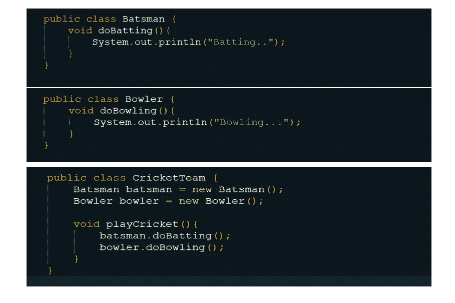

违反依赖倒置原则的一个例子。

在上面的例子中，*板球队员*是高级模块，*击球手*和*投球手*是低级模块。但是在这里，类 *CricketTeam* 依赖于两个低级模块*击球手*和*投球手*违反了依赖倒置原则的第一部分。

看看 *CricketMatch* 类的实现，doBatting()和 doBowling()方法是*击球手*和*投球手*类的方法。它们是游戏的形式，这意味着它们是细节。这里的细节不依赖于抽象。这样就违反了原则的第二部分。

我们来看看如何修正上面的代码来保证依赖倒置原则。

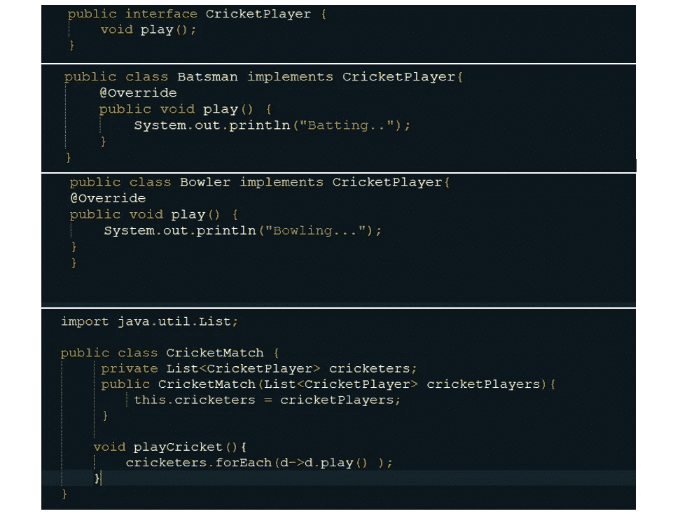

依赖倒置原则得到保证的一个例子。

为了解决上面的第一个问题，我用抽象方法 play()引入了一个名为 *CricketPlayer* 的抽象(接口)。现在*击球手*和*投球手*类是*板球运动员*抽象的实现。现在，作为高级模块的类 *CricketMatch* 不依赖于低级模块，而只依赖于抽象。此外，低级模块及其细节依赖于抽象，这确保了依赖性反转原则。

通过在你的设计中应用 S.O.L.I.D 原则，你将按照适当的标准编写代码，你会发现它们非常有用。通过确保这些原则，您的代码将很容易扩展、修改、测试和重构，而不会遇到困难。

希望这篇文章能帮助你对神盾局的原则有所了解。

享受阅读！！！！！！！！