# 标准普尔 500 利用脸书的先知进行预测

> 原文：<https://medium.com/analytics-vidhya/s-p-500-prediction-using-facebooks-prophet-e1a112584b9f?source=collection_archive---------10----------------------->

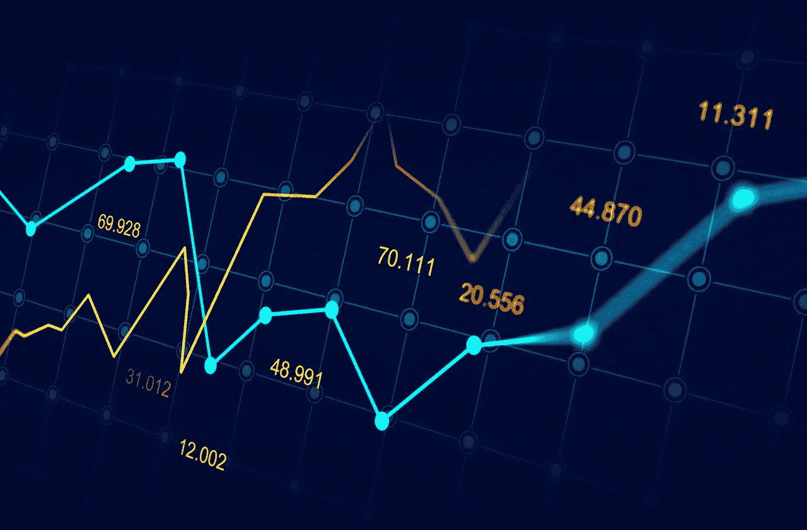

鸣谢:Getty Images

# 免责声明:市场和机器学习

股票绝对是一个时间序列。对于每个值具有连续时间点的任何数据也是如此。不幸的是，你不能可靠地战胜市场。

《用 Python 进行深度学习》Chollet 的书说，市场与天气模式等自然现象相比，具有非常不同的统计特征。当你只能访问公开可用的数据时，试图使用机器学习来击败市场是一项艰巨的任务，你可能会浪费时间和资源，却没有任何回报。

> 永远记住，当谈到市场时，过去的表现并不能很好地预测未来的回报——**看后视镜是一种糟糕的驾驶方式。**另一方面，机器学习适用于过去可以很好预测未来的数据集。

使用时间序列预测来预测股票价格并让我们都变得富有是一个非常糟糕的主意。相反，如果我们盲目地依赖它，它会让我们损失数百万。

# 介绍

这篇文章是关于学习脸书的先知，并用它来预测标准普尔 500 作为一个教程。

在本教程中，我们将使用 Prophet(脸书的时间序列预测库)预测股票价格。然而，历史价格并不能表明价格会上涨还是下跌。我宁愿使用我自己的变量(移动平均线)并使用机器学习来预测股价，而不是仅仅使用历史价格作为股价上涨的指标。

# 脸书的先知是什么？

最常用的预测模型是自回归模型。预测可能是一门很难的科学，需要大量的专业知识。因此，为了开发一种可以捕捉时间序列数据中季节性的模型，脸书的研究团队开发并开源了 [Prophet](https://facebook.github.io/prophet/docs/quick_start.html#python-api) ，它允许任何拥有 Python 或 R 编程技能的人轻松实现对时间序列的预测。

prophet 是一个开源库，用于基于 [**加法回归模型**](https://en.wikipedia.org/wiki/Additive_model) 预测时间序列数据，其中它可以轻松捕获**每日**、**每周**和**每年**季节性以及**假日效应**。

Prophet 使用一个可分解的时间序列模型，它有三个主要的模型组件:增长、季节性和假期。它们通过以下等式组合在一起:

> y(t) = g(t) + s(t) + h(t) + e(t)

其中 ***g(t)*** 代表趋势。Prophet 使用分段线性模型进行趋势预测， ***s(t)*** 代表由于每周或每年季节性的周期性变化， *h(t)* 代表节假日的影响， *e(t)* 代表误差项。

Prophet 模型通常非常快，即使对于成千上万次观察也是如此。它不需要任何数据预处理，也可以处理缺失数据和异常值。

我们开始吧！

我们将使用 [Google Colab](https://colab.research.google.com/notebooks/intro.ipynb) 进行演示，在其中旋转 Python 笔记本并安装必要的库。

我们从安装某些库开始，然后导入它！

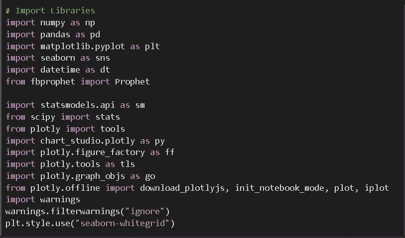

由于 google collab 中的版本不匹配，我们必须在导入这些库之前安装 Plotly、chart_studio 并升级 statsmodel。

让我们试着理解我们的数据=我们从雅虎财经历史数据中提取了过去 6 年的标准普尔 500 数据和每日频率数据。

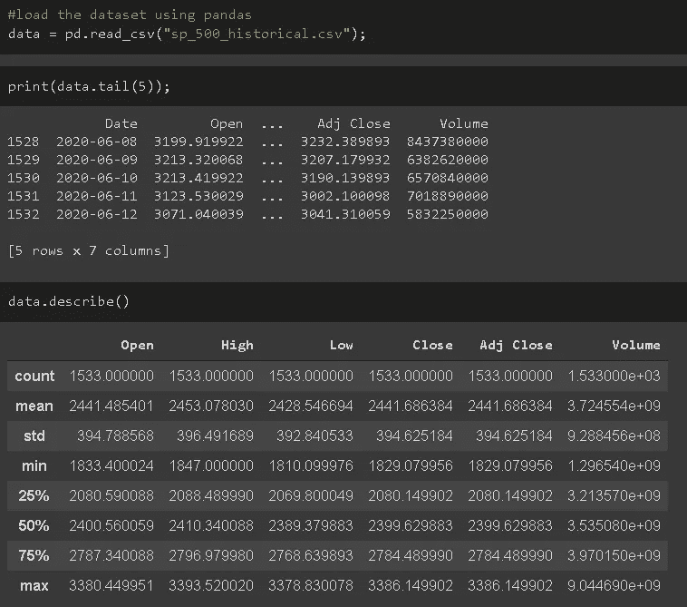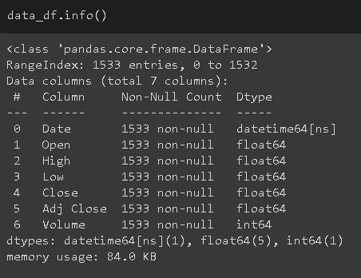

因为我们的数据已经预处理，似乎没有空数据和数据类型也是必要的。所以让我们抓紧时间处理吧！

我们绘制了 6 年的股票价格和这些年的交易量。

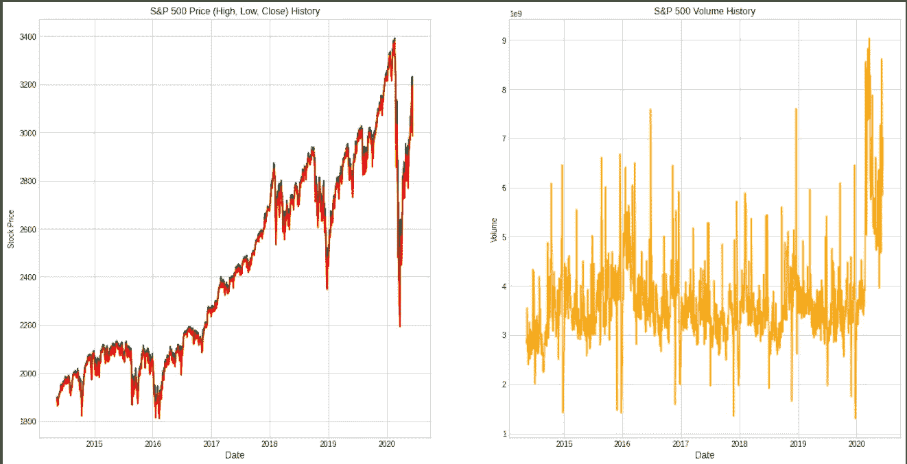

现在，在完成初始设置后，开始和[先知](https://facebook.github.io/prophet/docs/quick_start.html)一起进入这个演示的小树林。

如前所述，Prophet 是由脸书研究小组开发的用于时间序列预测的库。Prophet 可以很好地处理受季节性影响很大的数据集，如在线销售数据、企业销售数据、旅行数据、企业许可证数据等。)Python 开发人员可以很容易地联系到这个库，因为它使用 Scikit-Learn 的 API(类似于 Scikit-Learn)。

在我们将数据提供给预言家进行预测之前，需要什么样的预处理步骤？

1.  确保您将 *y* 的收盘**价格**(我们将对此价格进行预测)和 *ds* 的**日期**替换。
2.  将数据框与 Prophet 进行拟合，以便检测未来模式。
3.  用日线频率预测收盘价的上(高)价和下(低)价。

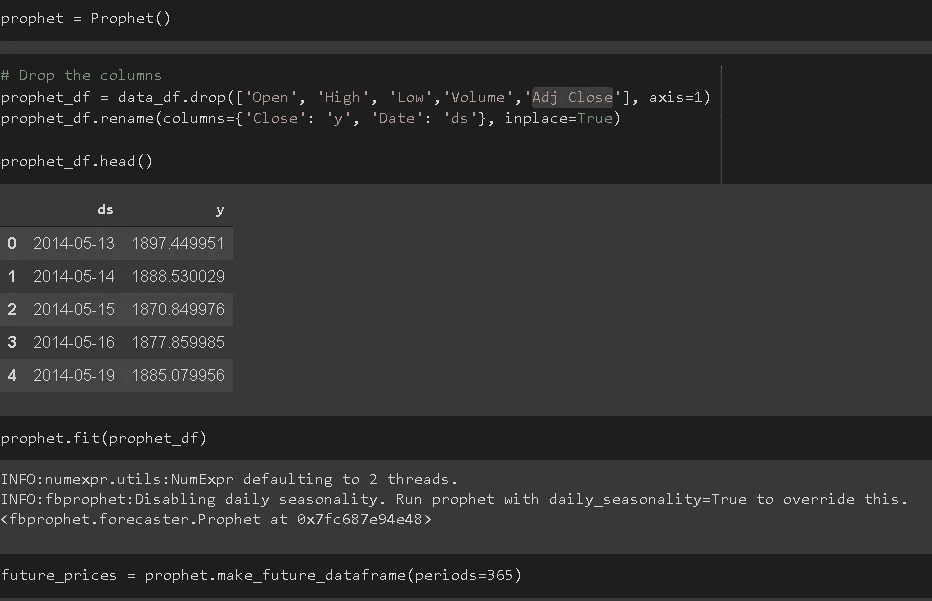

就这样，预测完成，未来 365 天的预测数据准备就绪。

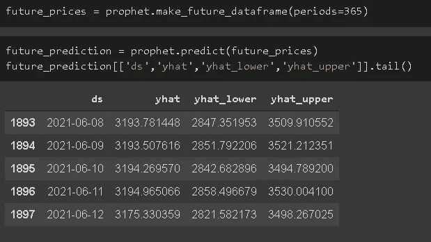

让我们把它画出来，研究数据的季节性，看看我们是否能找到什么。

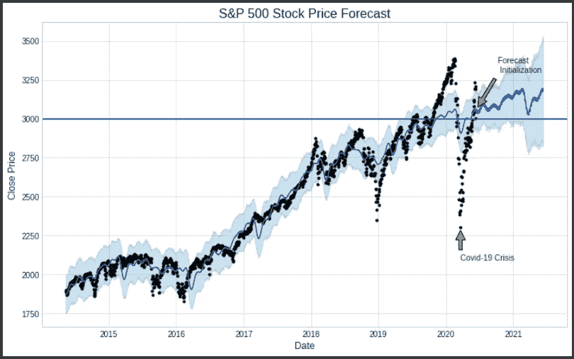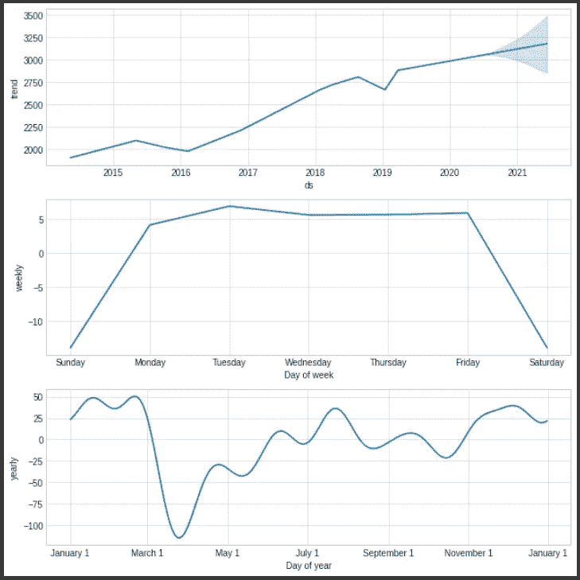

从上面的图表中，我们可以了解以下趋势:

1.  尽管今年早些时候有所下跌，但标准普尔 500 显示出了明年上涨的迹象，最高可达 3500 美元，约有 10%的增长！
2.  标准普尔 500 股票价格没有每周的季节性。
3.  根据年度季节性，它显示在一年的第一季度有所下降，然后在年中恢复。如果你仔细看过去 6 年的股价图表，那么你会注意到在 2016 年、2018 年甚至 2020 年的 3 月至 4 月期间出现了下跌(但 COVID 危机使下跌幅度更大)。

# 金融概念:(高开低走)和移动平均线

## 什么是 OHLC 和烛台？

下面的蜡烛线显示了每个时间段的开盘价、最高价、最低价和收盘价。蜡烛的颜色取决于它是看涨(向上)还是看跌(向下)。

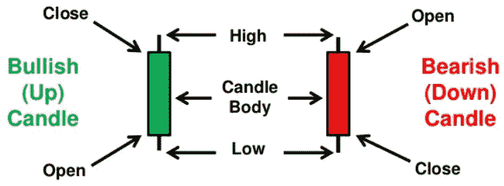

## 什么是移动平均线，它与市场中的买卖有什么关系？

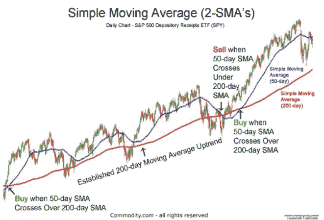

我用[和](https://plotly.com/)的股票价格数据来演示标准普尔 500 指数的移动平均线。这是 Google Collab 上[完整笔记本](https://colab.research.google.com/drive/1KzInwyC7ykvWZkcP6QktPYOEKUPXxQXE?usp=sharing)的链接。此外，这是 [github](https://github.com/meghshah09/SP-500-Stock-Price-Forecasting) 上回购的链接

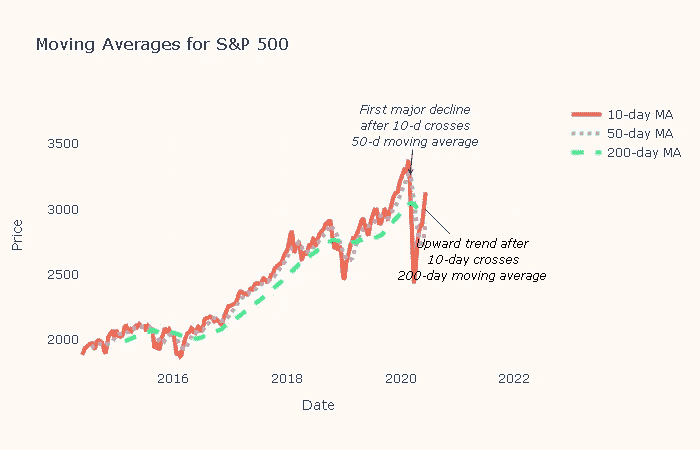

# 结论

本教程的唯一目的是浏览脸书的先知图书馆，这对预测高质量的数据非常有帮助。此外，我还想展示 Plotly 包，以及如何使用它来开发高质量的图表，不仅可以在笔记本上使用，还可以轻松地部署在 Web 应用程序中。

参考资料:

1.  [https://www . ka ggle . com/janiobachmann/s-p-500-time-series-forecast-with-prophet](https://www.kaggle.com/janiobachmann/s-p-500-time-series-forecasting-with-prophet)
2.  [https://facebook.github.io/prophet/docs/quick_start.html](https://facebook.github.io/prophet/docs/quick_start.html)
3.  [https://research.fb.com/prophet-forecasting-at-scale/](https://research.fb.com/prophet-forecasting-at-scale/)
4.  [https://finance.yahoo.com/quote/%5EGSPC/history](https://finance.yahoo.com/quote/%5EGSPC/history)