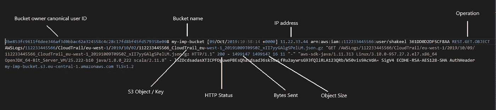
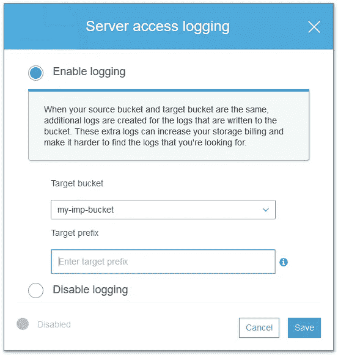
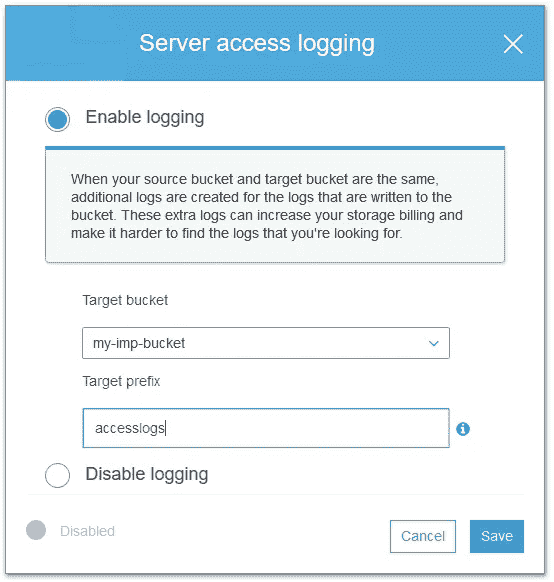
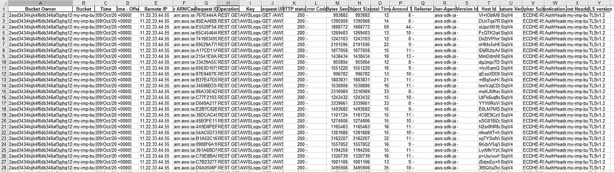
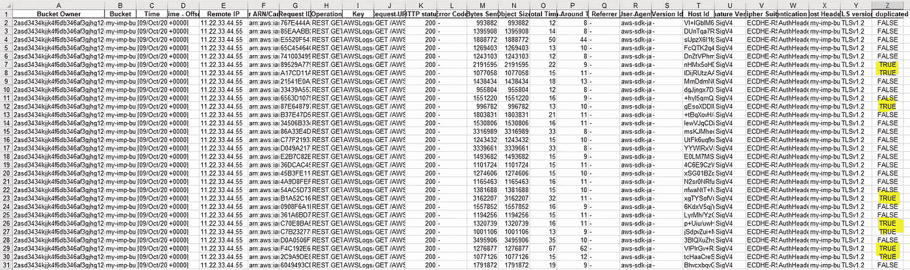
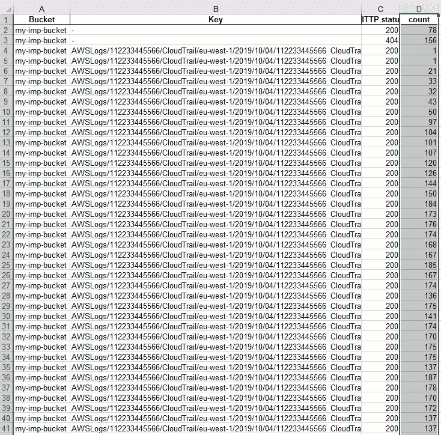
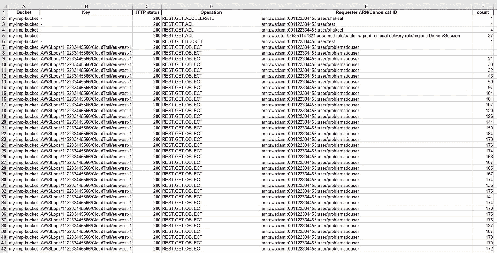

# 使用 pandas 解析 S3 访问日志

> 原文：<https://medium.com/analytics-vidhya/s3-access-logs-parsing-using-pandas-e9626241b656?source=collection_archive---------3----------------------->

您可能遇到过计费问题，有时您的 S3 对象被访问或下载的次数超出了您的预期，因此在这种情况下，对访问日志的简单分析将有助于找出系统中的问题。


[来源](https://images.app.goo.gl/MQPGg527x22YTCNb9)

这就是我们将要讨论的内容

*   什么是 S3 访问日志
*   如何在 AWS 中启用它们
*   使用熊猫解析

# W **什么是 S3 访问日志** —

S3 访问日志类似于普通的 Apache 日志文件。它可以回答你几个问题，比如谁在提出请求？执行什么类型的操作？他成功了吗？

> AWS source:
> 服务器访问日志记录提供了对一个 bucket 的请求的详细记录。服务器访问日志对许多应用程序都很有用。例如，访问日志信息在安全和访问审计中非常有用。它还可以帮助你了解你的客户群，理解你的亚马逊 S3 账单。



原始访问日志

# **如何启用它们？**

默认情况下，日志记录是禁用的，因此应该在需要时启用它。启用日志记录后，日志将保存到与源时段相同的 AWS 区域中的时段。

以下是实现它的快速步骤-

> 注意:-启用 S3 是可充电的**，因此在分析之后，如果不需要，您可以将其关闭。**

## ****启用 S3 存储桶的服务器访问日志****

1.  **登录 AWS 管理控制台，打开位于[https://console.aws.amazon.com/s3/](https://console.aws.amazon.com/s3/)的亚马逊 S3 控制台。**
2.  **在**存储桶名称**列表中，选择要启用服务器访问日志记录的存储桶的名称。**
3.  **选择**属性**。**
4.  **选择**服务器访问日志**。**
5.  **选择**启用记录**。对于**目标**，选择您想要接收日志记录对象的桶的名称。目标时段必须与源时段位于同一区域，并且不能有默认的保留期配置。**

****

**6.(可选)对于**目标前缀**，键入日志对象的关键字名称前缀，这样所有日志对象名称都以相同的字符串开头。**

****

**带前缀**

**7.选择**保存**。**

**[这里的](https://docs.aws.amazon.com/AmazonS3/latest/user-guide/server-access-logging.html)是从控制台启用 S3 日志的详细步骤，[是启用的编程方式](https://docs.aws.amazon.com/AmazonS3/latest/dev/enable-logging-programming.html)。**

# ****使用熊猫解析—****

**在任何活动的 S3 存储桶上启用 S3 访问日志后，您将看到在同一个存储桶中创建了许多日志文件。让我们启用日志几个小时并下载它们。**

**下载 AWS S3 对象**

**现在，所有访问日志都下载到目录“access_logs”中。**

**让我们开始分析**

1.  **我们的第一步是为每个访问日志创建 df。**
2.  **然后根据 [AWS 文档](https://docs.aws.amazon.com/AmazonS3/latest/dev/LogFormat.html)对列进行适当命名。**
3.  **现在把所有的 df_list 连接成一个 df。**

```
df_list = []
logs_dir_name = "access_logs"
for file in os.listdir(logs_dir_name):
    # read them into pandas with proper meaningful header
    df_list.append(pd.read_csv(
        '{0}/{1}'.format(logs_dir_name, file),
        sep=" ",
        names=['Bucket Owner', 'Bucket', 'Time', 'Time - Offset', 'Remote IP', 'Requester ARN/Canonical ID',
               'Request ID',
               'Operation', 'Key', 'Request-URI', 'HTTP status', 'Error Code', 'Bytes Sent', 'Object Size',
               'Total Time',
               'Turn-Around Time', 'Referrer', 'User-Agent', 'Version Id', 'Host Id', 'Signature Version',
               'Cipher Suite',
               'Authentication Type', 'Host Header', 'TLS version'],
        usecols=[0, 1, 2, 3, 4, 5, 6, 7, 8, 9, 10, 11, 12, 13, 14, 15, 16, 17, 18, 19, 20, 21, 22, 23, 24],
        engine='python'))

# concatenate all DFs
df = pd.concat(df_list)
df.to_excel('accesslogs_xls/s3-accesslog-complete.xls', index=False)
print(df)
```

**此时，您已经将整个访问日志放入一个 xls 中，即 accesslogs_xls 目录下的“s3-accesslog-complete.xls”**

****

**所有访问日志都记录在一个 xls 中**

**并且低于 df 的输出**

```
Bucket Owner     ...     TLS version
0   qwe334dfs2s61f6db346af3d0bbfgfd5652a543958c6728c17f...     ...         TLSv1.2
0   qwe334dfs2s61f6db346af3d0bbfgfd5652a543958c6728c17f...     ...         TLSv1.2
1   qwe334dfs2s61f6db346af3d0bbfgfd5652a543958c6728c17f...     ...         TLSv1.2
2   qwe334dfs2s61f6db346af3d0bbfgfd5652a543958c6728c17f...     ...         TLSv1.2
3   qwe334dfs2s61f6db346af3d0bbfgfd5652a543958c6728c17f...     ...         TLSv1.2
4   qwe334dfs2s61f6db346af3d0bbfgfd5652a543958c6728c17f...     ...         TLSv1.2
5   qwe334dfs2s61f6db346af3d0bbfgfd5652a543958c6728c17f...     ...         TLSv1.2
6   qwe334dfs2s61f6db346af3d0bbfgfd5652a543958c6728c17f...     ...         TLSv1.2
7   qwe334dfs2s61f6db346af3d0bbfgfd5652a543958c6728c17f...     ...         TLSv1.2
8   qwe334dfs2s61f6db346af3d0bbfgfd5652a543958c6728c17f...     ...         TLSv1.2
9   qwe334dfs2s61f6db346af3d0bbfgfd5652a543958c6728c17f...     ...         TLSv1.2
10  qwe334dfs2s61f6db346af3d0bbfgfd5652a543958c6728c17f...     ...         TLSv1.2
11  qwe334dfs2s61f6db346af3d0bbfgfd5652a543958c6728c17f...     ...         TLSv1.2
12  qwe334dfs2s61f6db346af3d0bbfgfd5652a543958c6728c17f...     ...         TLSv1.2
..
[64032 rows x **25 columns**]
```

**我们希望检查哪个 S3 对象被成功访问，并对其进行计数。**

1.  **让我们添加新列*“is _ duplicated”*来检查重复项。**
2.  **然后将其写入新文件。**

```
df_list = []
logs_dir_name = "access_logs"
for file in os.listdir(logs_dir_name):
    # read them into pandas with proper meaningful header
    df_list.append(pd.read_csv(
        '{0}/{1}'.format(logs_dir_name, file),
        sep=" ",
        names=['Bucket Owner', 'Bucket', 'Time', 'Time - Offset', 'Remote IP', 'Requester ARN/Canonical ID',
               'Request ID',
               'Operation', 'Key', 'Request-URI', 'HTTP status', 'Error Code', 'Bytes Sent', 'Object Size',
               'Total Time',
               'Turn-Around Time', 'Referrer', 'User-Agent', 'Version Id', 'Host Id', 'Signature Version',
               'Cipher Suite',
               'Authentication Type', 'Host Header', 'TLS version'],
        usecols=[0, 1, 2, 3, 4, 5, 6, 7, 8, 9, 10, 11, 12, 13, 14, 15, 16, 17, 18, 19, 20, 21, 22, 23, 24],
        engine='python'))

df = pd.concat(df_list)  # concatenate all df
**df['is_duplicated'] = df.duplicated(['Key'])**  #add is_duplicated col
df.to_excel('accesslogs_xls/s3-accesslog-complete.xls', index=False)
```

**现在，如果您注意到 is_duplicated 列中有许多“真”值，这意味着同一个对象被多次访问。**

****

**高亮显示 is_duplicated 列的相同 xls 文件**

**既然我们知道有些对象被多次访问，我们就会对这些对象被访问的次数感兴趣。**

1.  **为此，我们将使用熊猫的分组方法。让我们按照 bucket 名称、对象和 HTTP 状态进行分组。**
2.  **然后我们将写入一个新的 xls 文件。**

```
df_list = []
logs_dir_name = "access_logs"
for file in os.listdir(logs_dir_name):
    # read them into pandas with proper meaningful header
    df_list.append(pd.read_csv(
        '{0}/{1}'.format(logs_dir_name, file),
        sep=" ",
        names=['Bucket Owner', 'Bucket', 'Time', 'Time - Offset', 'Remote IP', 'Requester ARN/Canonical ID',
               'Request ID',
               'Operation', 'Key', 'Request-URI', 'HTTP status', 'Error Code', 'Bytes Sent', 'Object Size',
               'Total Time',
               'Turn-Around Time', 'Referrer', 'User-Agent', 'Version Id', 'Host Id', 'Signature Version',
               'Cipher Suite',
               'Authentication Type', 'Host Header', 'TLS version'],
        usecols=[0, 1, 2, 3, 4, 5, 6, 7, 8, 9, 10, 11, 12, 13, 14, 15, 16, 17, 18, 19, 20, 21, 22, 23, 24],
        engine='python'))

df = pd.concat(df_list)  # concatenate all df
df = df.groupby(['Bucket', 'Key', 'HTTP status']).size().reset_index(name='count')
df.to_excel('accesslogs_xls/s3-accesslog-groupby-s3key.xls', index=False)
```

**下面是上面代码的输出，count 列给出了同一个 S3 对象被下载的次数。**

****

**通过这种方式，我们可以看到请求者成功访问每个 S3 对象的计数，但是我们不知道进行了什么操作以及谁是请求者，所以让我们看看同一个用户是否多次尝试访问同一个对象，这可能有点不常见，也是我们练习的目标。**

```
df = pd.concat(df_list)  # concatenate all df
# df['is_duplicated'] = df.duplicated(['Key'])  # add duplicate boolean column
df = df.groupby(['Bucket', 'Key', 'HTTP status', **'Operation', 'Requester ARN/Canonical ID'**]).size().reset_index(name='count')
df.to_excel('accesslogs_xls/s3-accesslog-groupby-s3key1.xls', index=False)
```

****

**包含申请人详细信息的分组依据**

**从最后 3 列我们知道请求者和他试图访问 S3 对象的次数。现在我们可以回去修复系统中的这个问题。这是完整的代码要点。**

**使用 pandas 的 AWS 访问日志解析器**

# **进一步行动/带走-**

*   **分析“问题用户”在哪里被使用。**
*   **检查配置了“problematicuser”的系统中的异常情况。**
*   **如果不需要，则从该用户的 IAM 权限中删除 *s3:PutBucketAcl，s3:PutBucketPolicy，s3:PutObjectAcl 权限。***
*   **使用资源策略和其他可能的方法保护桶免受任何泄漏。**