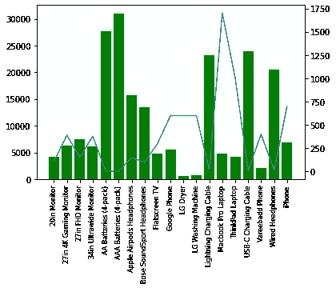

# 在线产品销售分析

> 原文：<https://medium.com/analytics-vidhya/sales-analysis-of-online-products-5d379717ff82?source=collection_archive---------23----------------------->

我们将分析经常一起购买的商品、公司的月销售额、最大订单和工时分析，同时还将分析大多数售出的产品。

# 销售分析的优势

*   确定你最有利可图的产品(并让它们大放异彩)
*   找到你的滞销产品(并更有效地集中你的资源)
*   准确定位你最赚钱的客户(并让他们再次光顾)
*   识别**销售**机会(和潜在问题)

## 1.准备用于分析的数据

由于我们拥有的数据集是按月的，并且在一个单独的文件中，所以首先我们需要将所有的数据合并到一个文件中，这可以通过导入**操作系统**包并循环通过数据，然后合并数据集来实现。我们的数据集中有 1，86，850 行和 6 个要素。

尺寸为 186850 x 6 的数据

第二步是通过使用 **dropna()** 函数从数据中删除“ **na** 值。删除空值后，我们现在有 1，86，305 行。

## 2.最佳销售月份

为了找到最好的销售月份，我们需要从给定的格式中提取月份。使用 **split()** 函数我们可以提取我们需要的值。在创建了一个为所有 1，86，305 行提取月份的函数后，我们将向数据集添加一个名为 month 的新列。

正如我们所看到的，特性的数据类型都是对象。我们需要改变一些功能的数据类型，比如将“订购数量”转换为整数，“价格”转换为浮点数，“月份”转换为整数。

通过使用 **matplotlib.pyplot** 包，我们绘制了图表，我们发现**十二月**的销售额最高。

## 3.区域销售

对于这一步，我们需要提取城市名称和交付到该地区的产品数量。

这可以通过 **groupby()** 和 **count()** 函数完成，稍后使用条形图绘制。

从这个柱状图我们可以得出结论，旧金山的销售额最高。

## **4。最佳销售时间**

对于这个过程，我们需要创建两个单独的数组作为 key 和 sales count。绘制两者之间的图表将会给我们提供销售额最高的时间。

这条线图表明，在**下午 12 点至 7 点**之间，产品销售额最高。

## 5.哪种产品卖得最多，为什么？

绘制产品和订购数量之间的图表。

**“AAA 电池 4 包”**是所有产品中销量最大的产品。

根据这个数字，我们可以得出结论，产品越便宜，销售额越高。

## 6.经常一起出售的产品

将相同的产品 id 分组将有助于我们分析销售最频繁的产品。此外，在对产品进行分组时，我们需要删除重复的值。我们还需要将相同的订单 ID 组合在一起。

该饼状图描述了 **iPhone、lightning 充电线**是最常一起购买的物品，其次是谷歌手机、USB-C 充电线。

# 结论

从上面执行的分析中，我们可以得出结论，12 月份的销售额最高，如果按地区计算，旧金山的销售额最高，中午 12 点到晚上 7 点是销售的黄金时间。我们还计算出“AAA 电池 4 件装”是销量最大的产品，通过分析销售趋势，我们可以说越便宜的产品销量越大。

*与我联系:*

 [## 艾米特·库马尔 Sahu - Track Lead -开源社区:VIT-美联社| LinkedIn

### 查看艾米特·库马尔·萨胡在全球最大的职业社区 LinkedIn 上的个人资料。阿米特有 4 个工作列在他们的…

www.linkedin.com](https://www.linkedin.com/in/amit-kumar-sahu-7aab19169)  [## ammy20019 -概述

### 在 GitHub 上注册你自己的个人资料，这是托管代码、管理项目和构建软件的最佳地方…

github.com](https://github.com/ammy20019)