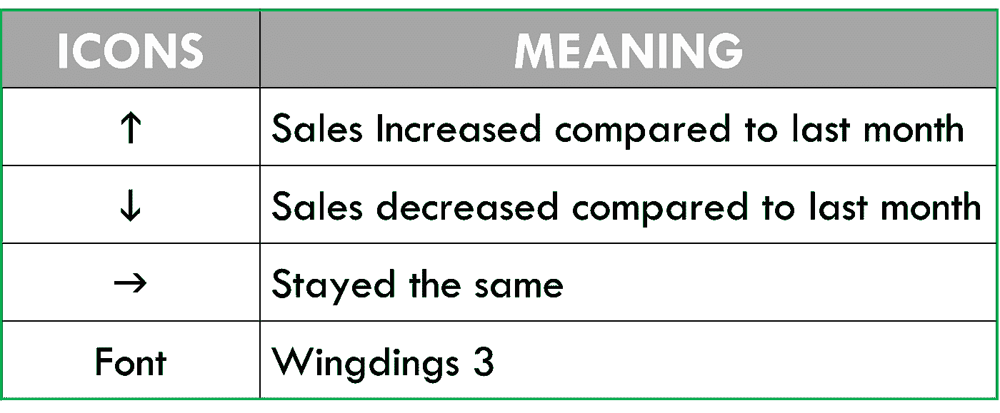
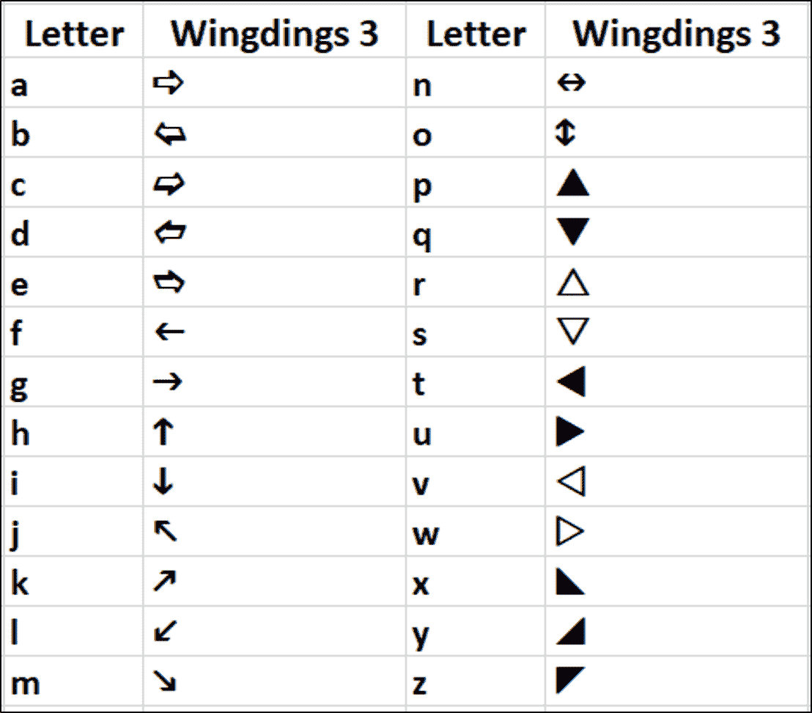
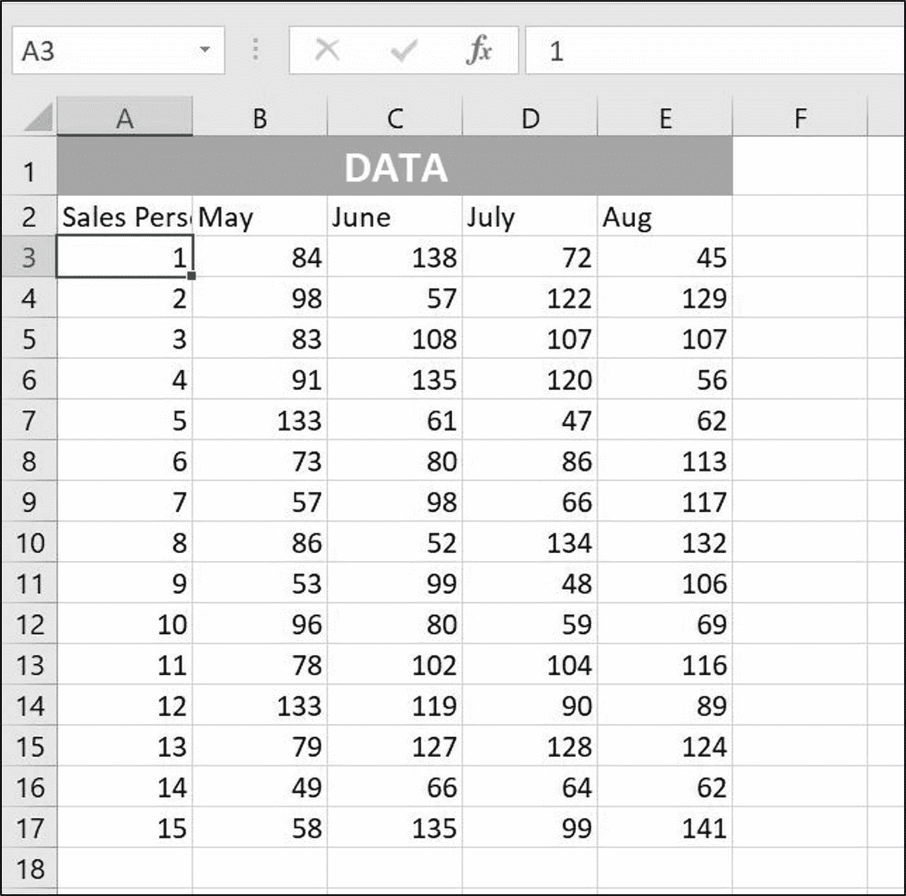
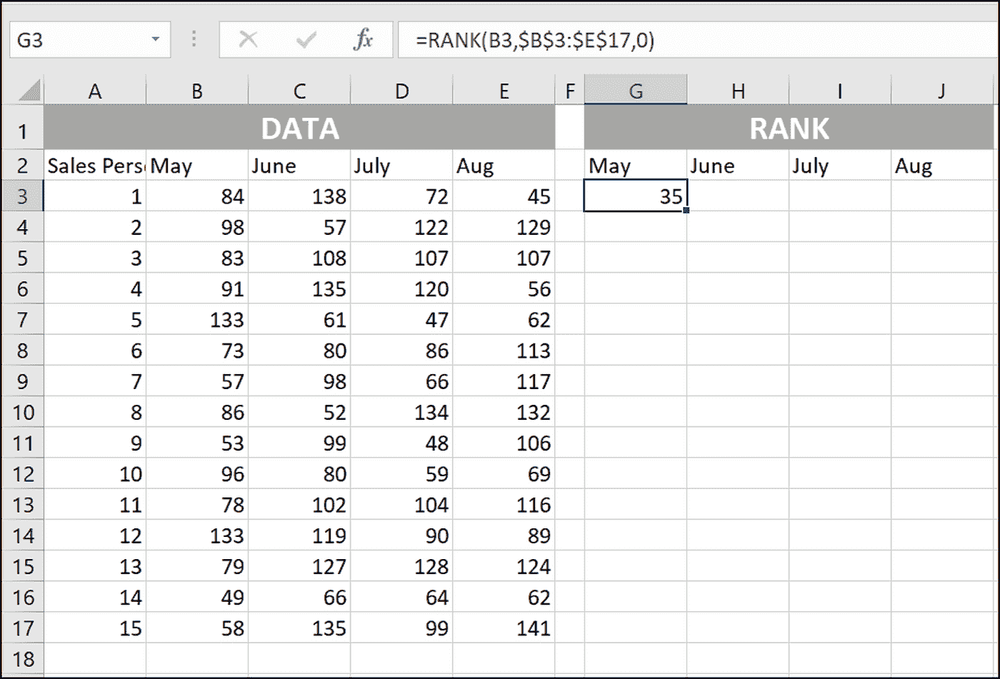
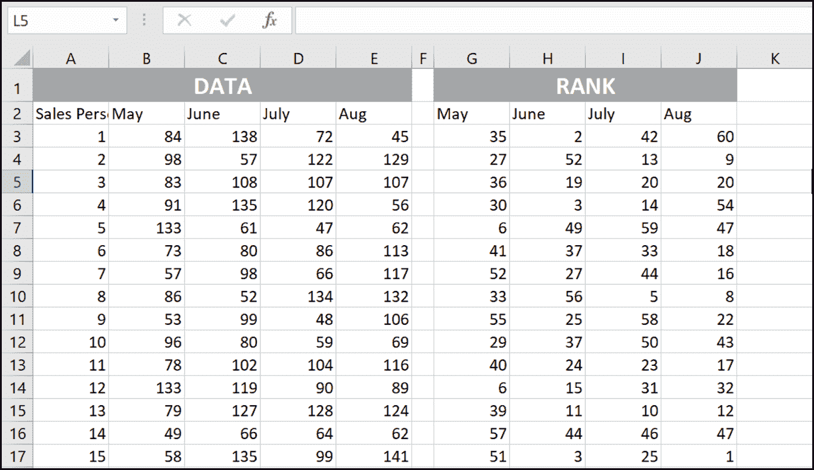
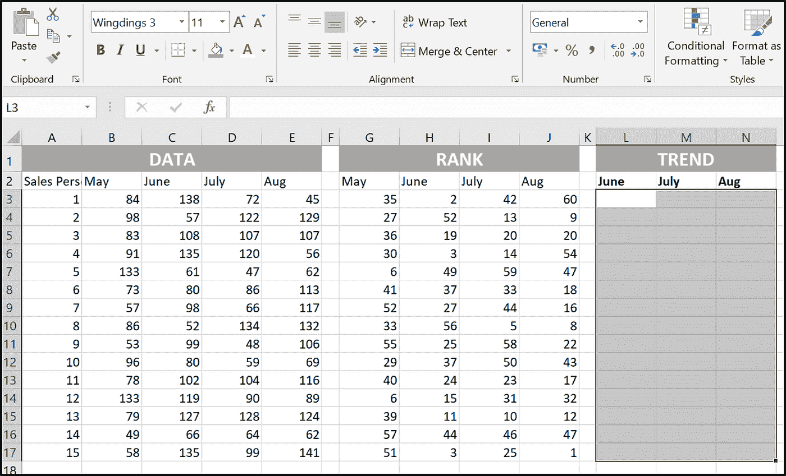
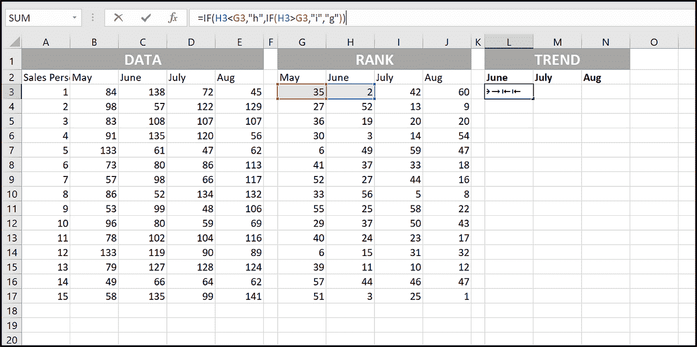
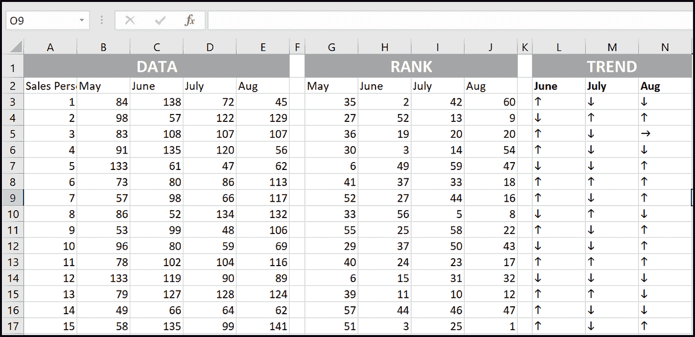

# 使用 Excel 进行销售数据分析

> 原文：<https://medium.com/analytics-vidhya/sales-data-analysis-using-excel-3e02bb21d171?source=collection_archive---------9----------------------->

对每家公司来说，销售是收入的来源，负责所有的成本和费用。如果你正在管理一个销售团队，你必须确定一个特定销售人员的业绩是增加、减少还是保持不变。

在本文中，我们将看到使用以下图标分析销售团队绩效的简单方法。

图标——含义

wingdings 3-字体

数据集:它包含 15 名雇员的销售数据。

要遵循的步骤:

1.  Ranking: Formula- RANK(B3，B$3:E$17，0)，然后将同样的公式复制到如图所示的其他单元格中。

函数参数:

**数字:**要计算其排名的数字。在这种情况下，84(B3)

**参考:**参考表即 B$3:E$17。

**顺序:**如果是 0(零)，最高的数字得到秩-1，如果是 1(一)，最低的数字得到秩-1。

**输出**:

2.选择 L3 到 N17，并将字体改为“Wingding 3”，然后使用以下公式。

公式:IF(H3 <g3>G3)，“I”，“j”))</g3>

**最终输出:**

*****

我希望这篇文章对你有所帮助。如果我错过了什么，请在评论区告诉我。

你觉得这个博客怎么样？评论！！！

不确定接下来要读什么？我又给你挑了一篇文章！！！

[群组分析](https://www.linkedin.com/pulse/cohort-analysis-python-shaik-subhani/) | [情绪分析](/swlh/sentiment-analysis-with-bag-of-words-4b9786e967ca?source=friends_link&sk=78bf4171137a0d1b9f83263708e4b08d)

关注我@[Medium](/@subhani1)|[LinkedIn](https://www.linkedin.com/in/shaik-subhani/)

*感谢阅读！*

*最初发表于*[https://www.linkedin.com/in/shaik-subhani/](https://www.linkedin.com/in/shaik-subhani/)