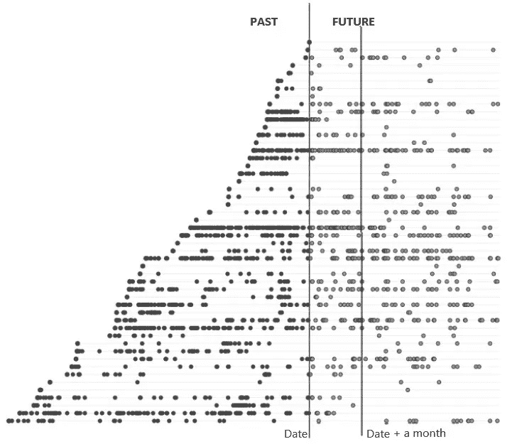
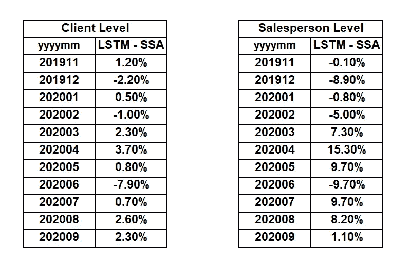

# 销售预测 LSTM 用例

> 原文：<https://medium.com/analytics-vidhya/sales-forecasting-an-lstm-use-case-2028c81d90eb?source=collection_archive---------13----------------------->

> 许多公司的典型流程包括预测下个月的销售额。可口可乐恩博诺也不例外。我们试图实现的是在客户层面预测这个数量，这意味着对于每个客户，我们将试图预测他们在未来一个月将购买多少。由于业务条件的原因，在给定佣金模型的情况下，需要对两类饮料进行预测。

在本帖中，我们将解释实现这种预测的过程，包括:

*   *数据探索性分析，*
*   *数据的清理和验证，*
*   *造型，*
*   *初步结果。*

# 数据探索性分析

首先，我们需要分析销售数据库中的可用数据，从中选择与客户行为相关的变量，例如购买不同类别的非酒精饮料、每个客户固有的地理和社会经济变量、客户资历、销售日期(这是关键特征之一)以及其他与业务相关的变量。

这些信息在 AWS Athena 的不同表中可用，因此，为了构建数据集，我们首先通过 AWS Glue library 从 Athena 读取这些表(使用 Python ),然后返回一个 PySpark 数据框，然后我们过滤并连接这些表，将所有可用信息放在一个数据框中。

# 清洁和验证

我们对每个变量进行了分布分析，特别是查看十分位数，我们发现资历存在极端值——有些客户超过一个世纪——这显然是错误的数据，所以我们需要过滤掉这些值。还发现非酒精饮料的数量(在特定的测量单位中)有一些异常值，因此这些值也被过滤掉了。在这个清理过程之后，只有 1.3%的数据被擦除。

# 数据集构建过程

深度学习框架被用来建模这个问题，因此我们需要的是样本。很多很多！

构建相应数据集的关键部分是在每个月底对数据进行采样。从概念上来说，在每个月底，我们希望有一个下个月的预测，因此我们所做的是:

*   创建一系列时间步骤(月末、每月)，
*   对于每个时间步，我们研究每个客户的过去行为(及其各自的特征)，
*   我们也调查了未来的目标。

每条水平线代表一位顾客的购买历史，因此，如果我们以“日期”为起点，那么一些顾客在过去比其他顾客有更多的事件。

现在的问题是我们想看多远的过去和多远的未来。后者是最容易回答的，因为我们想预测下个月会发生什么，所以我们只提前一个月预测。当然，如果我们想进一步预测时间，我们必须相应地创建目标变量，例如下一次购买、下一周、N 个月等等。

另一方面，我们对过去看得多远将会显著地增加/减少数据集的大小。因此，我们的第一个尝试是考虑从十多年前开始到 2019 年 10 月的时间步长，并查看过去 N 个月的消费者行为。这个参数(N)给出了相应的数据集(训练、开发和测试)的总大小为 95Gb，其中训练数据集具有大约 350 万个样本(每个样本是 M×L 的矩阵，其中 L 是固定的)。**使用这种数量的数据进行训练将花费大约至少 15.000 美元**，计算 10 次尝试一个将花费 100 小时进行训练的模型，每个历元花费大约一个小时，训练有 100 个历元(尽管我们确实使用了提前停止回调)，使用 ml . p 3.8 x 大型加速计算实例；因此，我们当然认为这样更好，并意识到考虑我们的客户在十多年前的行为是没有帮助的，而且，可能没有人记得他们在 N 个月前花了多少钱。

因此，我们只考虑了从 2015 年 1 月到 2019 年 10 月(稍后将详细介绍)以及 N/2 个月(在本文的剩余部分，我们将此称为 N)的消费者行为数据。当然，这一较短的时间大大减少了数据帧的大小，现在我们得到了:

*   130 万个样本来训练，
*   要开发的 15 万个样本，
*   要测试的 34K 样本。

在我们深入研究我们用来训练的深度学习网络的架构之前，请注意，构建数据集(特别是过去的*)的想法并不像它看起来那么微不足道，我们想就如何构建数据集进行更多的解释。*

*请记住，当我们向神经网络提供数据时，我们希望数据的格式为 **input|target** ，我们需要做的是建立一个数据集，这样输入将被格式化为一行(在 csv 文件中)，然后我们连接其相应的目标。所以我们所做的是:*

*   *对于每个时间步，查看每个客户端在过去 N 个月中的行为，进行一些转换，将其格式化为一行，*
*   *查看下个月并汇总(所有客户购买的总和)，将该目标与过去的行为联系起来*
*   *瞧啊！我们有我们需要的数据格式。*

*一旦我们的 PySpark 数据框架干净整洁，首先我们创建单独的客户列表来定义我们的培训、开发和测试数据集。然后我们逐月对每个数据帧进行采样。因此，对于每个时间步，我们将检查每个客户端(属于相应的组)的数据集在该特定日期是否有效，这意味着我们将只使用那些既有该特定时间步过去的数据又有该特定时间步未来的数据的客户端。然后我们在相应的数据集中选择了*个有效的客户端*，然后将其拆分为过去和未来的数据集。*

*未来的数据集很容易建立，因为我们只需要为每个客户的每一类非酒精饮料设定一个目标变量。这很容易用嵌套有**集合** **函数**的 **groupby** 来完成。*

*现在，对于过去的数据集，我们有每个客户过去 N 个月的所有数据，将这些数据保持在每日水平是至关重要的，因为我们希望利用我们将用于训练的递归神经网络；可以这样想:“如果你在一个月的第一天购买 10.000 单位的可口可乐，与最后一天相比，情况就大不一样了”。因此，这里的**关键变量是客户购买**的时间，为了让网络知道这个变量，所做的是计算多少天前(从我们‘查看’的时间步长开始)是具体的购买事件。请记住，对于每个客户，我们最终会得到一个 M x L 的数组，其中只有 L 是固定的(与每次购买相关的功能数量), M 表示客户在过去 N 个月中购买了多少次。*

*在我们有了该时间步骤中所有客户端的数据集之后，我们需要将值转换为区间[0，1](记住，NNs 是挑剔的，如果您不在区间[0，1]中向它们提供数据，它们的表现不会很好)。
之后，为每个客户端将所有这些*事件*分组，即一个接一个地连接起来(记住我们需要提供给 NN“input | target”的结构)。*

*为此，我们使用了以下函数:*

*   *pyspark.ml.feature
    →矢量汇编器
    →最小最大缩放器*
*   *py spark . ml . Lina LG
    →dense vector*
*   *SQL . functions
    →collect _ list
    →concat _ ws*
*   *功能工具
    →减少*

*现在我们已经有了每个客户端的输入和目标，我们将过去和未来的数据集连接起来，得到一个具有以下结构的数据帧‘input | target’。因为我们的目标是将这些数据保存为 csv 格式，所以我们所做的是:*

*   *以拼花格式写入这些数据框*
*   *将此拼花文件转换为 csv 文件。*

*因为我们想从 csv 文件中输入 NN，我们需要记住分隔符'，'，使用函数 *collect_list* 返回一个列表(用'，')为了避免任何不便，只需借助 concat_ws 函数用' | '替换'，'(仅在输入向量中)。*

*现在我们已经准备好编写这些拼花文件了。因为我们在许多时间步骤上迭代，而不是收集一个巨大的数据框，所以它建议将每个数据集追加到上一步中编写的 parquet 文件中。因此，在每个时间步(for 循环中的步骤)的末尾，我们以拼花格式编写了我们的 PySpark 数据帧，但是将它们附加到前一个*中。*
第一步，我们写了一个空数据框，其模式与时间步骤中创建的数据框相同。*

*好了，我们终于写好了拼花文件，现在用一个简单的命令行，我们把它们写成了 csv 格式。*

# *系统模型化*

*现在到了有趣的部分！让我们训练一个深度学习网络。*

*鉴于我们正在研究消费者行为，LSTM 网络就派上了用场，因为我们特别想利用时间购买行为来预测未来的购买。*

*手头的数据量无法放入内存，因此我们需要通过一个生成器函数来提供数据。对于那些不熟悉生成器函数的人来说，可以把它们想象成:“以自定义的批量生成我们的一部分数据”。因此，我们不是将所有数据加载到单个数据帧中，而是逐行读取每个 csv 文件，直到我们达到预定义的(这是一个可以设置为生成器的参数)批量大小，然后将它馈送到我们的神经网络，就这么简单。*

*用于最终模型的架构不能按照合规政策共享(我想保住我的工作，这比什么都重要！)*

*就我们可以分享的而言，我们使用了:*

*   *核正则化，*
*   *堆叠的 LSTM 层，*
*   *辍学，*
*   *提前停止回调。*

*还要注意，我们使用具有多个 GPU 的实例来训练模型，为此 Tensorflow 提供了一个“分布式策略”框架，该框架基本上通知每个可用的 GPU 关于我们的模型架构，并相应地将我们的批处理分发到每个 GPU(好家伙 Tensorflow！)*

*撇开架构不谈，最初的训练尝试让我们很头疼！让我们告诉你为什么:当使用 boto3 库从 S3 桶中读取数据时有一个时间限制，所以在我们用头撞墙了很长时间之后，一个团队成员建议将桶的副本复制到用于训练的机器中，所以在 s3fs 库的帮助下，我们完成了它，并且训练实际上超过了第一个纪元(yaaaaaay！).*

*但是(为什么总要有但是？)这些数据足以让模型训练几个小时(一次训练大约需要 14 个小时)，所以很明显，我们不能让多个 GPU 无限期地打开，因为我们会烧很多很多钱(记住，我的目标之一是保住我的工作！)，所以手头的解决方案就是用 dockers。*

*幸运的是，AWS SageMaker 有自己的库，可以使用 docker 文件。这使我们能够:*

1.  *需要满足我们特定需求(硬件)的实例，*
2.  *对我们使用这台机器的确切时间计费，*
3.  *记录下我们的剧本，*
4.  *将我们的输出保存到 S3 桶中。*

*经过一些尝试，我们最终得到了一个在绝对百分比误差预测的中位数方面满足业务需求的模型。*

# *初步结果*

*手头的问题是预测客户在接下来的一个月里将购买的两类盒子的数量，目标是预测销售人员在接下来的一个月里应该向他或她的客户销售多少盒子。*

*我们的第一次尝试是用截至 2019 年 10 月的数据进行训练，因为:*

*   *2019 年 10 月，智利爆发了一场社会罢工，并持续到 2020 年 3 月；所以销售受到了影响，*
*   *你听说过一个叫新型冠状病毒的小家伙吗？*

*使用截至 2019 年 10 月的数据进行训练的最佳结果，请记住，这一指标-中值绝对百分比误差-是通过评估 2019 年 11 月至 2020 年 9 月期间的所有测试样本获得的:*

> *中位数绝对百分比误差:26.7%*

*然后，如果我们按销售人员分组*

> ***绝对百分比误差中值为 11.2%***

*这并不坏，但仍有很大的改进空间。*

*显然，下一步是用 2020 年 9 月之前的数据进行训练，结果确实有所改善！*

*从客户的角度来看，我们的最好成绩是 23.7%。而按销售人员分组*

> ***绝对百分比误差的中位数**下降到 **4.33%** 。*

*需要强调的是，这些结果是针对少数客户得出的，我们要强调的是，在对所有客户进行预测时，情况可能并非如此。*

# *笔记*

*可口可乐 Embonor(出于不同的目的)实施了一个模型，预测客户在未来一个月将购买的盒子总数，还记得我们的深度学习模型预测了两个类别，当添加时可以与另一个模型进行比较。采用了一种非参数谱估计方法，即奇异谱分析(SSA)。这种方法从 6N 个月(其中 N 是我们的深度学习模型的月数)的消费者行为中获取信息，并为每个客户建立模型。
将结果与我们的深度学习模型(使用截至 2019 年 10 月的数据进行训练)进行比较，我们得到:*

**

*比较 LSTM 和 SSA 预测的绝对百分比误差中值之间的百分比差异。因此，如果 2019 年 11 月 LSTM 的误差为 X%，则 SSA 的误差为 X%-1.2%(在客户层面)。*

*现在，SSA 模型需要每个月计算一次，大约需要一个小时来运行，而我们只训练一次深度学习模型，然后预测大约需要 6 分钟，这意味着值得考虑实施的货币成本。*

# *后续步骤*

1.  *对超参数调整进行贝叶斯优化。*
2.  *使用失业和天气功能。*