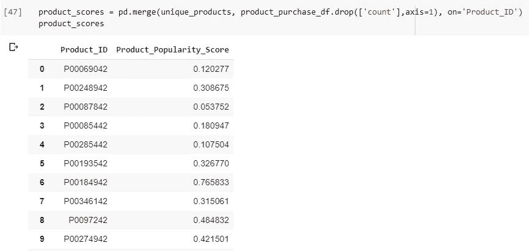
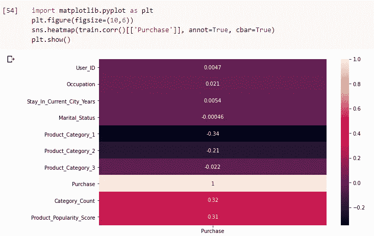
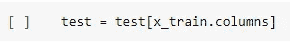

# 基于 ML 回归技术的黑色星期五销售预测

> 原文：<https://medium.com/analytics-vidhya/sales-prediction-on-black-friday-using-ml-regression-technique-380af62c181e?source=collection_archive---------9----------------------->

这篇文章解释了我使用机器学习算法解决黑色星期五销售预测数据集的方法。数据集已从 **AnalyticsVidhya** 平台(https://data hack . AnalyticsVidhya . com/)使用。

# 问题陈述

一家零售公司“ABC Private Limited”希望了解客户对不同类别的各种产品的购买行为(具体来说，购买金额)。他们分享了上个月不同客户对选定的大量产品的购买摘要。
该数据集还包含客户人口统计数据(年龄、性别、婚姻状况、城市类型、停留在当前城市)、产品详细信息(产品标识和产品类别)以及上个月的总购买量。

# 数据

数据集由训练数据集和测试数据集组成。

数据集特征描述

让我们从查看训练和测试数据集开始。

数据集详细信息

从上面我们可以观察到，在训练和测试数据集的列 **'Product_Category_2'** 和 **'Product_Category_3'** 中都有 ***缺失值*** 。这两个特性是产品的附加特性，不需要处理或填充这些值。

# 特征工程

特征工程的主要目的是尽可能多地分析数据，这可能涉及从与目标变量有更好相关性的现有特征中创建附加特征。因此，它有助于模型更好地执行。

让我们从目标变量开始。**目标变量(购买)**的 **distplot** 让我们了解到该分布类似于**高斯分布。**

距离图

为了研究**产品标识**和**采购**之间的**关系**，计算了产品标识的**平均采购**。按照购买价值的降序对这些价值进行排序后，从数据中随机抽取一些样本来获取更多信息。随机抽样表明，大多数**产品标识都有多个相关的产品类别**。

产品标识和平均购买价值之间的关系

创建了一个名为**“Category _ Count”**的独立特性，用于存储与 Product_ID 相关联的类别的数量。

特征:类别计数

除此之外，还观察到**某些产品比其他产品**卖得更多，这可能是该产品比其他产品更受欢迎的结果，并且可以假定与其他产品相比**有很大的偏差**。

产品标识和产品数量之间的关系

因此，另一个名为**“Product _ Popularity _ Score”**的功能被创建。为此，首先创建一个数据帧来存储所有唯一的 Product _ IDs

唯一的产品标识

在数据帧“产品 _ 购买 _df”中，通过使用 sklearn 的最小最大缩放器(*)进行缩放，在 0 和 1 之间的特征**“产品计数”**中，计数最高的产品将获得最高的受欢迎度分数。*

使用 MinMaxScaler 缩放产品计数以获得产品流行度分数

两个数据帧，即**“产品 _ 购买 _ df”**和**“独特 _ 产品”**被**合并**以创建具有产品 _ID 和产品 _ 流行度 _ 分数的单个数据帧“产品 _ 分数”。这又被压缩到一个字典中，该字典以“Product_ID”为关键字，以“Product_Popularity_Score”为值。

合并两个数据框架— unique_products 和 product_purchase_df

创建字典并将其映射到原始训练和测试数据集

功能:产品 _ 人气 _ 评分

让我们使用 **Seaborn 的热图**来绘制**相关性**，以可视化特征与**目标变量**的相关性，即**“购买”**。

正如我们可以观察到的，我们创建的特征，即**“类别 _ 计数”**和**“产品 _ 流行度 _ 得分”**分别具有**相关性**为 **0.32** 和 **0.31** ，与其他一些特征相比，这是相当可观的。

在进入下一步之前，如果我们看一下新构建的训练和测试数据，我们会发现在测试数据集中的“Product_Popularity_Score”列中有一些缺失值。

检查训练和测试中的缺失值

等等，这是怎么回事？？

让我们检查测试数据中存在的 Product _ id，以及是否有任何陌生的 Product _ id 只存在于测试数据集中。

在测试数据中寻找陌生的产品标识

训练数据集中总共缺少 46 个 Product _ IDs，这构成了测试数据集中的 61 行。

带有陌生产品标识的记录

在我们继续下一步之前，我们应该将 Product_Category 特性的数据类型更改为 string，因为这对下一步很有用。

将 Product_Category 功能的数据类型更改为字符串

为了填充这些空值，我们可以根据这些产品所属的类别，使用 **Product_Popularity_Score** 的**均值**。假设“Product _ ID”= p 00168242 有“Product _ Category _ 1”= 5 和“Product _ Category _ 2”= 16，现在我们收集训练数据中具有相同 Product_Categories 的所有记录，并获得“Product_Popularity_Score”的平均值以填充相应的缺失值。

处理 Product_Popularity_Score 中的空值

最后，如果我们看看特征**【停留 _ 当前 _ 城市 _ 年】**，它有 4 个类别。让我们在训练和测试数据集中，将类别 4+的名称更改为 4。

要素名称的映射类别值-停留当前城市年数

# 特征选择

现在我们已经完成了对特征的分析，让我们继续进行特征选择。这是目前训练和测试数据的样子:

train.head()和 test.head()

在查看数据时，我们看到诸如**性别、年龄、职业、城市类别、停留时间、婚姻状况和其他产品类别**等特征是分类特征，应该进行一次性编码以进一步处理。

使用 pandas.get_dummies 对分类特征进行一对一编码

在检查 Product_Category_1 中训练和测试数据的类别值时，我们发现测试数据中缺少值 19 和 20。因此，我们在应用 OneHotEncoding(如上所述)之后，向测试数据添加额外的列。

在测试数据中添加缺失字段

现在，我们删除 ID 值，因为这些值对于每个记录都是唯一的，因此与预测无关。

删除两个数据集中的 ID 列

现在，让我们从训练数据集中分离出数据和标签。

为训练数据集分离数据和标签

现在，我们确保测试和 x_train 数据具有相同的列名顺序。

确保 x_train 和 test 具有相同的列顺序

# 离群点检测

让我们做一个目标变量的**箱线图**，即**购买**

训练数据集中购买特征的箱线图

在箱线图中，我们可以看到有几个值位于外部。但是，如果我们看一下 z 分数，并检查它们是否高于通常的阈值水平(通常取为 3)，我们就不会得到这样的值。

目标变量的 z 得分

现在，我们可以有把握地说，没有重大异常值，我们可以进行到最后一节。

# 模型准备和预测

我确实使用了几种回归技术，但是 XGBRegressor 产生了最好的结果。它最初给了我 2896 的 RMSE 分数。

使用 XGB 回归器

在用几个值应用超参数优化之后，它给出了大约 2739 的 RMSE 分数。但是，仍然有其他方法来实现这一点，例如:提取更多令人兴奋的特征，尝试其他 ML 模型和尝试深度学习模型。

希望这是有用的信息。我知道我可能错过了很多东西。因此，任何类型的建议或改进是赞赏的。