# 熊猫销售报告

> 原文：<https://medium.com/analytics-vidhya/sales-report-in-pandas-c4ef777cc490?source=collection_archive---------4----------------------->

我将使用[https://www.kaggle.com/carrie1/ecommerce-data](https://www.kaggle.com/carrie1/ecommerce-data)。我在 Colab 工作，将数据存储在我的 Google Drive 上。

```
import pandas as pddf = pd.read_csv('drive/My Drive/data/ecommerce-data.zip',encoding = "cp1252")df.head()
```

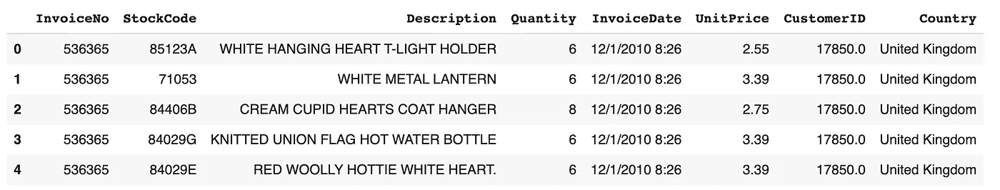

查看缺失值。

```
df.isna().mean()
```

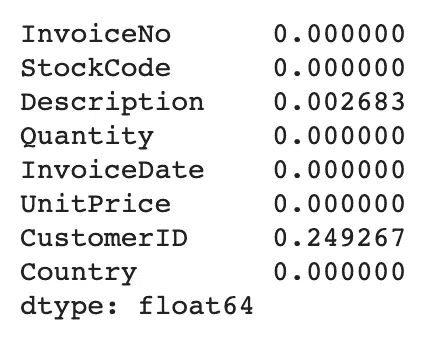

用某个数字填充缺少的 CustomerID，以便将这些客户归入 groupby:默认情况下，group by 忽略 NaN。我用负数填充它以保留数字类型。

```
df['CustomerID'].fillna(-999,inplace=True)
```

将文本日期转换为 python 日期。

```
df['InvoiceDate'] = pd.to_datetime(df['InvoiceDate'],format='%m/%d/%Y %H:%M')
```

让我们看看我们有什么时间段。

```
df['InvoiceDate'].min()
```

时间戳(“2010 年 12 月 1 日 08:26:00”)

```
df['InvoiceDate'].max()
```

时间戳(“2011 年 12 月 9 日 12:50:00”)

大概一年吧。好的。现在让我们创建一份月度销售报告。

# 1.创建包含唯一用户的表

在现实生活中，数据库中总有这样一个表。但在这种情况下，我们没有它。我还在这个表中添加了一个注册日期，这只是每个客户的最小发票日期。

```
user = df.groupby(['CustomerID'])['InvoiceDate'].min().reset_index()
user.head()
```

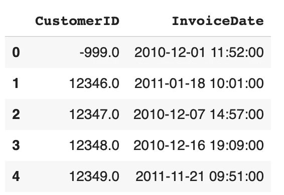

重命名列。

```
user.columns = ['CustomerID','reg_date']
```

添加注册月份。

```
user['reg_month'] = user['reg_date'].values.astype('datetime64[M]')
```

不用担心)。这只是谷歌关于“熊猫如何获得月的第一天”的第一个链接[https://stack overflow . com/questions/45304531/extracting-a-datetime-type-column-in-pandas](https://stackoverflow.com/questions/45304531/extracting-the-first-day-of-month-of-a-datetime-type-column-in-pandas)

```
user
```

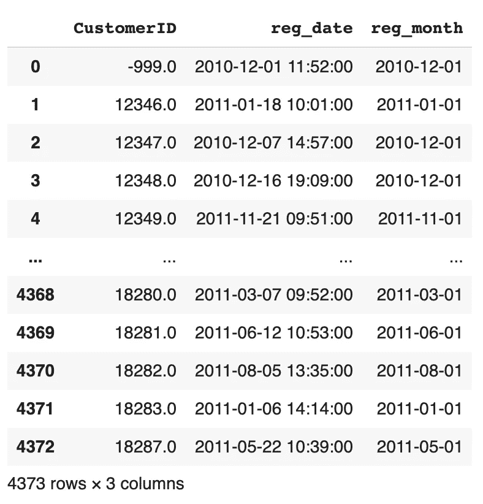

# 2.为每个用户生成每个可能月份的模板表。

```
min_month = df['InvoiceDate'].values.astype('datetime64[M]').min()
max_month = df['InvoiceDate'].values.astype('datetime64[M]').max()
dr = pd.DataFrame(pd.date_range(min_month,max_month,freq='MS'))
dr.columns = ['month']
```

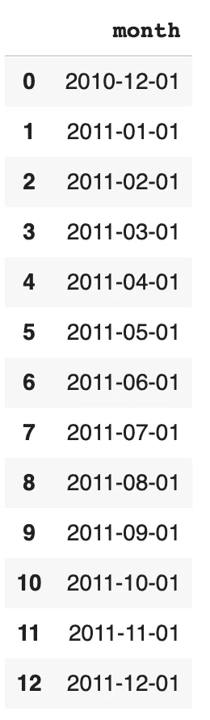

现在，我们必须对用户表执行交叉连接，并获取

```
len(user)*len(dr)
```

行。在熊猫身上，它可以像这样表演。

```
dr['key'] = 1
user['key'] = 1
report = dr.merge(user,on='key')
report.head()
```

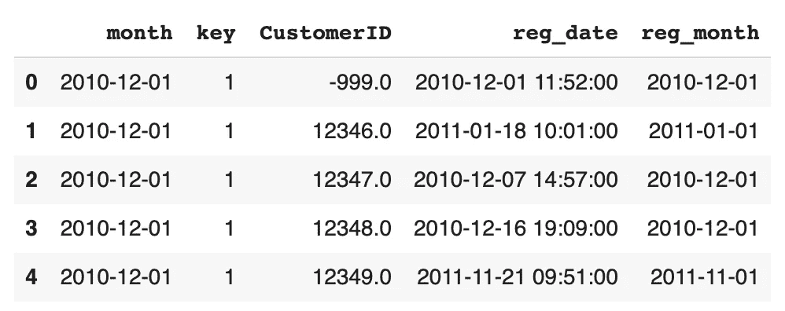

```
len(report)
```

56849

如我所料。但是我们有一些额外的行:一些用户在最小日期(2010-12)之后很久才来，在用户来之前就有他的记录是愚蠢的。

```
report = report[report['month']>=report['reg_month']]
```

让我们来看看一些特定的用户，以便做一个理智的检查。

```
report[report['CustomerID'] == 12346.0]
```

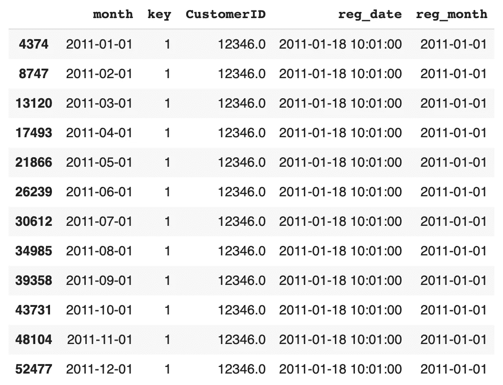

```
report[report['CustomerID'] == 12448.0]
```

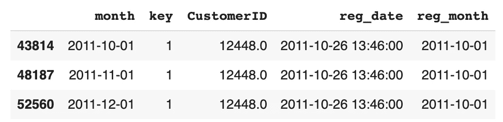

现在我们可以将销售信息加入到这个模板中。但是在做之前，我们应该做一些准备。

# 3.在与模板连接之前预聚合数据。

计算每个客户每月的总销售额。

```
df['month'] = df['InvoiceDate'].values.astype('datetime64[M]')
df['revenue'] = df['UnitPrice'] * df['Quantity']
sales_month = df.groupby(['CustomerID','month'])[['revenue']].agg('sum').reset_index()
sales_month.head()
```

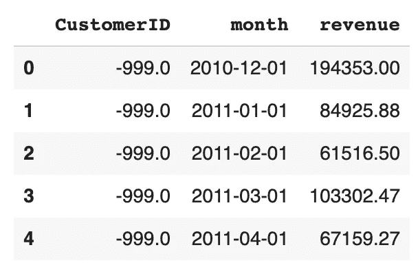

当你创建新的表格时，你应该确保你的总数是一致的。

```
df['revenue'].sum()
```

9747747.933999998

```
sales_month['revenue'].sum()
```

9747747.934000025

好吧。如果你关心小小数，请阅读 https://stackoverflow.com/a/11873114/4527289 的

# 4.加入模板

使用左连接非常重要！使用左连接，我们保留了报告表中的所有行—这就是我们理解客户活动中的差距的方式。

```
report = report.merge(sales_month,how='left',on=['CustomerID','month'])
report.head()
```

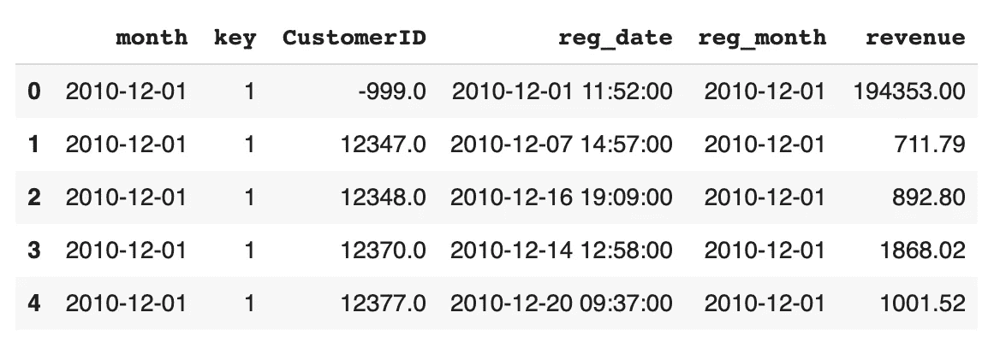

检查总数。

```
df['revenue'].sum()
```

9747747.933999998

```
report['revenue'].sum()
```

9747747.934000023

酷毙了。现在对一位顾客进行另一项健康检查。

```
report[report['CustomerID'] == 12347.0]
```

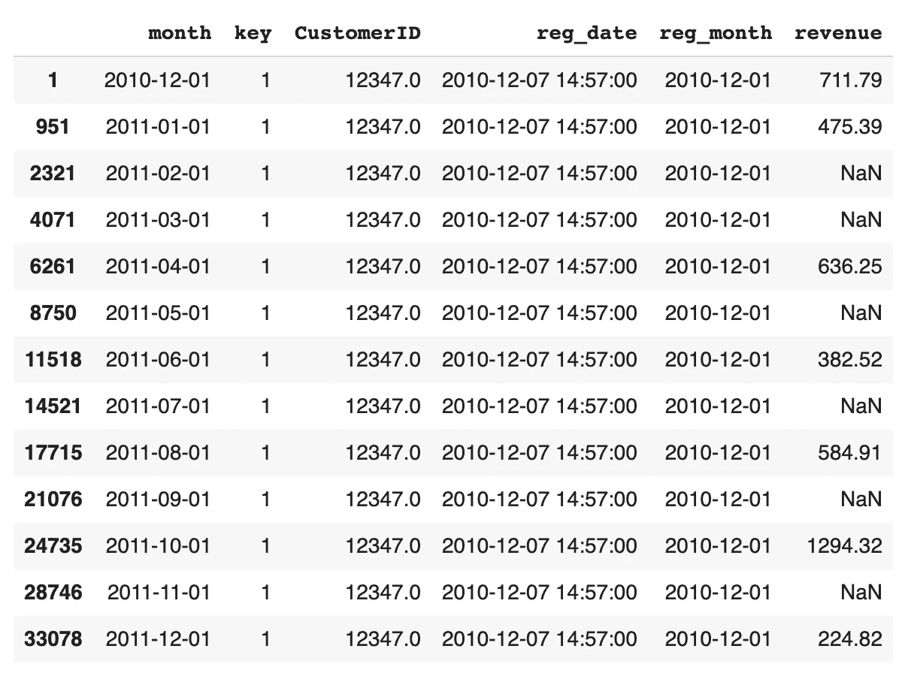

我们可以看到这个客户的活动并不规律！例如，在 2011 年 1 月 1 日之后有两个月的暂停购买。然后购买又开始了。

# 5.基本指标

添加总用户数、活跃用户数和新用户数。

```
report['user'] = 1
report['new'] = (report['reg_month'] == report['month']) * 1
report['active'] = (report['revenue'] > 0) * 1
report.head()
```

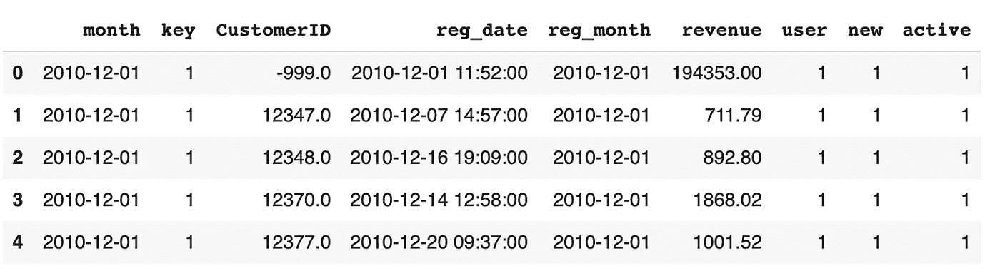

现在，您可以从该表创建月度报告。

```
report.groupby('month')[['revenue','user','new','active']].agg('sum')
```

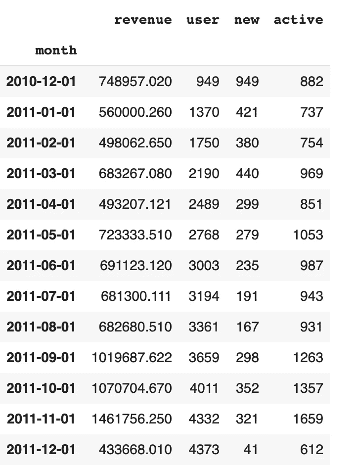

多酷啊。

这是创建各种报告的非常健壮的方法:每天、每周、每月。如果你生成所有可能的日期，你将不会错过任何事情。但是请记住，由于交叉连接的原因，这种方法是不可伸缩的:如果您有很多客户，您将会得到一个巨大的模板表。但根据我经验，它在拥有 20 万客户的中型企业中运行得很好:monty report 运行得很好。但是请不要每天都尝试)。

当然，你最好用 sql 来做这件事。Sql 在处理这类操作时要强大得多。

我认为有很多更聪明的方法来创建销售报告，而不需要如此庞大稀疏的表格，但我喜欢这种简单的方法。因为很简单，所以省了你很多痛苦。但这是有代价的。

这里是 colab 笔记本:[https://colab . research . Google . com/drive/1 WP 3 mtj _ 8 mvroc 4 ucvlh 0 a _ chub zene 8 f？usp =共享](https://colab.research.google.com/drive/1WP3Mtj_8MvroC4ucVlh0a_ChuBzeNe8f?usp=sharing)

感谢您的阅读。也可以在 https://www.glebmikhaylov.com/的[和 https://www.youtube.com/channel/UCLdAnxmoGVySnh691CwDz9Q 的](https://www.glebmikhaylov.com/)[我的 YouTube 频道](https://www.youtube.com/channel/UCLdAnxmoGVySnh691CwDz9Q)找到我。