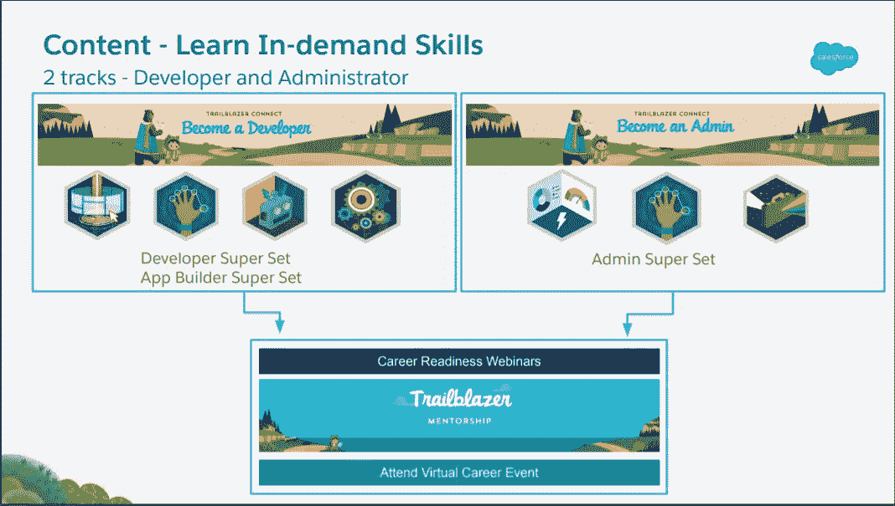
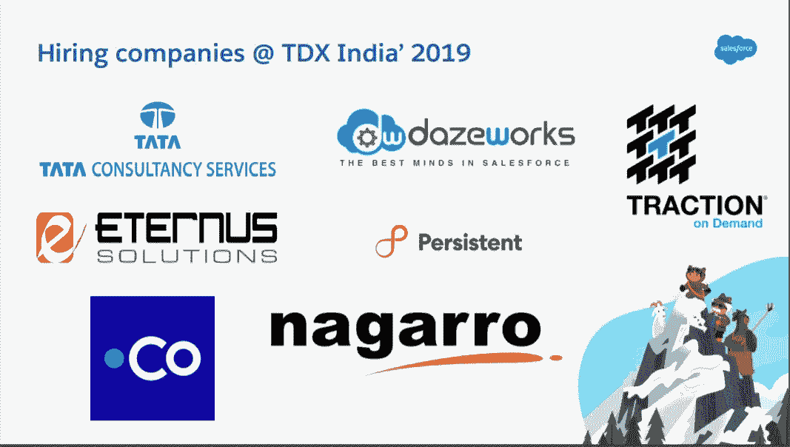
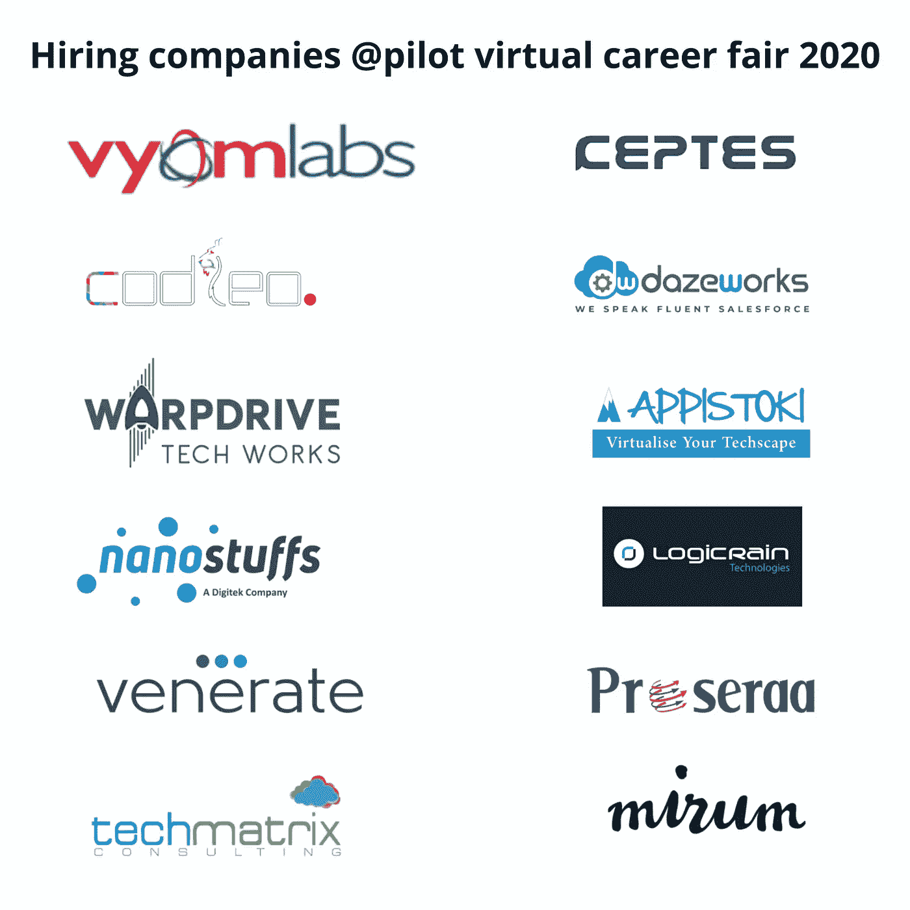

# 2020 年将 SalesForce 作为职业。

> 原文：<https://medium.com/analytics-vidhya/salesforce-as-a-career-in-2020-5e15fd43007d?source=collection_archive---------18----------------------->

这场新冠肺炎大灾难给整个生态系统带来了突然的变化，并摧毁了经济，但在这次隔离期间，我们大多数人都积极地利用这段时间学习新技能，为未来的发展做准备，同样，我也探索了很多，并在 salesforce 停了下来。我们简称它为 SFDC。我对云计算充满热情，我探索了 AWS、Firebase、GCP，然后在我最亲爱的朋友的激励下，我经历了 salesforce，trailhead 成为我在这个隔离区的虚拟游乐场，并开始争夺积分和徽章，当我犯了一个徽章错误时，我有巨大的学习和无数的犹豫，当我自己解决错误时，我有未知的快乐。 然后我看到我犯的有趣的错误时咯咯地笑了起来，但这是真的，当我们经历这种情况时，只有我们才能清楚地抓住习语背后隐藏的真相，我清楚地明白，每个错误都给我们带来了丰富的知识。

与我的虚拟操场的比赛以 107 个徽章结束，包括 6 个超级徽章和 11 个带有管理员认证(adm-201)的游侠印象的路径，bow-chicka-bow-wow，在继续之前，让我在这里停下来，告诉我为什么我在这个操场玩了很长时间而没有疲惫。

# 为什么选择 SalesForce？

在开始任何技术之前，如果你有这个问题，那么你是一个伟大的思想家，让我用我的方式来回答这个问题，当谈到 CRM(客户关系管理)时，Salesforce 是领先的 CRM 平台。这是一个有助于实现营销功能自动化或数字化的应用程序，借助该软件，公司可以增加利润和收入，四个 CRM 计划如下:

> 客户获取|客户保留|客户流失|
> 客户赢回

现在，您对什么是 CRM 以及我们在哪里使用 CRM 有了一些了解。现在，我们将了解哪些公司正在使用 salesforce，以及如何成为 salesforce 生态系统的一部分。

Salesforce 生态系统正在增长，预计到 2025 年将在印度创造 50 万个就业岗位。我们邀请所有学生踏上这一在线旅程，它提供精选内容，帮助您学习雇主寻求的销售技能。

招聘会是加入 salesforce ohana 的黄金机会，这有助于我们做好就业准备。它为未来的求职者提供了通过精心策划的 trail mixes、职业准备网络研讨会、导师以及通过虚拟招聘会和社区网络机会获得就业机会来学习 Salesforce 技能的机会。这是你参加这个最大的销售人才招聘会的路线图和先决条件。

> ***更多详情请参考本*** [***博客***](/trailhead/career-seekers-start-your-prep-for-the-trailblazer-connect-career-fair-782ed77f7780) ***。*(必填)**

请从这里一步一步来，

完成超级集合中的任何一个，以便您有资格参加即将到来的 2021 年职业博览会，并准备好向这个世界展示您的技能，这里有一些有用的资源供您浏览，不要跳到下一页。

**资源和资产:**

课程详情
— [为开发人员做好工作准备](https://trailblazercommunity.force.com/help/s/article/job-ready-developer-edition)
— [为管理人员做好工作准备](https://trailblazercommunity.force.com/help/s/article/job-ready-admin-edition)
—学生导师，[开拓者导师计划](https://trailhead.salesforce.com/trailblazerconnect/mentorship)
—关于开拓者模块的学生帮助文章，[学生开拓者帮助](https://trailblazercommunity.force.com/help/s/article/Student-Trailhead-Help)

# 在即将到来的 2021 年招聘会上还有更多的人要参观，所以开始准备吧。

我将为您提供一份精选的 salesforce MVP 产品组合链接和 youtube 频道列表，在这些链接和频道中，他们正在帮助所有 salesforce 爱好者。

**资源:** *S*[*hrey Sharma*](https://shreysharma.com)[*Blaze 你的认证*](http://blazeyourcertification.com/) *D*[*avid k .刘*](https://www.youtube.com/channel/UCE0ksmKZh8kp5ZSJmWKy_hw) *[*admin2de*](https://admin2dev.com/apex-starter/index.html)*v** 

**更新:**2020 年 12 月 7 日开放申请。还有时间去申请资格。

这就是我的全部，我们将在招聘会上见面，做好准备，做好准备！