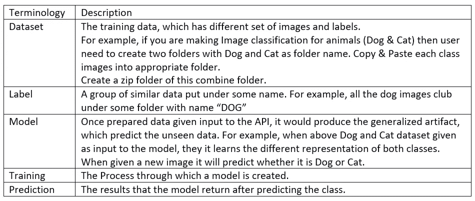

# Salesforce 爱因斯坦愿景

> 原文：<https://medium.com/analytics-vidhya/salesforce-vision-3c9c6b9cab31?source=collection_archive---------12----------------------->

在商业环境中，要交付的任务总是在很短的期限内完成。我们的一个客户在保险行业有很好的声誉。他们总是提出非常有创意的想法来帮助他们的客户群和当地的维修店。在这个新的项目中，他们提出了一个新的独特要求，他们希望自动将上传的图像标记到汽车和自行车中。此外，他们还想自动定位图像中的凹痕，以处理保险。虽然这看起来是一个非常有用和有趣的应用程序，但在短时间内实现和完成集成是相当具有挑战性的。此外，令人担忧的是，在我的团队中，没有人拥有丰富的图像数据工作经验。

处理图像数据总是具有挑战性。涉及图像数据的数据科学问题经常遇到处理数量和种类的挑战。一般来说，处理与计算机视觉相关的问题，需要具备扎实的图像处理基础知识。当我开始使用 Salesforce Einstein 的愿景时，这些假设发生了变化。

Einstein Vision 提供了不同的 API，探索深度学习模型在更大规模上分类和检测图像中的对象的能力。它还提供了一个预训练的分类器或训练您的自定义分类器。


克里斯里德在 [Unsplash](https://unsplash.com?utm_source=medium&utm_medium=referral) 上的照片

Einstein Vision 提供了以下 API:

Einstein 图像分类——用于开发人员训练模型并将图像分类成不同类别的 API

Einstein 对象检测—用于开发人员训练模型和检测图像中多个对象的 API

让我们更多地了解爱因斯坦视觉术语



**术语表**

请按照以下步骤开始使用 Salesforce Einstein。

# **图像分类**

爱因斯坦的设想提供了一种解决方案，可以自动将图像分类到适当的类别。它使用先进的深度学习算法来获得良好的准确性。

**先决条件:**

1.  注册帐户:创建 Salesforce 开发人员登录—[https://developer.salesforce.com/signup?d=70130000000td6N](https://developer.salesforce.com/signup?d=70130000000td6N)
2.  找到密钥:如果您的帐户被激活，则将 einstein_platform.pem 文件存储在适当的文件夹中，以生成访问令牌
3.  安装 Curl(可选):这个工具在 Linux 中可用。如果你在不同的系统上工作，请从这里下载
4.  从这个[页面生成一个令牌](https://api.einstein.ai/token)

*   请提供您注册的电子邮件 id(不要输入用户 id)
*   单击浏览并导航至您在步骤 2 中下载的 einstein_platform.pem 文件。
*   设置令牌的最大生命周期。
*   点击“获取令牌”。
*   JWT 令牌可用，可用于不同的任务。
*   更多详情，可以[访问](https://metamind.readme.io/docs/set-up-auth)

**图像分类步骤:**

**注意:**在以下所有步骤中，您需要用先决条件步骤中生成的令牌替换令牌。

1)创建数据集

将数据集上传到爱因斯坦平台。

*   首先，为每个班级创建不同的文件夹，并将图像存储在适当的文件夹中。
*   文件夹名称将被视为类别标签
*   创建所有这些文件夹的压缩文件
*   数据也可以从 URL 上传。
*   可以考虑这个[数据](https://www.kaggle.com/chetankv/dogs-cats-images)。它包含了猫和狗的图像。我已经把它存在“D:/DogVsCat.zip”里了

```
curl -X POST -H "Authorization: Bearer <TOKEN>" -H "Cache-Control: no-cache" -H "Content-Type: multipart/form-data" -F "type=image" -F "data=@D:/DogVsCat.zip[[CK1]](#_msocom_1) " https://api.einstein.ai/v2/vision/datasets/upload/sync
```

*   在上面的查询中，我们从本地驱动器创建/上传数据。用户可以通过 URL 和 path 变量上传文件。
*   如果从本地驱动器上传数据，则提供到的路径。本地驱动器上的 zip 文件(FilePart)带有“data”参数(而不是路径)。最大值。您可以从本地驱动器上传的 zip 文件大小为 50 MB。对于 Windows，请使用“data=@D:/DogVsCat.zip”
*   记住响应中的 datasetID
*   提供了高级参数

> -学习率:指定在每个时间戳时模型优化的梯度变化量。更小的值更好，即 0.001。有效范围 0.0001–0.01
> -时期:模型的训练迭代次数。有效范围 1–1000
> -train params { " trainsplitpratio ":0 . n }:在
> 模型创建期间训练和测试分流比。如果“trainSplitRatio”设置为 0.9，则 90%的数据在训练中考虑，其余的在测试中考虑。

2)训练数据集

*   数据集上传成功后，就可以进行进一步的训练了。
*   复制具有适当值的 DATASET_ID 和令牌。

```
curl -X POST -H "Authorization: Bearer <TOKEN>" -H "Cache-Control: no-cache" -H "Content-Type: multipart/form-data" -F "name=Beach and Mountain Model" -F "datasetId=<DATASET_ID>" [https://api.einstein.ai/v2/vision/train](https://api.einstein.ai/v2/vision/train)
```

*   训练需要时间，这取决于数据集的大小。请注意 modelId，以便进一步参考。
*   要检查训练状态，请使用上一步中观察到的适当 modelId 运行以下命令。

```
curl -X POST -H "Authorization: Bearer <TOKEN>" -H "Cache-Control: no-cache" -H "Content-Type: multipart/form-data" -F "name=Beach and Mountain Model" -F "datasetId=<DATASET_ID>" [https://api.einstein.ai/v2/vision/train](https://api.einstein.ai/v2/vision/train)
```

*   该响应返回培训过程的状态。如果它正在运行，您会看到正在运行的状态。当训练完成时，它返回成功的状态和进度值 1。

3)准确性测量

*   一旦您的模型被训练，您可以看到不同的指标，如 f1 分数、精确度、召回率和混淆矩阵。

```
curl -X GET -H "Authorization: Bearer <TOKEN>" -H "Cache-Control: no-cache" https://api.einstein.ai/v2/vision/models/<MODEL_ID>
```

4)对看不见的数据进行测试

*   一旦你的模型准备好了，你就可以对任何图像进行分类。
*   模型将返回以下两个值。

> 标签:类别标签
> 概率:给定类别的概率

*   使用可以提供本地图像(sampleContent)或来自 URL 的图像(sampleLocation)例如，来自 windows 的本地图像使用“sampleContent =@D:/new.png”

```
curl -X POST -H "Authorization: Bearer <TOKEN>" -H "Cache-Control: no-cache" -H "Content-Type: multipart/form-data" -F "sampleContent=@D:/image.png " -F "modelId=<YOUR_MODEL_ID>" [https://api.einstein.ai/v2/vision/predict](https://api.einstein.ai/v2/vision/predict)
```

# **物体探测**

自定义模型的对象检测工作流程如下

1)创建数据集

按照以下准则为对象检测创建适当的数据集。

*   图像中的对象是可见的和可识别的。
*   图像面向前方，不倾斜。
*   图像既不太暗也不太亮。
*   对于您希望模型识别的每个对象，图像包含 100–200 个或更多的出现次数(跨所有图像)。对象出现的次数越多，模型的性能就越好。

标签和 Zip 文件格式

*   标签内容存储在名为 annotations.csv 的逗号分隔(csv)文件中。
*   注释文件包含图像文件名以及图像中每个对象的标签和坐标(JSON 格式)。
*   请参见 Annotations 示例，从 Zip 文件异步创建数据集。以下是注释示例中的前四行。
*   CrowdFlower 和 SharinPix 可用于注释数据。
*   将所有图片放在一个标签为 CSV 文件的文件夹中，并创建一个 zip 文件以供上传。

请找到示例注释。

```
image_url,box0,box1,box2,box3,box4,box5,box6,box720171030_133845.jpg,"{""height"": 1612, ""y"": 497, ""label"": ""Alpine - Oat Cereal"", ""width"": 1041, ""x"": 548}","{""height"": 1370, ""y"": 571, ""label"": ""Alpine - Oat Cereal"", ""width"": 904, ""x"": 1635}","{""height"": 1553, ""y"": 383, ""label"": ""Alpine - Corn Flakes"", ""width"": 1059, ""x"": 2580}",,,,,20171030_133911.jpg,"{""height"": 1147, ""y"": 2299, ""label"": ""Alpine - Oat Cereal"", ""width"": 861, ""x"": 374}","{""height"": 1038, ""y"": 2226, ""label"": ""Alpine - Oat Cereal"", ""width"": 752, ""x"": 1263}","{""height"": 1464, ""y"": 709, ""label"": ""Alpine - Bran Cereal"", ""width"": 1056, ""x"": 179}","{""height"": 1470, ""y"": 746, ""label"": ""Alpine - Bran Cereal"", ""width"": 697, ""x"": 2327}","{""height"": 1434, ""y"": 752, ""label"": ""Alpine - Corn Flakes"", ""width"": 831, ""x"": 1312}","{          ""height"": 1080, ""y"": 2378, ""label"": ""Alpine - Corn Flakes"", ""width"": 965, ""x"": 2059}",,20171030_133915.jpg,"{""height"": 496, ""y"": 1811, ""label"": ""Alpine - Oat Cereal"", ""width"": 344, ""x"": 922}","{""height"": 100, ""y"": 112.18126888217523, ""label"": ""Alpine - Oat Cereal"", ""width"": 100, ""x"": 100}","{""height"": 517, ""y"": 1753, ""label"": ""Alpine - Oat Cereal"", ""width"": 337, ""x"": 1282}","{""height"": 590, ""y"": 1157, ""label"": ""Alpine - Bran Cereal"", ""width"": 383, ""x"": 889}","{""height"": 587, ""y"": 1157, ""label"": ""Alpine - Bran Cereal"", ""width"": 368, ""x"": 1674}","{""height"": 575, ""y"": 1169, ""label"": ""Alpine - Corn Flakes"", ""width"": 350, ""x"": 1303}","{""height"": 532, ""y"": 1757, ""label"": ""Alpine - Corn Flakes"", ""width"": 365, ""x"": 1629}"
```

2)上传数据集

```
curl -X POST -H "Authorization: Bearer <TOKEN>" -H "Cache-Control: no-cache" -H "Content-Type: multipart/form-data" -F "data=@D:/alpine.zip" -F "**type=image-detection**" [https://api.einstein.ai/v2/vision/datasets/upload](https://api.einstein.ai/v2/vision/datasets/upload)
```

*   上传对象检测数据集时，使用 type = "image-detection "。
*   上传影像分类数据集时，请使用 type = "image "。
*   请记下响应字段中的 id。它对应于 DATASET_ID。
*   当 available 为 true 并且 statusMsg 成功时，上载完成，数据集准备好接受训练。

检查上传的状态

```
curl -X GET -H "Authorization: Bearer <TOKEN>" -H "Cache-Control: no-cache" https://api.einstein.ai/v2/vision/datasets/<DATASET_ID>
```

3)训练模型

运行以下命令来训练模型。这和图像分类是一样的。

```
curl -X POST -H "Authorization: Bearer <TOKEN>" -H "Cache-Control: no-cache" -H "Content-Type: multipart/form-data" -F "name=Alpine Boxes on Shelves" -F "datasetId=<DATASET_ID>" [https://api.einstein.ai/v2/vision/train](https://api.einstein.ai/v2/vision/train)
```

*   记下响应标头中的 modelId。

检查培训执行的状态。

```
curl -X GET -H "Authorization: Bearer <TOKEN>" -H "Cache-Control: no-cache" https://api.einstein.ai/v2/vision/train/<YOUR_MODEL_ID>
```

检查不同的准确度/召回率/精确度/f1 分数

```
curl -X GET -H "Authorization: Bearer <TOKEN>" -H "Cache-Control: no-cache" https://api.einstein.ai/v2/vision/models/<MODEL_ID>
```

4)测试模型

运行以下命令对新图像进行分类。

*   用 **sampleLocation** (URL 路径)或 **sampleContent** (以@为后缀的本地路径)指定输入文件路径。
*   API 调用中前缀“detect”的差异。(图像分类以预测作为后缀)

```
curl -X POST -H "Authorization: Bearer <TOKEN>" -H "Cache-Control: no-cache" -H "Content-Type: multipart/form-data" -F "sampleContent=@D:/alpine.jpg" -F "modelId=BN2PTZQ6U2F7ORW57ZIZWZWRDQ" [https://api.einstein.ai/v2/vision/detect](https://api.einstein.ai/v2/vision/detect)
```

**结论:**

我个人觉得 Salesforce Einstein 很有意思，很容易上手。请找出以下优点和缺点

**优点:**

1.  易于用于构建定制模型。
2.  不需要特定的数据科学专业知识。提供预先训练好的模型供使用。
3.  Vision model 可轻松与 Salesforce 应用程序集成，通过 apex 类进行实时预测。
4.  还可以上传更大的一组训练数据集用于训练。

**缺点:**

1.  Vision 为高级参数提供的选项非常有限。许多重要参数丢失，如批量大小、漏失等。
2.  当前版本无法创建或集成自定义算法
3.  预测的批处理不可用。当前的爱因斯坦视觉 API 一次仅提供一个预测。但是，为了解决这个问题，用户可以在 apex 中编写自定义逻辑来进行批量预测。
4.  因为没有算法细节作为输出，所以很难解释建立的模型。

**参考**

> 1.[https://meta mind . readme . io/reference # predictive-vision-service-API](https://metamind.readme.io/reference#predictive-vision-service-api)
> 2 .[https://meta mind . readme . io/docs/introduction-to-the-Einstein-predictive-vision-service](https://metamind.readme.io/docs/introduction-to-the-einstein-predictive-vision-service)
> 3 .[https://metamind.readme.io/docs/scenario](https://metamind.readme.io/docs/scenario)—教程示例
> 4。[https://www.kaggle.com/chetankv/dogs-cats-images](https://www.kaggle.com/chetankv/dogs-cats-images)

## 特别提及

1.  阿伦·阿尼扬:[https://www.linkedin.com/in/arunaniyan/](https://www.linkedin.com/in/arunaniyan/)

## LinkedIn connect

Chetan Khadke: [LinkedIn](https://www.linkedin.com/in/khadke-chetan-a9360a49/)