# Salesforce Vision 与 Salesforce 应用程序的集成

> 原文：<https://medium.com/analytics-vidhya/salesforce-vision-integration-with-salesforce-app-d758369dc37f?source=collection_archive---------16----------------------->

Salesforce 提供各种选项，用 [Lighting App builder](https://help.salesforce.com/articleView?id=lightning_app_builder_overview.htm&type=5) 在不到 10 分钟的时间内创建应用。Salesforce 应用程序提供了与 salesforce 的多个不同服务(如 Salesforce Einstein)进行交互的强大功能。在本文中，我将向您介绍如何将 Salesforce Einstine 组件集成到 Salesforce 应用程序中。请考虑阅读这篇[博客](/analytics-vidhya/salesforce-vision-3c9c6b9cab31?source=friends_link&sk=d18b2ebd04f12ead24db7c9532a8e615)，使用 Salesforce Einstein 创建一个自定义的图像分类。


由[凯文·Ku](https://unsplash.com/@ikukevk?utm_source=medium&utm_medium=referral)在 [Unsplash](https://unsplash.com?utm_source=medium&utm_medium=referral) 上拍摄

# 目标

我们希望构建 salesforce lighting 应用程序来跟踪汽车维修服务。我们这项活动背后的主要目标是帮助车库人员有效地管理他们的时间表，最大限度地减少用户的输入。

## ML 透视

当一辆新车来到车库进行服务/维修时，该应用程序会根据汽车类型和型号自动对汽车图像(由摄像头点击)进行分类。

**先决条件:**

1.  爱因斯坦视觉 API 知识
2.  爱因斯坦视觉训练/预训练模型 Id(查看此[博客](/analytics-vidhya/salesforce-vision-3c9c6b9cab31?source=friends_link&sk=d18b2ebd04f12ead24db7c9532a8e615)创建一个)
3.  使用 modelId 调用 vision API 的访问令牌
4.  Java 编程知识不多
5.  一杯咖啡或茶让大脑清醒😃

数据集:我用过斯坦福开源的[汽车图像数据集](https://ai.stanford.edu/~jkrause/cars/car_dataset.html)。汽车数据集包含 196 类汽车的 16，185 张图像。

请按照一步一步的教程，将视觉模型与自定义应用程序相结合。

1.  创建自定义对象

*   转到设置页面，选择“对象管理器”。点击创建->“新对象”。

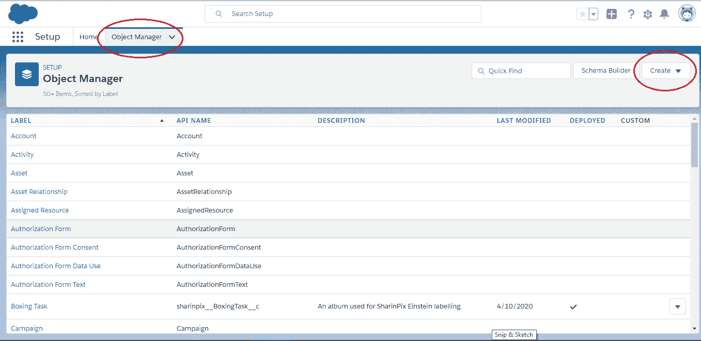

对象管理器

*   指定标签、复数标签字段，并选择下面显示的所有选项，然后单击保存按钮。它将创建一个新对象。

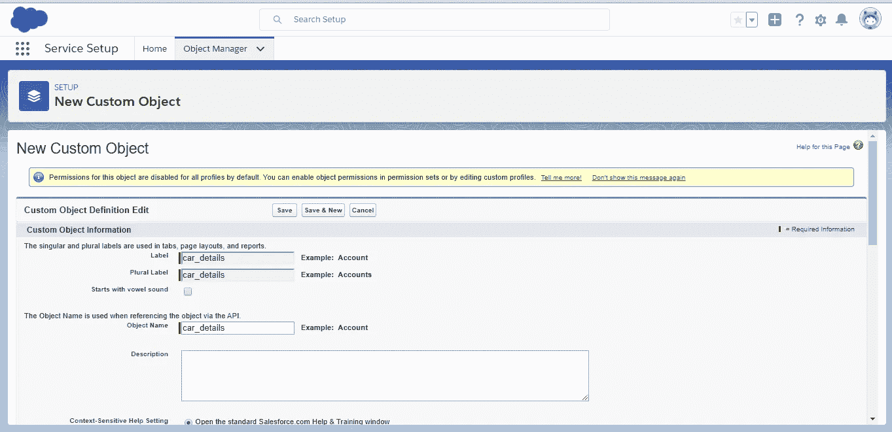

对象名称

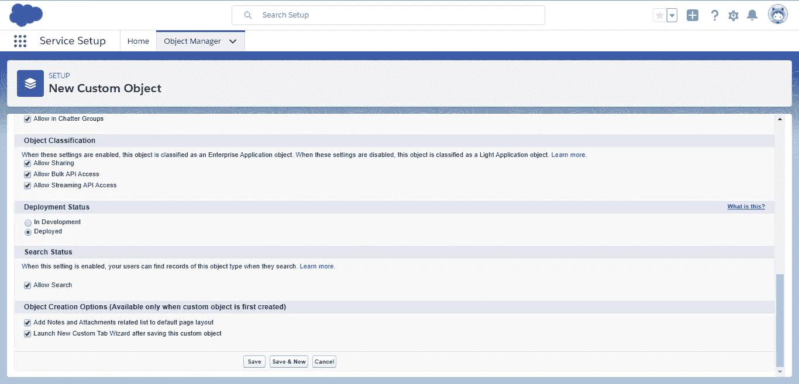

指定所有参数并保存

*   指定对象的配置文件图片。

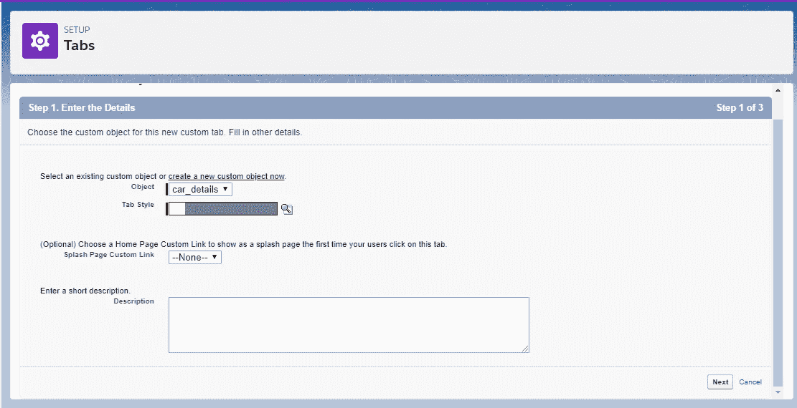

个人资料图片选择和简短描述

*   保留默认选项，单击“下一步”按钮两次，然后单击“保存”按钮。保留所有屏幕的所有默认选项。

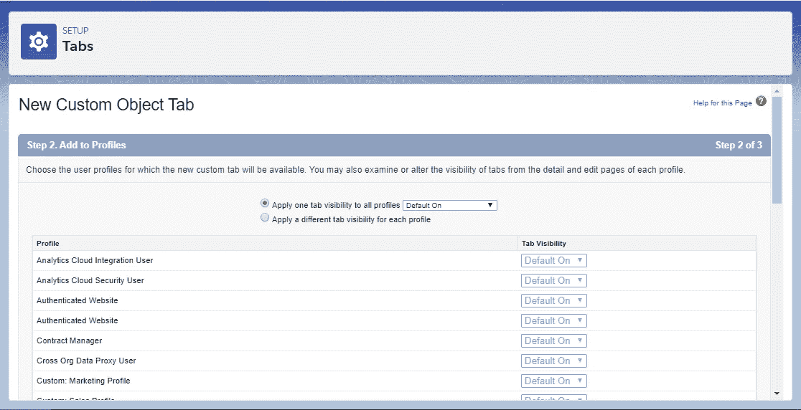

汽车对象详细信息

*   将创建汽车对象。

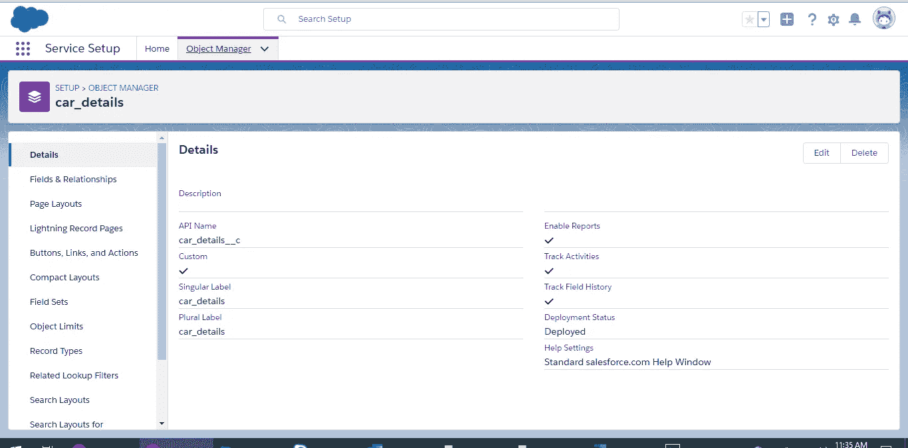

汽车对象详细信息

*   在汽车对象中创建新字段。转到“字段和关系”->“新建”。

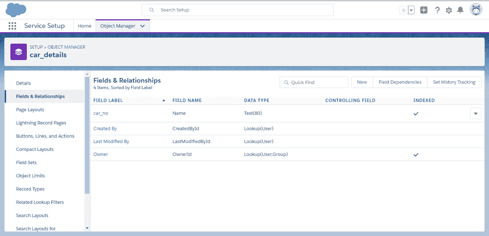

汽车详细信息-->“字段和关系”

*   选择“文本”选项，然后单击下一步按钮。

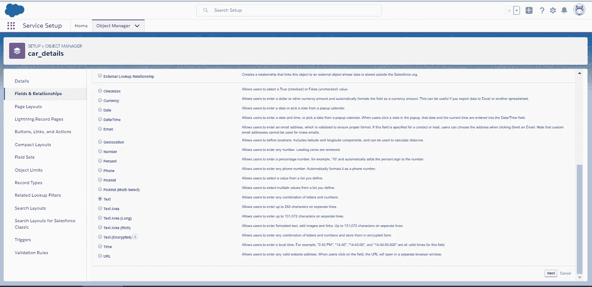

选择选项文本

*   提供字段的名称，然后单击“下一步”按钮 3 次并保存。它创造了一个新的领域。类似地，为图像(类型 URL)、汽车号码(类型文本)、汽车类型(类型文本)和日期(类型日期)创建新字段。

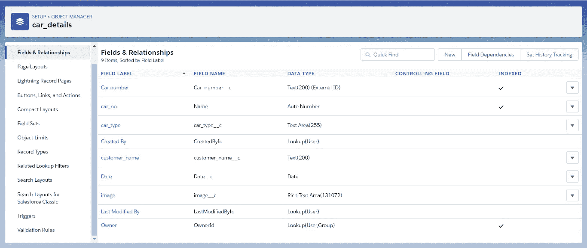

字段值

2.创建触发器 Apex 类

*   从右侧选择并选择“开发人员控制台”。
*   创建触发器类 Apex 类，并选择 SObject 作为 animal_image。

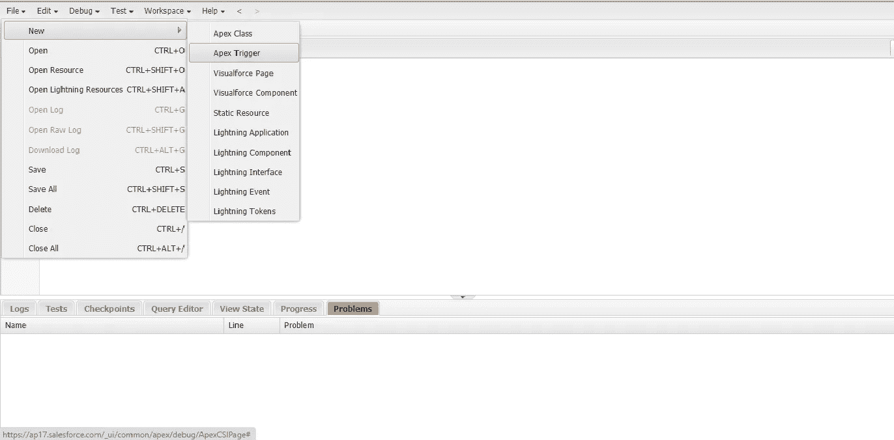

开发者屏幕

*   下面是触发调用。(顶点触发器)

*指定访问令牌和模型 Id(下面突出显示)*

```
trigger Car_trigger on car_details__c (after insert) {
List<Id> newCaseIds = New List<Id>();
for(car_details__c a : Trigger.New) {
System.debug(‘Adding new car object: ‘ + String.valueOf(a));
System.debug(‘Id No.: ‘ + String.valueOf(a.Id));
newCaseIds.add(a.Id);
}
System.debug(‘***** From Trigger: ‘);
System.debug(newCaseIds);
EinsteinVisionCar.getClass(newCaseIds);
}
```

*   请找到处理输入图像并将其传递给视觉分类器的助手类。(Apex 类)(遵循上一步)

*指定 access_token 和 modelId(注释如下)*

```
 public class EinsteinVisionCar {
 //@future 
 [@future](http://twitter.com/future)(callout=True)
 public static void getClass(List<Id> caseIds){
 System.debug(‘***** Case Id List: ‘);
 System.debug(caseIds);
 List<car_details__c> comingCases = [Select Id, Car_number__c, car_type__c, image__c from car_details__c WHERE Id =: caseIds]; // please check the necessary parameters here
 List<car_details__c> newCaseList = New List<car_details__c>();
 //put your access_token here
 String access_token = ‘’;
 For(car_details__c EveryCase : comingCases)
 {
 Http http = new Http(); 
 HttpRequest req = new HttpRequest();
 req.setMethod(‘POST’);
 req.setEndpoint(‘[https://api.einstein.ai/v2/vision/predict’](https://api.einstein.ai/v2/vision/predict'));
 req.setHeader(‘Authorization’, ‘Bearer ‘ + access_token);
 req.setHeader(‘Content-type’, ‘application/json’); 
 req.setTimeout(5000); // timeout in milliseconds
 String document= EveryCase.image__c;
 Matcher imgMatcher = Pattern.compile( ‘’ ).matcher( document );
 Blob b;String strBase64 = ‘’;
 // iterate each image tag found
 while ( imgMatcher.find() ) {

 // get the image tag html
 String imageTag = imgMatcher.group();
 System.debug( ‘imageTag=’ + imageTag );

 // get the value of the src attribute
 String imageURL = imageTag.substringBetween( ‘ src=”’, ‘“‘ );
 System.debug( ‘imageURL=’ + imageURL );

 // if url contained parameters they might be html escaped, unescape them
 // or, more conservatively, replace ‘&amp;’ with ‘&’
 String decodedURL = imageURL.unescapeHtml4();
 System.debug( ‘decodedURL=’ + decodedURL );

 // [https://developer.salesforce.com/docs/atlas.en-us.pages.meta/pages/apex_System_PageReference_getContent.htm](https://developer.salesforce.com/docs/atlas.en-us.pages.meta/pages/apex_System_PageReference_getContent.htm)
 PageReference page = new PageReference( decodedURL );
 b = page.getContent();
 strBase64 = EncodingUtil.base64Encode(b);
 System.debug( ‘blob=’ + strBase64 );
 }

 String modelId=’’; // Please provide your modelID here 
 String body = ‘{\”modelId\”:\”’+modelId+’\”,\”sampleBase64Content\”:\”’+ strBase64+’\”}’;
 System.debug(modelId);
 System.debug(‘****** Body\n’ + body);
 List<Probabilities> probabilities = new List<Probabilities>() ;
 req.setBody(body); 
 HTTPResponse res = http.send(req); 
 System.debug(‘res ‘+res.getBody());
 JSONParser parser = JSON.createParser(res.getBody()) ;
 System.debug(‘Json Parser: ‘+ parser);
 String label =’’;
 Decimal probability = 2 ;
 while (parser.nextToken() != JSONToken.END_OBJECT) {
 if (parser.getCurrentToken() == JSONToken.FIELD_NAME) {
 String text = parser.getText();
 if (parser.nextToken() != JSONToken.VALUE_NULL) {
 if (text == ‘probabilities’) {
 probabilities = new List<Probabilities>();
 while (parser.nextToken() != JSONToken.END_ARRAY) {
 probabilities.add(new Probabilities(parser));
 }
 } 
 }
 }
 }
 EveryCase.car_type__c = probabilities[0].label;
 newCaseList.add(EveryCase);
 System.debug(‘**********Updated for: ‘ + EveryCase.car_type__c );
 }
 update newCaseList;
 System.debug(‘********* Updation done!! **********’);
 System.debug(‘*****++++ Case Id List: ‘);
 System.debug(caseIds);
 }
 // Helper class to get probabilities with labels
 public class Probabilities {
 public String label { get; set; } 
 public Double probability { get; set; }
 public Probabilities(JSONParser parser) {
 while (parser.nextToken() != JSONToken.END_OBJECT) {
 if (parser.getCurrentToken() == JSONToken.FIELD_NAME) {
 String text = parser.getText();
 if (parser.nextToken() != JSONToken.VALUE_NULL) {
 if (text == ‘label’) {
 label = parser.getText();
 } else if (text == ‘probability’) {
 probability = parser.getDoubleValue();
 } 
 }
 }
 }
 }
 }
}
```

3.创建照明应用程序

*   进入设置，搜索应用管理器->新照明应用

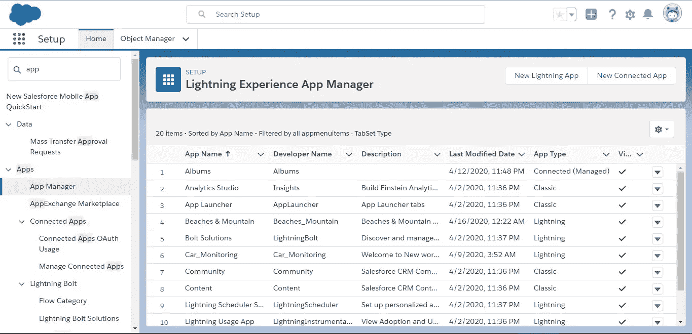

应用程序屏幕

*   请提供应用程序的名称，并上传应用程序的简介图片。

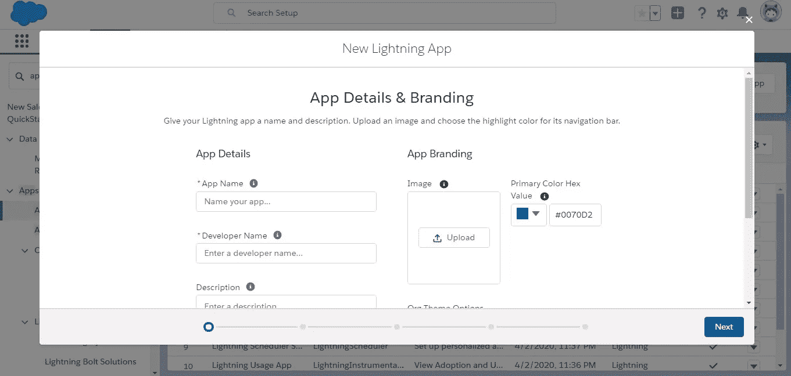

应用详细信息

*   选择所有适当的选项，然后单击下一步。(您可以选择默认选项)

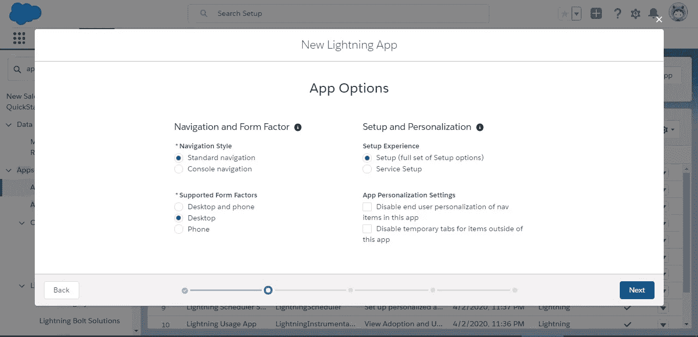

应用程序选项

*   在箭头按钮的帮助下，从左侧选择所有配置文件并推到右侧，然后单击“保存并完成”按钮。

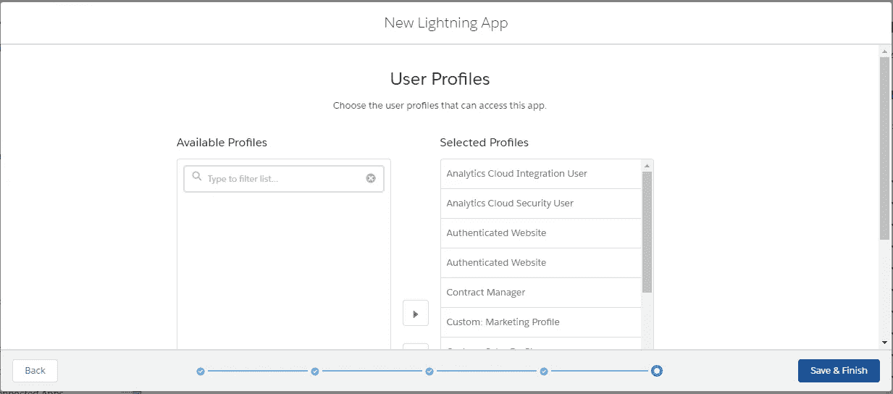

应用程序用户档案

4.上传图片并自动分类。

*   通过设置->搜索->应用程序名称打开应用程序，然后点击您的应用程序

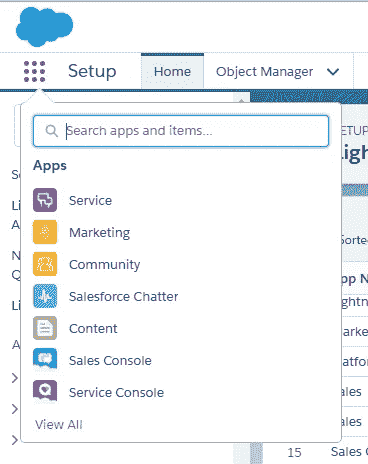

主屏幕

*   从搜索中选择对象(在第一步中创建)。

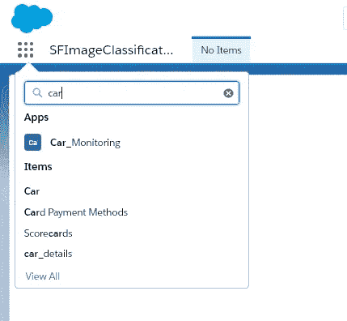

*   单击右侧的新选项。

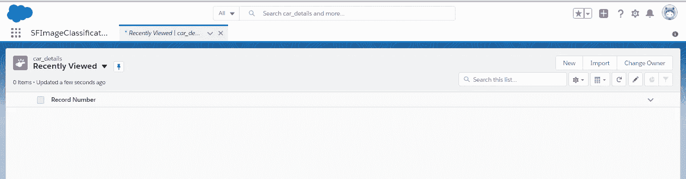

应用程序的登录页面

*   如下所示填写所有详细信息。请在 image_url 部分提供适当的图像 URL。**保持类型字段为空**。它将根据汽车图像的类型进行填充。

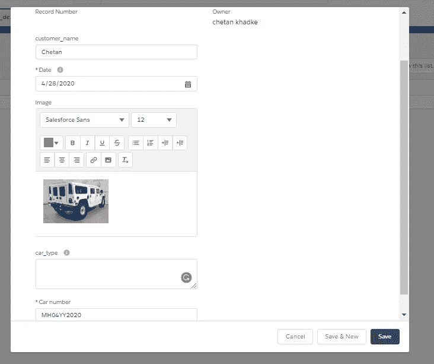

输入详细信息

*   car_type 信息会根据上传的图像类型自动填充到 tag 字段中，如下所示。爱因斯坦的视觉模型在后台调用以获取细节。

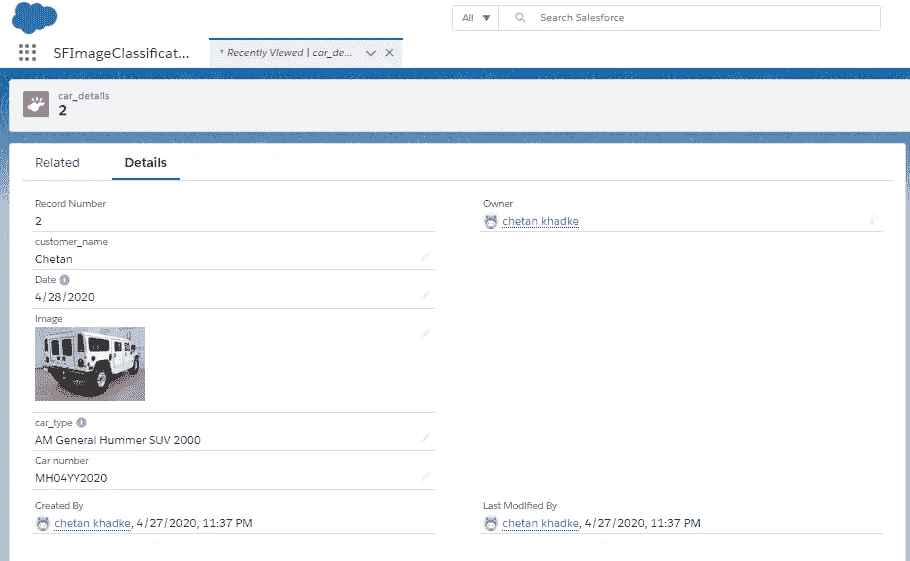

## **参考:**

1.  数据集[https://ai.stanford.edu/~jkrause/cars/car_dataset.html](https://ai.stanford.edu/~jkrause/cars/car_dataset.html)
2.  用于细粒度分类的 3D 对象表示，Jonathan Krause，Michael Stark，Jia Deng，李菲菲，*第四届 IEEE 表示和识别研讨会，ICCV 2013***(3D RR-13)**。澳大利亚悉尼。2013 年 12 月 8 日。
3.  自定义对象创建和照明应用创建— [YouTube 视频](https://www.youtube.com/watch?v=M462r41Ydow&t=233s)
4.  Apex 触发器[https://developer . sales force . com/docs/atlas . en-us . apex code . meta/apex code/apex _ triggers _ defining . htm](https://developer.salesforce.com/docs/atlas.en-us.apexcode.meta/apexcode/apex_triggers_defining.htm)