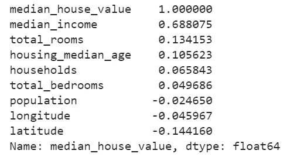
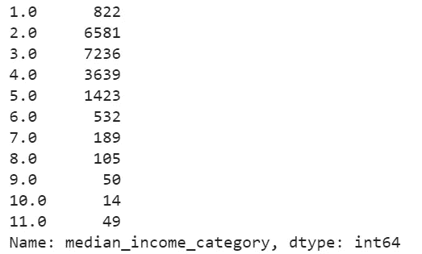
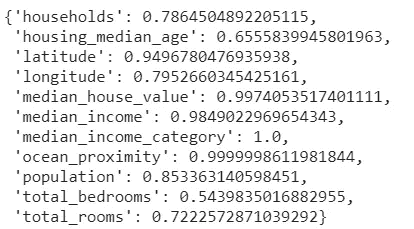

# 抽样

> 原文：<https://medium.com/analytics-vidhya/sampling-6037db498e71?source=collection_archive---------12----------------------->

在机器学习中，我们经常需要处理非常大的数据集，这有时在计算上可能是昂贵的。在这些时候，在这个大数据集中创建一个较小的样本并在这个较小的数据集中训练或建模更有意义。在这样做的同时，重要的是要确保我们不会丢失关于我们人口的统计信息。我们还需要确保我们的样本没有偏见，是我们人口的代表。我们探索一些方法来确保这一点。

出于本笔记本文档的目的，我们将使用加州房屋数据集。

此时，我们将采取两种方法:

1.简单随机抽样

*   这很容易实现，也是最直接的概率抽样方法。
*   存在引入采样偏差的风险。
*   为了对样本更有信心，可以对数据集的每个特征进行统计测试。

2.分层随机抽样

*   确保样本能够代表总体。
*   定义亚群或阶层，并从每个亚群中产生简单的随机样本。
*   这种方法减少了采样误差。

简单随机抽样

我们用熊猫。DataFrame.sample 获得一个简单的随机样本。它从一个对象轴上返回一个随机的项目样本。

为了确保我们的样本不丧失总体的统计显著性，我们进行了一些统计检验。为了更容易实现，我们做了一个可接受的假设:考虑每个变量(特征/列)独立于其他变量。

对于每个特征，我们将样本的概率分布与总体的概率分布进行比较。如果它们都是重要的，那么这个样本“通过了我们的测试”,否则我们用另一个样本重试。

我们使用 Kolmogorov-Smirnov 检验。

为了进行这些测试，我们使用了 [scipy](https://docs.scipy.org/doc/scipy//reference/index.html) 库，这是一个开源 Python 库，用于数学、工程、科学和技术计算。

我们看到所有列的 p 值都大于 0.05，因此我们不能拒绝它们来自不同分布的零假设，这意味着样本具有统计学意义。

分层随机抽样

在分层随机抽样中，选择一个阶层或亚群体是很重要的。最佳方法是选择最重要的特征(与目标变量的相关性最高),并根据该特征对人群进行分层。

因此，我们在此示例中看到，median_income 具有最高的相关性，我们选择此功能对数据集进行分层。为此，我们首先需要创建一个新的列来创建地层。

我们在上面所做的只是创建了 5 个阶层(或亚群体),我们将在此基础上进行采样。

我们看到所有列的 p 值都大于 0.05，因此我们不能拒绝它们来自不同分布的零假设，这意味着样本具有统计学意义。