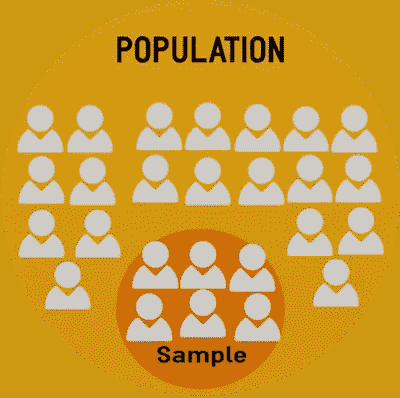

# 蜂箱中的采样数据

> 原文：<https://medium.com/analytics-vidhya/sampling-data-in-hive-f83560d9260e?source=collection_archive---------24----------------------->

抽样数据操作是你需要提供给除生产环境之外的其他环境的东西，比如测试环境，或者单元测试等等。因为您的数据可能非常庞大，您不希望在其他环境中使用相同的比例，所以您会在尽可能不损失比例的情况下对数据进行采样和缩小。

良好的采样实际上是很难实现的。因为你需要在尽可能不破坏实际数据规模的情况下对其进行采样。我说尽可能多，因为，这取决于你在做什么。我的意思是；您需要定义要进行缩放的列。例如，让我们假设您想要通过在一个类似于类别字段的字段上对数据进行缩放来对数据进行采样。您可以通过借助 rank windowing 函数限制所有行或使用严格的大小限制每个类别组，或者借助 **percent_rank** windowing 函数限制每个类别组超过组大小的百分比来对其进行采样。我认为第三种方法在某些领域是百分比抽样，这是一种更好的抽样方法。

# 通过严格的大小限制每个类别(不建议)

这意味着我们将只取每个类别的 **n** 行。让我们假设这个 **n** 是 2。

这将产生如下结果:

有一些像电子产品一样的休闲产品。好像一点都不好缩放。因为休闲产品是电子产品的两倍。

**按百分比限制每个类别(建议)**

我认为这是做这件事的最好方法。因为百分比总是在一个适当的范围内。

让我们假设我们想要将每个类别组缩小为% 50%。窗口函数是我们正在寻找的。

这将产生如下结果:

如你所见，等级仍然存在于类别之间。还是有两倍于电子产品的休闲产品。