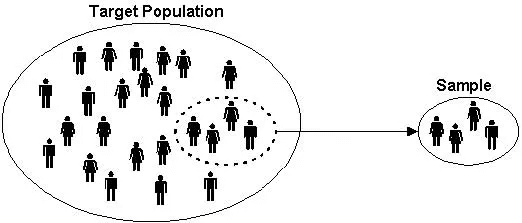
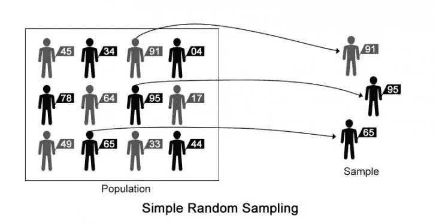
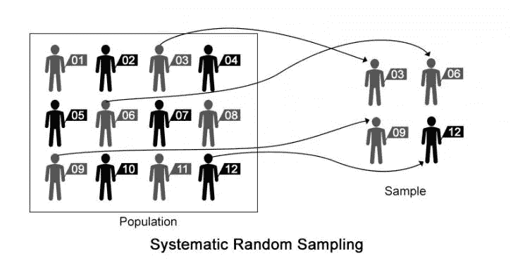
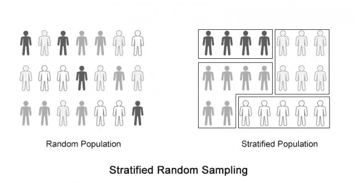
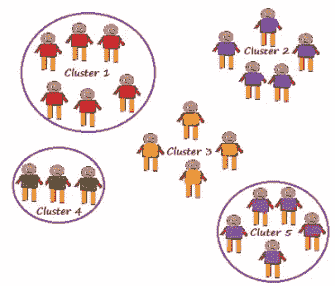

# 取样方法——我们需要知道的一切！

> 原文：<https://medium.com/analytics-vidhya/sampling-methods-6c6e21773a1c?source=collection_archive---------10----------------------->

照片由[何孝](https://unsplash.com/@mihodango?utm_source=medium&utm_medium=referral)在 [Unsplash](https://unsplash.com?utm_source=medium&utm_medium=referral) 上拍摄

我们在数据科学中面临的最大问题之一是在有限的机器上处理大量数据。

那么，如何处理这个问题呢？有一种方法可以解决这个问题，那就是挑选一部分数据进行分析。这种方法被称为抽样。我们将在本文中讨论这个问题。

本文将涵盖以下主题:

1.  什么是抽样？
2.  为什么我们需要取样？
3.  一些不同类型的取样方法。

让我们从定义什么是采样开始。

> *抽样*是统计分析中使用的一个过程，在这个过程中，从一个较大的总体中抽取预定数量的观察值。

让我们通过一个例子来更详细地理解这一点。假设我们想研究一个地方的 5000 名成年人的吸烟习惯，那么我们只从其中的 500 名成年人中收集信息，并找出他们的吸烟习惯。根据这 500 个成年人的吸烟习惯，我们得出了整个 5000 个成年人的结论。

**为什么我们需要采样？**

假设人口的一部分代表全体，那么信息只能从这部分人口中获得。因此，对一部分进行研究，并在此基础上对整个人口得出结论。

这种方法成本低，耗时少。

因为只研究了宇宙的一部分，所以可以获得详细的信息。

在无限人口的情况下，这种方法是有用的。

**不同类型的采样方法**

在统计学中，抽样方法指的是我们如何从总体中选择成员。如果样本不是随机选取的，它可能会在某些方面有偏差，数据可能不能代表总体。有许多方法可以选择样本。那么，让我们来了解不同类型的采样方法。

**简单随机样本:**在统计学**，**简单随机样本是从一个较大的集合(总体)中选出的个体(样本)的子集。每个个体都是随机选择的，完全是随机的，这样每个个体在抽样过程中的任何阶段都有相同的被选中概率，并且每个 *k* 个体子集被选中的概率与任何其他 *k* 个体子集被选中的概率相同。这一过程和技术被称为**简单随机抽样。**

这里，随机样本通常具有相当的代表性，因为它们不会偏向某些成员。随机调查是避免偏差的最好方法。因此，你的结果更好。

**系统抽样:**系统抽样是一种概率抽样方法，从较大的总体中，按照随机的起点，但以固定的周期间隔，选取样本成员。这个间隔称为抽样间隔，通过将总体规模除以期望的样本规模来计算。

只有当给定的总体在逻辑上是同质的，才能应用系统抽样，因为系统抽样单位在总体上是均匀分布的。研究人员必须确保选择的采样间隔不会隐藏模式。任何模式都会威胁到随机性。

系统抽样比简单的随机抽样更方便。然而，如果我们从总体中选择项目时存在潜在的模式，这也可能导致偏差。

**分层抽样:**分层随机抽样是一种抽样方法，它涉及到将人口划分为更小的称为阶层的子群体。在分层随机抽样中，阶层是根据成员的共同属性或特征(如收入或教育程度)形成的。

它保证了每个组的成员都能在样本中得到体现，所以当我们希望每个组都有一些成员时，这种抽样方法是很好的。然而，分层抽样需要对人口特征有适当的了解。

**整群抽样:**整群抽样是一种技术，在这种技术中，代表总体的参与者的群被识别并包括在样本中。整群抽样包括识别代表人口的参与者群，并将他们包括在样本组中。

一个聚类样本从一些组中获得每个成员，因此当每个组反映总体时是好的。当我们关注一个特定的地区或区域时，使用这种类型的抽样。

感谢阅读！