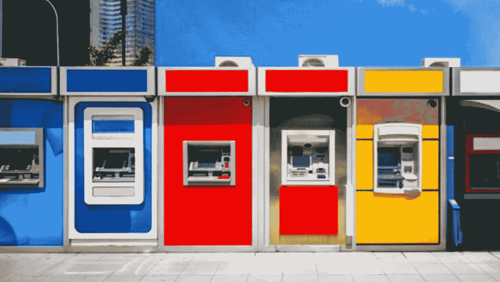
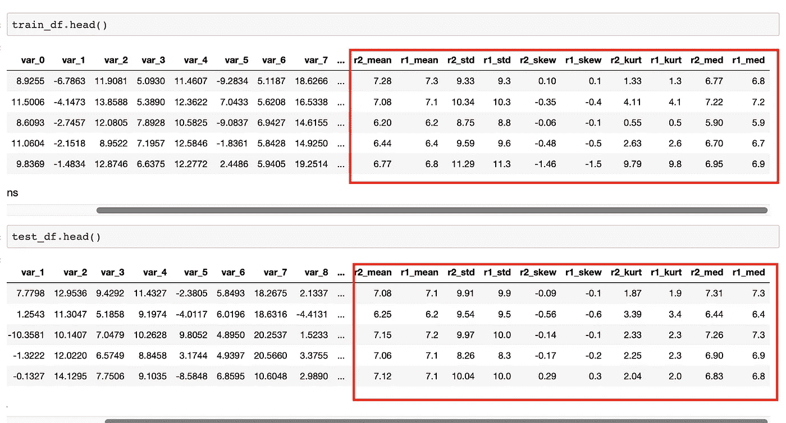

# 桑坦德银行客户交易预测:端到端机器学习项目

> 原文：<https://medium.com/analytics-vidhya/santander-customer-transaction-prediction-an-end-to-end-machine-learning-project-2cb763172f8a?source=collection_archive---------4----------------------->

# 你能确定谁将进行交易吗？

# 目录:

*   问题陈述
*   数据采集
*   评估指标
*   数据描述
*   探索性数据分析
*   特征工程
*   解决方案 1:具有简单特性的轻型 GBM 模型
*   解决方案 2:特性工程&带有附加特性的 LightGBM 模型
*   结论
*   遵循的程序
*   模型性能比较

# 问题陈述:

在这个挑战中，桑坦德银行邀请卡格勒帮助他们识别哪些客户将在未来进行特定交易，而不管交易的金额。为这个竞赛提供的数据与我们可用来解决这个问题的真实数据具有相同的结构。

数据是匿名的，每行包含 200 个数字值，仅用一个数字标识。

我们将探索数据，为模型做准备，训练模型并预测测试集的目标值，然后准备提交。

# 数据采集:

这是卡格尔比赛的照片。从以下来源下载数据集。

**来源:**[https://www . ka ggle . com/c/桑坦德-客户-交易-预测/概述](https://www.kaggle.com/c/santander-customer-transaction-prediction/overview)

# 评估指标:

在预测概率和观察目标之间的 ROC 曲线下的**区域评估提交。**

## 提交文件

对于测试集中的每个 Id，您必须对目标变量进行二进制预测。该文件应包含一个标题，并具有以下格式:

`ID_code,target
test_0,0
test_1,1
test_2,0
etc.`

# 数据描述

为您提供了一个匿名数据集，其中包含数字特征变量、二进制目标列和一个字符串`ID_code`列。

任务是预测测试集中`target`列的值。

## 文件描述

*   train.csv 训练集。
*   test.csv —测试集。测试集包含一些不包括在评分中的行。

# 探索性数据分析

让我们加载训练和测试文件。

训练和测试数据帧都有 200000 个条目。训练有 202 列，测试有 201 列。

列车包含:

*   ID_code(字符串)；
*   目标；
*   200 个数值变量，命名从 var_0 到 var _ 199

测试包含:

*   ID_code(字符串)；
*   200 个数值变量，命名从 var_0 到 var _ 199

# **检查缺失数据:**

让我们检查一下是否有丢失的数据。

我们定义了一个助手函数`missing_data`，并应用于训练和测试数据。

在训练和测试数据集中没有丢失数据。

让我们检查训练集和测试集中的数值。

**观察:**

*   对于训练和测试变量数据，标准偏差相对较大
*   训练和测试数据的最小、最大、平均、sdt 值看起来非常接近
*   平均值分布在很大的范围内

让我们检查一下`target`值在训练数据集中的分布。

**观察:**

我们可以看到数据是不平衡的。多数值将 0 作为目标值。

**平均值和标准差的分布:**

## 偏斜度和峰度的分布:

## **特征相关性:**

特征之间的相关性非常小。

# 重复值:

让我们检查在训练和测试数据集中是否有任何重复的值。

我们可以看到，上面显示了训练集和测试集中的重复值和前 15 个最大重复值。

**观察:**训练和测试中的相同列具有相同或非常接近的重复数。

# 特征工程

让我们创建简单的特征，如总和、最小值、最大值、平均值、标准差、偏斜、库尔特和中位数，如下所示。

让我们检查一下新创建的特征:

让我们检查一下这些新设计的特性的分布情况。

新特征在训练数据集中的分布

测试数据集中新特征的分布

圆形特征:

让我们创建一些圆形特征如下。

让我们看看这些功能是什么样子的。

现在让我们建立机器学习模型。

# 解决方案 1:具有简单功能的轻型 GBM 模型:

> ***什么是轻 GBM？***

Light GBM 是一个梯度推进框架，使用基于树的学习算法。

> ***它与其他基于树的算法有何不同？***

**轻型 GBM 垂直生长树**而其他算法水平生长树，这意味着轻型 GBM 逐叶生长树**而其他算法逐级生长。它会选择 delta 损失最大的叶子来生长。当生长相同的叶子时，逐叶算法可以比逐层算法减少更多的损失。**

**光 GBM 模型的超参数:**

让我们用上面选择的超参数来训练模型。

**特征重要性:**

从该模型中观察到的一些最重要的特征如下。

**测试数据预测:**

现在让我们预测测试数据的结果。

> 结果:排行榜得分:AUC — 0.90014(排名 335，最高 3.8%)

# 解决方案 2:特征工程和 LightGBM 模型

# 特征工程和数据扩充

## 1.分离真实/合成测试数据和魔术特征

使用一行中的唯一值计数来识别合成样品。如果一行在一个特征中至少有一个唯一值，那么它是真实的，否则它是合成的。YaG320 在这个内核中共享了这种技术——伪样本列表和公/私 LB 拆分(参考:[https://www . ka ggle . com/YAG 320/List-of-Fake-Samples-and-Public-Private-LB-split](https://www.kaggle.com/yag320/list-of-fake-samples-and-public-private-lb-split))，并成功识别测试集中的合成样本。通过这种方式，可以捕获测试集特征的分布峰值上的异常凸起。魔术特征是从测试集中的训练集和真实样本的组合中提取的。

## 2.数据扩充

数据扩充意味着增加数据点的数量。过采样数据会显著增加 CV 和排行榜分数，因为数据是不平衡的。这个过采样技术在这个内核中被刘继伟分享(参考:【https://www.kaggle.com/jiweiliu/lgb-2-leaves-augment】[)。](https://www.kaggle.com/jiweiliu/lgb-2-leaves-augment)

现在让我们尝试用 LighGBM 模型来实现这些。

# 模型— LightGBM 梯度推进决策树

模型的超参数:

实施:

**功能重要性:**

**测试数据预测及提交:**

> 结果:排行榜得分:AUC — 0.92358(排名 19，为前 1%)

# 结论:

# 遵循的程序

1.  对训练和测试数据集进行探索性数据分析。
2.  对缺失值和重复数据执行检查。
3.  观察各种密度图、平均值分布图、偏度图、峰度图、训练图和测试图以及目标值 1 和 0。
4.  观察特征之间是否有任何关联
5.  执行特征工程并创建特征
6.  对这些特征应用机器学习模型光梯度增强机器，并观察到 0.90014 的 ROC。
7.  为了进一步提高模型的得分，采用连续唯一值计数来识别合成样本，区分真实样本和合成样本。使用这些数据在训练集和测试集中创建了神奇的特性。
8.  作为数据扩充步骤，由于数据不平衡，执行了数据过采样。
9.  再次应用机器学习模型 lightGBM 和新创建的神奇功能，它帮助 ROC 得分提高到 0.92358。

# 模型性能比较

具有额外功能的轻型 GBM 将模型分数提高到 0.92358，这非常接近 kaggle 的排行榜最高分数。肯定可以做得更多。

感谢阅读！

# 参考资料:

[https://www . ka ggle . com/c/Santander-customer-transaction-prediction/notebooks](https://www.kaggle.com/c/santander-customer-transaction-prediction/notebooks)