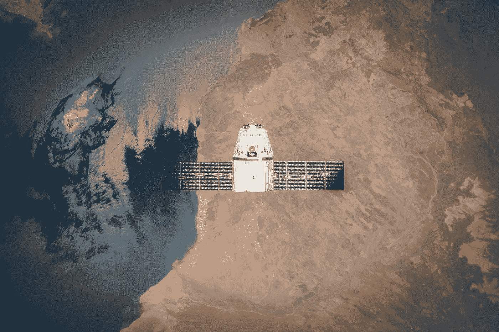
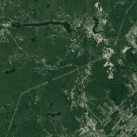
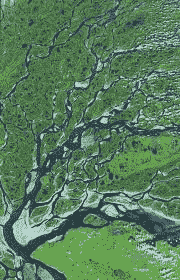
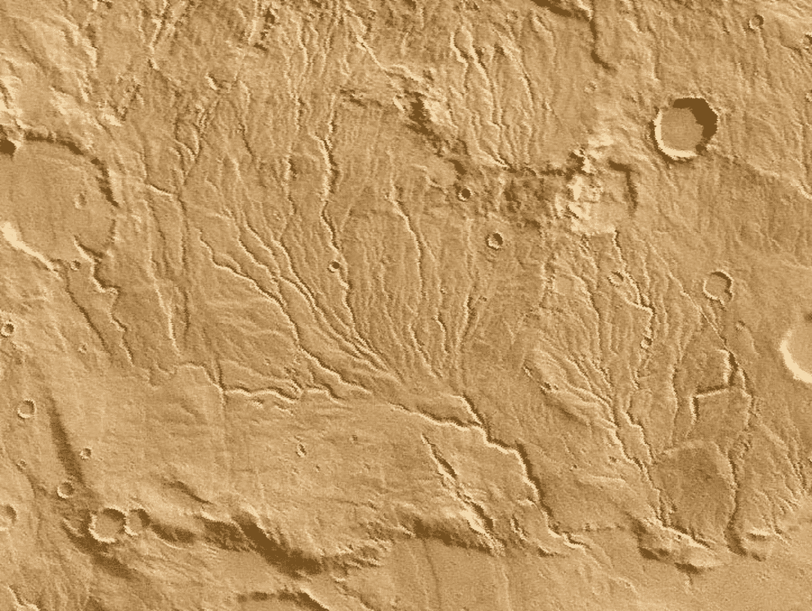
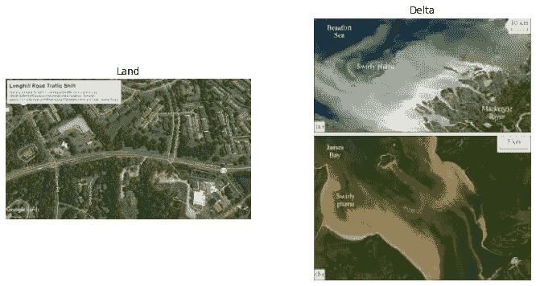
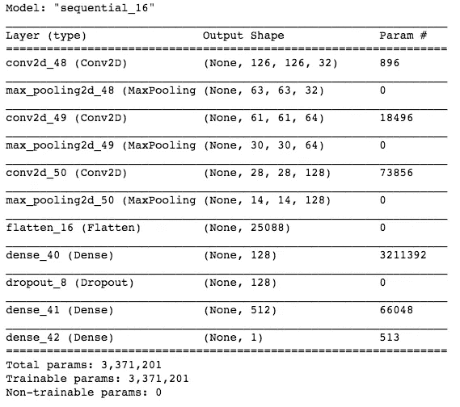
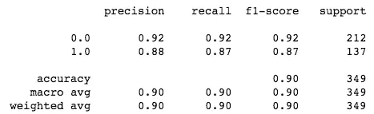
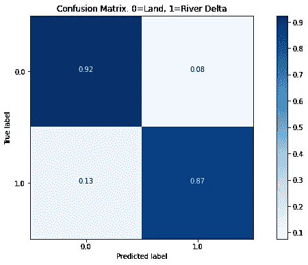
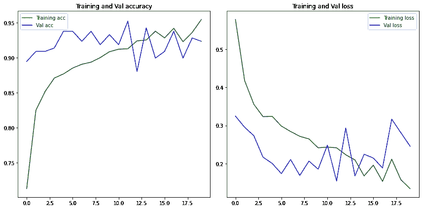

# 用卷积神经网络进行卫星图像分类。

> 原文：<https://medium.com/analytics-vidhya/satellite-image-classification-with-a-convolutional-neural-network-4ed4fbd05008?source=collection_archive---------15----------------------->

[SpaceX](https://www.pexels.com/photo/white-and-black-satellite-586063/)

我在 Flatiron 的最新项目是使用神经网络对卫星图像进行分类。我选择使用卷积神经网络(CNN)并创建一个网络抓取图像数据集来训练模型。这将只是一个项目的快速纲要，并附有我的文章到更多技术部分的链接。这样，它可以帮助你熟悉这些主题，或者帮助与那些对计算机视觉和机器学习有类似兴趣的人分享更多关于我的工作。

我选择使用 CNN，因为我读过一些关于计算机视觉的学校课程，关于 CNN 在图像分类方面的优势。CNN 使用池层来过滤图像像素的补丁，找到共同的模式，这些模式发展成更复杂的模式，以帮助确定图像类别。我选择用卫星图像进行计算机视觉项目，因为在地球上可能有解决方案的用例，在其他星球上也可能有。我读过一些文章，内容是一些组织在火星表面寻找不同的地质模式，寻找可能存在的水，或者水在火星上的存在。这使我试图建立模型来识别地球上的河流三角洲模式，下一步是训练模型并定位火星上的三角洲模式。该模型最终也可以用于观察地球上河流三角洲的变化，可能用于农业、气候变化甚至房地产。目前，在我写这篇博客的时候，这个项目正在进行中，对地球图像进行了训练和测试。火星图像将是我毕业后开始的下一部分。

陆地图像图块。

河流三角洲图像拼贴。

一个火星三角洲图像块。

为了获得数据集的图像，我研究了一些不同的 API 和 webscraping with Beautiful Soup。后来，我决定使用 Selenium 从 Google 上的一个图像搜索中抓取一些图像。这种方法能够交互式地滚动页面，这是访问所有图像所必需的。我在这里写了一篇关于这个过程的文章。这种方法作为一个起点是有用的，以便经历建立数据集、创建模型、训练、测试和让一切工作的过程。缺点是有很多图像不干净，包含文本或其他图像伪影，总体上导致结果不准确。下面有一些例子图片，所以你可以明白我的意思。我不主张任何使用图像的版权，因为它们用于学校的教育项目，如果有人反对在我的文章中显示它们，我会删除它们。

请注意图像上不同的文本和标签，它们对培训没有帮助。

对于项目的下一部分，我计划清理当前的数据集，并从像 [NASA API 的](https://api.nasa.gov/)或[地球引擎](https://earthengine.google.com/)这样的来源获得的更可靠的图像中建立另一个数据集。如果任何读者有一些其他类似的建议，他们发现作为卫星图像资源是有用的，我很乐意检查一下，并随时在评论中留下注释。

以一个粗略的数据集为起点，我开始克服下一个挑战，那就是我过时的 09 年 Macbook Pro。它只能更新到 El Capitan，而不能运行 Keras(用于神经网络和我的 CNN 的软件包)必要的最新版本。所以我把这个项目转移到了一个基于云的 Google Colab 笔记本上，并在那里继续运行剩下的模型训练。我有一篇单独的文章[在这里](/analytics-vidhya/a-quick-workflow-for-google-colab-github-and-jupyter-notebooks-on-mac-ff5d004e01f)帮助详细描述我用来将我的 Colab 笔记本连接到 Github 并保持它们与我的本地 Jupyter 笔记本同步的过程。随着一切正确同步，我继续运行不同的模型，并比较它们的结果。

当前数据集较小，在训练集和测试集之间总共有 1，600 多幅图像。我使用图像生成器来执行图像增强，并将数据集扩展到 2200 多张图像。使用的一个较好的模型是 CNN，它有一个 SGD 优化器，使用了 dropout 层。如果你想知道更多关于 CNN 模型建立过程的细节，我有一篇单独的文章[在这里](/swlh/a-simple-convolutional-neural-network-summary-for-binary-image-classification-with-keras-d58caf2f84a4)。下面是模型中包含的图层的图像。

这个分类报告、混淆矩阵和随后的图表将向您展示该模型的准确性、召回率、精确度和丢失率的一些统计数据。

模型分类报告。0 类=陆地，1 类=三角洲。

分类的混淆矩阵。

训练和验证数据的准确度和损失图。

总的来说，我很高兴模型框架已经建立，并且能够运行和处理图像，但是工作还没有完成，因为我计划获得更多的图像，并进入这个项目的第二阶段，对火星图像进行分类。我一定会创建另一篇文章，详细介绍该项目的这一部分完成后。如果你对这类话题感兴趣，你可以在我的 [Github 这里](https://github.com/alexanderbeat/riverdelta-satellite-image-classification)找到这个项目的当前代码，会有更多更新。感谢您的阅读，如果您有类似的想法并愿意分享您的发现，请告诉我。在 Medium 上关注我[或者你可以在](/@alexanderjohnnybeat) [Twitter](https://twitter.com/alexanderjbeat) 、 [LinkedIn](https://www.linkedin.com/in/alexanderjohnnybeat/) 或者我的 [Github 页面](https://github.com/alexanderbeat)上联系我。