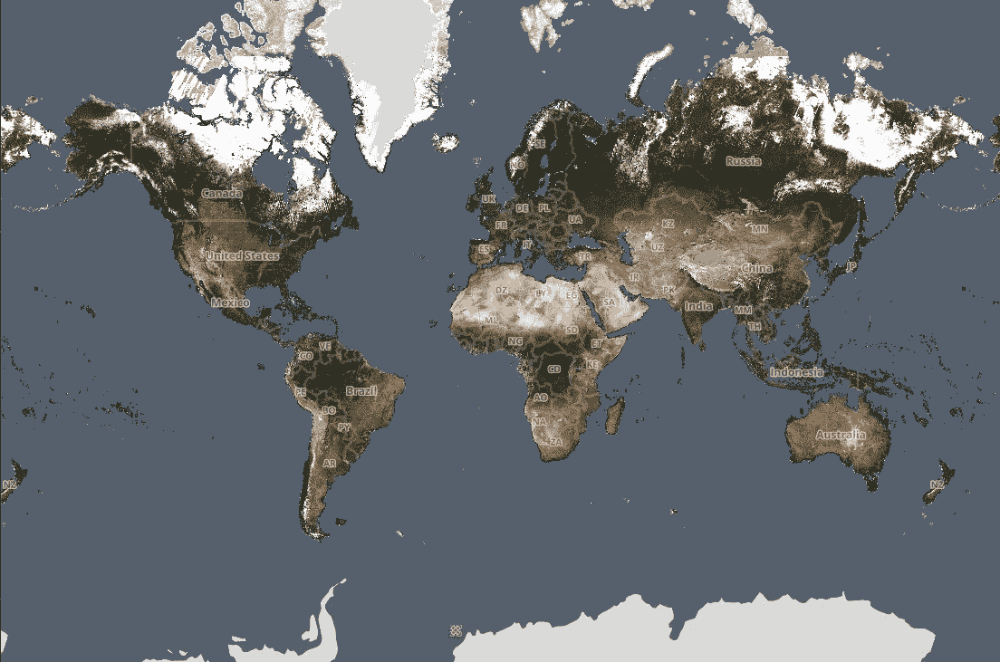

# 使用 Python 进行卫星影像分析

> 原文：<https://medium.com/analytics-vidhya/satellite-imagery-analysis-with-python-3f8ccf8a7c32?source=collection_archive---------0----------------------->

[来源](https://www.planet.com/explorer/#/area-coverage/0.53,1/cloud_cover/0,0.25/types/PSScene4Band/mosaic/global_monthly_2018_10_mosaic/center/13.440,2.162/zoom/2)

> 数据是当今的新石油，但如果数据真的被用来监控世界各地的石油会怎么样呢？

> **更新 2021** :这篇文章发表于很久以前。库的一些细节和特性可能已经改变。建议查看文档以了解相关细节