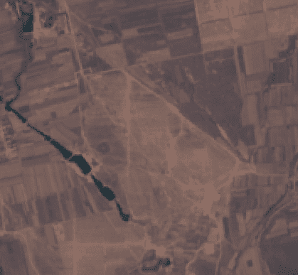
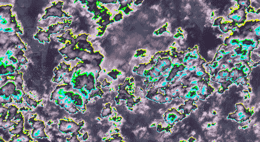
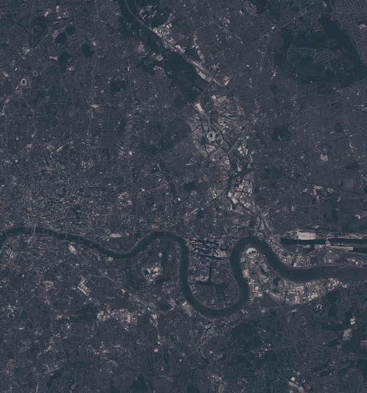

# 卫星图像时间流逝

> 原文：<https://medium.com/analytics-vidhya/satellite-imagery-timelapses-4e9f5ec412b7?source=collection_archive---------19----------------------->

和..熊猫！



新的一年已经开始，我们都已经在做事的热潮。所以我想这个周末我会有一个有趣的帖子！

当然，这将是关于熊猫、太阳能农场和时间流逝！

我是如何做到这一点的，只是通过关注可再生能源领域发生的事情，我引用[文章](https://www.businessinsider.com/china-panda-shaped-solar-energy-farms-project-2018-6)中的话:

> *2017 年，这两个团体在中国的 Daton 建造了一座 248 英亩的太阳能发电厂，从上面看，它像两只微笑的熊猫。现在，联合国、熊猫绿色能源和中国政府正在中国各地建造 99 个类似的太阳能农场。*

期待未来的太阳能农场，同时，让我们开始乐趣:

# 设置

*   安装哨兵枢纽
*   安装 eo 学习

(请在下面的参考资料中找到上述内容的链接)

## 数据析取

在我之前的:[用 Python I](https://danielmoraite.github.io/docs/satellite1.html) 进行卫星影像分析的文章中，你可以找到如何获取感兴趣区域`AOI`坐标的详细信息。请确保您从菜单中分别选择了`meta`、`add bboxes`。

定义 ROI BBOX 和时间间隔向 eopatch 请求不同类型的层和数据源

```
roi_bbox = BBox(bbox=[113.4705, 39.9697, 113.4951, 39.9871], crs=CRS.WGS84)
 time_interval = ('2017-02-01', '2017-08-01')
```

工作流程的任务:—下载 S2 图像(所有 13 个波段)—过滤掉云覆盖率大于给定阈值(例如 0.8，0.05)的图像

```
layer='BANDS-S2-L1C'
  ​
wcs_task = S2L1CWCSInput(layer=layer, 
                           resx='5m',
                           resy='5m',
                           maxcc=.05, time_difference=datetime.timedelta(hours=1))
  ​
save = SaveToDisk('timelapse_example', overwrite_permission=2, compress_level=1)
```

构建和执行延时作为一个变换链

如果您选择的区域和时间范围没有足够的 0.8 cc，请随意将最大云覆盖率设置为 0.8 到 0.05。否则，它将看起来像下面这样(有点神游):



```
timelapse =LinearWorkflow(wcs_task, save)
  ​
result = timelapse.execute({
   wcs_task: {'bbox': roi_bbox, 'time_interval': time_interval},
                          save: {'eopatch_folder': 'eopatch'}})
```

将结果作为 eopatch 获取

```
eopatch = result[save]
eopatch
```

```
EOPatch(
    data: {
      BANDS-S2-L1C: numpy.ndarray(shape=(4, 387, 419, 13), dtype=float32)
    }
    mask: {
      IS_DATA: numpy.ndarray(shape=(4, 387, 419, 1), dtype=bool)
    }
    scalar: {}
    label: {}
    vector: {}
    data_timeless: {}
    mask_timeless: {}
    scalar_timeless: {}
    label_timeless: {}
    vector_timeless: {}
    meta_info: {
      maxcc: 0.05
      service_type: 'wcs'
      size_x: '5m'
      size_y: '5m'
      time_difference: datetime.timedelta(0, 3600)
      time_interval: ('2017-02-01', '2017-08-01')
    }
    bbox: BBox(((113.4705, 39.9697), (113.4951, 39.9871)), crs=EPSG:4326)
    timestamp: [datetime.datetime(2017, 4, 1, 3, 18, 46), ..., datetime.datetime(2017, 7, 30, 3, 21, 38)], length=4
  )
```

创建 gif 的函数

```
import imageio, os
  ​
def make_gif(eopatch, project_dir, filename, fps):
"""
Generates a GIF animation from an EOPatch.
"""
with imageio.get_writer(os.path.join(project_dir, filename), mode='I', fps=fps) as writer:
           for image in eopatch:
               writer.append_data(np.array(image[..., [3, 2, 1]], dtype=np.uint8))
```

将 EOPatch 写入 GIF

```
make_gif(eopatch=eopatch.data['BANDS-S2-L1C']*2.5*255, project_dir='.', filename='eopatch_timelapse1.gif', fps=1)from IPython.display import Image
​
Image(filename="eopatch_timelapse.gif")
```



如上图 gif 所示，春天的伦敦。

请在此找到完整的代码[。](https://github.com/DanielMoraite/DanielMoraite.github.io/blob/master/assets/panda.ipynb)

请随意选择您自己的坐标。你可能也想玩玩时间框架。

## 资源:

*   [EO-learn 的文档](https://eo-learn.readthedocs.io/en/latest/index.html)
*   [eo-learn github](https://github.com/sentinel-hub/eo-learn)
*   我建议将 eo-learn github 存储库复制到您的驱动器上
*   [sentinelhub 创建账户](https://services.sentinel-hub.com/oauth/subscription?param_redirect_uri=https://apps.sentinel-hub.com/dashboard/oauthCallback.html&param_state=%2Fconfigurations&param_scope=SH&param_client_id=30cf1d69-af7e-4f3a-997d-0643d660a478&origin=)
*   [sentinelhub 实例 ID](https://www.sentinel-hub.com/faq/where-get-instance-id)
*   [sentinelhub 安装](https://pypi.org/project/sentinelhub/)

注意事项:

```
# SentinelHub API Key (instance id) stored as an env variable(if you want to call it from your notebook):        
    import os
    os.environ['INSTANCE_ID']='your instance ID'
    INSTANCE_ID = os.environ.get('INSTANCE_ID')
```

随意去 PAAAANDAAAS！