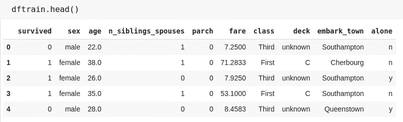
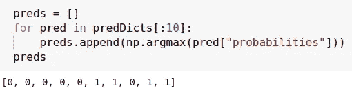
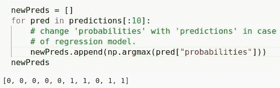

# 保存并加载用于预测的 TensorFlow 估计器模型。

> 原文：<https://medium.com/analytics-vidhya/save-and-load-a-tensorflow-estimator-model-for-predictions-233b798620a9?source=collection_archive---------3----------------------->

本文将详细描述保存 TensorFlow (V2)估算器模型，然后重新加载该模型进行预测的过程。


弗兰基·查马基在 [Unsplash](https://unsplash.com/s/photos/machine-learning?utm_source=unsplash&utm_medium=referral&utm_content=creditCopyText) 上拍摄的照片

ython 有一个非常强大和慷慨的社区，当谈到用 Python 进行机器学习时，它变得更加强大。每当你想学习新东西的时候，只要点击谷歌，你就会得到大量的资源。同样，当你写一些代码或者使用一些新的库时，你被困在某个地方，无法找到解决方案。

> 无论你有什么问题，在 StackOverflow 上都会有答案。

虽然几乎每次都是这种情况，但是有些时候问题是如此的新，以至于你无法得到预先解决的答案。因此，对于这些罕见的情况，您将不得不亲自动手。

上周，当我试图*保存一个 TensorFlow 估计器模型，然后使用重新加载的模型*进行预测时，出现了这样一个案例。官方[文档](https://www.tensorflow.org/guide/saved_model#savedmodels_from_estimators)对此非常简短，没有任何关于正在发生的事情的线索。他们在一个非常基本的数据集上给出了一个小的解决方案，但如果没有对代码中发生的事情进行解释，这对于复杂的场景来说是没有用的。

所以我点击了谷歌，令我惊讶的是，这个问题没有解决方案。很多和我类似的问题但是没有合适的答案。虽然有答案，但都是 Tensorflow 版本 1。在[答案](https://stackoverflow.com/questions/46098863/how-to-import-an-saved-tensorflow-model-train-using-tf-estimator-and-predict-on)中，他们使用了一个模块 *Conrib* 来做预测，但是这个模块完全从 TF V2 中移除了。

虽然我可以使用 Keras 或 Sklearn 来完成我的任务，但是要求是特别针对 V2 的。所以我必须找到解决办法。

我也是。因为我是强大的 Python 社区的一员，所以我有责任与每个人分享这个方法，以便其他人可以使用它。

所以让我们开始吧。


艾玛·弗朗西丝·洛根在 [Unsplash](https://unsplash.com/s/photos/start?utm_source=unsplash&utm_medium=referral&utm_content=creditCopyText) 拍摄的照片

由于本文的唯一目的是理解如何使用加载的 TF 估计模型进行预测，所以我将跳过对其他部分不必要的解释。

# 概观

这个端到端的演练使用`tf.estimator` API 训练一个逻辑回归模型，然后保存该模型，然后用不同的名称重新加载它以进行预测。

首先:**导入库**

```
import os
import shutil
import numpy as np
import pandas as pd
import tensorflow as tf
```

**加载数据集**

我们将使用泰坦尼克号数据集，目标是(相当病态地)预测乘客的存活率，给出诸如性别、年龄、阶级等特征。

```
dftrain = pd.read_csv('https://storage.googleapis.com/tf-datasets/titanic/train.csv')dfeval = pd.read_csv('https://storage.googleapis.com/tf-datasets/titanic/eval.csv')
```

这是我们的数据集的样子。幸存的列**是我们的目标列，其余的是特性列。**



dftrain 的前五行

```
╔════════════════════╦════════════════════════════════════╗
║     Column Name    ║            Description             ║
╠════════════════════╬════════════════════════════════════╣
║ survived           ║ Passenger survived or not          ║
║ sex                ║ Gender of passenger                ║
║ age                ║ Age of passenger                   ║
║ n_siblings_spouses ║ siblings and partners aboard       ║
║ parch              ║ of parents and children aboard     ║
║ fare               ║ Fare passenger paid.               ║
║ class              ║ Passenger's class on ship          ║
║ deck               ║ Which deck passenger was on        ║
║ embark_town        ║ Which town passenger embarked from ║
║ alone              ║ If passenger was alone             ║
╚════════════════════╩════════════════════════════════════
```

**模型的特征工程**

估计器使用一个称为特征列的系统来描述模型应该如何解释每个原始输入特征。估计器需要一个数字输入向量，而要素列描述了模型应该如何转换每个要素。

```
LABEL = "survived"
NUMERIC_COLUMNS = ['age', 'fare']
CATEGORICAL_COLUMNS = ['sex', 'n_siblings_spouses', 'parch', 'class', 'deck', 'embark_town', 'alone']feature_columns = []for feature_name in CATEGORICAL_COLUMNS:
  vocabulary = dftrain[feature_name].unique()
  feature_columns.append(
     tf.feature_column.categorical_column_with_vocabulary_list(
       feature_name, vocabulary))for feature_name in NUMERIC_COLUMNS:
  feature_columns.append(
    tf.feature_column.numeric_column(
      feature_name, dtype=tf.float32))
```

以下两个函数分别负责将数据提供给模型进行训练和评估。

```
def make_train_input_fn(df, num_epochs):
  return tf.compat.v1.estimator.inputs.pandas_input_fn(
    x = df,
    y = df[LABEL],
    batch_size = 128, 
    num_epochs = num_epochs,
    shuffle = True,
    queue_capacity = 1000
  )def make_prediction_input_fn(df):
  return tf.compat.v1.estimator.inputs.pandas_input_fn(
    x = df,
    y = None,
    batch_size = 128,
    shuffle = False,
    queue_capacity = 1000
  )
```

**训练模型**

```
# Instantiate the pre-made estimator
model = tf.estimator.LinearClassifier(feature_columns)# Train the model
model.train(make_train_input_fn(dftrain, num_epochs=10))
```

**对评估数据集进行预测**

```
predDicts = list(model.predict(make_prediction_input_fn(dfeval)))
```

让我们看看前 10 个预测

```
preds = []
for pred in predDicts[:10]:
  preds.append(np.argmax(pred["probabilities"]))
```



**保存模型**

Tensorflow 估计器模型不像 Sklearn 模型那样保存在 pickle 文件中。以下是存储 TF 估计模型的方法。

```
inputFn = \ tf.estimator.export.build_parsing_serving_input_receiver_fn(
  tf.feature_column.make_parse_example_spec(feature_columns))OUTDIR = 'modelDir'
shutil.rmtree(OUTDIR, ignore_errors = True) # start fresh each timemodelBasePath = os.path.join(OUTDIR, "model")modelPath = model.export_saved_model(modelBasePath, inputFn)
```

**重新加载模型**

我们将使用不同的模型名称，以确保我们没有使用现有的模型。

```
savedModelPath = modelPath
importedModel = tf.saved_model.load(savedModelPath)
```

**预测采用进口模型**

要使用加载估计模型对未知数据集进行预测，我们必须遵循以下小步骤:

1.  对数据集的所有行重复步骤 2–4。
2.  创建 tf.train.Example()对象。该对象将负责将我们的数据传递给模型进行预测。
3.  遍历所有列，并根据该列的数据类型，使用 *bytes_list* 、 *float_list* 、 *int64_list* 中的适当类型，将该列值添加到*示例*对象。关于这些类型[的更多信息，请点击](https://www.tensorflow.org/tutorials/load_data/tfrecord)。
4.  使用此示例对象和导入的模型进行预测。请注意，这个示例对象的作用与将单个行传递给 sklearn 模型进行预测的作用相同。

下面是同样的 Python 实现。

```
def predict(dfeval, importedModel):
  colNames = dfeval.columns
  dtypes = dfeval.dtypes
  predictions = []
  for row in dfeval.iterrows():
    example = tf.train.Example()
    for i in range(len(colNames)):
      dtype = dtypes[i]
      colName = colNames[i]
      value = row[1][colName]
      if dtype == "object":
        value = bytes(value, "utf-8")
        example.features.feature[colName].bytes_list.value.extend(
            [value])
      elif dtype == "float":
        example.features.feature[colName].float_list.value.extend(
            [value])
      elif dtype == "int":
        example.features.feature[colName].int64_list.value.extend(
            [value])

    predictions.append(
      importedModel.signatures["predict"](
        examples=tf.constant([example.SerializeToString()])))return predictions
```

我们将不得不从 **dfeval** 中删除标签列，因为我们将传递数据集本身，而不是一个为我们做这件事的函数。

```
dfeval.drop(columns=["survived"], inplace=True)
```

我们将使用加载的模型和数据集调用**预测**函数来获得预测。

```
predictions = predict(dfeval, importedModel)
```

我们来看看前 10 个预测。

```
newPreds = []
  for pred in predictions[:10]:
    # change 'probabilities' with 'predictions' in case
    # of regression model.
    newPreds.append(np.argmax(pred["probabilities"]))
```



如你所见，两种型号的**输出是相同的**。

*这就是我们如何保存张量流估算模型，然后使用重新加载的模型进行预测*

你可以在 Github 上的这个[笔记本](https://github.com/AjeetSingh02/Notebooks/blob/master/TFestimatorClassificationSaveLoad.ipynb)里找到全部代码。欢迎在评论中提出你在代码中发现的任何错误，或者你有任何疑问或建议。

如果你喜欢这篇文章，那么你可以想按多少次拍手按钮就按多少次。还有，你可以在[**LinkedIn**](https://www.linkedin.com/in/singhajeet23/)**上联系我，或者在**[**GitHub**](https://github.com/AjeetSingh02)**上关注我。**

> 仅此而已。感谢阅读。快乐学习。


安妮·斯普拉特在 [Unsplash](https://unsplash.com/?utm_source=unsplash&utm_medium=referral&utm_content=creditCopyText) 上拍摄的照片