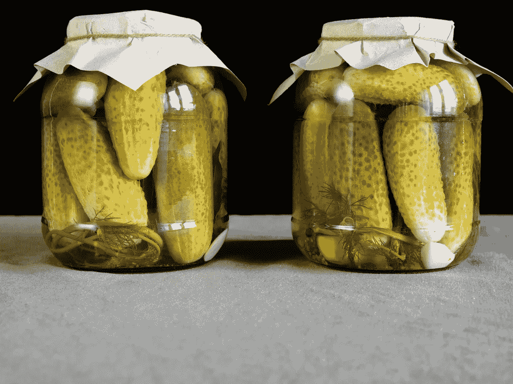
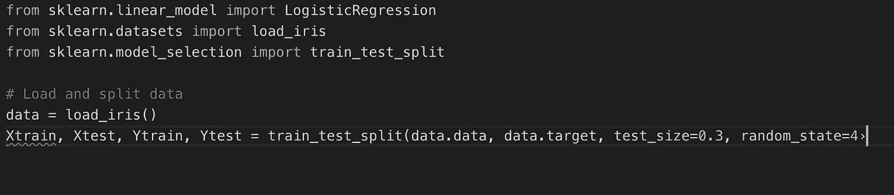
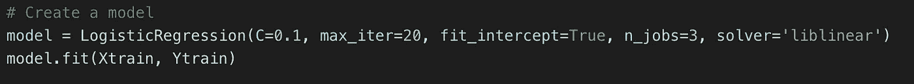
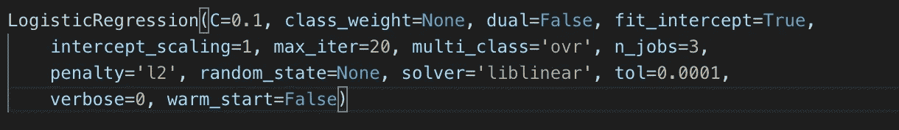
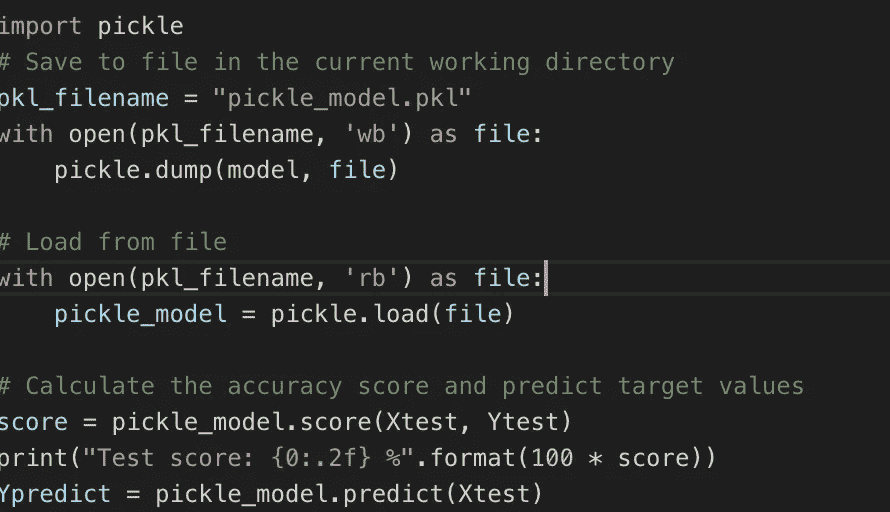
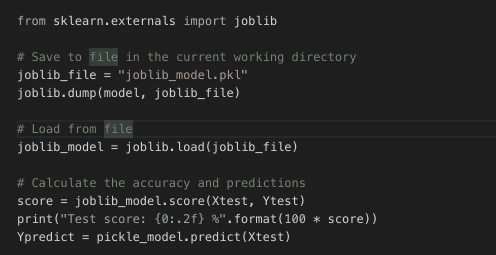
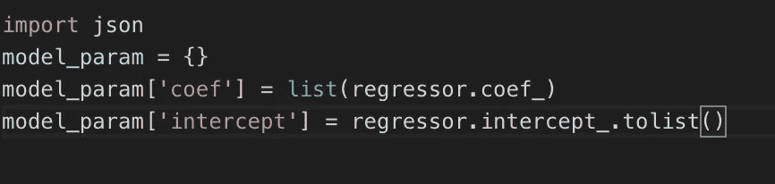
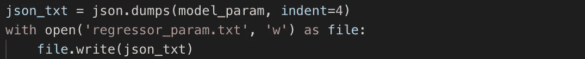
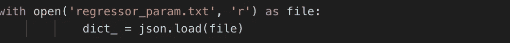

# 如何在一分钟内保存和加载您的 Scikit-learn 模型

> 原文：<https://medium.com/analytics-vidhya/save-and-load-your-scikit-learn-models-in-a-minute-21c91a961e9b?source=collection_archive---------2----------------------->

## 权威指南

保存泡菜

你有没有建立过机器学习模型，想知道如何拯救它们？接下来，我将向您展示如何将 Scikit 学习模型保存为一个文件。

数据的保存被称为 ***序列化，*** 我们将一个对象存储为字节流保存在磁盘上。加载或恢复模型被称为 ***反序列化，*** 其中我们将字节流从磁盘恢复回 Python 对象。

***你应该保存你的模型的理由？***

1.  以防你需要重建训练好的模型。
2.  与他人分享模型。我们可以将模型保存到一个文件中，并与其他人共享该文件，可以加载该文件来进行预测。
3.  当您需要将模型用于生产目的时。为了避免长时间的训练，我们在一个巨大的数据集上训练了该模型，并拥有一个性能良好的预测模型。

***sci kit 中保存和恢复模型的工具-学习***

我们描述的第一个工具是 [Pickle](https://docs.python.org/3/library/pickle.html) ，这是用于对象序列化和反序列化的标准 Python 工具。然后，我们看一下 [Joblib](https://pythonhosted.org/joblib/) 库，它提供了包含大型数据数组的对象的简单序列化(反序列化),最后，我们展示了一种手动方法，用于将对象保存到 [JSON](https://en.wikipedia.org/wiki/JSON) (JavaScript 对象符号)和从 JSON【】恢复对象。这些方法都不是最佳解决方案，但是应该根据项目的需要选择合适的方法。

***模型初始化***

首先，让我们创建一个 scikit-learn 模型。在我们的例子中，我们将使用一个[逻辑回归](https://en.wikipedia.org/wiki/Logistic_regression)模型和[虹膜数据集](https://en.wikipedia.org/wiki/Iris_flower_data_set)。让我们导入所需的库，加载数据，并将其分成训练集和测试集。

现在，让我们使用一些非默认参数创建模型，并使其符合训练数据。我们假设您之前已经找到了模型的最佳参数，即产生最高估计精度的参数。

使用`fit`方法，模型已经学习了存储在`model.coef_`中的系数。目标是将模型的参数和系数保存到文件中，这样就不需要对新数据重复模型训练和参数优化步骤。

我们的模型现在已经训练好了。我们可以保存该模型，并在以后加载该模型，以便对看不见的数据进行预测。

***用泡菜拯救你的模特***

Pickle 用于序列化和反序列化 Python 对象结构，也称为编组或展平。序列化是指将内存中的对象转换为可以存储在磁盘上或通过网络发送的字节流的过程。稍后，可以检索这个字符流，并将其反序列化回 Python 对象。当您使用机器学习算法时，Pickle 非常有用，您需要保存它们以便能够在以后生成预测，而不必重写所有内容。

***用 Joblib*** 保存你的模型

[Joblib](https://pypi.python.org/pypi/joblib) 是 SciPy 生态系统的一部分，为管道化 Python 作业提供了实用程序。它提供了[实用程序，用于有效地保存和加载利用 NumPy 数据结构的 Python 对象](https://pythonhosted.org/joblib/generated/joblib.dump.html)。这对于一些需要大量参数或存储整个数据集(如 K-最近邻)的机器学习算法非常有用。尽管 Pickle 要求将文件对象作为参数传递，但 Joblib 既可以处理文件对象，也可以处理字符串文件名。如果您的模型包含大型数据数组，每个数组将存储在一个单独的文件中，但保存和恢复过程将保持不变。

***使用 JSON 格式保存你的模型***

根据您的项目，很多时候您会发现 Pickle 和 Joblib 是不合适的解决方案。其中一些原因将在后面的考虑因素一节中讨论。我们将首先导入 JSON 库，创建一个包含系数和截距的字典。系数和截距是一个数组对象。我们不能将数组转储为 JSON 字符串，所以我们将数组转换为一个列表，并将其存储在字典中

我们使用 JSON 转储将 Python 字典转换成 JSON 字符串。我们需要缩进输出，所以我们提供缩进参数，并将其设置为 4。将 JSON 字符串保存到文件中。

我们将文件内容加载到一个 JSON 字符串中。以“读取”模式打开文件，然后将 JSON 数据加载到 python 对象中，在我们的例子中，python 对象是一个字典

因为使用 JSON 的数据序列化实际上将对象保存为字符串格式，而不是字节流，所以可以用文本编辑器打开和修改“regressor_param.txt”文件。虽然这种方法对开发人员来说很方便，但是它不太安全，因为入侵者可以查看和修改 JSON 文件的内容。

***考虑章节***

1.  Pickle 和 Joblib 工具的最大缺点是它们对不同模型和 Python 版本的兼容性。
2.  在保存和恢复模型之间，模型的内部结构应该保持不变
3.  从已知来源接收时恢复模型，以避免任何恶意代码。Pickle 和 Joblib 都可能包含恶意代码，因此不建议从不受信任或未经验证的来源恢复数据。

***结论***

恭喜你！现在，您已经准备好使用 Python 对文件进行酸洗和反酸洗了。您将能够保存您的机器学习模型，并在以后继续使用它们。Pickle 和 Joblib 库使用起来既快速又简单，但是在不同的 Python 版本和学习模型的变化之间存在兼容性问题。

数据科学新手？需要指导吗？

你可以从这里伸出手

*   推特:@ akinwhande
*   Linkedin: [阿金万德](https://www.linkedin.com/in/akinwande-komolafe-49166b147/)

喜欢这篇文章吗？然后在 medium 上关注我，获取更多有见地的文章。

我参与了一个开源项目，帮助数据科学家解决基本数据争论和预处理步骤的问题。Slik 背后的想法是启动监督学习项目。文档链接可在[这里](https://sensei-akin.github.io/slik_python_package/html/index.html)找到