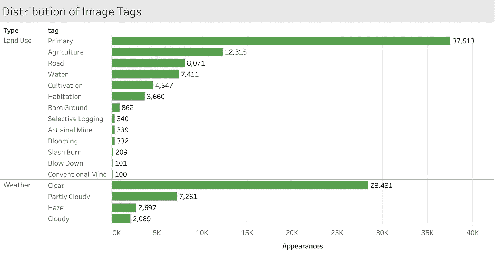

# 从太空拯救雨林

> 原文：<https://medium.com/analytics-vidhya/saving-the-rainforest-from-space-aa8b2192847e?source=collection_archive---------20----------------------->

## 利用卫星图像和神经网络确定毁林的主要指标

弗拉德·希利塔努在 [Unsplash](https://unsplash.com?utm_source=medium&utm_medium=referral) 上拍摄的照片

> 在 [Github](https://github.com/drewhibbard/satellite-deforestation) 上查看完整代码

我想我们都知道森林砍伐的影响，不仅是对雨林中难以置信的生物多样性的影响，也是对人类的影响。你可以在 WWF 的或者维基百科的上读到更多关于这个问题的内容。这篇文章将关注机器学习在这个问题上可能产生和正在产生的影响。首先，我将使用高级图像来绘制一段时间内森林流失的地图，然后展示我如何训练一个卷积神经网络来识别森林砍伐的主要指标。这样我们可以提醒当局采取行动的准确位置。

## 绘制森林损失和收益图

[谷歌地球引擎](https://earthengine.google.com/)拥有一些工具，可以很容易地绘制出地球随时间的变化，比如本例中的森林。使用 UMD·汉森的影像，我能够构建以下 3 层地图，显示 2000 年至 2015 年间的森林损失和收益。第一层是绿色的森林，接下来的红点表示森林减少，蓝点表示 15 年间森林增加。注意亚马逊河上过多的红点和缺少的蓝点。

绿色:2000 年的森林。红色:到 2015 年森林消失。蓝色:到 2015 年森林增加

## 卡格尔挑战

该项目的最佳卫星图像来源是由一家名为 [Planet、](https://www.planet.com/)Planet:从太空了解亚马逊的公司发起的 Kaggle 挑战赛。所以我决定在挑战结束 3 年后“参加”。

虽然大多数卫星图像的像素在 10 到 100 米之间，但 Planet 的技术可以达到 3 米，这让我们可以详细了解该地区。他们提供了超过 40，000 张亚马逊雨林的图片，参与者将这些图片分为 17 个非专属类别。下面是这些标签的分布。每张图片都有一个“天气”标签，至少一个“土地使用”标签。

注意像“刀耕火种”和“常规地雷”这样的职业的稀有性。这些对模型来说很难识别。下面是一些来自官方挑战页面的标签示例。我关注的是作为森林砍伐主要指标的非稀有标记，比如道路、农业、居住和耕作。

当你看到一条道路蜿蜒穿过原始森林时，很多时候，随之而来的是周围地区的森林砍伐。农业、居住和耕作是有用的预测指标，只要留意这些区域和森林之间的边界，目标是保持边界不变。

## 构建卷积神经网络

对于图像分类任务，我自然转向卷积神经网络。经过一些实验后，我意识到要得到一个真正精确的模型，我需要自己训练一个完整的模型。所以我就这么做了。

我采用了 Keras 中可用的 VGG16 模型，并允许它重新训练每一层，而不仅仅是顶层。虽然预训练版本针对一般的 1000 类输出进行了优化，但这允许我针对更具体的 17 类输出进行优化，以匹配 17 个标签。

该问题还需要输出层上的 sigmoid 激活函数，以及作为损失函数的二进制交叉熵。虽然通常对于多类问题，我们会使用 Softmax 激活和分类交叉熵，但由于类的非排他性，将该问题视为 17 个独立的二进制分类更有意义。

该模型在官方挑战指标上表现非常好，这是所有 17 个类别的平均 F-Beta 分数，beta = 2。它的得分超过了 92%，与挑战赛冠军的差距在 1%以内。当β= 2 时，我们专注于以假阳性为代价最小化假阴性。这是有道理的，因为过度预测积极的阶层没有太大的负面影响。人类当然会在派出团队调查该地区之前查看任何照片。

同样，我特别关注那些揭示森林砍伐的类，比如道路、农业、居住和耕作。这里进行得很好，你可以看到下面的混淆矩阵。

## 测试新图像

当然，真正的测试是在新的图像上进行测试。不幸的是，我没有足够的资源将这个模型应用到大范围，但是技术肯定可以做到这一点。我简单地使用了 Planet 的 explorer 应用程序，放大了我们之前看到红点的几个区域，比如巴西的 Rondonia 州，并拍摄了几张截图。

我确保拍摄的像素尺寸和分辨率与训练集完全相同，训练集为 256x256 像素，每像素 3m。它继续在最重要的类别上表现良好，如道路和农业，并能够区分道路和河流。

像这样的机器学习应用可以带来更多的成功故事，比如哥斯达黎加，该国在过去 20 年里通过向土地所有者支付保护森林的费用，重新获得了大片雨林。当我们在 2040 年重新运行地图图层时，希望蓝色会比红色多！