# 向达克斯问好！

> 原文：<https://medium.com/analytics-vidhya/say-hello-to-dax-ac53c87f7126?source=collection_archive---------30----------------------->


在[上一篇文章](https://www.vivran.in/post/data-modeling-with-power-pivot-getting-started-p1)中，我们学习了连接、转换和建立数据表之间的关系。我们还知道如何通过组合不同的事实(数字)和维度(类别)来创建一个简单的透视报表。

本文介绍了作为计算列和度量的 DAX 函数。

# DAX 是什么？

DAX，代表**D**ATA**A**Analysis e**X**presses，是微软 Analysis Services、Power BI、Excel Power Pivot 的编程语言。它创建于 2010 年，第一次发布了 Excel 2010 的 Power Pivot。

DAX 是一种函数式语言。DAX 中的每个表达式都是一个函数调用。类似 Excel 函数的东西。与其他编程语言相比，Excel 和 DAX 中不存在语句、循环和跳转的概念。

Excel 用户可能会发现有些 DAX 表达式很熟悉。Excel 函数和 DAX 之间的主要区别在于 Excel 对单元格执行计算。在 Excel 中，我们可以用坐标来引用单元格。例如，我们可以写出公式:

```
=A1 + (B1 * 2)
```

DAX 作用于表和列，而不是单元格；因此，DAX 表达式指的是表和列。这有点像 Excel 表格中公式的工作方式。

在 Excel 表格中，我们引用使用 *[@ColumnName]* 格式的列，其中 *ColumnName* 是要使用的列的名称，@符号表示*“考虑当前行中的值”。*

在下面的示例中，我们将两列的当前行相乘，以获得销售额。

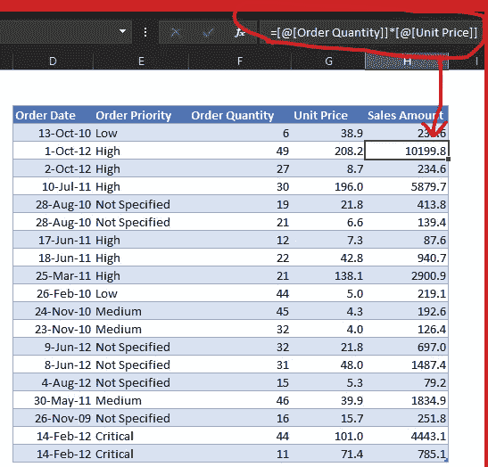

如果我们在 DAX 中写同样的表达式，我们这样写:

```
Sales[Sales Amount] := Sales[Order Quantity] * Sales[Unit Price]
```

在上面的表达式中，每一列都以表名为前缀。当我们在数据建模中处理多个表时，在 DAX 中使用列时包含表名是至关重要的。我们必须指定表名，因为不同表中的两个列名可能是相同的。

# 引入计算列和度量

我们使用 DAX 创建两种输出:计算列和度量。

计算列就像表中的常规列一样。前面的示例是一个计算列。要在表中添加计算列(Power Pivot):

设计>添加>在公式栏中编写完整的表达式

```
Sales Amount := Orders[Unit Price] * Orders[Order Quantity]
```

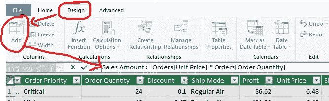

> *注意:在 Power Pivot 中编写 DAX 表达式时，不要忘记在“=”前添加“:”。*

上面的表达式在表中添加了一列，计算如下:

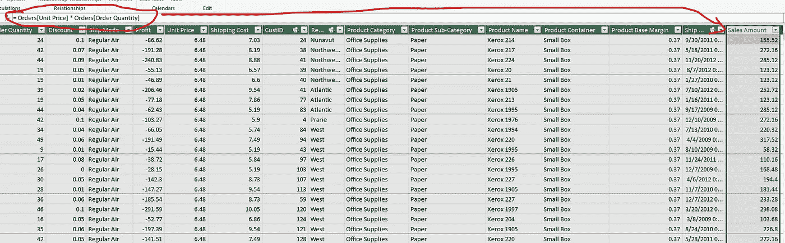

虽然在表中添加计算列很方便，但它使用了宝贵的 RAM。

# 何时使用计算列？

专家建议在下列情况下增加计算栏:

我们将该列用作过滤器或切片器，

使用数据透视表或矩阵的列或行部分中的字段

将结果分类。比如年龄在 10 & 20，20 & 30 之间等等。

对于其他的一切，我们创造衡量标准。

# 了解 DAX 度量

在 Excel 的引用中，度量是我们在表外编写的公式。

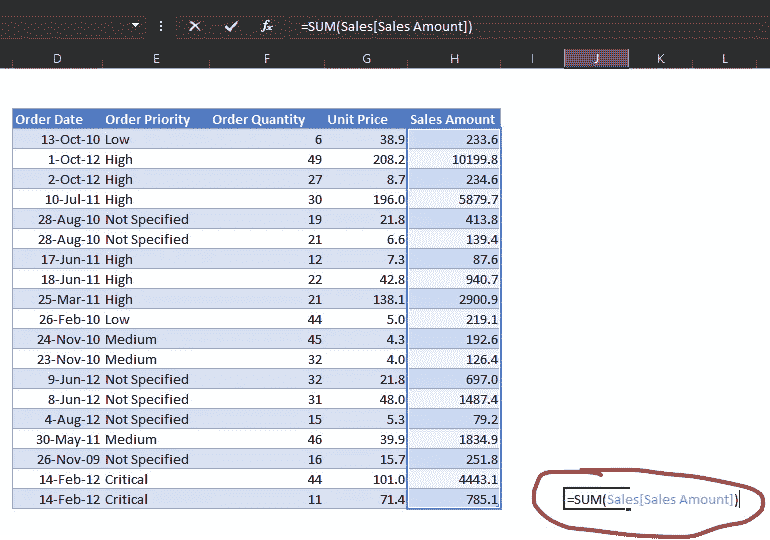

我们可以在 DAX 中写同样的表达式:

```
Total Sales := SUM(Sales[Sales Amount])
```

在 Power Pivot 中，我们在*计算区域*中编写度量

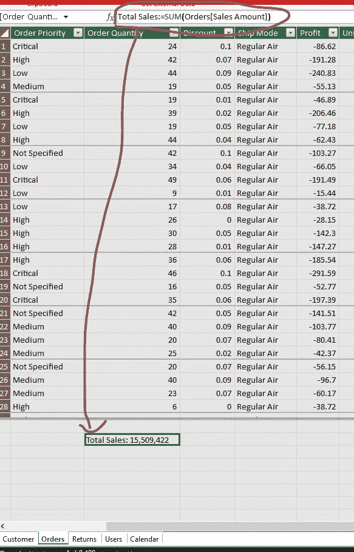

只需选择该区域中的任意单元格，然后开始键入完整的表达式。

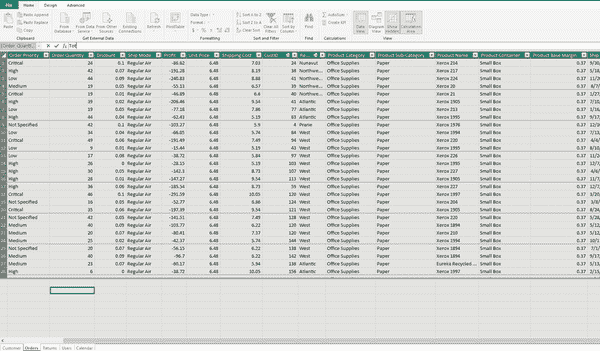

或者，我们可以使用替代选项

力量透视>度量>新度量

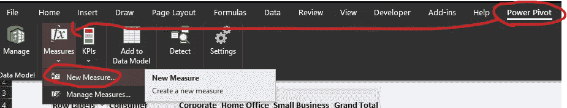

我更喜欢这个选项，因为它提供了一些额外的功能:

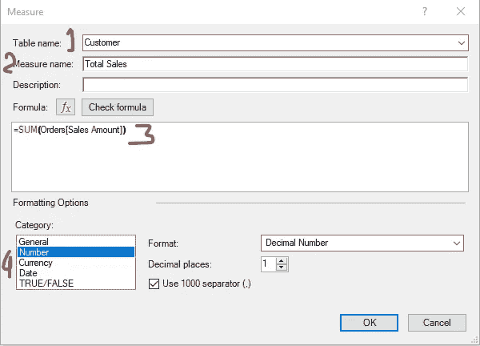

1.**表名**:该度量的*主表*(存储的地方)。DAX 度量的位置不影响输出。DAX 度量不是表格的一部分，只是放在那里，以便我们在需要时可以找到它们。

2.**测量名称**:非常直接(等式的左侧)

3.**计算区域**:我们定义表达式(等式的右边)

4.**格式化选项**:定义输出的格式。

而且还有一个加成功能:**检查公式**。确实非常方便。

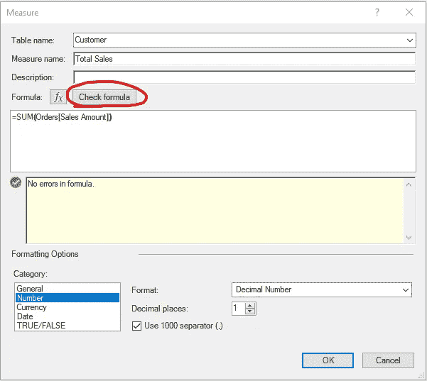

DAX 度量是强大的，我们可以创建一些有用的计算。我们可以即时执行计算*。*

例如，使用 DAX 度量，我们可以将上述两个步骤结合起来(订单数量和单价相乘，并合计计算出的金额)。

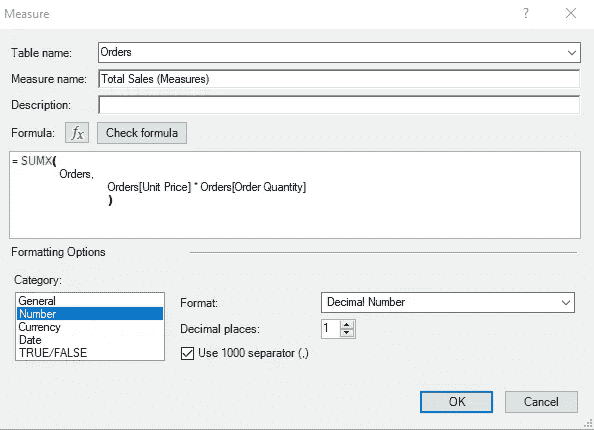

SUMX 是一个迭代器。它首先应用表达式 Orders[Unit Price]* Orders[Order Quantity]，然后动态地获得输出的聚合和。我们可以跳过为销售额添加计算列的步骤。

有关更多详细信息，请阅读文章:

[迭代器:X 因子](https://www.vivran.in/post/dax-iterators-the-x-factors)

# 在 Power BI Desktop 中添加计算列和度量

我们可以通过多种方式在 Power BI 中添加计算列和 DAX 度量。我最喜欢的选项是:

右键单击表名>新建计算列或度量

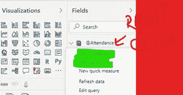

或者，我们可以通过建模来访问它

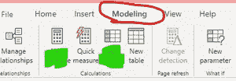

第一个选项确保我将测量值存储在所需的*“主表”*中。

欲了解更多详情，请参阅文章: [DAX 衡量标准表](https://www.vivran.in/post/dax-tables-for-measures)

# 计算列和度量值之间的差异

虽然它们看起来很相似，但它们之间有很大的不同。

计算列在数据刷新期间进行计算，并使用当前行作为上下文。这与我们是否在任何计算或视图中使用它无关。

DAX 度量对当前上下文定义的数据聚合进行操作。它总是对评估上下文(筛选器或行)下的数据聚合进行操作。有关 DAX 中评估上下文的更多详细信息，请参考以下文章:

[过滤器&行上下文](https://www.vivran.in/post/dax-filter-context-row-context-what-are-they)

# 在模型中添加 DAX 度量值

您可能会发现以下文章很有帮助:

[在 DAX 中使用变量](https://www.vivran.in/post/dax-using-variables)

[数据建模与相关&相关表](https://www.vivran.in/post/dax-data-modeling-with-related-relatedtable)

[DAX:用户关系](https://www.vivran.in/post/multiple-dates-on-the-same-axis-dax-userelationship)

[时间情报 DAX: P1](https://www.vivran.in/post/introduction-to-time-intelligence-part-1)

[时间情报 DAX: P2](https://www.vivran.in/post/dax-time-intelligence-part-2-till-date-aggregations)

[运行总数](https://www.vivran.in/post/running-totals)

[比较绩效与排名](https://www.vivran.in/post/using-rank-for-comparison)

请注意，Power BI 和 Power Pivot 拥有相同的 DAX 公式引擎；因此，以上文章中分享的例子同样适用于 Power Pivot。

*我写一下*[*MS Excel*](https://www.vivran.in/my-blog/categories/excel)*[*权力查询*](https://www.vivran.in/my-blog/categories/powerquery)*[*权力毕*](https://www.vivran.in/my-blog/categories/powerbi)*[*权力中枢*](https://www.vivran.in/my-blog/categories/power-pivot)*[*DAX*](https://www.vivran.in/my-blog/categories/dax)****

***[@imVivRan](https://twitter.com/imvivran)***