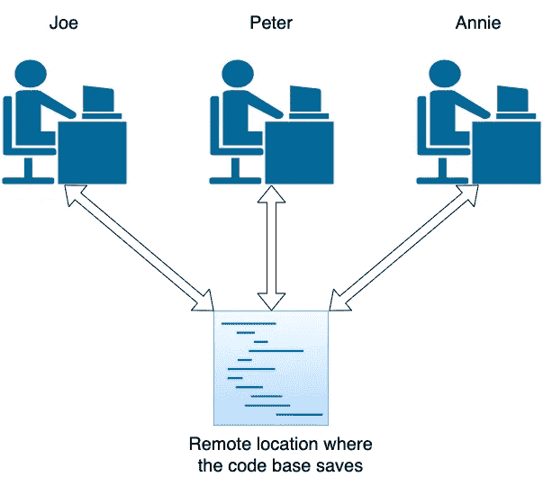

# 向 Git 和 Github 问好

> 原文：<https://medium.com/analytics-vidhya/say-hello-to-git-and-github-937b217339f?source=collection_archive---------10----------------------->


# git 简介

## Git 是什么？

这是一个版本控制系统。也许你听说过版本控制系统。接下来的问题是什么是版本控制系统。首先，我们必须弄清楚这个版本控制系统要解决的问题是什么。我将举两个基本的例子，讨论版本控制系统将要解决的基本问题，还有更多。让我们来看一个基本的场景，三个人在同一个项目中一起工作。他们分别开发他们的部分，当他们来到一个地方，决定“嘿，我们需要组合我们的代码，并交付产品”，然后你认为会发生什么。


当他们组合代码时，他们会面临大量的困难，因为代码之间有很多冲突。版本控制系统促进了协作的工作环境，在这种环境中，这三个人可以在相同的代码基础上处理相同的项目，然后他们可以在那里解决冲突。为了进一步澄清，代码库位于远程位置或每个人都可以访问的地方。让我们假设 joe 开始项目，他保存他所做的更改，当 Peter 开始开发或 Peter 开发一个功能(软件的一个功能)时，他可以接受 Joe 所做的更改，并将更改保存到 Joe 开发的代码中。有许多优点

*   开发人员可以协同工作
*   当场解决冲突
*   监控开发者



第二种情况是，一组开发人员正在开发一个软件并发布了 1.0 版，然后是 1.1 版的功能发布，然后是 1.11 版的补丁发布，但不幸的是它崩溃了，然后他们不得不退回到 1.1 版并开始在 1.1 版上开发。那我们该如何管理这些版本呢？


解决方法是我们有两种方法可以做。

1.  在不同的目录下保存不同的版本会浪费很多额外的内存
2.  使用版本控制系统

通过使用版本控制系统，我们可以很容易地回到主要使用它的任何位置。

## git 是如何工作的？

有两种存储库(保存文件的地方)类型，

1.  本地存储库(Local repository)—在本地机器上保存您的更改，任何人都不能使用 git 访问。
2.  **远程存储库**——你可以在任何 git 托管服务平台上远程保存更改，任何获得授权的人都可以访问这些更改。我将在后面讨论什么是 git 托管服务。

然后让我们讨论一下这些存储库是如何制作的以及它们的用途。

*   **在你的机器上相同的目录下初始化一个本地 git 库。**

您可以将您的更改添加到本地存储库中并管理它们。这个本地存储库跟踪您所有的本地更改。但是，其他人如何访问这些变化，那么你必须进入下一个阶段。

*   **在 git 托管服务上设置远程存储库。**

您可以设置一个远程存储库，并将您的更改添加到任何授权用户都可以访问的远程存储库中。

git 所做的是跟踪您的所有更改，您可以添加任何您需要添加到存储库中的内容，您可以在任何需要的时候恢复，并返回到任何点，您可以创建分支等等，git 会处理这些。这些命令将在下一节讨论。


## 什么是 git 托管服务？

git 托管服务只是帮助建立一个任何授权的人都可以访问的远程存储库。它只是在一个远程位置启动一个 git 存储库，任何授权的人都可以使用 git 访问资源。

有几种 git 托管服务，它们是

*   开源代码库
*   Gitlab
*   比特桶
*   代码库和更多

# Git 命令

## 使用本地存储库

首先，让我们弄清楚如何使用本地存储库。首先，我们必须在项目目录中初始化 git 本地存储库。

**一起工作。gitignore 文件**

这是另一个重要的文件，它包含关于您不打算添加到本地和远程存储库中的文件的信息。例如，在反应或角度项目中，可以生成节点模块。这些信息不会被添加到存储库中。然后在中指出。gitignore 文件。


样本。gitignore 文件。

**初始化本地 git 库**

```
git init
```

您必须在项目目录中运行该命令。你可以看到一个隐藏的目录被命名为。git”以及所有的配置、更改和在 git 下完成的一切都保存在那里。


**检查更新文件**

这是一个很好的练习，在你添加文件到仓库之前，你必须使用下面的命令检查什么是改变的文件。

```
git status
```

结果将显示未提交的已添加文件为绿色，未添加的文件为红色，如下所示。


git status 命令的输出

**将文件添加到本地存储库**

```
git add <file_name>  // Add a single file.
git add <directory_name> // Add a directory.
git add . // Add all changes
```

使用添加命令，您可以将文件添加到存储库中，添加命令中有各种选项。

**将文件提交到本地存储库**

请注意，您不能转到添加文件的位置。你必须提到那些被称为提交的点。如果你想保存一个函数开发的点，或者任何你必须提交的特定点，使用这些提交 id，你可以返回或者做很多事情。

```
git commit -m <message>
```

你必须提到提交后的信息，它应该是一个简单而有意义的信息。

例如:- git commit -m "开发了 addDocument 函数"

**获取提交历史记录**

要获取提交历史记录，您必须使用 log 命令，它将显示从最新到最早的提交历史记录。

```
git log
```


使用提交消息，你可以很容易地确定提交点，使用提交 id，你可以去的位置和更多将在未来的帖子中讨论。

## 使用远程存储库

让我们讨论使用远程存储库的基本命令。高级命令将在以后的帖子中讨论。

**在 github 中创建一个存储库**

我们将使用 github 作为 git 托管服务，让我们与 github 一起工作。

*   创建一个 github 存储库，在右上角有一个 add 按钮，按照下面给出的说明进行操作。


点击新建存储库


创建一个存储库，根据需要命名其他信息

**为现有项目设置远程存储库**

要在项目文件夹中设置远程存储库，首先必须转到项目目录并

```
git remote add <remote_name> <remote_repository_url>
```

提到 remote_name 是为了方便识别遥控器，因为在高级情况下，我们必须使用多个遥控器。

remote_repository_url 可以从 github 中获取，如下所示。


创建新的存储库


从现有存储库中获取名称。

**从远程存储库提取文件**

主分支机构的名称是 master，在本次会议中，我们将与 master branch 一起工作

```
git pull <remote_name> <branch_name>
```

为了从特定的远程和特定的分支获取文件，我们使用上面的命令。

注意:当我们使用添加 remote 时，我们使用相同的 remote 名称。

例如:git 拉式来源主机

**将文件推送到远程存储库**

重要提示:-在将文件推送到远程系统之前，您必须将文件添加并提交到本地存储库。然后只有它们被添加到远程存储库中。

```
git push <remote_name> <branch_name>
```

希望这是有帮助的。

如果你觉得这有帮助，请点击那个👏并分享到社交媒体上:)