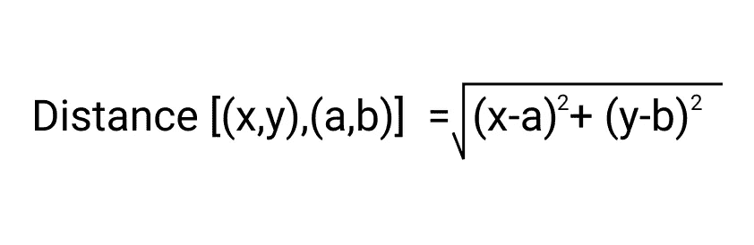

# 深入了解 K 均值聚类

> 原文：<https://medium.com/analytics-vidhya/say-hi-to-k-mean-clustering-967720723cda?source=collection_archive---------6----------------------->

Pierre Bamin 在 [Unsplash](https://unsplash.com?utm_source=medium&utm_medium=referral) 上拍摄的照片

在本文中，我们将了解 K 均值聚类实际上是如何工作的。我取了一个包含样本数据点及其坐标或 X 和 Y 值的表格。我们将把这些数据点分配给指定数量的簇，并通过手动计算给这些簇分配它们各自的质心。

假设我们有以下 6 个数据点(如图所示)。

样本数据点。(图片来源:作者)

对于 K-均值聚类，我们决定“K”值或聚类数。假设这里我们选择把给定的数据点分配给两个聚类，也就是我们选择 K = 2。

最初，我们将数据点编号 1 (182，72)和数据点编号 2(170，56)分别作为聚类“K1”和“K2”。

“K1”和“K2”是当前只有一个点的群集，该点也是它们各自的质心。下表给出了质心的值。

图片来源:作者

现在，我们将找到每个数据点和两个聚类之间的欧几里德距离。该数据点将属于更靠近它的聚类。

欧几里德距离的计算公式。这里我们将(x，y)作为初始质心的值，而(a，b)作为数据点的值。(图片来源:作者)

## 让我们开始计算吧！

我们的第一个数据点是 1 (182，72)，这也是 K1 和聚类 1 (K1)的质心中的唯一点。对于我们的第二点(170，56 ),关于群集 2(K2)也可以这样说。

现在我们将计算点 3 到 K1 和 K2 的距离，并将结果制成表格。

计算欧几里德距离。(图片来源:作者)

由于数据点 3 离 K2 的距离小于它和 K1 之间的距离，所以它将属于第二组，即 K2。

图片来源:作者

聚类 K2 现在有两个数据点，点 2 (170，56)和点 3 (168，60)。现在我们将重新计算 K2 的新质心。

图片来源:作者

K2 的新形心是(169，58)。

现在我们将找到数据点 4 到 K1 和 K2 的质心(新的质心)的距离。

图片来源:作者

由于数据点编号 4 离 K1 的距离小于它和 K1 之间的距离，所以它将属于第一组，即 K1。

图片来源:作者

聚类 K1 现在有两个数据点，点 1(185，72)和点 4(179，68)。现在我们将重新计算 K1 的新质心。

图片来源:作者

K1 的新质心是(182，70)。

现在我们将计算数据点 5 (182，72)的距离。

图片来源:作者

我们可以清楚地看到，数据点 5 属于 K1。现在我们将重新计算 K1 的质心。

图片来源:作者

K1 的新质心是(182，71)。现在我们将计算第六个也是最后一个点(188，77)的距离。

图片来源:作者

我们可以看到，数据点 6 属于第一个聚类，即 K1。现在我们重新计算 K1 星团的质心。

图片来源:作者

K1 的新形心是(185，74)。

最终的簇和质心如下表所示。

图片来源:作者

让我们总结一下步骤。

图片来源:作者

我希望这有助于您更好地理解 K 均值聚类。

# 在你走之前

***感谢*** *的阅读！如果你想与我取得联系，请随时通过 ipsitashee4@gmail.com 联系我或我的* [***LinkedIn 个人资料***](http://www.linkedin.com/in/ipsita-shee-764220191) *。*