# 俄罗斯住房市场

> 原文：<https://medium.com/analytics-vidhya/sberbank-russian-housing-market-514993c54fe0?source=collection_archive---------5----------------------->

*俄罗斯一场预测房地产价格的卡格尔竞赛*

[挂靠在](https://www.linkedin.com/in/arpita-gupta-b08711106/)

2017 年 5 月，俄罗斯历史最悠久、规模最大的银行 Sberbank 向 Kaggle 上的数据科学家发出挑战，要求他们开发利用广泛的特征来预测实际价格的算法。算法应用依赖于丰富的数据集，包括住房数据和宏观经济模式。一个准确的预测模型将使俄罗斯联邦储蓄银行在不确定的经济中为他们的客户提供更多的确定性。

**关于数据**

由于这是一场 kaggle 竞赛，因此数据集由 [kaggle 提供。](https://www.kaggle.com/)提供的[数据集](https://www.kaggle.com/c/sberbank-russian-housing-market/data)由一个训练集、一个测试集和一个包含历史宏观经济指标的文件组成。

1.  训练集包含从 2011 年 8 月到 2015 年 6 月的约 2.1 万笔房地产交易，以及特定于该物业的信息。这个集合还包括房产的出售价格。
2.  测试集包含从 2015 年 7 月到 2016 年 5 月的约 7K 笔房地产交易，以及特定于该房产的信息。这一套不包括财产的交易价格。
3.  宏观经济数据的时间跨度为 2010 年 1 月至 2016 年 10 月。
4.  总共有大约 400 个特征或预测因子。

**解决问题的现有方法:**

因为这个问题已经 3 年了，所以有很多解决方案，几乎每个人都使用 XGBoost 模型来预测价格。

以下是解决该问题的一些现有方法:

1.[http://cs 229 . Stanford . edu/proj 2017/final-posters/5124210 . pdf](http://cs229.stanford.edu/proj2017/final-posters/5124210.pdf)

2.[https://www . research gate . net/profile/P _ pinte las/publication/228084519 _ Data _ Preprocessing _ for _ Supervised _ Learning/links/0c 960517 fefa 258d 0d 000000/Data Preprocessing-for-Supervised-Learning . pdf](https://www.researchgate.net/profile/P_Pintelas/publication/228084519_Data_Prep%20rocessing_for_Supervised_Learning/links/0c960517fefa258d0d000000/DataPreprocessing-for-Supervised-Learning.pdf)

3.[https://olgabelitskaya.github.io/MLE_ND_P6_PR.pdf](https://olgabelitskaya.github.io/MLE_ND_P6_PR.pdf)

4.[https://github . com/admiral Wen/Sberbank-Russian-Housing-Market](https://github.com/AdmiralWen/Sberbank-Russian-Housing-Market)

**我对现有方法的改进:**

我对缺失值使用了基于模型的插补，并使用自定义模型来预测输出。定制模型有 light gbm 作为基础模型，LR 作为元模型，我已经在第一次切割方法中详细解释了我的定制模型。

**探索性数据分析:**

EDA 是任何数据科学项目的第一步，也是最重要的一步。通过 EDA，我们可以深入了解我们的数据。在 EDA 中，我首先了解缺失值，在我们的数据中，大约 60 列有缺失值，然后通过对响应变量进行单变量分析，我了解到数据中也有一些异常值。

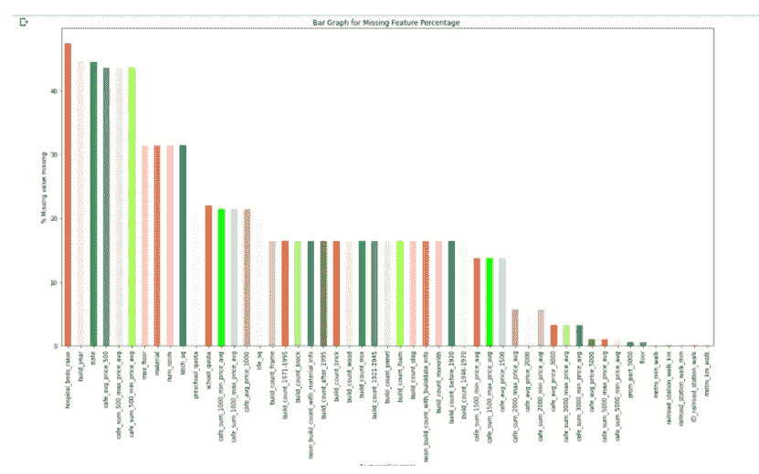

缺失值百分比

响应变量:

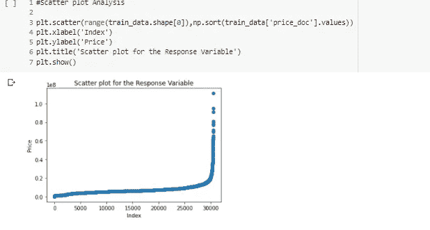

价格 _ 单据

这些是我的 EDA 的一些观察结果:

1.  平均价格最高的地区是 Hamovniki，平均价格最低的地区是 Poselenie Klenovskoe

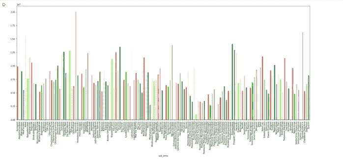

2.周一的平均售价最高，而周六和周日的平均售价最低。

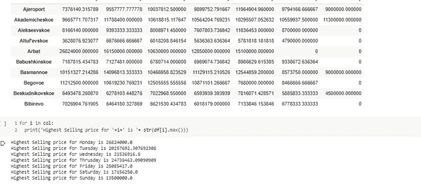

3.虽然没有平稳的模式，但我们可以粗略地说，随着平方米面积的增加，价格也增加。

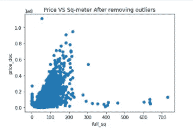

4.如果房子是旧的，可能会比新的价格高。所有 2000 年以前建造的房子都比 2000 年以后建造的价格高。如果 1950 年代或 1960 年代以前的房子更贵。

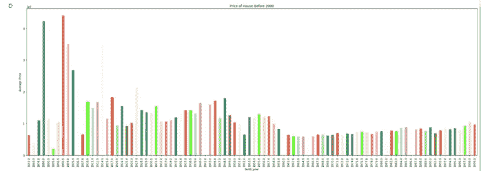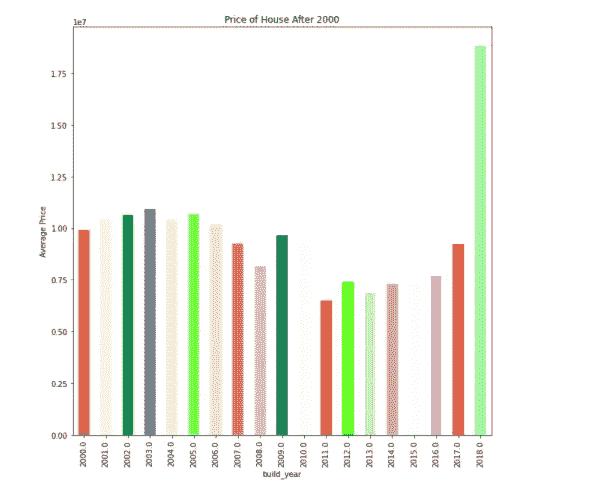

5.如果产品类型是自住的，房屋的平均售价就高。人们倾向于将更多的资金投入到那些房屋销售量低的地区。

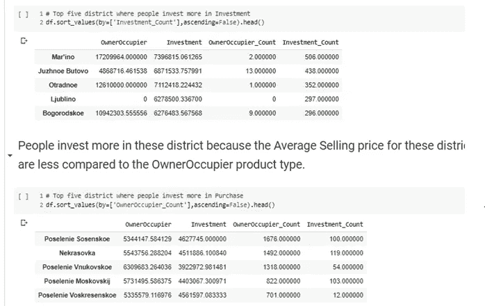

6.随着房子离绿区的距离增加，我们的价格下降。

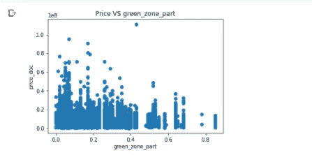

7.如果工业区的份额越小，人们在该地区购买房屋的可能性就越大，或者换句话说，我们可以说工业区份额越小的地方，房屋数量就越多。

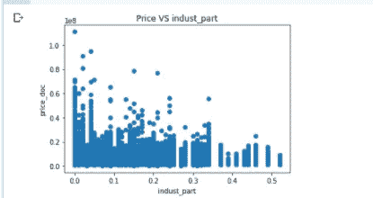

如果该地区的工业区份额较少，房屋的售价就会很高

8.如学校、医院、商场、地铁站、火车站、公园、健身房、游泳池等基础设施。离房子越近，房子就越贵。

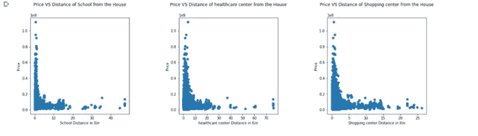

9.我们的数据包含共线性，因此我们必须删除高度相关的数据以获得更好的性能。我们可以通过分析相关矩阵来选择要删除的列。

10.我已经根据与 price_doc 相关的相关值分析了特征，我已经根据与 price_doc 相关的相关值将我们的大相关矩阵分成了四个部分。我只分析了与 price_doc 的相关值大于 0.10 的数据，在我看来，与 price_doc 的相关值小于 0.10 不会给模型增加任何重要性，因此我们可以选择移除与 price_doc 的相关值小于 0.10 的所有特征。

**第一次切入方式**

1.首先，我做了 EDA，看看数据是如何与响应变量相关联的，也看看缺失值的百分比。然后，在 EDA 之后，我已经完成了特征工程，如删除所有方差为零或很小的列以及所有无用的 id，对于填充缺失值列，我使用了两种方法，对于所有缺失值百分比小于或等于 5%的情况，我使用中值计算方法和基于模型(KNN)的插补，否则。我还清理了数据，并根据现有特征计算了附加特征。

**2。**在特征工程之后，我使用标签编码器将所有分类特征转换成数字。然后，我应用不同的模型，并选择具有最低 MSE(均方误差，我在本案例研究中使用 MSE 作为评估指标)的模型。我在这个案例研究中尝试的模型是**随机森林、决策树、XGBoost、AdaBoost 和定制模型。**

3.我也尝试了 SGD 回归器，但这个模型在这个数据集上表现很差，我在这个案例研究中得到 14265056376832233472 均方根误差。

4.对于自定义模型，我生成了 50 个随机样本(样本大小为数据行的 60%)，然后我将 **light gbm** 作为基础模型，并生成了与这 50 个随机样本相对应的 50 个基础模型，然后我将线性回归作为元模型来生成最终输出。

**车型对比**

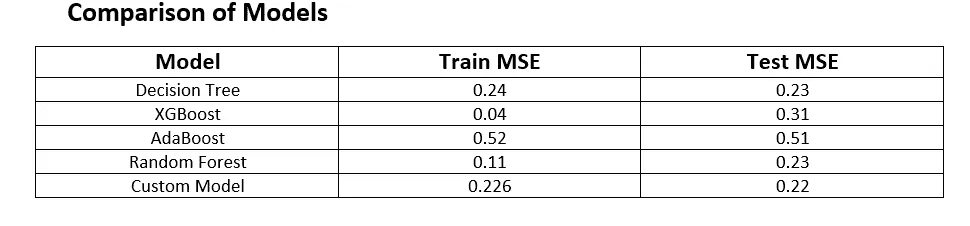

我们可以看到定制模型在所有模型中表现最好。因为这是 Kaggle 完成的，所以我在 kaggle 上上传了测试文件(test.csv)的预测价格，以查看我的模型的性能:

**我在本案例研究中遇到的问题**是我的 RMSE 分数没有从 0.39 提高，因为我对数据进行了归一化处理，但我观察到，如果我不对数据进行归一化处理，我的 RMSE 分数会从 0.39 提高到 0.327，并且在自定义模型的基础模型中，我尝试了 XGBoost、决策树和 Random Forest 作为基础模型，但使用 lightgbm regressor 作为基础模型，使用线性回归作为元模型，我获得了更好的 RMSE 分数。

**你可以在** [**Github 上查看我的代码。**](https://github.com/arpitagupta963/Sberbank-Russian-Housing-Market)

**未来工作**

通过更有效地进行特征工程，分数可能会提高，我们将更多地致力于设计新的特征来改善我们的模型预测。这就要求我们对俄罗斯的房地产经济有更深入的行业了解。

**参考文献**

1.[http://cs 229 . Stanford . edu/proj 2017/final-posters/5124210 . pdf](http://cs229.stanford.edu/proj2017/final-posters/5124210.pdf)

2.[https://www . research gate . net/profile/P _ pinte las/publication/228084519 _ Data _ Preprocessing _ for _ Supervised _ Learning/links/0c 960517 fefa 258d 0d 000000/Data Preprocessing-for-Supervised-Learning . pdf](https://www.researchgate.net/profile/P_Pintelas/publication/228084519_Data_Prep%20rocessing_for_Supervised_Learning/links/0c960517fefa258d0d000000/DataPreprocessing-for-Supervised-Learning.pdf)

3.https://olgabelitskaya.github.io/MLE_ND_P6_PR.pdf

4.[https://github . com/admiral Wen/Sberbank-Russian-Housing-Market](https://github.com/AdmiralWen/Sberbank-Russian-Housing-Market)

5.[https://towards data science . com/dimensionally-reduction-for machine-learning-80 a 46 C2 ebb 7 e](https://towardsdatascience.com/dimensionality-reduction-formachine-learning-80a46c2ebb7e)

6.[https://www . Applied ai course . com/course/11/Applied-Machine-learning-course](https://www.appliedaicourse.com/course/11/Applied-Machine-learning-course)