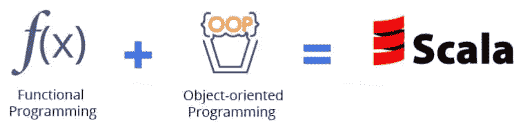
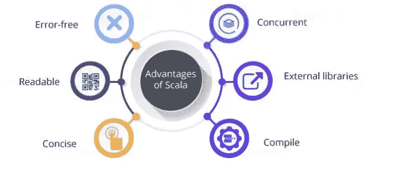

# 两分钟后 Scala

> 原文：<https://medium.com/analytics-vidhya/scala-76a9954f7602?source=collection_archive---------23----------------------->

Scala 是一种高级编程语言，同时具有函数式和面向对象的语言特性。它被设计得简洁而快速。Scala 被编译成 Java 字节码。然后，可执行文件在 Java 虚拟机(JVM)上运行。因为 Scala 被编译成 Java 字节码，所以它与 Java 有无缝的互操作性，从而可以访问有用的 Java 源代码库。

用 Scala 写的代码更容易测试和重用；并行化变得更简单，并且整个程序中的错误更少。Scala 编程遵循自顶向下的方法；每个程序都被分解成多个程序块，每个程序块都可以并行处理，因此加快了处理速度，也提高了效率。

Scala 的第一个版本是由德国计算机科学家 Martin Odersky 开发的，于 2003 年发布，从那以后一直运行的很成功。

> 我们发现 Scala 让我们能够用更少的代码更快地交付东西。“这给球队注入了新的活力。”——格雷厄姆·塔克利，《卫报》

**Scala 优势**

*   代码更加简洁，可读性更好，并且没有错误。
*   与许多其他编程语言相比，Scala 很容易编写、编译、调试和运行程序。
*   函数式编程让你从不同的角度来处理同样的问题。
*   它部署了有助于并行化任务的并发性。
*   许多第三方库可以用于特定的任务。它们可以以语言结构的形式添加。

如果你喜欢这篇文章，请点击👏所以其他人会在媒体上看到它。