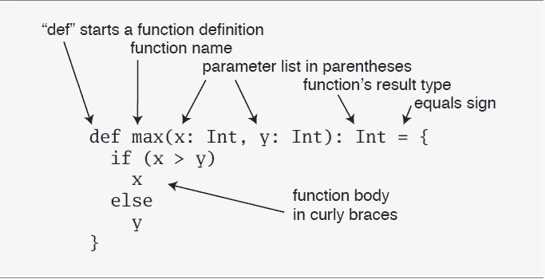

# Scala —基础:-

> 原文：<https://medium.com/analytics-vidhya/scala-basics-ace1dccd72f8?source=collection_archive---------25----------------------->

在这一节，我们将回顾 Scala 编程语言的基础。在整个博客中，我们将使用流行的 IntelliJ 理念，我们已经在我的[上一篇文章](/@duke.lavlesh/how-to-install-intellij-idea-on-ubuntu-18-04-19-10-ubuntu-16-04-5bc45bb6c022?source=friends_link&sk=f16d31bdd444d90beda96b7fa5ae6c05)中设置好了。我希望到目前为止，您对使用 IntelliJ IDEA 已经比较熟悉了。如果没有，请随时查看我的[以前的帖子](/@duke.lavlesh/how-to-install-intellij-idea-on-ubuntu-18-04-19-10-ubuntu-16-04-5bc45bb6c022?source=friends_link&sk=f16d31bdd444d90beda96b7fa5ae6c05)。

如果你对 Java 有很好的理解，那么你学习 Scala 将会非常容易。Scala 和 Java 之间最大的语法差异是“；”行尾字符是可选的。

**区分大小写—**Scala 区分大小写，这意味着标识符 hello 和 Hello 在 Scala 中有不同的含义。请浏览下面的更多差异。

*   **类名—**对于所有的类名，第一个字母应该是大写的。如果几个单词组成一个类的名字，每个单词的第一个字母应该大写。

> *示例-类 MyFirstScalaClass。*

*   **方法名**——所有方法名都应以小写字母开头。如果使用多个单词组成方法的名称，那么每个内部单词的第一个字母应该大写。

> 示例 def myMethodName()

*   **程序文件名**—程序文件名应与对象名完全匹配。保存文件时，你应该使用对象名(记住 Scala 是区分大小写的)和 append。“scala”添加到名称的末尾。(如果文件名和对象名不匹配，你的程序将无法编译。

> 示例假设“HelloWorld”是对象名。那么文件应该保存为‘hello world . Scala’。

*   def main(args:Array[String])Scala 程序处理从 main()方法开始
*   **对象—**对象有状态和行为。对象是一个类的实例。例子——狗有状态——颜色、名字、品种以及行为——摇摆、吠叫和进食。
*   **类—**类可以被定义为一个模板/蓝图，它描述了与类相关的行为/状态。
*   **方法—**方法基本上是一种行为。一个类可以包含许多方法。在方法中，逻辑被编写，数据被操作，所有的动作被执行。
*   每个对象都有其独特的实例变量集，这些变量被称为字段。对象的状态由分配给这些字段的值创建。
*   **闭包**—**闭包**是一个函数，它的返回值取决于在这个函数之外声明的一个或多个变量的值。
*   **Traits**trait 封装了方法和字段定义，然后可以通过将它们混合到类中重用。特征用于通过指定所支持方法的签名来定义对象类型。
*   **def 关键字—**“def”关键字用于在 Scala 中声明一个函数。
*   **Function_name —** 应该是小写的有效名称。Scala 中的函数名可以包含+、~、&、–、++、\、/等字符。
*   **Parameter_list —** 在 Scala 中，定义了逗号分隔的输入参数列表，前面是数据类型，在括号内。
*   **Return_type —** 用户在定义函数时必须提及参数的返回类型，函数的返回类型是可选的。如果没有指定函数的任何返回类型，默认的返回类型是 Unit，相当于 Java 中的 void。
*   **方法体—** 方法体用大括号{ }括起来。执行预期操作所需的代码。

> def function _ name([parameter _ list]):[return _ type]= {
> 
> //函数体
> 
> }

**注意-** 如果用户不使用等号和主体，那么隐式方法被声明为抽象。

*   **定义一些变量——**Scala 有两种变量，vals 和 vars。val 类似于 Java 中的 final 变量。一旦初始化，val 就不能被重新分配。相比之下，var 类似于 Java 中的非最终变量。var 在其整个生命周期中可以被重新分配。
    *这里有一个 val 的定义:*

> scala> val msg = "Hello，world！"

该语句引入 msg 作为字符串“Hello，world！”。
msg 的类型是 java.lang.String，因为 Scala 字符串是由 java 的 String 类实现的
。如果您习惯用 Java 声明变量，您会注意到这里有一个显著的不同:java.lang.String 和 String 都没有出现在 val 定义中。这个例子说明了类型推断，Scala 能够找出你忽略的类型。

**定义一些函数:-** 现在你已经使用了 Scala 变量，你可能想写一些函数。下面是在 Scala 中如何做到这一点:

> def max(x: Int，y: Int): Int = {
> 
> 如果(x > y) x
> 
> 否则 y
> 
> }
> 
> max: (Int，Int)Int

函数的结果类型是一个等号和一对包含函数体的花括号。在这种情况下，主体包含一个 if 表达式，
，它选择 x 或 y 中较大的一个，作为
max 函数的结果。正如这里演示的，Scala 的 if 表达式可以产生一个
值，类似于 Java 的三元运算符。比如 Scala 表达式
“if(x>y)x else y”的行为类似于“(x > y)？Java 中的 x : y”。

*   **写一些 Scala 脚本:-** 虽然 Scala 是为了帮助程序员构建超大规模系统而设计的，
    它也可以很好地缩小到脚本。脚本只是文件中的一系列
    语句，它们将被顺序执行。将它放入名为 hello.scala 的文件
    :

> *println("你好，世界，来自一个剧本！")*

> 我希望你清楚地喜欢 Scala 基础，如果还有任何疑问，你可以随时问我。
> 
> 感谢阅读！！我的帖子。
> 
> 我会在下一个有趣的 Scala 话题中再次和你见面..