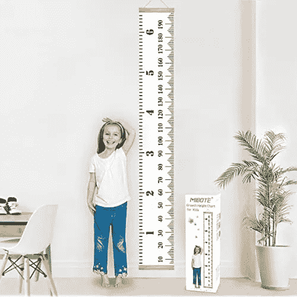
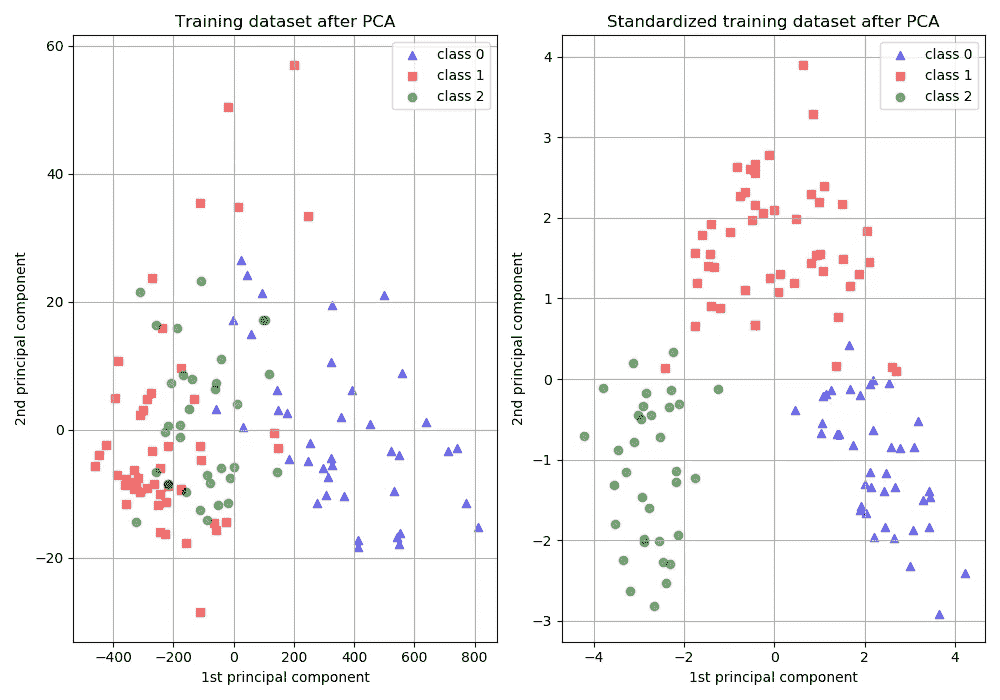
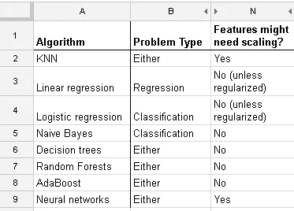
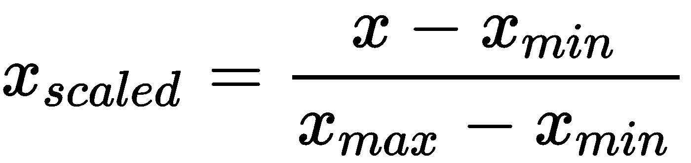
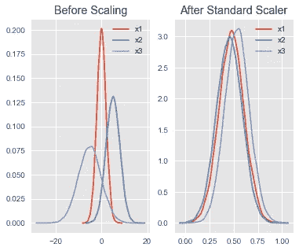
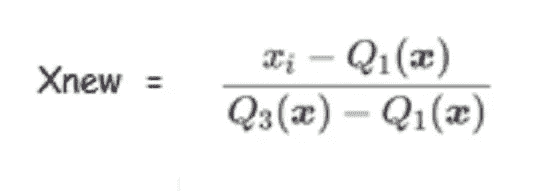

# 扩展—从零到英雄

> 原文：<https://medium.com/analytics-vidhya/scaling-zero-to-hero-45668c6d58f6?source=collection_archive---------18----------------------->

据说哈奴曼勋爵有山那么大，飞过狭窄的海峡到达兰卡。着陆后，他发现了一个居住着国王罗波那和他的恶魔追随者的城市，所以他缩小到一只蚂蚁的大小&潜入城市；根据印度教神话。它明确指出了缩放的相关性，这也是我们今天要讨论的内容。*‘特征缩放及其在机器学习中的重要性’。*

## **什么是特征缩放？**

要素缩放是一种用于缩放数据集的独立变量(要素)的方法。在开发用于预测的机器学习模型之前，它作为数据预处理的一部分被执行。

在我们进一步探索如何之前，我认为更重要的是获得一种直觉，并澄清“为什么”

## **我们为什么要缩放特征？**

如果你想让你的机器(计算机)从提供的数据中学习并准确预测，你需要一种方式向系统传达 100 公斤的体重并不比 10 公里/小时的速度好，仅仅 100 并不意味着大于/好于 10(因为你的系统对体重和速度没有直觉，只能理解数字)。真实世界数据集包含在量值、单位和范围上有很大差异的要素。假设数据集包含 100 个特征/变量，您不希望某些特征对算法的决策过程产生过大的影响。因为机器学习模型总是给较高或较大的数字较高的权重，给较小的数字较低的权重。

特征缩放的其他好处包括在算法的[正则化](https://www.quora.com/How-can-feature-scaling-affect-regularization)过程中进行适当的惩罚(防止过度拟合&帮助一般化】)(特别是如果模型对异常值敏感的话)。它还*加速收敛*，例如在随机梯度下降中，特征缩放有时可以提高算法的收敛速度。在[支持向量机](https://scikit-learn.org/stable/modules/svm.html)中，可以减少寻找支持向量的时间。

## **什么时候进行特征缩放？**

某些算法，如 SVM、逻辑回归和 KNN，使用基于距离的度量(比如[欧几里德距离](https://en.wikipedia.org/wiki/Euclidean_distance))需要特征缩放来提供正确的预测。而决策树、随机森林、XG-Boost 等基于树的算法不需要[特征缩放](https://stats.stackexchange.com/questions/244507/what-algorithms-need-feature-scaling-beside-from-svm)。

特征缩放和 PCA

何时扩展

## **你怎么能以规模为特征？**

有三种主要的定标器可以完成这项工作(阅读更多[这里](https://towardsdatascience.com/scale-standardize-or-normalize-with-scikit-learn-6ccc7d176a02)或者[这里](https://becominghuman.ai/demystifying-feature-scaling-baff53e9b3fd)——很棒的文章)

1.  **Min-max scaler:** 顾名思义，从你的特征中减去最小值，再除以范围(见下图)。它保留了原始分布的形状，并且不改变原始数据中嵌入的信息。它不会降低极值的权重，即异常值不受影响。

最小-最大缩放器

2.**标准化:**通过减去平均值然后缩放至单位方差来标准化特征。如果您的要素值呈正态分布，并且您希望减少异常值的影响，并且您不介意要素内相对间距的变化，那么这是一个不错的选择。深度学习和某些回归器受益于标准缩放。

标准缩放器

分布

**3。鲁棒定标器:**该定标器移除中值，并根据分位数范围(Q3，75%值— Q1，25%值)对数据进行定标。它减少了异常值的影响。

鲁棒定标器

[链接到 Sklearn 预处理 API](https://scikit-learn.org/stable/modules/classes.html#module-sklearn.preprocessing)(python 标准机器学习库)

## **结束语**

如果您希望模型有效，特征缩放是一种非常有用的技术，但同时并不总是必需的。某些机器学习算法，尤其是 Tree，不需要您缩放您的要素。

希望这篇文章给你一个关于什么是缩放，为什么和如何使用它的简要介绍。我试图用通俗的语言来描述它，在必要的时候提供外部资源链接。感谢阅读。

想动手试试的请查看[https://www . ka ggle . com/rtatman/data-cleaning-challenge-scale-and-normalize-data](https://www.kaggle.com/rtatman/data-cleaning-challenge-scale-and-normalize-data)