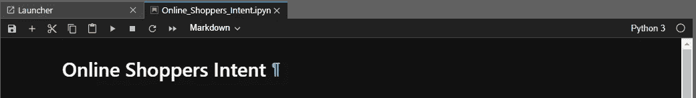
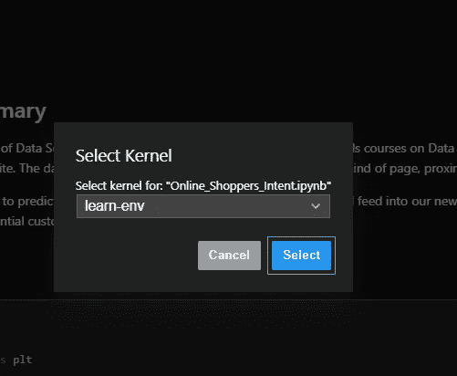
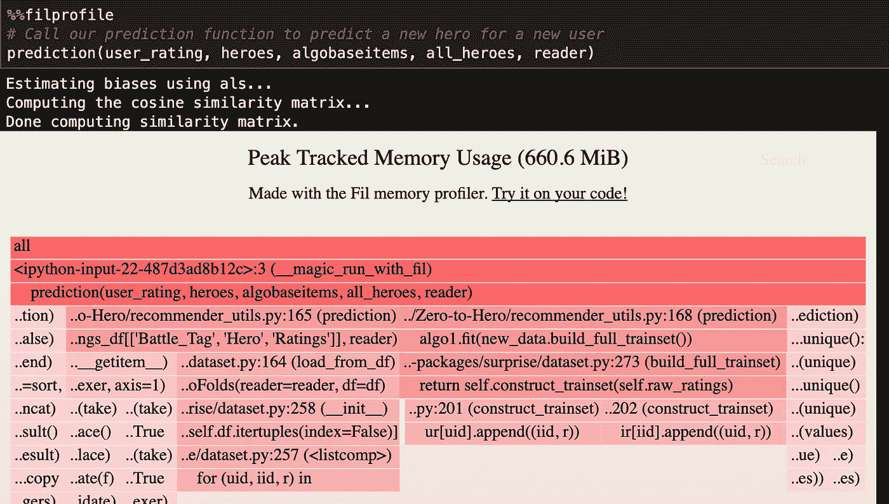

# 扫描数据管道中的内存问题

> 原文：<https://medium.com/analytics-vidhya/scanning-for-memory-issues-in-your-data-pipelines-e6a9ea08b2ce?source=collection_archive---------13----------------------->

```
$ pip install filprofiler%load_ext filprofiler # use the python fil kernel%%filprofile # run this in the cell you wish to evaluate
```


泰勒·达维在 [Unsplash](https://unsplash.com?utm_source=medium&utm_medium=referral) 上拍摄的照片

> “由此导致的突然系统故障、蓝屏和停机在当今时代越来越不可接受。”

我花了一些时间了解 python 如何使用[引用计数和垃圾收集系统](https://pythonspeed.com/articles/function-calls-prevent-garbage-collection/)来处理其[内存管理](https://docs.python.org/3/c-api/memory.html)。数据科学可能会受到系统 CPU 和内存等因素的制约。努力跟上负载的 CPU 通常表现为系统“变慢”。然而，像泄漏和高内存使用峰值等内存问题。可能会产生灾难性的后果，通常会导致关机、蓝屏甚至数据丢失。

我最近有一对旧的记忆棒，只有两个 2gb 的记忆棒出现故障，由此导致的突然系统故障、蓝屏和停机在这个时代越来越不可接受。

在上下文中，我将在本文中介绍的工具可以用于许多目的:

*   如果您发现加载大量数据很困难
*   想看看你的代码的哪一部分使用了最多的内存吗
*   想要以更小的 ram 成本进行操作等。

那么 Python [Filprofiler](https://github.com/pythonspeed/filprofiler) 就适合你。还有其他针对 Python 的内存分析器，但是用 Filprofiler 的创建者的话说

> 它们都不是为读入数据、处理数据并写出结果的批处理应用程序而设计的-it Amar Turner-Trauring

与服务器不同，在服务器中，数据泄漏更经常是内存问题的原因，数据管道是更临时的解决方案，因此内存峰值是更常见的问题。"**这是 Fil 的主要目标:诊断内存使用的峰值."— Itamar，T.T.**

现在就试一试，看看你的内存在哪里用得最多(目前只限于 Linux 和 macOS):

# 安装和使用

使用以下内容安装软件包:

```
**$** pip install --upgrade pip
**$** pip install filprofiler
```

或康达:

```
**$** conda install -c conda-forge filprofiler
```

## 与脚本文件一起使用

如果您有一个包含代码的脚本:

```
$ python yourscript.py --load-file=yourfile
```

只需将 python 改为“fil-profile run ”,如下所示:

```
$ fil-profile run yourscript.py --load-file=yourfile
```

## 与 Jupyter 笔记本配合使用

安装完成后，确保在笔记本上加载了备用内核“Python 3 with Fil”。你可以在笔记本右上角修改内核



点击右上角的内核



从下拉列表中选择备用内核

一旦选择了内核，您就可以在笔记本的任何地方加载扩展:

```
%load_ext filprofiler
```

您可以通过在单元格顶部添加“%%filprofile”魔术来运行任何特定单元格的配置文件

```
%%filprofile
```

下面是我在推荐引擎上使用它为用户预测商品的一个例子:



该配置文件显示内存使用情况的热图。可以单击每个单独的单元格，并且可以观察到内存分配起源的每个回溯。从上面可以看出，大部分内存使用发生在数据集的读取、构建和为惊喜库构建数据集，以及算法的拟合。

创造者打算让它保持精简和易于使用。他想让它“正常工作”。Windows 系统的使用正在进行中。

感谢您的阅读！我希望这篇文章能帮助您更多地了解 Python 的内存管理系统，以及如何优化您的代码以最小化数据管道中的内存峰值。你可以在这篇[博客文章](https://pythonspeed.com/articles/memory-profiler-data-scientists/)中读到更多关于 fil profiler 的信息，这里有一个[为数据科学家减少内存使用的指南](https://pythonspeed.com/datascience/)

# 参考

1.  [Python 中的内存管理](https://docs.python.org/3/c-api/memory.html) —官方文档
2.  [执着于内存:Python 函数调用如何增加你的内存使用量](https://pythonspeed.com/articles/function-calls-prevent-garbage-collection/)——博客文章，Itamar，T.T
3.  [Filprofiler](https://github.com/pythonspeed/filprofiler) — GitHub
4.  [Fil:面向数据科学家的新 Python 内存分析器和](https://pythonspeed.com/articles/memory-profiler-data-scientists/)——博客帖子，Itamar，T.T
5.  [数据科学家减少内存使用指南](https://pythonspeed.com/datascience/) —博客文章，Itamar，T.T