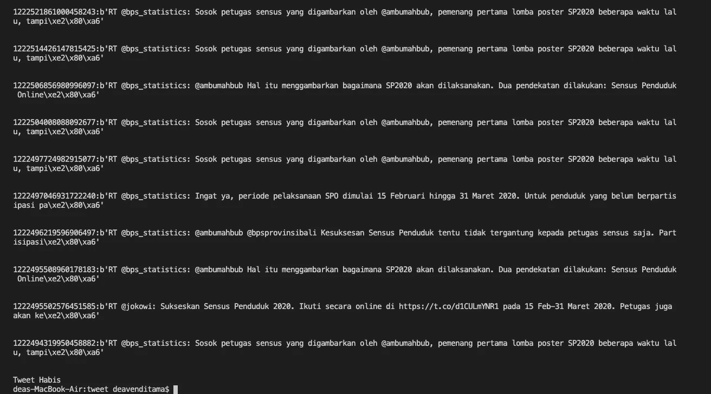

# 使用 Python 3 抓取和存储推文

> 原文：<https://medium.com/analytics-vidhya/scape-and-save-tweet-using-python-3-5a186777c388?source=collection_archive---------5----------------------->


凯利·西克玛在 [Unsplash](https://unsplash.com?utm_source=medium&utm_medium=referral) 上的照片

W 当我们想要使用 tweet 数据进行一些文本分析时，我们必须从 Twitter API 获取数据，并将其保存在数据库或文件中。在之前的教程中，我已经写了如何使用 Tweepy 和 Python 抓取数据，以及如何在 MySQL 中存储数据。如果你没有读过这两篇教程，请继续读下去

[使用 30 行 Python 代码抓取 Twitter 数据](https://chatbotslife.com/crawl-twitter-data-using-30-lines-of-python-code-e3fece99450e)

[将 MySQL 连接到 Python](https://chatbotslife.com/connecting-mysql-to-python-ceef881a19ef)

基于上面的教程，我们可以使用 Python 3 抓取 tweet 数据并将其保存在数据库中。

首先当然要准备好数据库(MySQL)来后期保存数据。我创建了一个名为 social_media 的新数据库，并创建了一个名为 tweet 的表来存储数据。下面是创建该表的 SQL。

```
CREATE TABLE `tweet` (
  `id` int(11) NOT NULL,
  `search_val` varchar(60) NOT NULL,
  `created_at` text,
  `tweet_id` text,
  `text` text,
  `source` text,
  `in_reply_to_status_id` text,
  `in_reply_to_user_id` text,
  `in_reply_to_screen_name` text,
  `user_name` text,
  `user_screen_name` text,
  `user_location` text,
  `user_url` text,
  `user_description` text,
  `user_verified` tinyint(1) DEFAULT NULL,
  `user_followers_count` int(11) DEFAULT NULL,
  `user_friends_count` int(11) DEFAULT NULL,
  `user_listed_count` int(11) DEFAULT NULL,
  `user_favourites_count` int(11) DEFAULT NULL,
  `user_created_at` text,
  `user_id` varchar(50) DEFAULT NULL,
  `user_profile_image_url_https` text,
  `coordinates_lat` text,
  `coordinates_lon` text,
  `place_country` text,
  `place_country_code` text,
  `place_full_name` text,
  `place_id` varchar(50) DEFAULT NULL,
  `place_type` varchar(30) DEFAULT NULL,
  `quoted_status_id` varchar(50) DEFAULT NULL,
  `quoted_status` text,
  `retweeted_status` text,
  `quote_count` int(11) DEFAULT NULL,
  `reply_count` int(11) DEFAULT NULL,
  `retweet_count` int(11) DEFAULT NULL,
  `favorite_count` int(11) DEFAULT NULL,
  `retweeted` tinyint(1) DEFAULT NULL,
  `entities` text,
  `lang` varchar(30) DEFAULT NULL,
  `feeds_link` text,
  `feeds_video` text,
  `feeds_image` text,
  `created_date` datetime DEFAULT CURRENT_TIMESTAMP
) ENGINE=InnoDB DEFAULT CHARSET=latin1;
```

我们可以从 Twitter API 中检索到如此多的数据，但我没有全部保存下来。我试图尽可能地容纳来自 Twitter 搜索 API 的数据，这些数据可能对文本分析或任何事情都有用。

完成数据库设置后，现在我们可以编写 Python 3 代码来抓取和保存 tweets。

觉得迷茫？我希望不会。这看起来有点混乱，因为我试图将所有有用的数据存储在变量中(第 37–103 行)，创建包含这些变量的 Python 元组，然后将它追加到 val 列表中。

SQL 命令写在第 151–161 行，注意我们的 SQL 语法中列的顺序与元组中变量的顺序相同。

不要忘记根据您的需要更改 twitter API 和数据库凭证，保存 Python 3 代码并运行它。



它将打印我们从 API 获得的 tweet 的每个 id 和文本。现在你可以很容易地抓取 twitter 数据，如果你想改变搜索关键词，可以改变第 11 行的标签。

> 注意:免费的 Twitter 搜索 API 只返回过去 7 天的推文。

这些都是我送的，谢谢