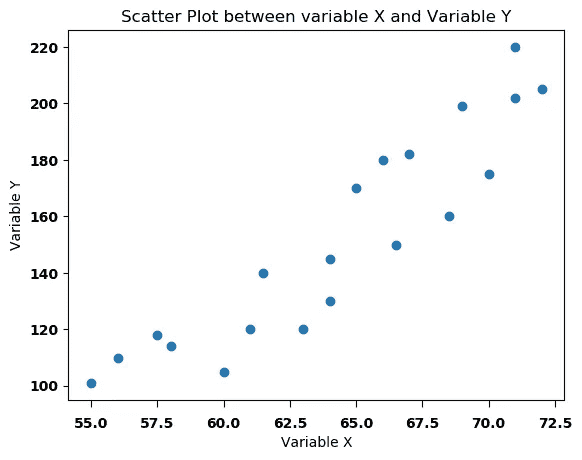
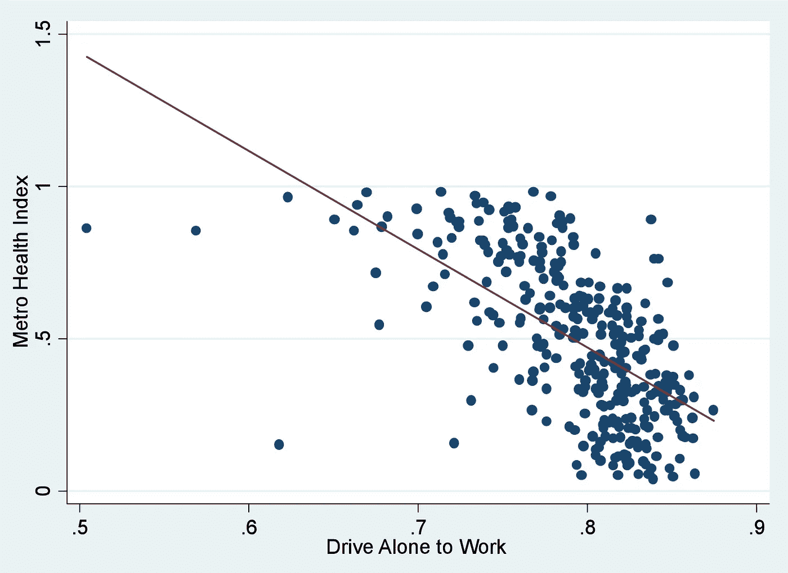
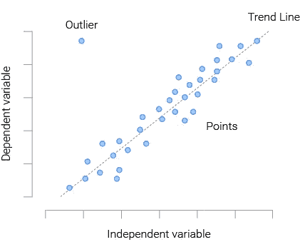
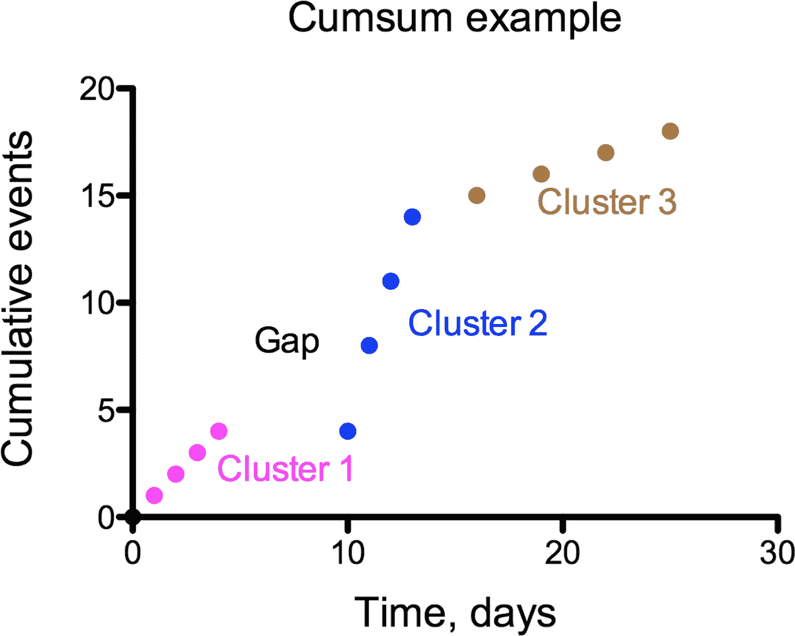

# 散点图，为什么和如何

> 原文：<https://medium.com/analytics-vidhya/scatter-plots-why-how-3de6e1e32645?source=collection_archive---------6----------------------->

# 讲故事、提示和警告

图片来自 [Pixabay](https://pixabay.com/?utm_source=link-attribution&utm_medium=referral&utm_campaign=image&utm_content=1821331) 的 [LeoNeoBoy](https://pixabay.com/users/LeoNeoBoy-2404531/?utm_source=link-attribution&utm_medium=referral&utm_campaign=image&utm_content=1821331)

**又名**:散点图，散点图，散点图，点阵图，XY 图

**为什么**:散点图用于确定一对数值变量是否**相关**。它们适用于两个数值变量的分布分析。它们不应该用来显示一段时间内的趋势。它们也不适合用于比较分析。此外，当消息的本质是显示数量时，它们是不合适的。

**定义 1** :关联**关联**定义为评估两个变量之间关系的度量(一种度量)。您可以计算(使用方程式)取值在 1 到-1 之间的相关系数:接近 0 的值表示没有相关性；接近 1 的值表示两个变量之间有很强的直接关系；接近-1 的值表示它们之间有很强的**反比关系**；大于 0.7 或-0.7 的值分别表示强的正相关或负相关；低于 0.3 或-0.3 的值表示弱的或无效的直接或反向关系。

来源:维基百科

**消息**的本质是什么:从表示两个数值变量的数据集开始，这两个数值变量由笛卡尔平面 x-y 中的点来表示，通过揭示相关性的存在与否，从这些数据点生成的**形状**来叙述消息。这种相关性可以是正的或负的，并且通过表示大量数据点来获得。尽管每个点都指示精确的数值，但是可视化的目的是确定所表示的数值变量之间是否存在关系或相关性，而不是关注所指示的精确值。

**如何**:对一对数值变量(A，B)的每一次观测画一个点，根据变量 A 的值垂直定位该点，根据变量 B 水平定位该点，这些点合在一起就构成了参考平面上的一个散乱的云。试图确定两个变量是否相关。它还试图通过绘制点的接近程度来确定相关性的强度。根据一个变量的较高值对应于另一个变量的较大值或较小值，相关系数的符号表示它们是相关还是反相关。您可以添加颜色、标签或不同的视觉标记来包含其他变量，尤其是分类变量，但可视化的讲述可能会受到很大阻碍。

**定义 2** :一个**分类变量**，也称为定性变量，通常取有限数量的互斥类别或组的值。这些值可以是数字，但不代表数量，而是相互排斥的组(即性别:1-男性；2-女性；3-其他)。

例子:理查德·佛罗里达(1)收集了可能影响吸烟和肥胖地区差异的因素的数据，比如收入、教育，甚至人们上下班的方式。大部分人步行和骑自行车上班的大都市在地铁健康指数上表现更好。相反，独自开车上班的人的比例与地铁健康指数呈负相关。吸烟和肥胖水平较高的人通常与独自开车上班的人比例较高有关。

**示意图**:

**讲故事**:散点图(点状图)和折线图一样，都是从两个数值变量映射定量数据的想法。它们的不同之处在于各个点不是由线连接的。相反，它们通过笛卡尔平面上的点的分布来表达信息。

在散点图中可以发现数据集的三个重要特征:1 .- **离群值**，与数据集中所有其他数据非常不同的一段数据，并且似乎不符合相同的模式。这些异常值可能代表有价值的信息来分析。首先必须验证这些异常值的存在不是因为测量数据时的误差；2.- **间隙**，一个不包含任何数据的间隔。数据之间差距的可视化证明了解释其存在的深入分析的合理性；3.- **聚类**，孤立的数据点组，也可以对它们出现在图表中的原因进行特殊分析。当然，差距和聚类可能代表数据收集方法中的错误。

资料来源:van Dijk 等人(2)

一条**回归线**被习惯性地添加到散点图中。也称为最佳拟合线或趋势线，它以数学方式表达了两个数值变量之间的关系。回归线是一条将自变量或响应变量与一个或几个因变量或解释变量联系起来的直线。回归线的目的是通过内插法估计独立变量的一些未测量值，或通过外推法将其用于预测目的。应特别注意不要混淆相关性和因果关系。

**定义 3 & 4** : **因果关系**是“因与果之间建立的关系”。自变量是你操作的变量，因变量是你观察的变量。

**散点图提示**

*   散点图随着数据点数量的增加而改善；
*   笛卡尔平面 x-y 应该从(0，0)开始，以便清楚地显示相关性的存在或不存在；
*   对称性:变量 A 和变量 B 的相关性的思想等价于变量 B 关于 A 的思想；
*   当一个变量独立，另一个变量非独立时，可以画回归线；
*   分类变量可以通过颜色(最好)、可视标记或标签(文本)来添加。然而，这样做增加了可视化的复杂性；
*   如果用颜色来表示不同的类别，它们必须是和谐的组合，而不一定带有某种明确的含义。你必须使用定性色标，所有的颜色必须足够不同，以区分类别，但没有突出。
*   使用视觉标记(正方形、三角形、星号等)很方便。)什么时候会有打印输出；
*   带标签的散点图使用文本来标识每个数据点。

**警告**

*   散点图对于非技术观众来说通常很难理解；
*   记住类别通常是没有顺序的，所以颜色不应该代表某种不存在的顺序；
*   尽量不要出现很多回归线。屏幕上超过两条回归线可能会让观众感到困惑；
*   使用相关图可以显示几个相关系数。但是，它们是非常抽象的图表，不容易解释，产生它们的数值不会出现在图表中。
*   尽量不要用网格。如果它们是绝对必要的，它们必须是模糊的；
*   不要混淆散点图和气泡图。后者用彩色圆盘或气泡代替单个点。气泡的面积代表第三个数值变量。气泡图关注的是比例，而不是相关性。

**替代方案**:标准散点图的一个变体是**象限图**。基本上，它是一个分为四个部分或象限的散点图。目标是使图表更具可读性和易于解释。

与散点图一样，每观察到一对数值变量，就画一个点。第三个分类变量通过颜色或视觉标记来表示。这张图表用垂直线和水平线分成四个区域。这四个部分或象限的大小不一定相等。

象限图用于呈现可分为四个区域的数据，如 SWOT(优势、劣势、机会和威胁)分析。它还可以用来分析营销活动的结果。下图试图揭示各种营销活动的效率。

总而言之，在以下情况下，您可以使用散点图:

*   您希望显示两个数值变量之间的关系或相关性；
*   您正在寻找两个数值变量的基于分布的结论；
*   您希望显示或确定数据集中是否存在线性或非线性趋势或模式、正相关或负相关、聚类、异常值(异常值)或缺口。

1.-佛罗里达，理查德。为什么有些城市比其他城市更健康。城市实验室，2012 年 1 月 5 日。https://www . city lab . com/design/2012/01/why-some-city-is-health-others/365/

2.-格特·范·迪克，罗兰·蒂吉斯。血管迷走性晕厥。JACC:临床电生理学，第 3 卷，第 9 期，2017 年 9 月，第 1054–1055 页