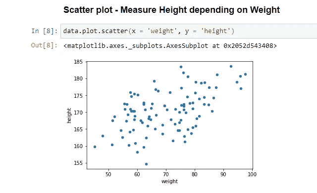

# 散点图和最佳拟合线

> 原文：<https://medium.com/analytics-vidhya/scatterplot-and-best-fit-line-b901b1992b07?source=collection_archive---------5----------------------->

**用 python 可视化和理解**

我最喜欢的和利基图表之一是散点图！如果我们在数据科学领域，有大量的统计分析要执行，那么散点图是我们的友好工具。散点图对于关注两个数字、数量序列之间的关系以及技术和非技术领域中的一个公共序列非常有用。

**什么是散点图？**

散点图使用 X 轴和 Y 轴显示定量变量之间的关系。这些图通常用于理解数据，而不是用于交流。与线形图不同，散点图显示的点集中在单个数据点上。散点图最适合用于:
1 .揭开任何图案
2。找出两组数据之间的关系

## **读取散点图**

使用散点图时，我们必须为我们的观众明智地使用数据。我们可能需要分解数据来解释如何阅读它。

1.扫描每个轴:当数据包含多个变量时，我们的观众可能很难确定哪个变量代表哪个轴。

2.可视化截面:我们可以通过将点分成象限来创建截面。这是观察自然间断和分组存在的一个重要方面。这将有助于我们理解这种比较。

3.识别形状:在绘图时，最好将各个点总结成一个统一的形状。我们必须问自己一些问题，比如:
i)所有的点都在向同一个方向移动吗？
ii)是否像指数曲线？
iii)随着我的眼睛沿着轴移动，圆点是否在增加？
现在，我们将尝试使用 **Python、Pandas 和 Jupyter Notebook** 从数据库中探索体重身高比的模式，以直观地理解散点图。

在上面的笔记本中，我们使用 Dataset 来了解一个学校学生团队的身高(y 轴)与体重(x 轴)的关系。

**最佳拟合线**

最佳拟合线或最佳拟合线(“趋势”线)是一条直线，它可以穿过散点图上数据点的中心，也可以不穿过任何点，或者穿过所有点。

我们知道，直线的方程是:

# **y = mx + b**

其中 **m** 是直线的**斜率**，而 **b** 是 y 轴截距 **y 轴截距**
我们已经有了 X 和 y 轴的值，所以现在我们需要计算 m 和 b。这些的公式可以写成:

**m =(((均值(x)*均值(y))-均值(x*y))/
((均值(x)*均值(x))-均值(x*x)))**

**b =b =均值(y)-m *均值(x)**

分母是

denom=X.dot(X) — X.mean()*X.sum()

上面穿过数据点的绿线称为数据点的最佳拟合线。

**结论:**在分析一个流程时，通过数据点的线可能会有争议。如果基础数据的趋势不明确，执行行可能会产生混乱。