# Pyspark 中的 SCD Type1 实现

> 原文：<https://medium.com/analytics-vidhya/scd-type1-implementation-in-pyspark-f3ded001fec8?source=collection_archive---------1----------------------->

本文的目标是理解使用大数据计算框架 Apache Spark 实现 SCD Type1。


要对 SCD 类型 1 或渐变维度有更多的了解，请参考我以前的博客，链接如下。博客包含对维度建模和数据仓库的详细见解，涵盖的用例类似，但这里的解决方案是使用 Apache Spark 实现的。

> [https://medium . com/analytics-vid hya/SCD-type 1-implementation-in-python-e4f 6 EC 13 a 797](/analytics-vidhya/scd-type1-implementation-in-python-e4f6ec13a797)

1.  **创建 Spark 会话并导入数据集:**

```
import pyspark
from pyspark.sql import SparkSession
print(‘Modules Imported’)spark=SparkSession.builder.appName(‘spark_scd_type1’).getOrCreate()#Import source dataset
emp_src = spark.read.format(“jdbc”) \
 .option(“url”, “jdbc:oracle:thin:scott/scott@//localhost:1522/oracle”) \
 .option(“dbtable”, “emp_spark”).option(“user”, “scott”) \
 .option(“password”, “scott”).option(“driver”, “oracle.jdbc.driver.OracleDriver”).load()
emp_src.show(10)#import Target dataset, as of now target has zero rows
emp_tgt = spark.read.format(“jdbc”) \
 .option(“url”, “jdbc:oracle:thin:scott/scott@//localhost:1522/oracle”) \
 .option(“dbtable”, “emp_spark_scd1”).option(“user”, “scott”) \
 .option(“password”, “scott”).option(“driver”, “oracle.jdbc.driver.OracleDriver”).load() 
```

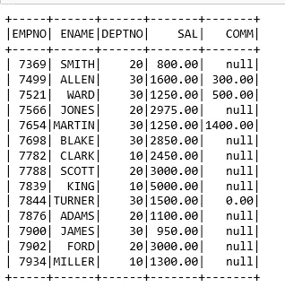

源数据集

```
#rename source and target DFs columns 
emp_src=emp_src.withColumnRenamed(‘EMPNO’,’EMPNO_SRC’) \
 .withColumnRenamed(‘SAL’,’SAL_SRC’) \
 .withColumnRenamed(‘ENAME’,’ENAME_SRC’) \
 .withColumnRenamed(‘DEPTNO’,’DEPTNO_SRC’) \
 .withColumnRenamed(‘COMM’,’COMM_SRC’) emp_tgt=emp_tgt.withColumnRenamed(‘EMPNO’,’EMPNO_TGT’) \
 .withColumnRenamed(‘SAL’,’SAL_TGT’)
```

**2。在源和目标 DFs 上执行左外连接:**

```
emp_scd=emp_src.join(emp_tgt,emp_src.EMPNO_SRC==emp_tgt.EMPNO_TGT,how=’left’)
emp_scd.show()
```

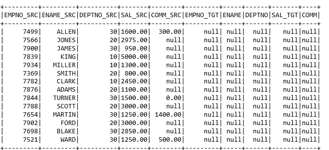

连接的数据框

**3。标记插入/更新的记录:**

```
from pyspark.sql.functions import lit
from pyspark.sql import functions as fscd_df=emp_scd.withColumn(‘INS_FLAG’,
 f.when( (emp_scd.EMPNO_SRC!=emp_scd.EMPNO_TGT) | emp_scd.EMPNO_TGT.isNull(),’Y’). \
 otherwise(‘NA’))
scd_df.show()
```

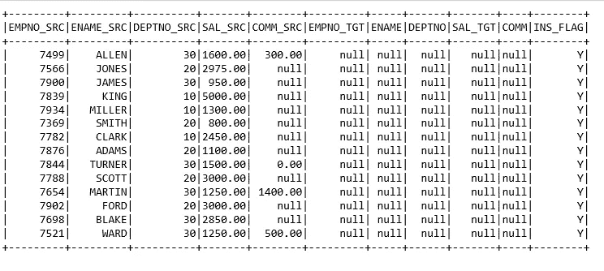

标记为插入的记录

**4。将记录插入目标:**

```
#renaming columns as per table column names
emp_ins=scd_df.select(scd_df[‘EMPNO_SRC’].alias(‘EMPNO’),scd_df[‘ENAME_SRC’].alias(‘ENAME’),scd_df[‘DEPTNO_SRC’].alias(‘DEPTNO’),scd_df[‘SAL_SRC’].alias(‘SAL’), scd_df[‘COMM_SRC’].alias(‘COMM’))emp_ins.write.format(“jdbc”).mode(‘append’) \
 .option(“url”, “jdbc:oracle:thin:scott/scott@//localhost:1522/oracle”) \
 .option(“dbtable”, “emp_spark_scd1”).option(“user”, “scott”) \
 .option(“password”, “scott”).option(“driver”, “oracle.jdbc.driver.OracleDriver”).save()
```

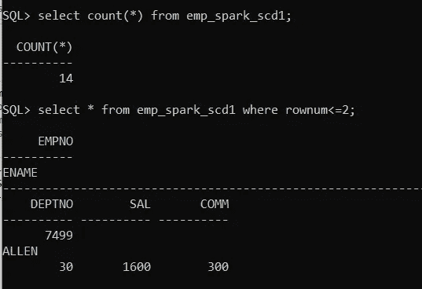

目标数据集

> 记录被加载到目标表中，由于 oracle 命令行中的对齐问题，无法放置整个数据集屏幕截图。

**5。插入并更新源中的一些记录:**

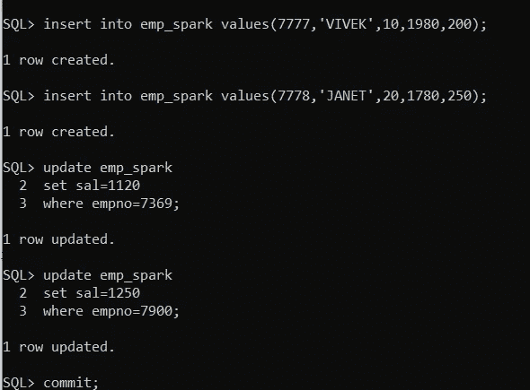

数据集更改

导入源和目标数据集:

```
#source data
emp_src1 = spark.read.format(“jdbc”) \
 .option(“url”, “jdbc:oracle:thin:scott/scott@//localhost:1522/oracle”) \
 .option(“dbtable”, “emp_spark”).option(“user”, “scott”) \
 .option(“password”, “scott”).option(“driver”, “oracle.jdbc.driver.OracleDriver”).load()
emp_src1.show()
```

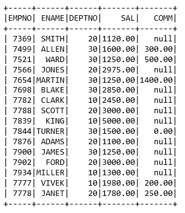

源数据

```
#target dataset
emp_tgt1 = spark.read.format(“jdbc”) \
 .option(“url”, “jdbc:oracle:thin:scott/scott@//localhost:1522/oracle”) \
 .option(“dbtable”, “emp_spark_scd1”).option(“user”, “scott”) \
 .option(“password”, “scott”).option(“driver”, “oracle.jdbc.driver.OracleDriver”).load()
emp_tgt1.show()
```

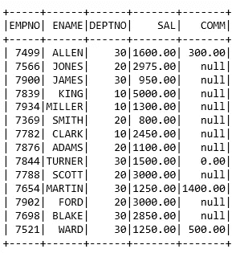

目标数据

**6。组合数据集和插入/更新标记**

```
from pyspark.sql.functions import round, col
emp_tgt1=emp_tgt1.select(round(‘EMPNO’,0).alias(‘EMPNO_TGT’),emp_tgt1[‘ENAME’].alias(‘ENAME_TGT’), round(‘DEPTNO’,0).alias(‘DEPTNO_TGT’)
 ,round(‘SAL’,2).alias(‘SAL_TGT’),round(‘COMM’,2).alias(‘COMM_TGT’))#perform left join on 
emp_scd1=emp_src1.join(emp_tgt1,emp_src1.EMPNO==emp_tgt1.EMPNO_TGT,how=’left’)
emp_scd1.show()
```

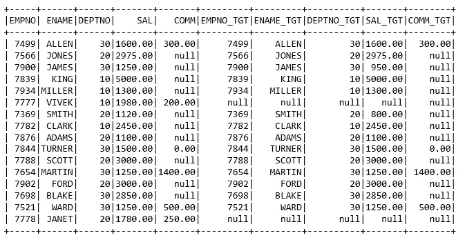

关联数据集

```
#Insert Flag
scd1_df=emp_scd1.withColumn(‘INS_FLAG’,
 f.when( (emp_scd1.EMPNO!=emp_scd1.EMPNO_TGT) | emp_scd1.EMPNO_TGT.isNull(),’Y’). \
 otherwise(‘NA’))#Update Flag
scd2_df=scd1_df.withColumn('UPD_FLAG',
                          f.when( (scd1_df.EMPNO==scd1_df.EMPNO_TGT) & (scd1_df.SAL!=scd1_df.SAL_TGT),'Y'). \
                          otherwise('NA'))
scd2_df.show()
```

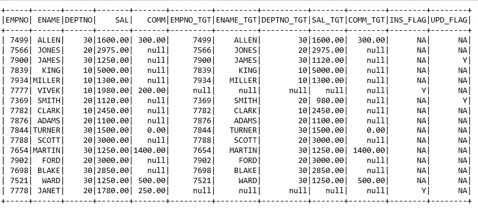

标记的记录

**7。插入 else 更新操作**

```
#insert records df
scd_ins=scd2_df.select(‘EMPNO’,’ENAME’,’DEPTNO’,’SAL’,’COMM’).filter(scd2_df.INS_FLAG==’Y’)
scd_ins.show(5)
```

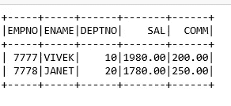

插入标记

```
#update records df
scd_upd=scd2_df.select(‘EMPNO’,’ENAME’,’DEPTNO’,’SAL’,’COMM’).filter(scd2_df.UPD_FLAG==’Y’)
scd_upd.show(5)
```

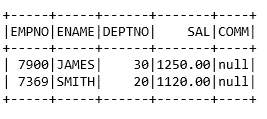

更新标记

```
#records to be overridden
scd_over=scd2_df.select(‘EMPNO’,’ENAME’,’DEPTNO’,’SAL’,’COMM’).filter((scd2_df.UPD_FLAG!=’Y’) & (scd2_df.INS_FLAG!=’Y’)) 
```

> 免责声明:到目前为止，Spark 不支持 DML 中的更新操作，所以记录将在目标中被覆盖。

**8。对数据帧进行并集，并将记录插入表:**

```
df_final = scd_ins.unionAll(scd_upd).unionAll(scd_over)
df_final.show()
df_final.count()
```

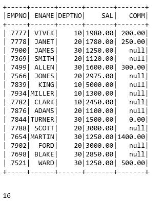

最终数据集

```
df_final.write.format(“jdbc”).mode(‘overwrite’) \
 .option(“url”, “jdbc:oracle:thin:[@localhost](http://twitter.com/localhost):1522/oracle”) \
 .option(“dbtable”, “emp_spark_scd1”).option(“user”, “scott”) \
 .option(“password”, “scott”).option(“driver”, “oracle.jdbc.driver.OracleDriver”).save()
```

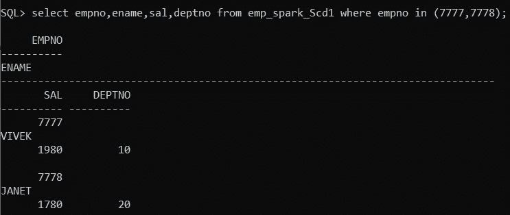

新记录

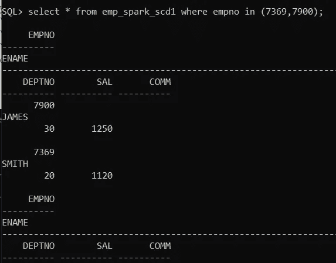

更新的记录

万岁！！！这是 Pyspark 中的 SCD Type1 实现，为了更好地理解流程和过程，分为两个部分。

# **总结:**

初始数据加载(满载)

如果存在实施，则插入 Else 更新

使用 sql_alchemy 库插入和更新记录

感谢所有人阅读我的博客，如果你喜欢我的内容和解释，请在媒体上关注我并分享你的反馈，这将永远帮助我们所有人提高我们的知识。

谢谢

Vivek Chaudhary