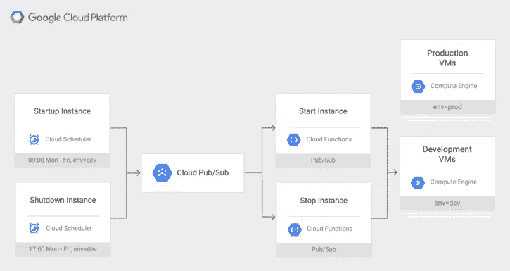
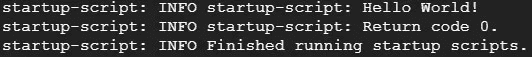

# 使用启动脚本调度计算引擎

> 原文：<https://medium.com/analytics-vidhya/scheduling-compute-engine-with-startup-scripts-1b17c40b311c?source=collection_archive---------11----------------------->

大家好。今天，我们将创建一个计算引擎实例，它使用自定义脚本在特定时间启动和关闭。让我再解释一下。

谷歌计算引擎(GCE)是一个基础设施即服务(IaaS ),允许开发人员在物理硬件上运行他们的工作。他们提供如此多类型的虚拟机。你可以修改内存，中央处理器，辅助存储器，甚至操作系统。

好的，但是我们怎么安排呢？我的意思是，我们肯定不会每次都雇人按按钮。对吗？还是我们？

这就是谷歌云调度器、云功能和云发布/订阅的用武之地。看起来很多，但相信我，不是的。在 Cloud Scheduler 的帮助下，我们可以设置特定的时间和有效载荷(我将在后面解释)。云调度程序触发发布/订阅。发布/订阅获取有效负载并触发云功能。最后，云函数使用启动脚本启动或关闭我们的实例。



完整的环境(图片来自[cloud.google.com](https://cloud.google.com/compute/docs/startupscript)

所以让我们开始吧。我们将使用网站来设置这个。如果你愿意，可以使用 [gcloud 命令行工具](https://cloud.google.com/compute/docs/gcloud-compute)。首先，您应该启用计费来访问计算引擎。然而，谷歌给你一年 300 美元的信用！

好的，让我们转到[计算引擎实例](https://console.cloud.google.com/compute/instances)并创建一个新项目。然后点击顶部的**创建实例**。设置名称**开发实例**。选择区域 **us-west1** ，选择区域 **us-west1-b** 。转到管理、安全性、磁盘、网络、单独租赁。在管理下点击**添加标签**，设置 **env** 为 key， **dev** 为 value。然后点击**创建**。恭喜，您已经启动并运行了虚拟机。但是我们还没有完成。我们将使用发布/订阅设置云功能。

让我们前往[云函数](https://console.cloud.google.com/functions/)。点击**创建功能**。设置你的函数名**startinstancebub**。对于触发器，选择**云发布/订阅**。对于主题，选择**创建新主题…** 。将出现一个新对话框。在此框中，设置名称**开始-实例-事件**。点击**创建**。对话框将会消失。运行时，选择 **Node.js 8** 。选择 **index.js** 并用这个替换代码。

```
const Compute = require('@google-cloud/compute');
const compute = new Compute();

exports.startInstancePubSub = async (event, context, callback) => {
  try {
    const payload = _validatePayload(
      JSON.parse(Buffer.from(event.data, 'base64').toString())
    );
    const options = {filter: `labels.${payload.label}`};
    const [vms] = await compute.getVMs(options);
    await Promise.all(
      vms.map(async instance => {
        if (payload.zone === instance.zone.id) {
          const [operation] = await compute
            .zone(payload.zone)
            .vm(instance.name)
            .start();

          // Operation pending
          return operation.promise();
        }
      })
    );
    const message = `Successfully started instance(s)`;
    console.log(message);
    callback(null, message);
  } catch (err) {
    console.log(err);
    callback(err);
  }
};const _validatePayload = payload => {
  if (!payload.zone) {
    throw new Error(`Attribute 'zone' missing from payload`);
  } else if (!payload.label) {
    throw new Error(`Attribute 'label' missing from payload`);
  }
  return payload;
};
```

然后选择 **package.json** 。用这个替换代码。

```
{
  "name": "cloud-functions-schedule-instance",
  "version": "0.1.0",
  "private": true,
  "license": "Apache-2.0",
  "author": "Google Inc.",
  "repository": {
    "type": "git",
    "url": "https://github.com/GoogleCloudPlatform/nodejs-docs-samples.git"
  },
  "engines": {
    "node": ">=8.0.0"
  },
  "scripts": {
    "test": "mocha test/*.test.js --timeout=20000"
  },
  "devDependencies": {
    "@google-cloud/nodejs-repo-tools": "^3.3.0",
    "mocha": "^6.0.0",
    "proxyquire": "^2.0.0",
    "sinon": "^7.0.0"
  },
  "dependencies": {
    "@google-cloud/compute": "^1.0.0"
  }
}
```

对于要执行的功能，设置**startinstancebusub**。然后点击**创建**。这是我们的开胃菜。让我们设置停止功能。

再次点击**创建功能**。将其命名为 **stopInstancePubSub** 。对于触发，选择**云发布/订阅**。对于主题，选择**创建新主题…** 。在对话框中，设置名称**停止实例事件**点击创建。运行时，选择 **node.js 8** 。选择 index.js 选项卡，并将代码替换为。

```
const Compute = require('@google-cloud/compute');
const compute = new Compute();

exports.stopInstancePubSub = async (event, context, callback) => {
  try {
    const payload = _validatePayload(
      JSON.parse(Buffer.from(event.data, 'base64').toString())
    );
    const options = {filter: `labels.${payload.label}`};
    const [vms] = await compute.getVMs(options);
    await Promise.all(
      vms.map(async instance => {
        if (payload.zone === instance.zone.id) {
          const [operation] = await compute
            .zone(payload.zone)
            .vm(instance.name)
            .stop();

          // Operation pending
          return operation.promise();
        } else {
          return Promise.resolve();
        }
      })
    ); const message = `Successfully stopped instance(s)`;
    console.log(message);
    callback(null, message);
  } catch (err) {
    console.log(err);
    callback(err);
  }
};

const _validatePayload = payload => {
  if (!payload.zone) {
    throw new Error(`Attribute 'zone' missing from payload`);
  } else if (!payload.label) {
    throw new Error(`Attribute 'label' missing from payload`);
  }
  return payload;
};
```

然后选择 package.json 并用以下代码替换代码。

```
{
  "name": "cloud-functions-schedule-instance",
  "version": "0.1.0",
  "private": true,
  "license": "Apache-2.0",
  "author": "Google Inc.",
  "repository": {
    "type": "git",
    "url": "https://github.com/GoogleCloudPlatform/nodejs-docs-samples.git"
  },
  "engines": {
    "node": ">=8.0.0"
  },
  "scripts": {
    "test": "mocha test/*.test.js --timeout=20000"
  },
  "devDependencies": {
    "@google-cloud/nodejs-repo-tools": "^3.3.0",
    "mocha": "^6.0.0",
    "proxyquire": "^2.0.0",
    "sinon": "^7.0.0"
  },
  "dependencies": {
    "@google-cloud/compute": "^1.0.0"
  }
}
```

好了，我们设置了我们的功能和发布/订阅。接下来，我们将设置调度程序。转到[云调度器](https://console.cloud.google.com/cloudscheduler)。点击**创建工作**。将其命名为**启动-开发-实例**。对于频率，您可以输入任何您想要的 cron 时间。例如，*** * * * * ***表示每一分钟。或 0 9 * * 1–5 表示周一至周五每天的 09:00。对于时区，选择**美国/洛杉矶**。对于目标，选择**发布/订阅**。对于主题，输入**开始-实例-事件**。对于有效载荷(正如我前面提到的)，输入以下内容:

```
{"zone":"us-west1-b","label":"env=dev"}
```

然后点击**创建**。我们设置了启动调度程序，让我们设置停止一。

点击**创建作业**。将其命名为**关机开发实例**。对于频率，输入您的频率。对于时区，选择**美国/洛杉矶**。对于目标，选择**发布/订阅**。对于主题，输入**停止实例事件**。对于有效载荷(正如我前面提到的)，输入以下内容:

```
{"zone":"us-west1-b","label":"env=dev"}
```

然后点击**创建**。恭喜你！您安排了实例。但是我们还没有分配任何启动脚本。就这么办吧。

转到[计算引擎](https://console.cloud.google.com/compute/instances)。点击**开发实例**。点击页面顶部的**编辑**。查找自定义元数据。单击添加项目。对于键，输入**启动脚本**。对于 value，您可以输入您的脚本。一旦分配了启动脚本，每次虚拟机启动时，它都会执行启动脚本。让我们做一个 python 脚本的例子。

#!/bin/bash
python-<<EOF # python 脚本开始
print('Hello World！')
python 脚本的 EOF #结尾

这个脚本将被执行并打印“Hello World！”每次虚拟机启动时。让我们检查一下。转到计算引擎。选择**开发实例**。点击**开始**。当它启动时，点击 **SSH** 。它会打开一扇窗。这是您的 bash 命令行。键入以下代码查看日志:

tail -n 100 /var/log/syslog



已执行的启动脚本

我们结束了。您可以执行自己的脚本。如果你还有任何问题，请随时问我。祝您愉快:)