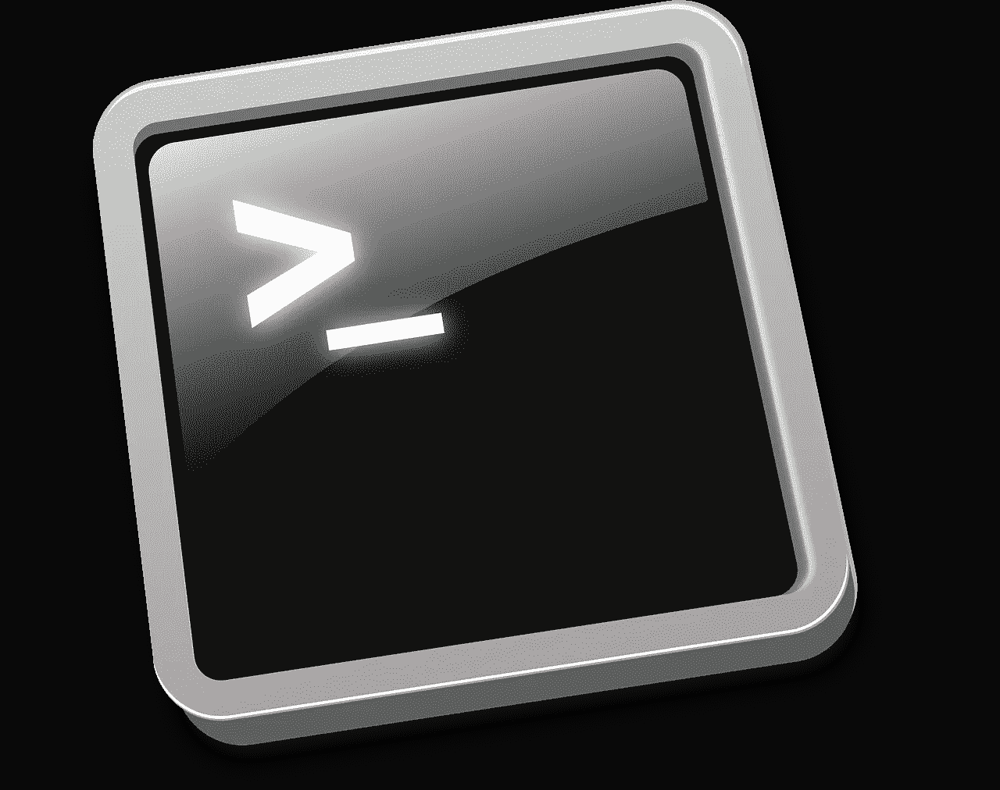

# 如何使用 Crontab 安排作业

> 原文：<https://medium.com/analytics-vidhya/scheduling-jobs-using-crontab-844c7e135d97?source=collection_archive---------11----------------------->

Cron 是一个允许 Unix 用户在预先定义的日期和时间自动运行任务(脚本、命令、软件……)的程序。这些任务称为 cron 作业，可用于备份数据、发送警报电子邮件、运行脚本等

cron 作业可以按分钟、小时、一月中的某一天、一个月、一周中的某一天或它们的任意组合进行调度。