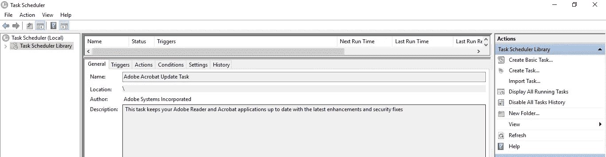
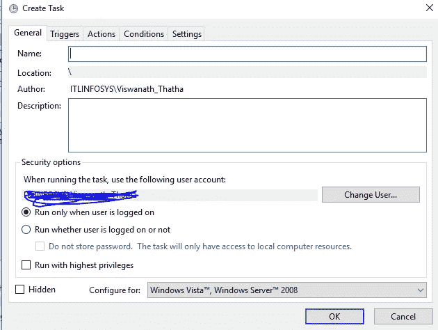
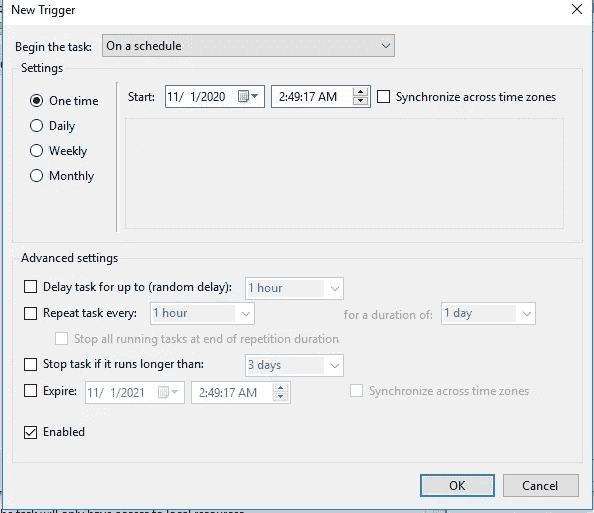
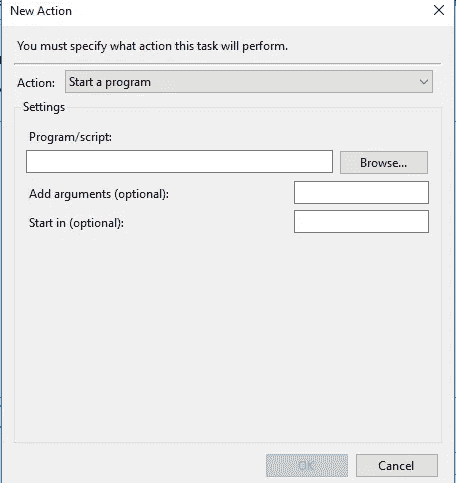

# 使用任务计划程序计划脚本

> 原文：<https://medium.com/analytics-vidhya/scheduling-scripts-using-task-scheduler-ced4d98a5be5?source=collection_archive---------17----------------------->

假设我有一个 python 程序，它需要每天从 web(web scrubling)中提取一些信息。我必须每天手动运行脚本来从 web 上获取数据。一天提取一次没什么大不了的，但是一天多次运行同一个脚本怎么办，如果我们忘记运行一次，我们会丢失我们想要提取的信息。对于处理数据的人来说，他们知道丢失数据的代价有多大。因此，为了避免这个问题，我们需要安排脚本在我们希望它运行的时间运行。

有许多方法可以安排一个脚本。如果我们从事开发项目，我们会对 Cron 有所了解，Cron 是一个软件工具，允许我们在类 Unix 系统上调度任务。有一种比这更简单的方法来实现我们的调度目标。我们可以在 windows 机器中使用内置的“任务调度程序”。我们可以很容易地利用这个工具来设置一个调度程序来处理我们的任务。使用任务调度器，我们可以调度任何类型的活动，如调度 python 脚本、java 脚本、bash 脚本等。我们只需要创建并遵循几个简单的步骤。

这是“任务计划程序”的主页。在中间窗口，您将看到已设置的调度程序，在右侧选项卡(操作)中，您将看到创建任务、导入任务、显示正在运行的任务等选项。

让我们创建一个基本任务，其中我们将安排一个 python 脚本在一天中的 10:00、14:00、18:00、22:00 运行四次，创建起来非常简单。

在“操作”窗口中，我们将单击“创建新的基本任务”

单击“创建任务”后，您将看到不同的选项卡常规、触发器、操作、条件和设置。在 General 下，我们将为我们的调度程序提供一个名称和描述。如果系统中指定了多个帐户，您可以更改用户。无论用户是否登录，您都可以选择运行脚本。

接下来点击“触发器”,你会看到下面的屏幕

在这里，您将有不同的选项来开始任务，其中一些是“按计划”、“登录时”、“启动时”等。接下来，在“设置”下，您可以选择设置运行作业的时间和频率(每天、每周、一次等)。).在高级设置下，您可以选择重复任务、运行超过 X 天时停止任务、过期等。你需要选择适合你的选项。

接下来点击“操作”，你会看到下面的屏幕

这是您将提到您的可执行文件和脚本路径的主要步骤。在“操作”下，选择“启动程序”，然后在“设置—程序/脚本”下，提及可执行文件的位置。对于 python 来说，要找到可执行文件的 find 位置，只需发出命令“pip show <any package="">”就可以了，它会显示该位置在哪里。在我的例子中，我使用的是 anaconda (python ),下面是我发出 pip show 命令后得到的结果:</any>

如上所述，您可以排除路径 lib\site-packages，然后添加 python.exe 来代替它们，这样我的 python 可执行路径将是**c:\ users \ XXXXXX \ appdata \ local \ continuum \ anaconda 3 \ python . exe**，我们将把它放在“Program/script”下。接下来，在“添加参数”下，指定。完全 py 文件。

例如**c:\ users \ xxxxx \ myPythonFiles \ example . py**

接下来，可以根据您的需求定制条件和设置。一旦提供了所有信息，

你会在时间表中看到这一点。该脚本每天上午 9 点触发，然后每 4 小时重复一次。如果要手动运行，可以右键后运行。类似地，如果您想要调度 java 脚本，您只需用 jre 文件位置更改您的程序/脚本位置。

很简单对吧..您不需要任何工具就可以从我们的任务调度程序中运行简单的脚本。如果你想生产你的代码，那么你应该选择像 Cron 这样的软件。此外，在每个云提供商中，我们都有不同的脚本调度和管道调度选项。这只是安排脚本的一种简单方式。希望你喜欢这篇文章。