# 学校 Java 项目国际象棋(1)

> 原文：<https://medium.com/analytics-vidhya/school-java-project-chess-1-85f97a2d1877?source=collection_archive---------7----------------------->


## 打印出一个空的游戏板

让我们创建一个简单的象棋应用程序，它可以像非数字棋盘一样使用，这意味着我们可以使用鼠标在棋盘上移动棋子。完成后，它看起来会像下面这样。

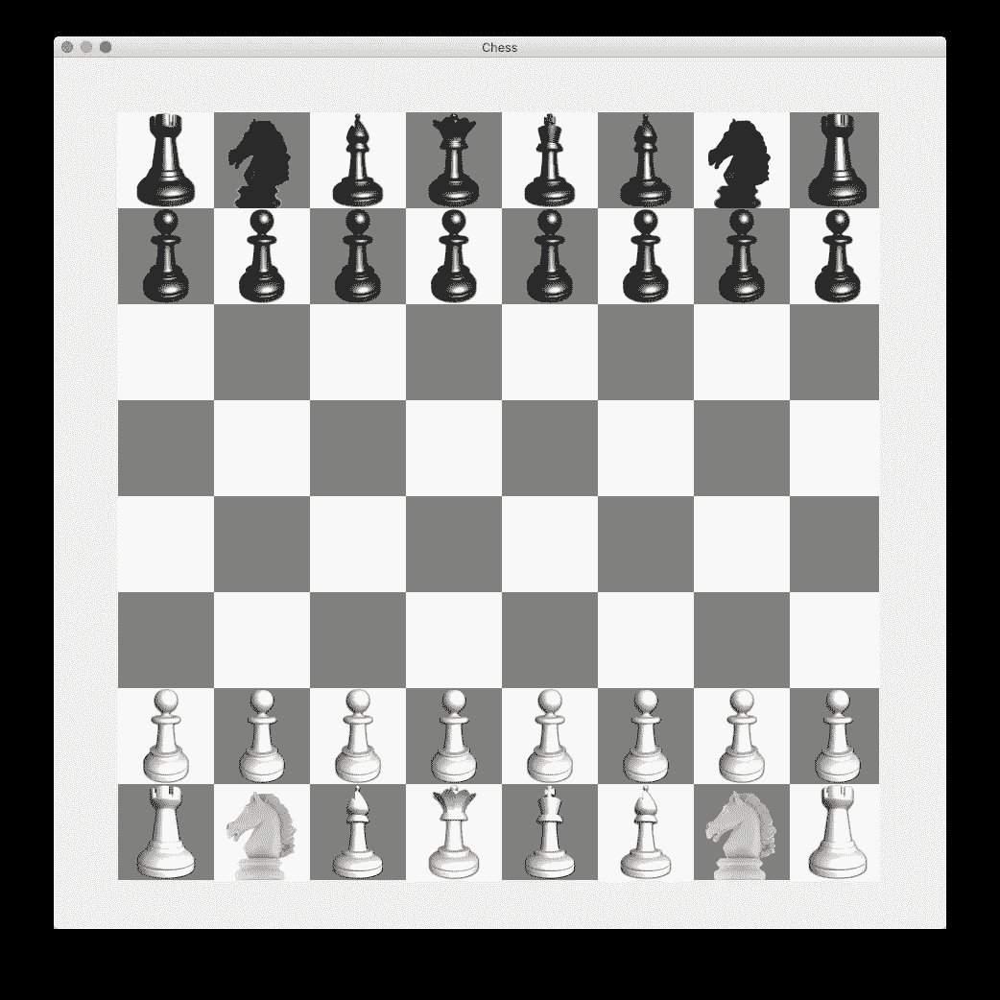

这是这个系列的第一篇文章，所以我们将同时开始 Java Hello World。我们的目标是打印出一个用 64 个点表示的简单的空棋盘。

```
 a b c d e f g h
8 . . . . . . . . 8
7 . . . . . . . . 7
6 . . . . . . . . 6
5 . . . . . . . . 5
4 . . . . . . . . 4
3 . . . . . . . . 3
2 . . . . . . . . 2
1 . . . . . . . . 1
  a b c d e f g h
```

我们只是简单地遵循这个[象棋维基](https://en.wikipedia.org/wiki/Chess)页面上显示的棋盘风格。

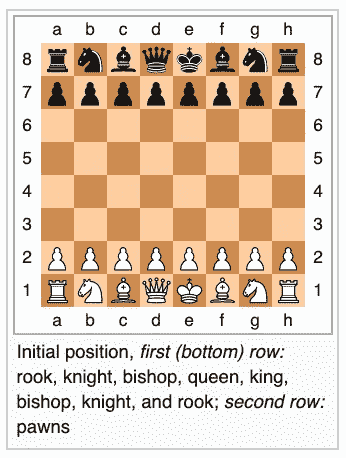

以下是我用过的电脑。如果你使用的不是 MacOS，你可能需要修改一些工具来适应，尽管你在这里找到的 Java 源代码也可以在你的机器上运行，我的意思是兼容。

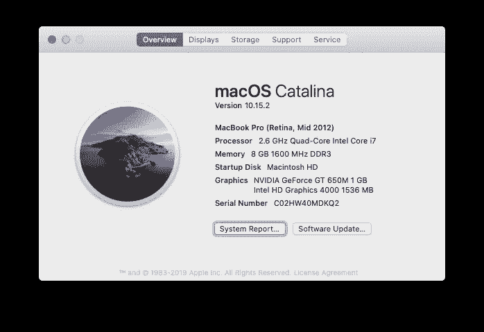

你可以通过按 Cmd + Space 调出 app term，开始输入“term…”。

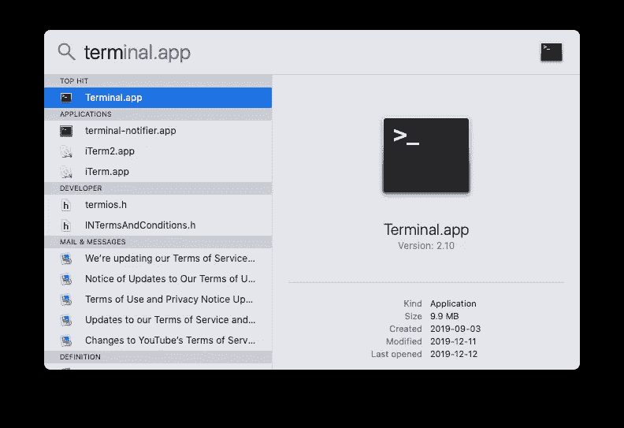

终端窗口如下所示。默认的命令行提示符可以是“$”或“%”或其他什么。

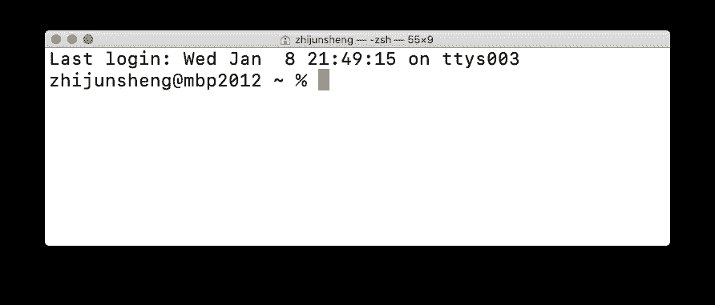

下一步没必要。但是为了好玩，让我们把默认提示从“`zhijunsheng@mbp2012 ~ %` ”改为“🄹”。

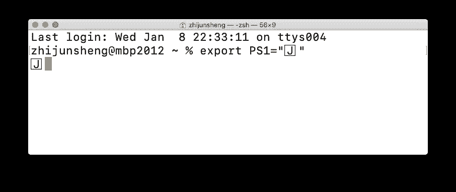

确保您的机器上安装了 Java。关于如何在你的机器上安装 Java 的细节我就不赘述了。这是做这件事的一种方法。如果你没有安装`homebrew`，你可以运行下面的。

```
🄹 ruby -e "$(curl -fsSL [https://raw.githubusercontent.com/Homebrew/install/master/install](https://raw.githubusercontent.com/Homebrew/install/master/install))"
```

然后跑`brew install java`。

确保 java 安装正确:

```
🄹 java -version
java version "1.8.0_20"
Java(TM) SE Runtime Environment (build 1.8.0_20-b26)
Java HotSpot(TM) 64-Bit Server VM (build 25.20-b23, mixed mode)
```

在你的文件系统中创建一个象棋目录，或者文件夹。

```
🄹 mkdir chess
🄹 ls -l
total 0
drwxr-xr-x  2 zhijunsheng  staff   64  8 Jan 23:05 chess
🄹 cd chess 
🄹 ls -l   
🄹
```

我们要写的第一个程序是 Hello Chess。我们使用 vim 文本编辑器来编辑源代码。缩进使用两个空格，而不是 tab 键。运行`vim Chess.java`开始输入源代码。如果你不知道如何使用 vim，这是一个和它交朋友的好时机，因为大多数程序员都可以使用这个小巧但功能强大的文本编辑工具。

```
🄹 vim Chess.java
```

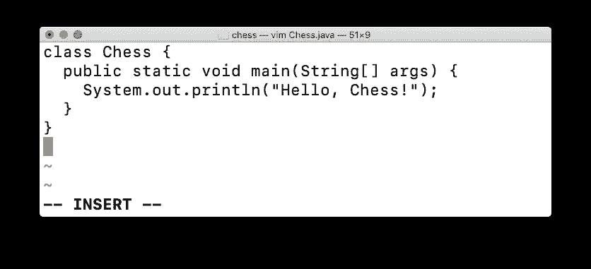

完整的代码有 5 行:

```
class Chess {
  public static void main(String[] args) {
    System.out.println("Hello, Chess!");
  }
}
```

用 javac 编译 Chess.java，用 java 运行应用程序。

```
🄹 javac Chess.java 
🄹 java Chess 
Hello, Chess!
```

恭喜你！我们的第一个 Java 程序运行良好。

顺便说一句，因为程序员很懒，上面两个命令可以这样放在一起:

```
🄹 javac Chess.java && java Chess
Hello, Chess!
```

没有必要每次更新源代码后都手动键入相同的命令，因为向上箭头键🔼带您浏览终端中的命令历史。

如果你检查你当前的目录，你会发现一个新的文件 Chess.class，它是命令`javac Chess.java`的输出。

```
🄹 ls -l          
total 16
-rw-r--r--  1 zhijunsheng  staff  417  8 Jan 23:21 Chess.class
-rw-r--r--  1 zhijunsheng  staff  105  8 Jan 23:15 Chess.java
```

在我们继续之前，让我们看看如果我们在源代码中犯了一个错误，比如说我们忘记了分号“；”。

```
class Chess {
  public static void main(String[] args) {
    System.out.println("Hello, Chess!")
  }
}
```

Java 编译器友好地报告说，在第 3 行“；”预期:

```
🄹 vim Chess.java              
🄹 javac Chess.java && java Chess
Chess.java:3: error: ';' expected
    System.out.println("Hello, Chess!")
                                       ^
1 error
```

因此，我们返回到 vim 命令模式下，键入“3 ”,然后键入“G ”,将光标移动到第 3 行。

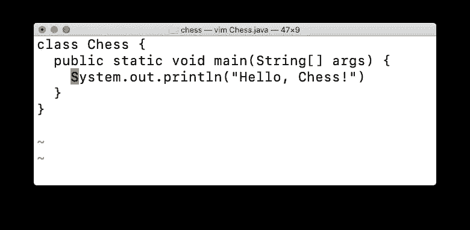

然后键入“$”将光标移动到当前行的末尾。

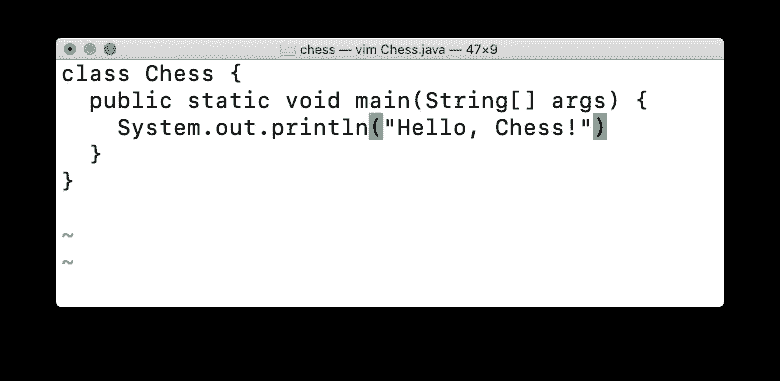

现在键入“a”进入编辑模式并添加丢失的分号。

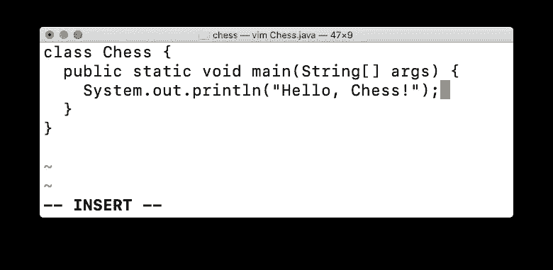

按 esc 键退出编辑模式，进入命令模式。

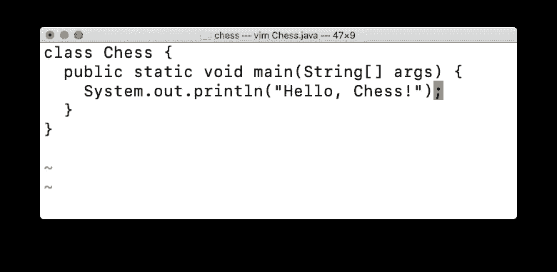

键入“:”和“x”，然后回车保存并退出 vim。

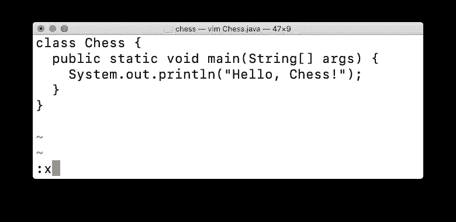

```
🄹 javac Chess.java && java Chess
Chess.java:3: error: ';' expected
    System.out.println("Hello, Chess!")
                                       ^
1 error
🄹 vim Chess.java                
🄹 javac Chess.java && java Chess
Hello, Chess!
🄹
```

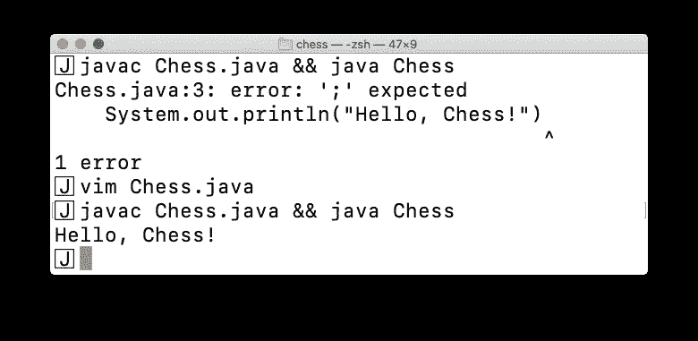

同样，如果需要如何使用 vim 的帮助，谷歌是我们最好的朋友。

我们现在可以做象棋相关的东西。事实上，我们几乎可以用程序做任何事情。

逻辑棋盘可以用 8×8 的点来表示。下面的代码可以打印出 8 个点。我们创建了一个名为 Board 的新类。

```
class Chess {
  public static void main(String[] args) {
    **Board brd = new Board();
    System.out.println(brd);**
  }
}**class Board {
  public String toString() {
    String brdStr = "";
    brdStr += " . . . . . . . .";
    return brdStr;
  }
}**
```

编辑/编译/运行它。

```
🄹 vim Chess.java                
🄹 javac Chess.java && java Chess
 . . . . . . . .
```

用 for 循环重构硬编码的`“ . . . . . . . .”`:

```
class Board {
  public String toString() {
    String brdStr = "";
 **for (int col = 0; col < 8; col++) {
      brdStr += " .";
    }**
    return brdStr;
  }
}
```

编辑/编译/运行它来查看同样的 8 点输出。

```
🄹 vim Chess.java                
🄹 javac Chess.java && java Chess
 . . . . . . . .
```

现在再加一个 for 循环打印出 8 行`“ . . . . . . . .”`。

```
class Board {
  public String toString() {
    String brdStr = "";
    **for (int r = 0; r < 8; r++) {**
      for (int c = 0; c < 8; c++) {
        brdStr += " .";
      }
      **brdStr += "\n"; // line break
    }**
    return brdStr;
  }
}
```

编辑/编译/运行它。

```
🄹 vim Chess.java                
🄹 javac Chess.java && java Chess
 . . . . . . . .
 . . . . . . . .
 . . . . . . . .
 . . . . . . . .
 . . . . . . . .
 . . . . . . . .
 . . . . . . . .
 . . . . . . . .
```

加顶`a b c d e f g h`:

```
class Board {
  public String toString() {
    String brdStr = "";
    **brdStr += " a b c d e f g h\n";**
    for (int r = 0; r < 8; r++) {
      for (int c = 0; c < 8; c++) {
        brdStr += " .";
      }
      brdStr += "\n"; // line break
    }
    return brdStr;
  }
}
```

编辑/编译/运行它。

```
🄹 vim Chess.java                
🄹 javac Chess.java && java Chess
 a b c d e f g h
 . . . . . . . .
 . . . . . . . .
 . . . . . . . .
 . . . . . . . .
 . . . . . . . .
 . . . . . . . .
 . . . . . . . .
 . . . . . . . .
```

添加从 1 到 8 的垂直坐标标签:

```
class Board {
  public String toString() {
    String brdStr = "";
    **brdStr += "  a b c d e f g h\n";**
    for (int r = 0; r < 8; r++) {
      **brdStr += (8 - r) + "";**
      for (int c = 0; c < 8; c++) {
        brdStr += " .";
      }
      brdStr += "\n"; // line break
    }
    return brdStr;
  }
}
```

编辑/编译/运行它。

```
🄹 vim Chess.java                
🄹 javac Chess.java && java Chess
  a b c d e f g h
8 . . . . . . . .
7 . . . . . . . . 
6 . . . . . . . . 
5 . . . . . . . . 
4 . . . . . . . . 
3 . . . . . . . . 
2 . . . . . . . . 
1 . . . . . . . .
```

类似地，我们可以添加等级标签和底部文件标签。

以下是完整的源代码:

```
class Chess {
  public static void main(String[] args) {
    Board brd = new Board();
    System.out.println(brd);
  }
}class Board {
  public String toString() {
    String brdStr = "";
    brdStr += "  a b c d e f g h\n";
    for (int r = 0; r < 8; r++) {
      brdStr += (8 - r) + "";
      for (int c = 0; c < 8; c++) {
        brdStr += " .";
      }
      brdStr += " " + (8 - r) + "\n";
    }
    brdStr += "  a b c d e f g h\n";
    return brdStr;
  }
}
```

我们结束了。

[学校 Java 项目象棋(1)](/@zhijunsheng/school-java-project-chess-1-85f97a2d1877?source=friends_link&sk=eab9b54731072ce1aefe26f2bf2f2d7b)

[学校 Java 项目象棋(二)](/@zhijunsheng/school-java-project-chess-2-e640d4391a20?source=friends_link&sk=502668bdbc9ff9291585144d5702c2fc)