# 学校 Java 项目蒙德里安艺术

> 原文：<https://medium.com/analytics-vidhya/school-java-project-mondrian-art-5d2c0bbf8940?source=collection_archive---------6----------------------->


## 您可以看到并享受的递归:-D

对大多数人来说，他们看到的第一个递归例子是阶乘。

```
🄹 vim Factorial.java                    
🄹 javac Factorial.java && java Factorial
5! = 120
```

下面是它的实现方式:

```
class Factorial {
  private static int fact(int n) {
    if(n == 0) {
      return 1;
    }
    return n * fact(n - 1);
  } public static void main(String[] args) {
    System.out.println("5! = " + fact(5));
  }
}
```

今天我们来玩蒙德里安艺术的视觉递归。[皮耶·蒙德里安](https://en.wikipedia.org/wiki/Piet_Mondrian)是荷兰画家和理论家，被认为是 20 世纪最伟大的艺术家之一。他被认为是 20 世纪抽象艺术的先驱之一，因为他改变了他的艺术方向，从具象绘画转向越来越抽象的风格，直到他的艺术词汇减少到简单的几何元素。

为了简单起见，我们将所有代码放在一个文件 Piet.java 中。

```
🄹 vim Piet.java
```

让我们在 JFrame 中画一条线来湿一下手。

```
import javax.swing.JFrame;
import javax.swing.JPanel;
import java.awt.Graphics;class CanvasPanel extends JPanel {

  public void paintComponent(Graphics g) {
    g.drawLine(0, 0, getWidth(), getHeight());
  }
}class Piet {
  Piet() {
    JFrame f = new JFrame("Piet Mondrian");
    f.setSize(500, 309);
    f.setLocation(50, 50);
    f.add(new CanvasPanel());
    f.setVisible(true);
  }

  public static final void main(String[] args) {
    new Piet();
  }
}
```

编译并运行它。

```
🄹 javac Piet.java && java Piet
```

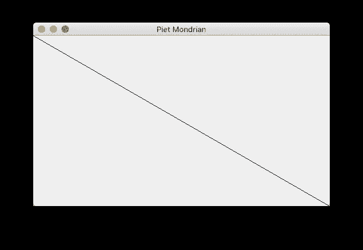

将画线代码重构为一个名为`drawLineInRect`的函数。这次试试垂直线。

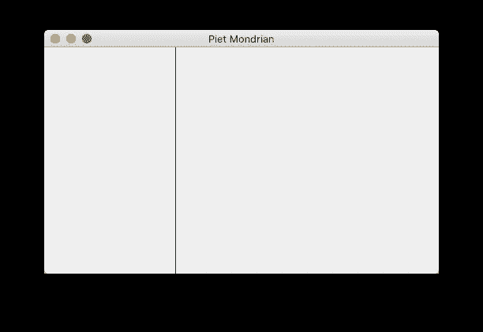

到目前为止完整的代码:

```
import javax.swing.JFrame;
import javax.swing.JPanel;
import java.awt.Graphics;
import java.awt.Rectangle;class CanvasPanel extends JPanel {

  public void paintComponent(Graphics g) {
    Rectangle rect = new Rectangle(0, 0, getWidth(), getHeight());
    drawLineInRect(rect, g);
  }private void drawLineInRect(Rectangle rect, Graphics g) {
    int randomOffset = rect.width / 3;
    int fromX = rect.x + randomOffset;
    int fromY = rect.y; 
    int toX = fromX;
    int toY = rect.y + rect.height;
    g.drawLine(fromX, fromY, toX, toY);
  }
}class Piet {
  Piet() {
    JFrame f = new JFrame("Piet Mondrian");
    f.setSize(500, 309);
    f.setLocation(50, 50);
    f.add(new CanvasPanel());
    f.setVisible(true);
  }

  public static final void main(String[] args) {
    new Piet();
  }
}
```

让我们让这条垂直线变得随机。

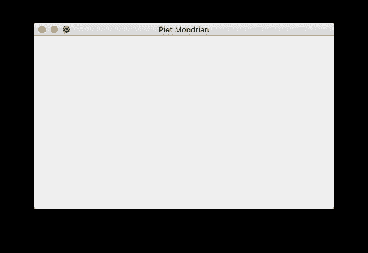

到目前为止完整的代码:

```
import javax.swing.JFrame;
import javax.swing.JPanel;
import java.awt.Graphics;
import java.awt.Rectangle;
**import java.util.Random;**class CanvasPanel extends JPanel {
  **private Random rand = new Random();** public void paintComponent(Graphics g) {
    Rectangle rect = new Rectangle(0, 0, getWidth(), getHeight());
    drawLineInRect(rect, g);
  } private void drawLineInRect(Rectangle rect, Graphics g) {
    **int randomOffset = rand.nextInt(rect.width);**
    int fromX = rect.x + randomOffset;
    int fromY = rect.y; 
    int toX = fromX;
    int toY = rect.y + rect.height;
    g.drawLine(fromX, fromY, toX, toY);
  }
}class Piet {
  Piet() {
    JFrame f = new JFrame("Piet Mondrian");
    f.setSize(500, 309);
    f.setLocation(50, 50);
    f.add(new CanvasPanel());
    f.setVisible(true);
  }

  public static final void main(String[] args) {
    new Piet();
  }
}
```

用黄色填充左边的小矩形。

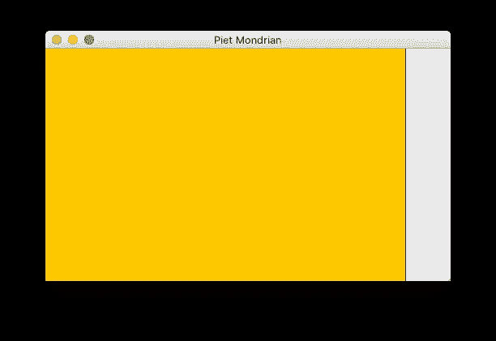

到目前为止完整的代码:

```
import javax.swing.JFrame;
import javax.swing.JPanel;
import java.awt.Graphics;
import java.awt.Rectangle;
**import java.awt.Color;**
import java.util.Random;class CanvasPanel extends JPanel {
  private Random rand = new Random(); public void paintComponent(Graphics g) {
    Rectangle rect = new Rectangle(0, 0, getWidth(), getHeight());
    drawLineInRect(rect, g);
  } private void drawLineInRect(Rectangle rect, Graphics g) {
    int randomOffset = rand.nextInt(rect.width);
    int fromX = rect.x + randomOffset;
    int fromY = rect.y;
    int toX = fromX;
    int toY = rect.y + rect.height;
    g.drawLine(fromX, fromY, toX, toY); **Rectangle rect0 = new Rectangle(rect.x, rect.y, randomOffset, rect.height);
    g.setColor(Color.orange);
    g.fillRect(rect0.x, rect0.y, rect0.width, rect0.height);
  }**
}class Piet {
  Piet() {
    JFrame f = new JFrame("Piet Mondrian");
    f.setSize(500, 309);
    f.setLocation(50, 50);
    f.add(new CanvasPanel());
    f.setVisible(true);
  } public static final void main(String[] args) {
    new Piet();
  }
}
```

用不同的颜色填充两个小矩形。

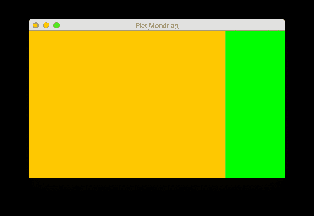

```
class CanvasPanel extends JPanel {
  private Random rand = new Random(); public void paintComponent(Graphics g) {
    Rectangle rect = new Rectangle(0, 0, getWidth(), getHeight());
    drawLineInRect(rect, g);
  } private void drawLineInRect(Rectangle rect, Graphics g) {
    int randomOffset = rand.nextInt(rect.width);
    int fromX = rect.x + randomOffset;
    int fromY = rect.y;
    int toX = fromX;
    int toY = rect.y + rect.height;
    g.drawLine(fromX, fromY, toX, toY); Rectangle rect0 = new Rectangle(rect.x, rect.y, randomOffset, rect.height);
    g.setColor(Color.orange);
    g.fillRect(rect0.x, rect0.y, rect0.width, rect0.height);
    **Rectangle rect1 = new Rectangle(rect.x + randomOffset, rect.y, rect.width - randomOffset, rect.height);
    g.setColor(Color.green);
    g.fillRect(rect1.x, rect1.y, rect1.width, rect1.height);**
  }
}
```

有一个问题:垂直线消失了，即被两个小矩形覆盖。我们需要的是这样的东西:

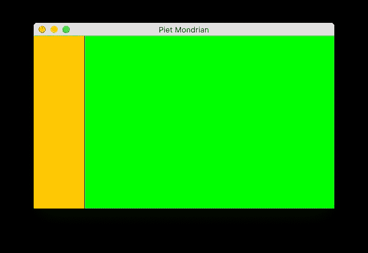

在画完两个矩形后画线就固定了。我们还需要为线条设置黑色。

```
class CanvasPanel extends JPanel {
  private Random rand = new Random(); public void paintComponent(Graphics g) {
    Rectangle rect = new Rectangle(0, 0, getWidth(), getHeight());
    drawLineInRect(rect, g);
  } private void drawLineInRect(Rectangle rect, Graphics g) {
    int randomOffset = rand.nextInt(rect.width); Rectangle rect0 = new Rectangle(rect.x, rect.y, randomOffset, rect.height);
    g.setColor(Color.orange);
    g.fillRect(rect0.x, rect0.y, rect0.width, rect0.height);
    Rectangle rect1 = new Rectangle(rect.x + randomOffset, rect.y, rect.width - randomOffset, rect.height);
    g.setColor(Color.green);
    g.fillRect(rect1.x, rect1.y, rect1.width, rect1.height); int fromX = rect.x + randomOffset;
    int fromY = rect.y;
    int toX = fromX;
    int toY = rect.y + rect.height;
    g.setColor(Color.black);
    g.drawLine(fromX, fromY, toX, toY);
  }
}
```

修改方法`drawLineInRect`,使其为纵向矩形绘制一条垂直线，为横向矩形绘制一条水平线。

```
class CanvasPanel extends JPanel {
  private Random rand = new Random(); public void paintComponent(Graphics g) {
    Rectangle rect = new Rectangle(0, 0, getWidth(), getHeight());
    drawLineInRect(rect, g);
  } private void drawLineInRect(Rectangle rect, Graphics g) {
    i**nt randomOffset;
    Rectangle rect0, rect1;
    int fromX, fromY, toX, toY;** **if (rect.width < rect.height) {
      randomOffset = rand.nextInt(rect.height);
      rect0 = new Rectangle(rect.x, rect.y, rect.width, randomOffset);
      rect1 = new Rectangle(rect.x, rect.y + randomOffset, rect.width, rect.height - randomOffset);
      fromX = rect.x;
      fromY = rect.y + randomOffset;
      toX = fromX + rect.width;
      toY = fromY;
    } else {
      randomOffset = rand.nextInt(rect.width);
      rect0 = new Rectangle(rect.x, rect.y, randomOffset, rect.height);
      rect1 = new Rectangle(rect.x + randomOffset, rect.y, rect.width - randomOffset, rect.height);
      fromX = rect.x + randomOffset;
      fromY = rect.y;
      toX = fromX;
      toY = rect.y + rect.height;
    }** g.setColor(Color.orange);
    g.fillRect(rect0.x, rect0.y, rect0.width, rect0.height);
    g.setColor(Color.green);
    g.fillRect(rect1.x, rect1.y, rect1.width, rect1.height); g.setColor(Color.black);
    g.drawLine(fromX, fromY, toX, toY);
  }
}
```

我们可以通过改变画面宽度来测试肖像模式:

```
class Piet {
  Piet() {
    JFrame f = new JFrame("Piet Mondrian");
    f.setSize(**250**, 309);
    f.setLocation(50, 50);
    f.add(new CanvasPanel());
    f.setVisible(true);
  }

  public static final void main(String[] args) {
    new Piet();
  }
}
```

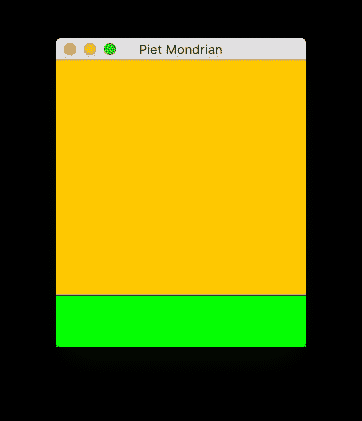

把它改回 500，我们在横向模式下得到一个矩形。

```
class Piet {
  Piet() {
    JFrame f = new JFrame("Piet Mondrian");
    f.setSize(**500**, 309);
    f.setLocation(50, 50);
    f.add(new CanvasPanel());
    f.setVisible(true);
  }

  public static final void main(String[] args) {
    new Piet();
  }
}
```

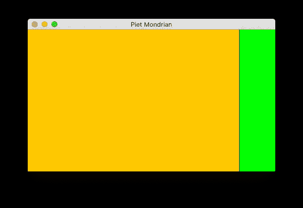

你准备好了吗？我们将进行递归调用的第一次尝试。

```
class CanvasPanel extends JPanel {
  private Random rand = new Random(); public void paintComponent(Graphics g) {
    Rectangle rect = new Rectangle(0, 0, getWidth(), getHeight());
    drawLineInRect(rect, g);
  } private void drawLineInRect(Rectangle rect, Graphics g) {
 **if (rect.width < 50 && rect.height < 50) {
      return;
    }** int randomOffset;
    Rectangle rect0, rect1;
    int fromX, fromY, toX, toY; if (rect.width < rect.height) {
      randomOffset = rand.nextInt(rect.height);
      rect0 = new Rectangle(rect.x, rect.y, rect.width, randomOffset);
      rect1 = new Rectangle(rect.x, rect.y + randomOffset, rect.width, rect.height - randomOffset);
      fromX = rect.x;
      fromY = rect.y + randomOffset;
      toX = fromX + rect.width;
      toY = fromY;
    } else {
      randomOffset = rand.nextInt(rect.width);
      rect0 = new Rectangle(rect.x, rect.y, randomOffset, rect.height);
      rect1 = new Rectangle(rect.x + randomOffset, rect.y, rect.width - randomOffset, rect.height);
      fromX = rect.x + randomOffset;
      fromY = rect.y;
      toX = fromX;
      toY = rect.y + rect.height;
    } g.setColor(Color.orange);
    g.fillRect(rect0.x, rect0.y, rect0.width, rect0.height);
    g.setColor(Color.green);
    g.fillRect(rect1.x, rect1.y, rect1.width, rect1.height); g.setColor(Color.black);
    g.drawLine(fromX, fromY, toX, toY); **drawLineInRect(rect0, g);
    drawLineInRect(rect1, g);**
  }
}
```

我们得到了:

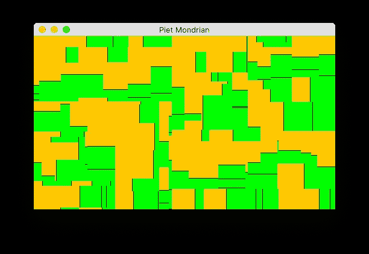

问题来自填充的矩形覆盖了一些线。它可以通过填充每个矩形的插图来解决:

```
int gap = 1;
g.setColor(Color.orange);
g.fillRect(rect0.x + gap, rect0.y + gap, rect0.width - 2*gap, rect0.height - 2*gap);
g.setColor(Color.green);
g.fillRect(rect1.x + gap, rect1.y + gap, rect1.width - 2*gap, rect1.height - 2*gap);
```

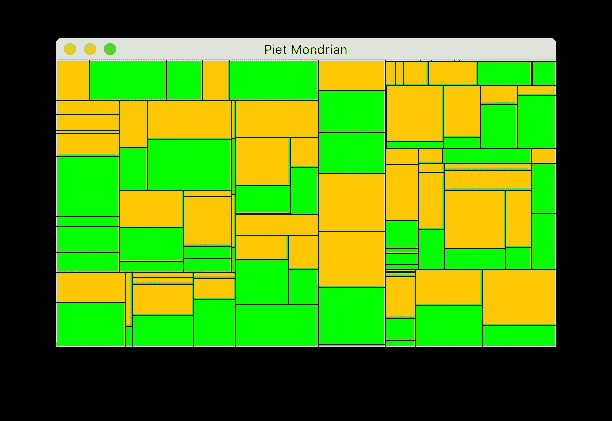

酷！让我们通过引入随机填充颜色来使它更酷。

```
class CanvasPanel extends JPanel {
  **private static final int LINE_WIDTH = 1;**
  private Random rand = new Random(); public void paintComponent(Graphics g) {
    Rectangle rect = new Rectangle(0, 0, getWidth(), getHeight());
    drawLineInRect(rect, g);
  } private void drawLineInRect(Rectangle rect, Graphics g) {
    if (rect.width < 100 && rect.height < 62) {
      return;
    } int randomOffset;
    Rectangle rect0, rect1;
    int fromX, fromY, toX, toY; if (rect.width < rect.height) {
      randomOffset = rand.nextInt(rect.height);
      rect0 = new Rectangle(rect.x, rect.y, rect.width, randomOffset);
      rect1 = new Rectangle(rect.x, rect.y + randomOffset, rect.width, rect.height - randomOffset);
      fromX = rect.x;
      fromY = rect.y + randomOffset;
      toX = fromX + rect.width;
      toY = fromY;
    } else {
      randomOffset = rand.nextInt(rect.width);
      rect0 = new Rectangle(rect.x, rect.y, randomOffset, rect.height);
      rect1 = new Rectangle(rect.x + randomOffset, rect.y, rect.width - randomOffset, rect.height);
      fromX = rect.x + randomOffset;
      fromY = rect.y;
      toX = fromX;
      toY = rect.y + rect.height;
    } **fillInRect(rect0, LINE_WIDTH, g);
    fillInRect(rect1, LINE_WIDTH, g);** g.setColor(Color.black);
    g.drawLine(fromX, fromY, toX, toY); drawLineInRect(rect0, g);
    drawLineInRect(rect1, g);
  } **private void fillInRect(Rectangle rect, int gap, Graphics g) {
    float red = rand.nextFloat();
    float grn = rand.nextFloat();
    float blu = rand.nextFloat();
    Color randomColor = new Color(red, grn, blu);
    g.setColor(randomColor);
    g.fillRect(rect.x + gap, rect.y + gap, rect.width - 2*gap, rect.height - 2*gap);
  }**
}
```

第一件艺术品出来了:

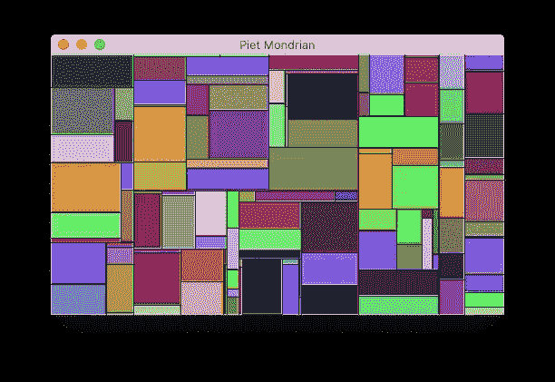

我忍不住又烤了一个。

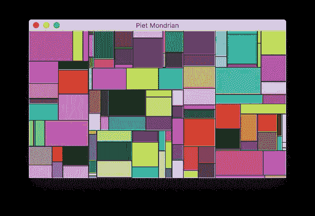

为了增加笔画宽度，我们需要`Graphics2D`的帮助。但这几乎不是问题，因为 Swing 中的每个图形都是 Graphics2D 对象(出于兼容性原因，它只保留了旧的接口)。

```
import javax.swing.JFrame;
import javax.swing.JPanel;
import java.awt.Graphics;
**import java.awt.Graphics2D;
import java.awt.BasicStroke;**
import java.awt.Rectangle;
import java.awt.Color;
import java.util.Random;class CanvasPanel extends JPanel {
  **private static final int LINE_WIDTH = 5;**
  private Random rand = new Random(); public void paintComponent(Graphics g) {
    Rectangle rect = new Rectangle(0, 0, getWidth(), getHeight());
    drawLineInRect(rect, g);
  } private void drawLineInRect(Rectangle rect, Graphics g) {
    if (rect.width < 200 && rect.height < 124) {
      return;
    } int randomOffset;
    Rectangle rect0, rect1;
    int fromX, fromY, toX, toY; if (rect.width < rect.height) {
      randomOffset = rand.nextInt(rect.height);
      rect0 = new Rectangle(rect.x, rect.y, rect.width, randomOffset);
      rect1 = new Rectangle(rect.x, rect.y + randomOffset, rect.width, rect.height - randomOffset);
      fromX = rect.x;
      fromY = rect.y + randomOffset;
      toX = fromX + rect.width;
      toY = fromY;
    } else {
      randomOffset = rand.nextInt(rect.width);
      rect0 = new Rectangle(rect.x, rect.y, randomOffset, rect.height);
      rect1 = new Rectangle(rect.x + randomOffset, rect.y, rect.width - randomOffset, rect.height);
      fromX = rect.x + randomOffset;
      fromY = rect.y;
      toX = fromX;
      toY = rect.y + rect.height;
    } **fillInRect(rect0, LINE_WIDTH / 2, g);
    fillInRect(rect1, LINE_WIDTH / 2, g);** g.setColor(Color.black);
    **Graphics2D g2 = (Graphics2D)g;
    g2.setStroke(new BasicStroke(LINE_WIDTH));
    g2.drawLine(fromX, fromY, toX, toY);** drawLineInRect(rect0, g);
    drawLineInRect(rect1, g);
  } private void fillInRect(Rectangle rect, int gap, Graphics g) {
    float red = rand.nextFloat();
    float grn = rand.nextFloat();
    float blu = rand.nextFloat();
    Color randomColor = new Color(red, grn, blu);
    g.setColor(randomColor);
    g.fillRect(rect.x + gap, rect.y + gap, rect.width - 2*gap, rect.height - 2*gap);
  }
}
```

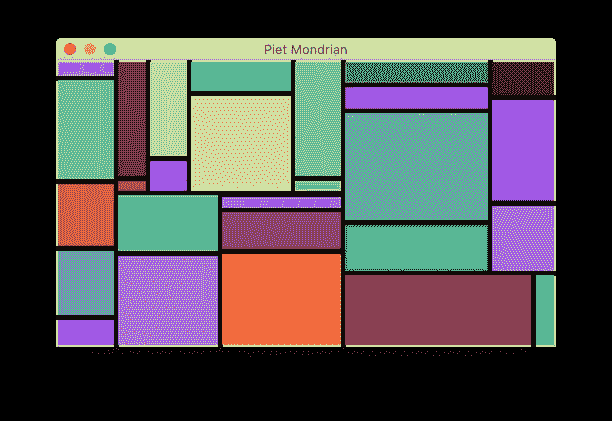

最外面的框架没有被覆盖。这可以通过对第一个矩形使用负插入来解决。

```
class CanvasPanel extends JPanel {
  private static final int LINE_WIDTH = 5;
  private Random rand = new Random(); public void paintComponent(Graphics g) {
    Rectangle rect = new Rectangle(**-LINE_WIDTH/2, -LINE_WIDTH/2, getWidth() + LINE_WIDTH, getHeight() + LINE_WIDTH**);
    drawLineInRect(rect, g);
  }
  // ...
```

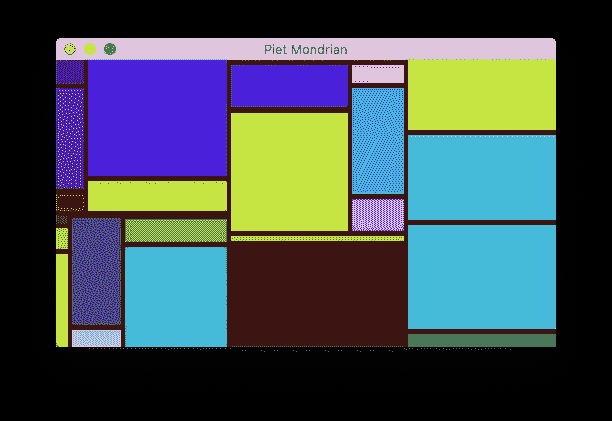

这是 LINE_WIDTH = 8 的艺术:

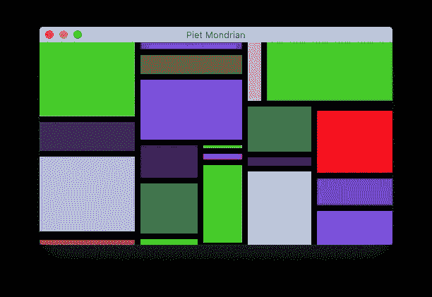

再次运行我们得到另一个:

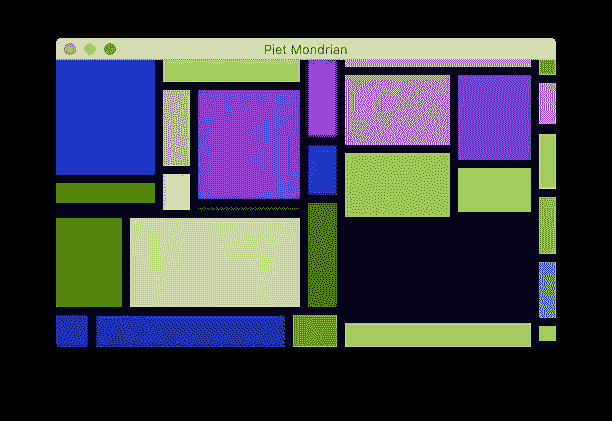

完整的源代码:

```
import javax.swing.JFrame;
import javax.swing.JPanel;
import java.awt.Graphics;
import java.awt.Graphics2D;
import java.awt.BasicStroke;
import java.awt.Rectangle;
import java.awt.Color;
import java.util.Random;class CanvasPanel extends JPanel {
  private static final int LINE_WIDTH = 8;
  private Random rand = new Random(); public void paintComponent(Graphics g) {
    Rectangle rect = new Rectangle(-LINE_WIDTH/2, -LINE_WIDTH/2, getWidth() + LINE_WIDTH, getHeight() + LINE_WIDTH);
    drawLineInRect(rect, g);
  } private void drawLineInRect(Rectangle rect, Graphics g) {
    if (rect.width < 200 && rect.height < 124) {
      return;
    } int randomOffset;
    Rectangle rect0, rect1;
    int fromX, fromY, toX, toY; if (rect.width < rect.height) {
      randomOffset = rand.nextInt(rect.height);
      rect0 = new Rectangle(rect.x, rect.y, rect.width, randomOffset);
      rect1 = new Rectangle(rect.x, rect.y + randomOffset, rect.width, rect.height - randomOffset);
      fromX = rect.x;
      fromY = rect.y + randomOffset;
      toX = fromX + rect.width;
      toY = fromY;
    } else {
      randomOffset = rand.nextInt(rect.width);
      rect0 = new Rectangle(rect.x, rect.y, randomOffset, rect.height);
      rect1 = new Rectangle(rect.x + randomOffset, rect.y, rect.width - randomOffset, rect.height);
      fromX = rect.x + randomOffset;
      fromY = rect.y;
      toX = fromX;
      toY = rect.y + rect.height;
    } fillInRect(rect0, LINE_WIDTH / 2, g);
    fillInRect(rect1, LINE_WIDTH / 2, g); g.setColor(Color.black);
    Graphics2D g2 = (Graphics2D)g;
    g2.setStroke(new BasicStroke(LINE_WIDTH));
    g2.drawLine(fromX, fromY, toX, toY); drawLineInRect(rect0, g);
    drawLineInRect(rect1, g);
  } private void fillInRect(Rectangle rect, int gap, Graphics g) {
    float red = rand.nextFloat();
    float grn = rand.nextFloat();
    float blu = rand.nextFloat();
    Color randomColor = new Color(red, grn, blu);
    g.setColor(randomColor);
    g.fillRect(rect.x + gap, rect.y + gap, rect.width - 2*gap, rect.height - 2*gap);
  }
}class Piet {
  Piet() {
    JFrame f = new JFrame("Piet Mondrian");
    f.setSize(500, 309);
    f.setLocation(50, 50);
    f.add(new CanvasPanel());
    f.setVisible(true);
  }

  public static final void main(String[] args) {
    new Piet();
  }
}
```

最有趣的部分是对函数`drawLineInRect`的递归调用。

这是我用 Xcode 在 Swift 上实现的一个类似的蒙德里安艺术:

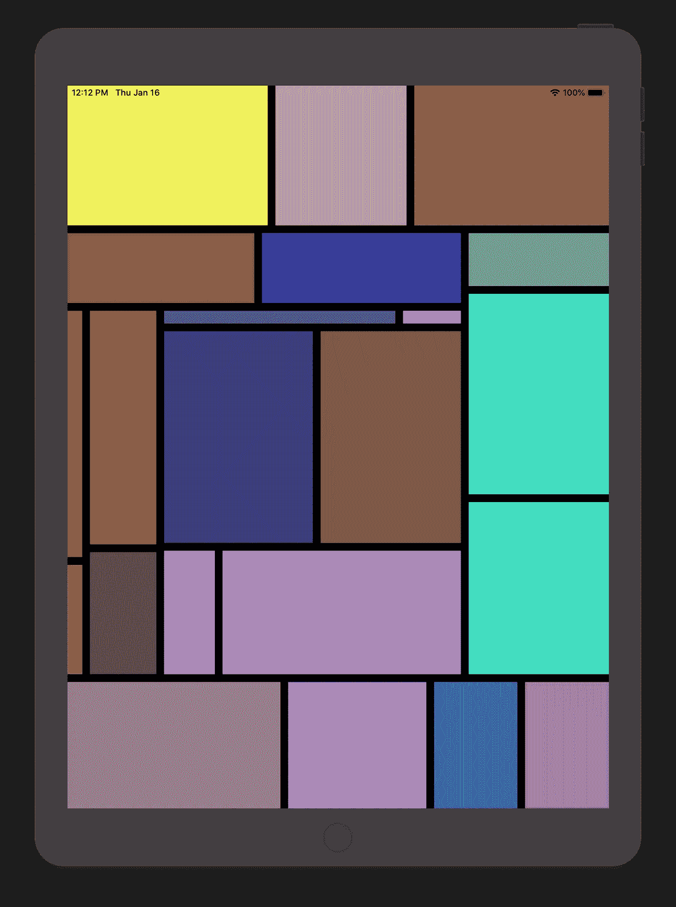

我把对应的 Swift 代码放在这里做比较:

```
import UIKitclass PietView: UIView {
    let lineWidth: CGFloat = 11
    let percent: CGFloat = 0.46
    var minW: CGFloat = 0
    var minH: CGFloat = 0 override func draw(_ rect: CGRect) {
        minW = rect.width * percent
        minH = rect.height * percent

        let inset = -lineWidth/2
        let rectWithInset = rect.inset(by: UIEdgeInsets(top: inset, left: inset, bottom: inset, right: inset))
        drawLineIn(rect: rectWithInset)
    } func drawLineIn(rect: CGRect) {
        if rect.width < minW && rect.height < minH {
            return
        }

        let path = UIBezierPath()

        let randomOffset: CGFloat
        let fromX, fromY, toX, toY : CGFloat
        let rect0: CGRect
        let rect1: CGRect

        if rect.width < rect.height {
            randomOffset = CGFloat(arc4random() % UInt32(rect.height))
            fromX = rect.origin.x
            fromY = rect.origin.y + randomOffset
            toX = fromX + rect.width
            toY = fromY
            rect0 = CGRect(x: rect.origin.x, y: rect.origin.y, width: rect.width, height: randomOffset)
            rect1 = CGRect(x: rect.origin.x, y: rect.origin.y + randomOffset, width: rect.width, height: rect.height - randomOffset)
        } else {
            randomOffset = CGFloat(arc4random() % UInt32(rect.width))
            fromX = rect.origin.x + randomOffset
            fromY = rect.origin.y
            toX = fromX
            toY = fromY + rect.height
            rect0 = CGRect(x: rect.origin.x, y: rect.origin.y, width: randomOffset, height: rect.height)
            rect1 = CGRect(x: rect.origin.x + randomOffset, y: rect.origin.y, width: rect.width - randomOffset, height: rect.height)
        }

        fillIn(rect: rect0, inset: lineWidth/2)
        fillIn(rect: rect1, inset: lineWidth/2)

        path.move(to: CGPoint(x: fromX, y: fromY))
        path.addLine(to: CGPoint(x: toX, y: toY))
        path.lineWidth = lineWidth
        path.stroke()

        drawLineIn(rect: rect0)
        drawLineIn(rect: rect1)
    }

    private func fillIn(rect: CGRect, inset: CGFloat) {
        let rectWithInset = rect.inset(by: UIEdgeInsets(top: inset, left: inset, bottom: inset, right: inset))
        let rectPath = UIBezierPath(rect: rectWithInset)
        let r = CGFloat(Int(arc4random()) % 1000) / 1000
        let g = CGFloat(Int(arc4random()) % 1000) / 1000
        let b = CGFloat(Int(arc4random()) % 1000) / 1000
        let a = CGFloat(Int(arc4random()) % 1000) / 1000
        let color = UIColor(red: r, green: g, blue: b, alpha: a)
        color.setFill()
        rectPath.fill()
    }
}
```