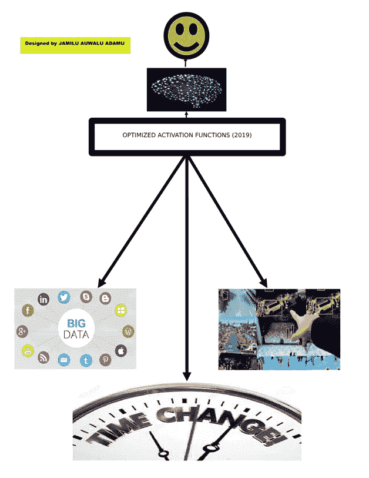

# 科学事实证明，现有的一套激活函数形成了神经网络的黑盒

> 原文：<https://medium.com/analytics-vidhya/scientific-facts-that-prove-the-existing-set-of-activation-functions-formed-the-neural-networks-5ace2d82b3d?source=collection_archive---------19----------------------->

在我之前题为“*拜拜神经网络的试错激活函数:欢迎使用高级优化激活函数*”的文章中，我们停在了一个点上，我们即将展示科学事实，证明现有的激活函数集形成了神经网络的“黑盒”。

Jamilu (2019)提出，可用于成功实施人工神经网络的胜任且合格的激活函数是源自**引用的 AI-ML-PURIFIED 数据集**的激活函数，其满足 *Jameel 的 ANNAF 随机和/或确定性标准*，这归因于以下**科学事实**:

**(1)** 它们**来自**参考的 AL-ML-Purified 数据集，并满足 Jameel 的 ANNAF 随机和/或确定性准则；

**(2)** 它们与参考的 AI-ML-Purified 数据集有非常强的(如果不是完美的)**相关性**。由于人工神经网络使用过去的历史数据来预测给定任务的未来，因此必须强有力地建立数据集和激活函数之间的联系；

**(3)****与现有的假设和试错激活函数相比，它们更好地将**与参考的 AI-ML 净化数据集相关联；

**(4)** 它们确实描述了我们引用的 AI-ML-Purified 数据集的**分布**，这是一个列表或函数，显示了 AI 数据的所有可能值(或区间)以及它们出现的频率；

**(5)** 它们表示关于我们引用的 AI-ML 纯化数据集的真实、虚拟和非虚拟信息；

**(6)** 他们确实**捕捉到了**我们引用的 AI-ML-Purified 数据集的对称、左斜、右斜、中斜、薄斜和宽斜性质；

**(7)** 它们包含与我们参考的 AI-ML 纯化数据集的可变性(范围、四分位间距和标准偏差)和集中趋势(平均值、众数、中值、最小值和最大值)测量值相关的真实、虚拟和非虚拟信息；

**(8)** 他们**捕获了**关于我们引用的 AI-ML-Purified 数据集中的元素之间的相关性(**自相关**)的真实、虚拟和非虚拟信息；

**(9)** 在双变量 AI-ML 数据集的情况下，他们捕获了关于我们参考的 AI-ML 纯化数据集的关联(协方差和相关性)的**度量的真实、虚拟和非虚拟信息；**

**(10)** 他们**捕获**真实的、虚拟的和非虚拟的信息，不管我们参考的 AI-ML-Purified 数据集的参数是否随时间恒定；而且，

**(11)** 他们还**捕捉到了**在我们参考的 AI-ML 净化数据集中**异常值**的存在。

**引用 AI-ML-Purified 数据集**是指我们引用的人工神经网络数据集应具备以下**品质**:

a.准确度和精确度

b.合法性和有效性

c.可靠性和一致性

d.及时性和相关性

e.完整性和全面性

f.可用性和可访问性

g.粒度和唯一性

此外，这项研究表明，高级激活函数满足 Jameel 的 ANNAF 随机和/或确定性标准，取决于参考的纯化人工智能数据集、时间变化和应用领域(首字母缩写为 DTA ),如下图所示:

Jamilu (2019)提出应该抛弃**假设激活函数**的“**试错**”选择**的做法，但是，激活函数的选择应该遵循“**经验法则**，因此，作者将“ ***JAMEEL 准则(2015)*** ”增强为提出“ ***JAMEEL 的 ANNAF 随机准则(2019)*****

未完待续。

作者

贾米卢·奥瓦卢·阿达姆，FIMC，中央军委，FIMS(英国)，FICA(在望)

**副主编**，*风险与财务管理杂志*，美国

**编辑**，*经济与管理科学杂志*，美国

**前副主编**，*英国风险模型验证杂志*

**同行评审**，*RISK.NET 期刊*，伦敦

前**指导委员会成员，PRMIA** 尼日利亚分会

**书籍作者**

**通信:**数学规划大楼， **118** 国家数学中心，小谢达，夸里， **904105，**FCT-尼日利亚。联系电话: **+2348038679094。**电子邮件:**[**whitehorseconsult@yahoo.com**](mailto:whitehorseconsult@yahoo.com)**