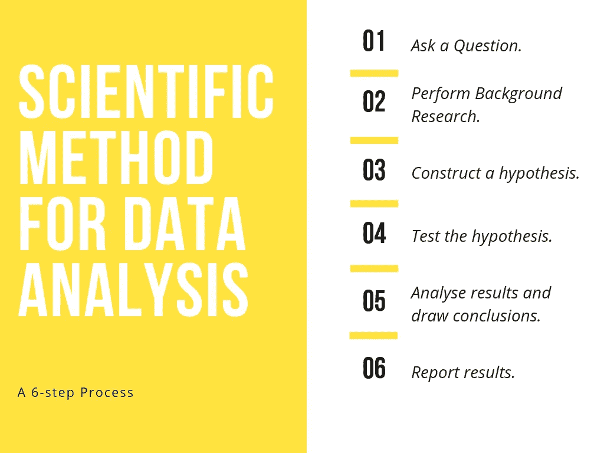

# 数据分析的科学方法

> 原文：<https://medium.com/analytics-vidhya/scientific-method-for-data-analysis-41798626371a?source=collection_archive---------6----------------------->

数据分析是一个处理数据的过程，目的是发现可用于决策的信息。在这篇博客中，我讨论了一种方法，其中包括一些步骤，如果按照特定的顺序执行，可以使数据分析过程顺利而有效。这种方法被称为“科学方法”。让我们来理解这种方法在数据分析方面提供了什么。

数据分析的科学方法

## 问题

这个方法从一个问题开始。一个与你的公司给你的问题相关的问题。这个问题将是你在剩下的分析过程中需要解决的问题。整个过程都会基于这个问题。问题可以是“什么”、“为什么”、“如何”、“哪个”、“何时”、“谁”或“在哪里”之类的问题，基于你可以衡量的东西，最好是一个数字。例如，如果您的公司向您提供了一个数据集以及一个希望您使用数据分析解决的问题，该问题通常是类似“两种产品之间的关系是什么”或“客户最喜欢哪种产品”这样的问题。真实情况下你会遇到的问题不会和例子中的完全一样，会更有意义。

## 背景研究

作为问题的后续，你应该做一个背景调查。你应该检查文献、现有的研究、现有的结果，找出是否有任何种类的代码、良好的已建立的实践或分析的例子在过去已经或没有工作，以便从一个好的点开始我们的分析，避免潜在的错误发生，并从我们的进一步分析中获得有意义的答案。

## 构建一个假设

一旦我们得到了问题，并进行彻底的背景研究，我们将把问题，这将是一个现实生活中的问题转化为一个研究假设。假设是对一种现象提出的解释。根据维基百科，“科学家通常将科学假设建立在以前的观察基础上，这些观察不能用现有的科学理论令人满意地解释。”。简单来说，假设是为了解释某些事件或现象而暂时接受的理论。在统计世界中，根据你最初的问题，这是一个关于你相信什么是真的有根据的陈述。这种假设通常使用基于现实生活问题，包括我们可以测量变量和数量，以便对它们做出具体统计陈述。

## 检验假设

一旦我们建立了假设，我们将会检验它。为了检验假设，我们需要根据实验或问题的性质设计的数据。每个假设检验都要求分析师提供一个你在上一步中构建的零假设，以及一个替代假设，当零假设被证明是统计错误时，替代假设将被接受。执行各种统计分析步骤来测试假设。

## 分析结果并得出结论

在测试假设并获得结果后，需要对结果进行分析以得出结论，这就是统计软件通常用来衡量我们收集的证据的地方，以查看我们为了回答感兴趣的问题而制定的假设是真还是假。在这里，我们决定是用零假设还是另一个假设。

## 报告结果

在对我们感兴趣的问题得出结论后，必须写一份报告，包括结果，描述我们的发现，我们的假设是否正确，以及我们的结果有什么实际意义。这些结果不仅要解释你在特定假设或问题的背景下所发现的东西，还要解释更广泛的结论，以便与手头问题的真实生活情况联系起来。

这些是分析任何数据都要遵循的基本步骤。每个人都有自己的分析方法，但是为了得到所需的结论，总是需要执行上面解释的步骤。随着技术的不断发展，新的软件和工具不断推出，本博客中解释的一些步骤可能会被一些软件或工具取代，但无论如何执行，过程都是一样的。

感谢您的阅读。享受统计。